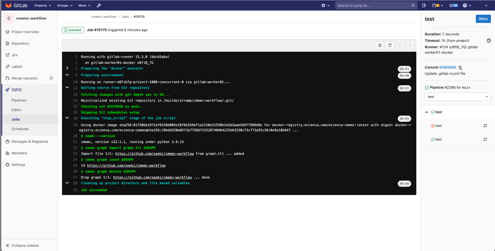

# Using Gitlab Pipelines

## Introduction

[Gitlab CI/CD](https://docs.gitlab.com/ee/ci/introduction/index.html) allows for automation and execution of workflows based on pushes, merge requests and other trigger events on your git repository.
In order to control eccenca Corporate Memory instances from within Gitlab CI/CD based workflows, you need to provide cmemc as well as credentials for your instance to the Gitlab CI/CD pipeline.

## Runner Provisioning

In order to use cmemc in Gitlab piplines, you can use the [cmemc docker image](../docker-image).

```yaml title="Partial .gitlab-ci.yml showing cmemc provisioning"
test:
    image:
      name: docker-registry.eccenca.com/eccenca-cmemc:latest
      entrypoint: [""]
    script:
        - cmemc --version
```

Adding this to your pipeline description, will provide a cmemc command which can be used in the workflow step.

## Credentials and Usage

Since we should never commit credentials in your repository, we need to provide them as an encrypted secret managed outside of the repository.
You can add [CI/CD variables](https://docs.gitlab.com/ee/ci/variables/#add-a-cicd-variable-to-a-project) to a project’s settings directly in Gitlabl

Given the following pipeline step, you need to add `MY_CMEM_BASE_URI`, `MY_OAUTH_GRANT_TYPE`, `MY_OAUTH_CLIENT_ID` and `MY_OAUTH_CLIENT_SECRET` as encrypted secrets to your repository:

```yaml title="Partial .gitlab-ci.yml showing credential provisioning"
test:
    image:
      name: docker-registry.eccenca.com/eccenca-cmemc:latest
      entrypoint: [""]
    stage: test
    script:
        - cmemc --version
        - cmemc graph import graph.ttl $GRAPH
        - cmemc graph count $GRAPH
        - cmemc graph delete $GRAPH
    variables:
      GRAPH: "https://github.com/seebi/cmemc-workflow"
      CMEM_BASE_URI: $MY_CMEM_BASE_URI
      OAUTH_GRANT_TYPE: $MY_OAUTH_GRANT_TYPE
      OAUTH_CLIENT_ID: $MY_OAUTH_CLIENT_ID
      AUTH_CLIENT_SECRET: $MY_OAUTH_CLIENT_SECRET
```

This snippet also demonstrates, how you can map your project variables to [cmemc's configuration variables](../cmemc-command-line-interface/configuration/file-based-configuration).

## Example Project

The Github project [eccenca/cmemc-workflow](https://github.com/eccenca/cmemc-workflow) provides an [example gitlab pipeline description](https://github.com/eccenca/cmemc-workflow/blob/main/.gitlab-ci.yml) which uses cmemc to import a graph, count the triples and removes the graph afterwards.
Here is an example output:



