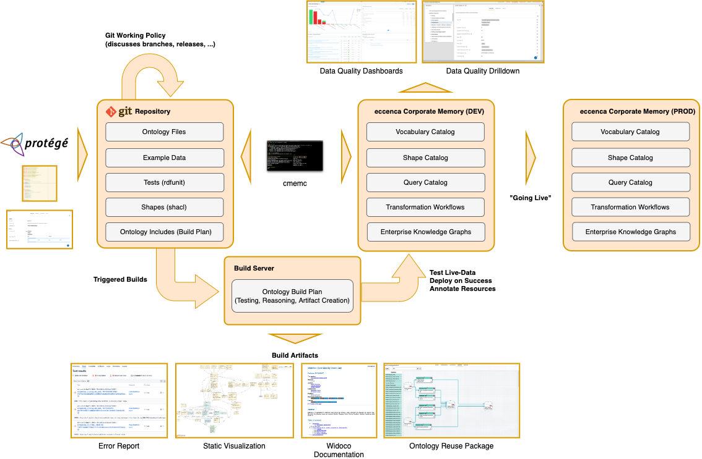

# Continuous Integration and Delivery

## Introduction

Project teams often manage crucial parts of their work assets inside of git repositories.
This includes Corporate Memory related files such as ontologies, shapes or project configurations.
Given such a project setup, it is often wanted to start activities with these Corporate Memory files.
Continuous integration (CI) is the practice of automating the integration of changes from multiple contributors into a single project.
Originated from software projects, CI can (and should) be applied to Knowledge Graph projects as well.

## Example Project

The following depiction shows an example project setup which applies CI/CD principles to a Knowledge Graph project.

The project has two Corporate Memory stages, **DEV** and **PROD**.
The DEV Stage produces Knowledge Graphs based on artefacts from one or more Git repositories.
Changes on the artefacts are tested by a Build Server.
The Build Server pushes tested artefacts (Green Builds) to the DEV stage as well as produces other artefacts such as Visualisations, Documentation and Test Result artefacts.
The automated activities in the Build Plan are executed with cmemc on the Corporate Memory instances.
Once a release is ready, artefacts are transferred to the PROD Stage.

## Integration Recipes

Complex build plans are compiled of simple steps, each executing a specific activity.
cmemc is a building block to create complex build plans for your Knowledge Graph project.
The following pages provide recipes for different CI/CD solutions:

-   :material-github: [Github Actions](../cmemc-command-line-interface/invocation/github-action)

-   :material-gitlab: [Gitlab Pipelines](../cmemc-command-line-interface/invocation/gitlab-pipeline)

