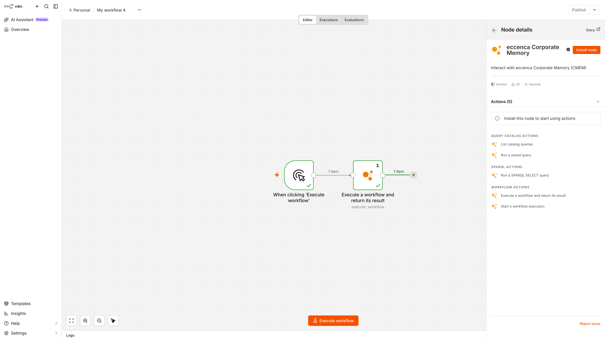

# n8n Community Node

## Introduction

[n8n](https://n8n.io/) is a workflow automation tool that connects applications and services to each other, driven by events such as an incoming webhook, a new file or a schedule.
The eccenca Corporate Memory community node adds Corporate Memory to the set of systems an n8n automation can reach.
It is published as `@eccenca/n8n-nodes-corporate-memory` and installs through the n8n community node installer.

With the node in place, the connectors that n8n already provides become available to Corporate Memory processes without writing a Python plugin or a custom script.
An automation can start a Corporate Memory workflow, read from the Knowledge Graph and hand the result to any other system in the same n8n canvas.

!!! note "Relation to cmemc"

    cmemc automates Corporate Memory from a terminal, a script or a continuous integration pipeline.
    The n8n community node covers the case where the automation is event driven and already connects other systems.
    Both work against the same Corporate Memory APIs, so the choice is one of environment rather than capability.

## Use cases

- **Event-driven workflow execution:**
    An event in n8n starts a Corporate Memory workflow.
    Typical triggers are an incoming webhook, a new file in an object store or a document management system, an incoming mail, or a schedule.

- **Publishing graph content to downstream systems:**
    A query from the query catalog runs on a schedule and its result rows are forwarded to a messaging service, an issue tracker, a spreadsheet or a REST API.

- **Knowledge Graph lookup inside a larger automation:**
    A SPARQL query enriches items that already flow through an n8n automation with context from the Knowledge Graph.

## Prerequisites

- **An n8n instance:**
    The node is a verified community node and installs on a self-hosted n8n instance as well as on n8n Cloud.
    See [Installing community nodes](https://docs.n8n.io/integrations/community-nodes/installation/) in the n8n documentation.

- **An OAuth client in Keycloak:**
    The node authenticates with the client credentials grant and needs a confidential client, scoped to the permissions the automation requires.
    Creating a service account client is described under [Keycloak](../../deploy-and-configure/configuration/keycloak/index.md).

- **A reachable Corporate Memory deployment:**
    The n8n instance needs network access to the base URL of the Corporate Memory deployment and to its Keycloak token endpoint.

## How the node works

The connection to Corporate Memory is configured once as a credential.
It holds the client ID, the client secret and the base URL of the deployment, and derives the token endpoint and the component URLs from that base URL.
The credential is then reused by every node instance in every automation.

A single node covers three resources, which correspond to the three parts of Corporate Memory an automation reaches:
workflows in Build, the SPARQL endpoint of the Knowledge Graph, and the query catalog.
Selecting a resource offers the actions available for it:

| Resource | Action | Result |
| --- | --- | --- |
| Workflow | Execute a workflow and return its result | The automation waits for the workflow to finish and continues with its output. |
| Workflow | Start a workflow execution | The workflow is started in the background and the identifiers of the running execution are returned. |
| SPARQL | Run a SPARQL SELECT query | One item per result row. |
| Query Catalog | List catalog queries | The queries saved in the selected catalogs. |
| Query Catalog | Run a saved query | The result of a saved query, with placeholders substituted. |

{ class="bordered" }

Because each action emits n8n items, the output of one Corporate Memory action can be routed into any other node, including a second Corporate Memory action.

## Further reading

- [n8n-nodes-corporate-memory repository](https://github.com/eccenca/n8n-nodes-corporate-memory) — installation, credential fields and per-action parameters
- [@eccenca/n8n-nodes-corporate-memory on npm](https://www.npmjs.com/package/@eccenca/n8n-nodes-corporate-memory) — the published package and its current version
