# Processing Data with Variable Input Workflows

## Introduction

This tutorial shows how you can create and use data integration workflows to process data coming from outside eccenca Corporate Memory (i.e., without registering datasets).
This is achieved with the **Allow replacement** flag on input and/or output datasets.
This flag is supported by most file dataset types.
A replaceable dataset is created and used inside a workflow as an input for other tasks (e.g., a transformation).

The workflow is then called with the actual payload via an HTTP REST call or via [`cmemc`](../cmemc-command-line-interface/index.md).

This allows you to solve all kinds of [☆ Automation](../index.md) tasks where you need to process lots of small data snippets or similar.

!!! Tutorial Package

    The complete tutorial is available as a Marketplace Package. You can install this package

    - by using the web interface (:eccenca-module-marketplace: **Packages** → Search → "Variable Input") or
    - by using the [command line interface](../cmemc-command-line-interface/index.md)

        ``` shell-session
        cmemc -c my-cmem package install ecc-variable-input-tutorial
        ```

## 1 Install the required Ontologies / Vocabularies

This tutorial makes use of the `rdfs:` and `schema.org` ontologies.
Both can be installed from the **Marketplace**.

Click the :eccenca-module-marketplace: **Packages** icon in the main menu under the **Marketplace** section.

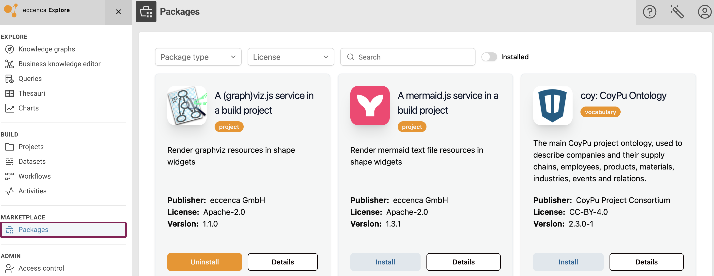{ class="bordered" }

Search for the required ontologies / vocabularies and click the **Install** button.
Wait for a package installation to complete (the **Install** button will change to **Uninstall**) before installing the next package.

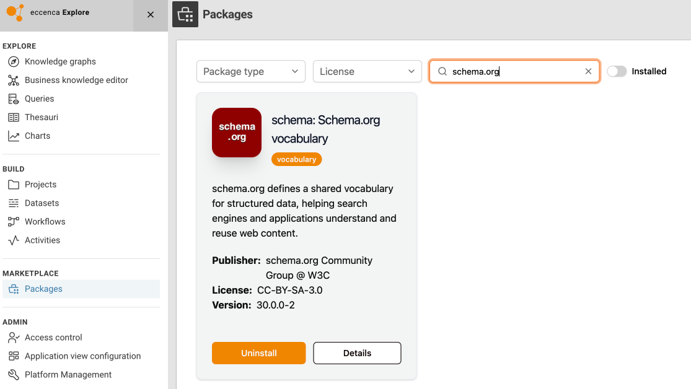{ class="bordered" }

## 2 Create a new project

Click the :eccenca-artefact-project: **Projects** icon in the main menu under the **Build** section.
Then click on **Create new** :eccenca-item-add-artefact: in the top right corner to create a new project.

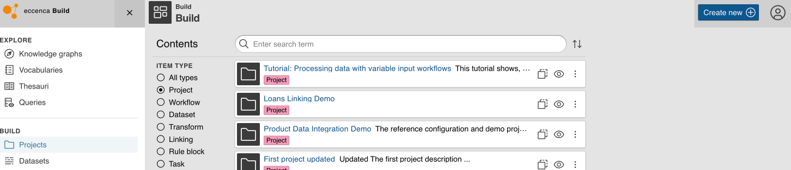{ class="bordered" }

Click on **Project** in the **Create new item** dialog, then click **Add**.

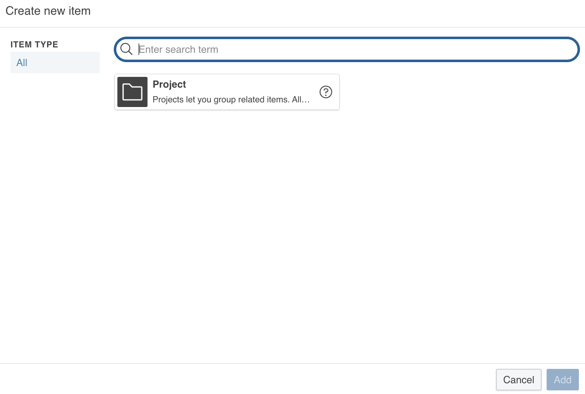{ class="bordered" width="70%"}

Provide it with a _Title_ and _Description_.
In this example we will use:

- Title: `Variant Configuration Demo Project`
- Description: `This project contains a workflow that transforms excel files with variant configuration data into a knowledge graph.`

Then click on **Create**.

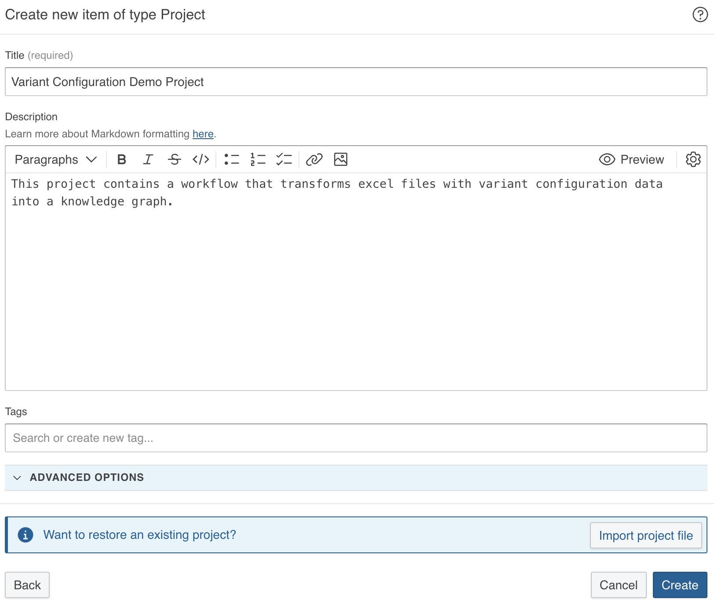{ class="bordered" width="70%"}

The project will include everything you need to build a workflow for extracting Feed XML data, transforming it into RDF, and loading it into a Knowledge Graph.


## 3 Create and populate the workflow

Click on **Create new** in the top right corner to create a new workflow.
Click on **Workflow** under the section **ITEM TYPE**, then click on **Workflow** and **Add**.

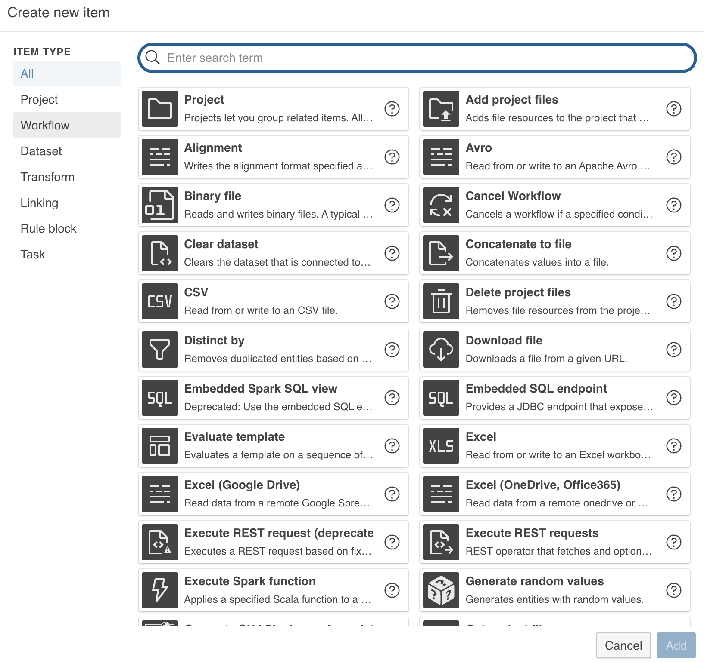{ class="bordered" width="70%"}

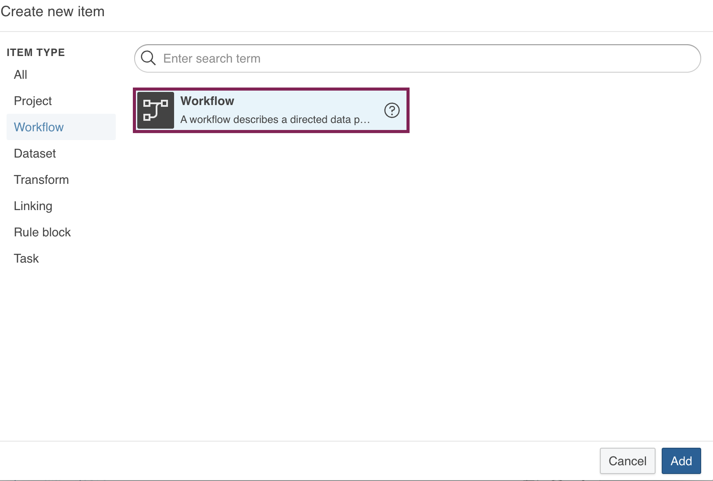{ class="bordered" width="70%" }

Provide it with a _Label_ and _Description_.
In this example we will use:

- Label: `process feed documents (workflow io)`
- Description: `This workflow transforms an input with the feed transformation and outputs the data into the Feed Data graph.`

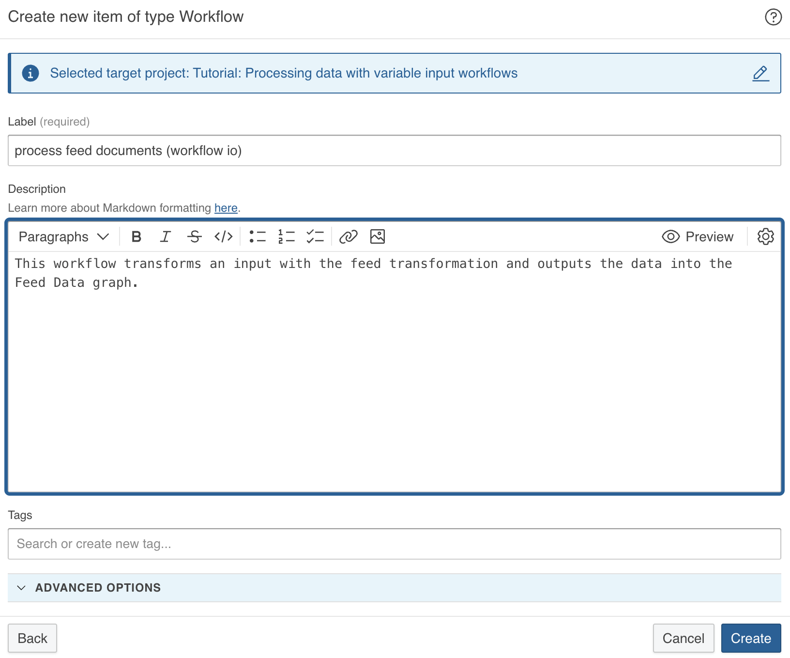{ class="bordered" width="70%"}

Add the XML dataset (feed data) into your project via drag-and-drop.
In this tutorial we use this file: [feed.xml](feed.xml)(1)
{ .annotate }

1. Original feed source was: `https://www.ecdc.europa.eu/en/taxonomy/term/2942/feed`

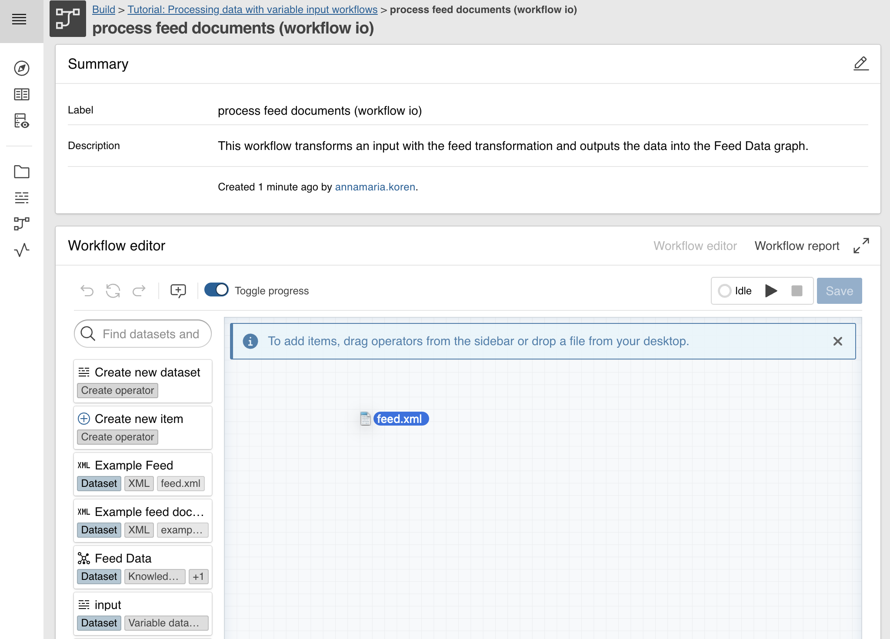{ class="bordered" }


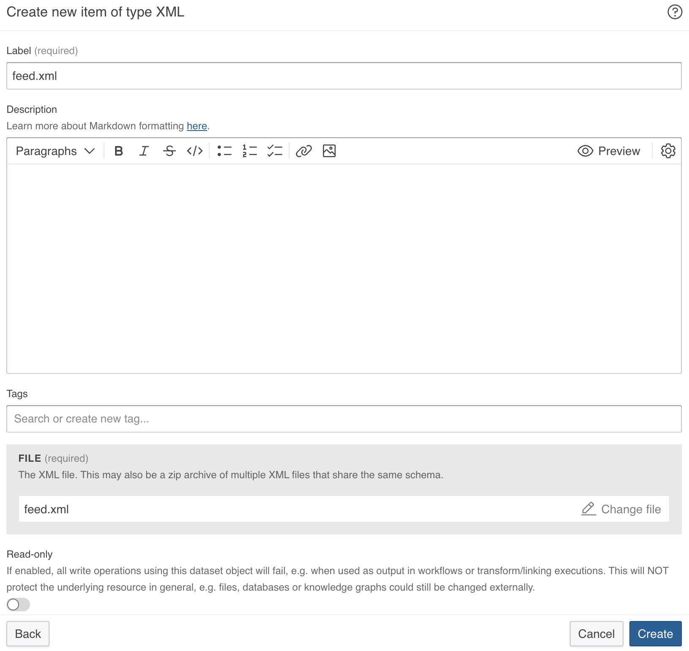{ class="bordered" width="70%" }

Click the output port menu of the feed.xml dataset task.
And click **Connect to newly created Transformation**.

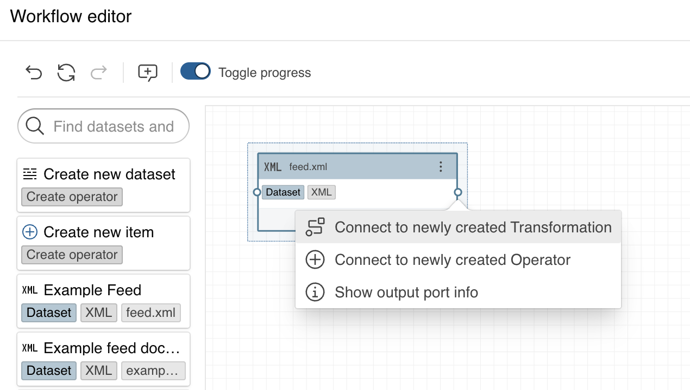{ class="bordered" width="70%"}

If necessary change the details in the create dialog, complete by clicking the **Create** button.

Click the output port menu of the Transform feed.xml transformation task.
And click **Connect to newly created Knowledge graph**.

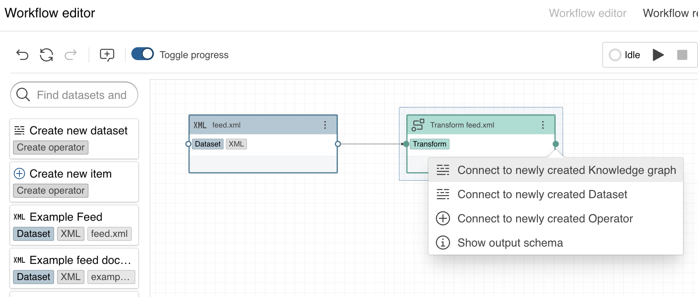{ class="bordered" width="90%"}

Customize the _Label_ and provide _Graph_ IRI.
In this example we will use:

- Label: `Feed Data`
- Graph: `http://example.org/feeds/`

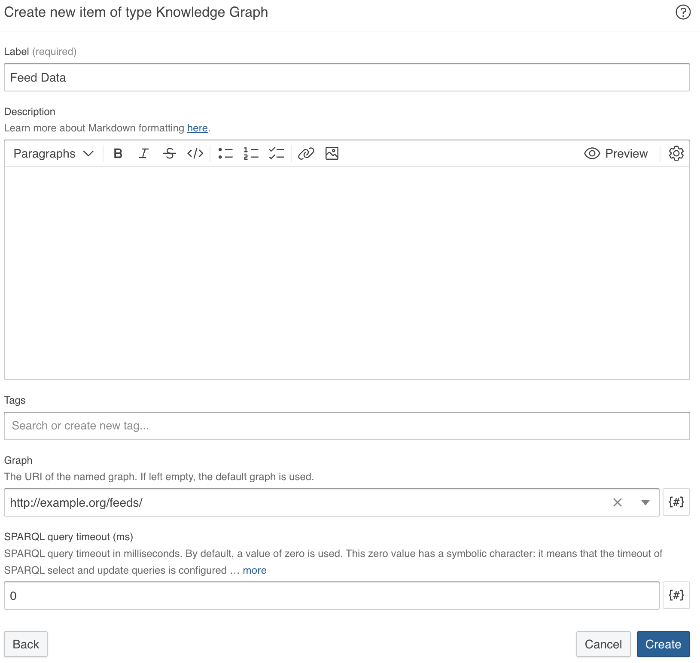{ class="bordered" width="70%"}

**Save** the workflow.

## 4 Create the feed transformation

Based on the added sample feed XML Dataset, create a mapping to generate RDF triples.

Click **Open details page** in the Transform feed.xml transformation task context menu to open the transformation editor in a new browser tab (use **Mapping editor** to open the transformation editor in a modal dialog).

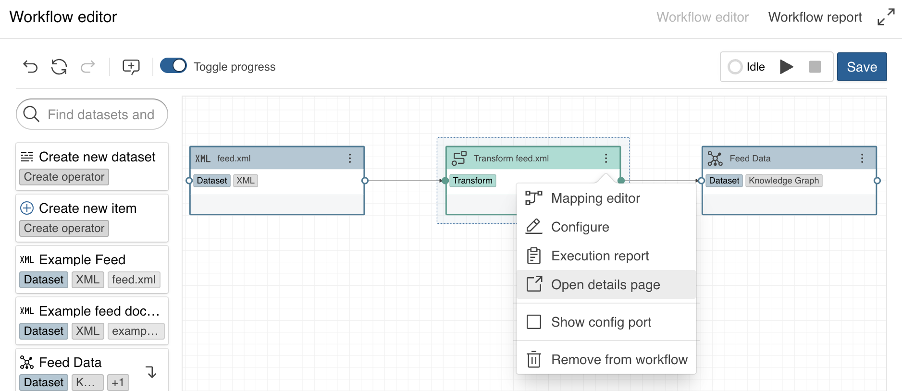{ class="bordered" width="90%"}

The screenshot provides an example mapping to generate WebPages, which includes a label, a URL, a text, and the date they were published in the feed.
The mappings are based on classes and properties defined by the _Schema.org_ and _RDFS_ vocabulary.

In case you need help with mapping data from XML to RDF, feel free to visit your respective tutorial: [Lift data from JSON and XML sources](../../build/lift-data-from-json-and-xml-sources/index.md).

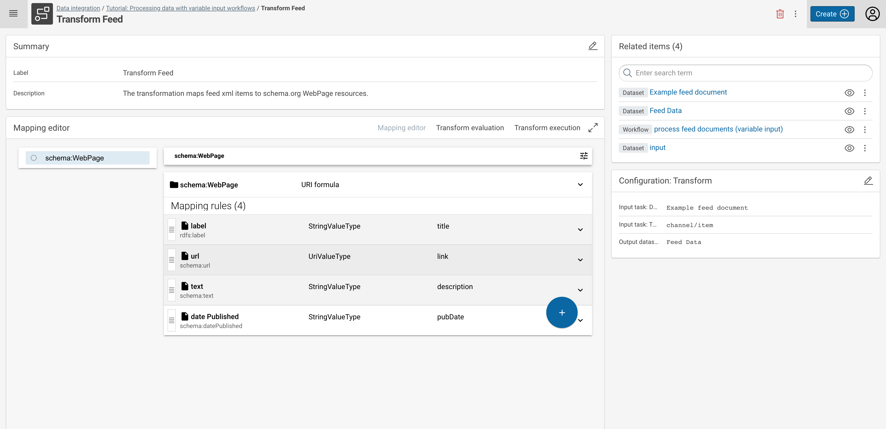{ class="bordered" }

## 5 Allow input dataset replacement

Activate the **Allow replacement** flag in a datasets` context menu by activating the **Allow replacement** option.

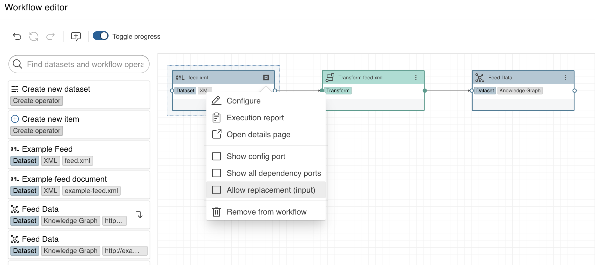{ class="bordered" width="90%" }

## 6 Use `cmemc` to feed data into the workflow

Finally, you can process all the feeds you want by executing the created workflow with a dynamic XML payload.

For this, you need to use the `workflow io` command:

``` shell-session
# process one specific feed xml document
cmemc workflow io varinput:process-feed -i feed.xml
```

You can easily automate this for a [list of feeds](feeds.txt) like this:

``` shell-session
$ cat feeds.txt
https://feeds.npr.org/500005/podcast.xml
http://rss.cnn.com/rss/cnn_topstories.rss
https://lifehacker.com/rss
http://feeds.bbci.co.uk/news/rss.xml
…

# fetch the list of urls one by one and feed the content to the corporate memory workflow
$ cat feeds.txt | xargs -I % sh -c '{ echo %; curl -s % -o feed.xml; cmemc workflow io varinput:process-feed -i feed.xml; rm feed.xml; }'
https://feeds.npr.org/500005/podcast.xml
http://rss.cnn.com/rss/cnn_topstories.rss
https://lifehacker.com/rss
http://feeds.bbci.co.uk/news/rss.xml
…
```

## 7 Explore the fetched Knowledge Graph

In **EXPLORE** > **Knowledge graphs**, you can study the ingested feed data.

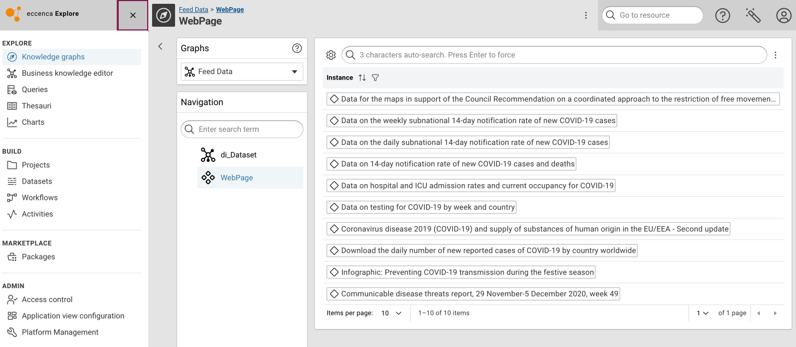{ class="bordered" }
