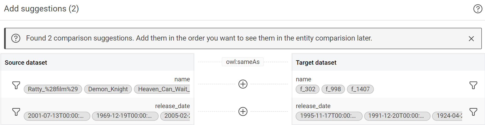
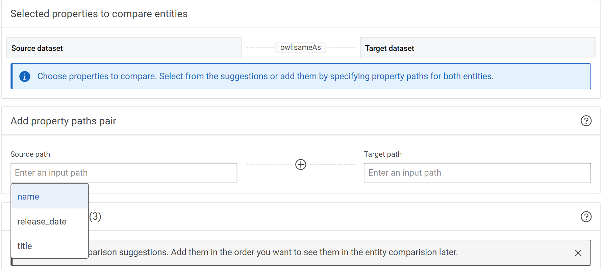
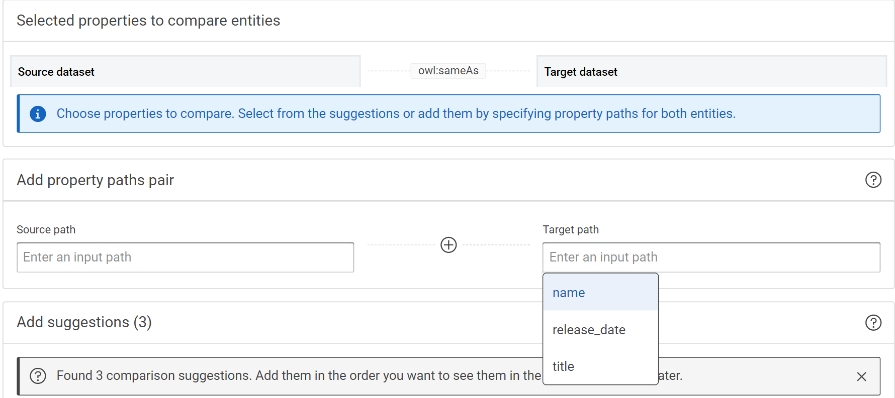
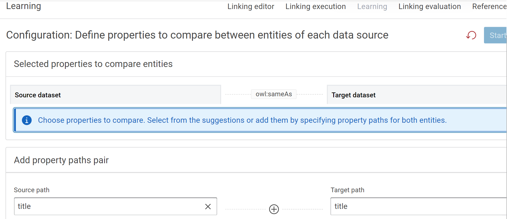

#### **Introduction**

Active learning infuses expert knowledge and creates new relationships between properties of two datasets. We can learn new rules and refine existing rules.

### **Usage**

Define properties to compare between entities of the selected datasets.

### **Start the learning dialog**

Create a linking rule and setup source and target datasets as well as the linking property that should be yielded. Start the learning dialog by clicking the “Learning” tab in the linking view.

### **Creating an automatic link rule**

- Choose properties to compare. Select from the suggestions or search them by specifying property paths for both entities.

       

!!! Note

       Based on the dataset suggestions for comparison are produced.

         

  ### **Add property paths for both entities**.

 - Click on the Source path and select a path.

      

 - Click on the Target path and select a corresponding path.

          

 - Click on the plus icon to add the path pair to be examined in the learning algorithm.

      

            

        