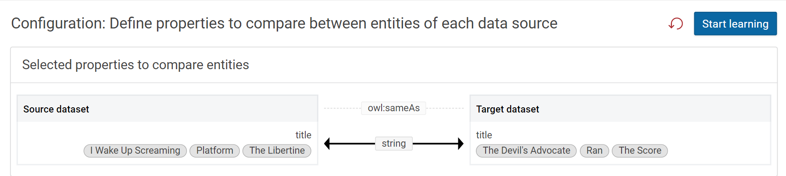

#### **Introduction**

Active learning infuses expert knowledge and creates new relationships between properties of two datasets. We can learn new rules and refine existing rules.

### **Usage**

Define properties to compare between entities of the selected datasets.

### **Start the learning dialog**

Create a linking rule and setup source and target datasets as well as the linking property that should be yielded. Start the learning dialog by clicking the “Learning” tab in the linking view.

### **Creating an automatic link rule**

- Choose properties to compare. Select from the suggestions or search them by specifying property paths for both entities.

    

!!! Note

       Based on the dataset suggestions for comparison are produced.

        
### **Add property paths for both entities**.

 - Click on the Source path and select a path.

     

 - Click on the Target path and select a corresponding path.

          

 - Click on the plus icon to add the path pair to be examined in the learning algorithm.

     

   !!! Success
        
           Step Result: Both entities' paths were added.
          
           

 - Click on delete icon to remove the paths.

     

 - Click on Start learning.

    

    !!! Note

           Clicking on the star icon uses the property value as the entity label, unselecting the star icon removes the property value from the entity label. Multiple properties can be starred to use them as a combined label.

           

           

    !!! Success

          Step Result: The comparison in both paths will be reflected as shown below.
           
               

    Cross-check the similarity between the source and target path data with regards to the configured link property (owl:sameAs in this example).
    
    **Confirm**: If the source and target title names are the same, click on Confirm and it is shown in dark blue colour.  

    

    **Uncertain**: If the title names differ slightly, we can consider the link uncertain. As it might be a spelling mistake, we cannot ensure it is the same nor can we say it is different. If the title names are different it is displayed in light blue colour. 

         

    **Decline**: If the title names of source and target path are different,click on decline and it displayed in light blue colour.

     

    - On the right side of the page click on the 3 dots, then click on show entity’s URI.

    

!!! Success

         Step Result: It shows the link entity URIs along with rows numbers in both the dataset files.

         

- Click on Save based on our input confirm, uncertain and decline the link rule will get generated automatically and the score changes for these entities in the score bar.

- Switch on the save best learned rule, then click on save.

 !!! Success

          The new automatically created linking rule based on the input training data consisting of confirmed, uncertain and declined links is shown below. It tokenize all the input values from the connected source path and compares the data with  target paths.

        