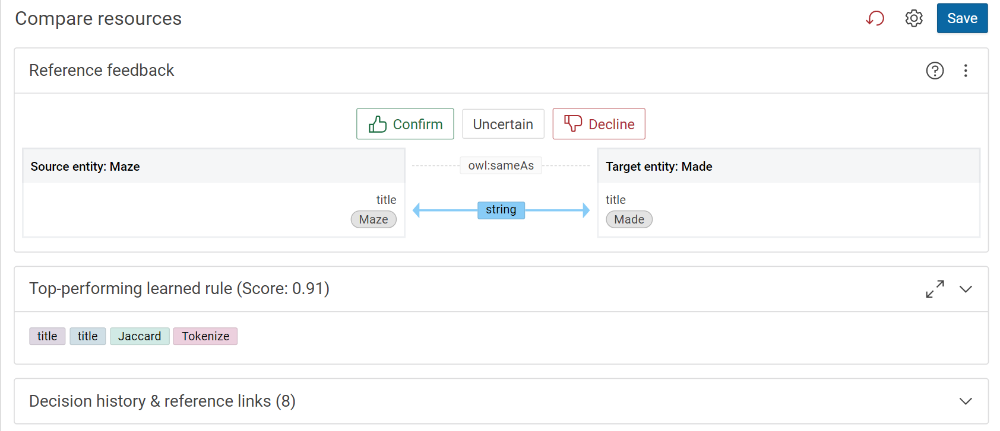

# Active Learning of Linking Rules

## Introduction

Active learning infuses expert knowledge and creates new relationships between properties of two datasets. We can learn new rules and refine existing rules.

The documentation consists of the following parts described in detail below:

-   [Introduction](#introduction)
-   [Usage](#usage)
-   [Start the learning dialog](#start-the-learning-dialog)
-   [Creating an automatic link rule](#creating-an-automatic-link-rule)
-   [Add property paths for both entities](#add-property-paths-for-both-entities)

## Usage

Active learning is a special case of machine learning in which a learning algorithm interactively queries a user to label new data points with the desired outputs [[wikipedia]](https://www.wikiwand.com/en/Active_learning_(machine_learning)#introduction).
In Corporate Memory we apply this approach to the process of learning a linking rule by interactively label records from the configured source and target dataset.
Labeling in this case means to indicate if the pair of resources (from source and target) should be connected with the configured property.
The labeling process creates reference links against which the linking rule can be created and further refined as more input is given by the user.

Our active (link) learning is a three step process:

1. It starts by define properties to compare between entities of the selected datasets.
2. We continue with the interactive labeling process where user feedback is asked, the golden record build and a rule (automatically) calculated and refined (as more reference links are entered)
3. Saving the learned rule and/or the reference links only

## Start the learning dialog

Link learning is a feature available on a link rule in a DataIntegration project.
See the [Lift data from tabular data such as CSV, XSLX or database tables](/build/lift-data-from-tabular-data-such-as-csv-xslx-or-database-tables) tutorial to learn how to setup a project.
Use the **Create :eccenca-item-add-artefact:** button in your project and select **Linking** to create a new linking rule.
In the configuration dialog of your linking rule and setup source and target datasets as well as the linking property that should be yielded.
Start the learning dialog by clicking the “Learning” tab in the linking view.

The examples process below uses the **movies** example project which can be added to your workspace with the **:eccenca-item-add-artefact: Add "movies" example project** button to be found in the **:eccenca-application-useraccount:** user menu in the top right corner.

## Creating an automatic link rule

-   Choose properties to compare.
    Select from the suggestions or search them by specifying property paths for both entities.

    { class="bordered" }

!!! note

    Based on the dataset suggestions for comparison are produced.

## Add property paths for both entities

-   Click on the Source path and select a path.

    { class="bordered" }

-   Click on the Target path and select a corresponding path.

    { class="bordered" }

-   Click on the :eccenca-item-add-artefact: icon to add the path pair to be examined in the learning algorithm.

    { class="bordered" }

    !!! success

        Step Result: Both entities' paths were added.

        { class="bordered" }

-   Click on :eccenca-item-remove: icon to remove the paths.

     { class="bordered" }

-   Click on Start learning.

    { class="bordered" }

    !!! note

        Clicking on the :material-star: icon uses the property value as the entity label, unselecting the :material-star: icon removes the property value from the entity label.
        Multiple properties can be starred to use them as a combined label.

        { class="bordered" }

        { class="bordered" }

    !!! success

        Step Result: The comparison in both paths will be reflected as shown below.

        { class="bordered" }

    Cross-check the similarity between the source and target path data with regards to the configured link property (`owl:sameAs` in this example).

    **:octicons-thumbsup-24: Confirm**: If the source and target title names are the same, click on Confirm and it is shown in dark blue colour.

    { class="bordered" }

    **Uncertain**: If the title names differ slightly, we can consider the link uncertain.
    As it might be a spelling mistake, we cannot ensure it is the same nor can we say it is different.
    If the title names are different it is displayed in light blue colour.

    { class="bordered" }

    **:octicons-thumbsdown-24: Decline**: If the title names of source and target path are different,click on decline and it displayed in light blue colour.

    { class="bordered" }

-   On the right side of the page click on the 3 dots, then click on show entity’s URI.

    { class="bordered" }

!!! success

    Step Result: It shows the link entity URIs along with rows numbers in both the dataset files.

    { class="bordered" }

-   Click on Save based on our input confirm, uncertain and decline the link rule will get generated automatically and the score changes for these entities in the score bar.

{ class="bordered" }

-   Switch on the save best learned rule, then click on save.

{ class="bordered" }

!!! success

    The new automatically created linking rule based on the input training data consisting of confirmed, uncertain and declined links is shown below.
    It tokenize all the input values from the connected source path and compares the data with target paths.

    { class="bordered" }
