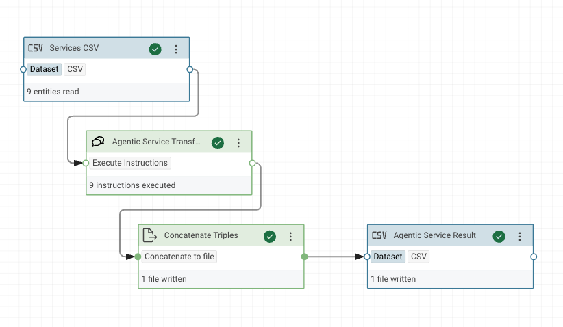
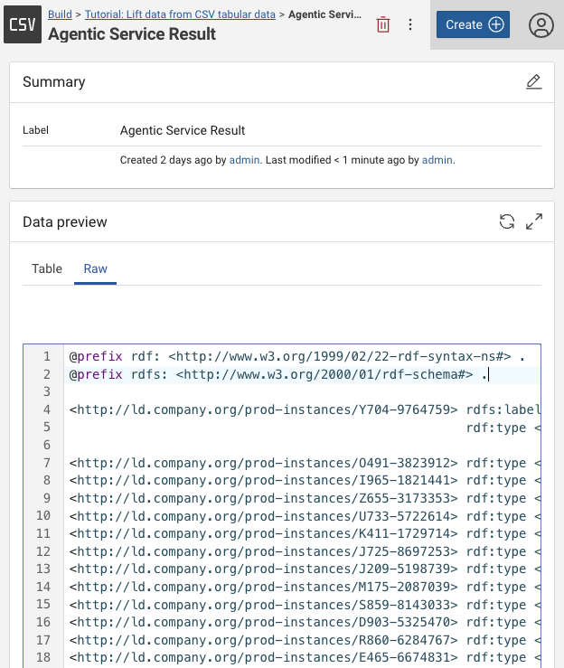
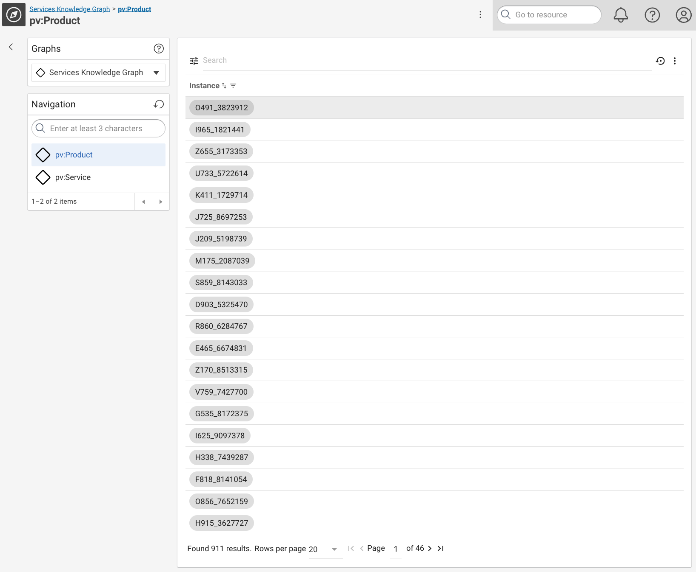

# Agentic lifting tabular data such as CSV, XSLX or database tables

!!! Requirements

    This tutorial requires the installation of Corporate Memory LLM Plugin.

    For installing the LLM plugin, you will need to execute the following cmemc command on your cmem installation.

    ``` shell-session
    $ cmemc admin workspace python install cmem-plugin-llm
    Install package cmem-plugin-llm ... done
    ```

## Introduction

This beginner-level tutorial shows how you can build a Knowledge Graph based on input data from a **comma-separated value file** (.csv), an **excel file** (.xlsx) or a **database table** (jdbc).
It is based on the [lift tabular data tutorial using transformation rules](../../build/lift-data-from-tabular-data-such-as-csv-xslx-or-database-tables/index.md).

!!! Abstract

    The complete tutorial is available as a [project file](tutorial-csv.project.zip). You can import this project

    - by using the [web interface](../../build/introduction-to-the-user-interface/index.md) (Create → Project → Import project file) or
    - by using the [command line interface](../../automate/cmemc-command-line-interface/index.md)

    ``` shell-session
    $ cmemc -c my-cmem project import tutorial-csv.project.zip tutorial-csv
    ```

    This step is optional and makes some of the following steps of the tutorial superfluous.

The documentation consists of the following steps, which are described in detail below:

!!! Notice

    You can reuse the workflow from the tutorial [lift tabular data using transformation rules](../../build/lift-data-from-tabular-data-such-as-csv-xslx-or-database-tables/index.md) and jump to _**setp 5**_.

1. Registration of the target vocabulary
2. Uploading of the data (file)/Connect to JDBC endpoint
3. (Re-)View your data table
4. Creation of a (target) graph
5. Creation of the execute instruction agentic workflow
6. Evaluation of the results through a CSV dataset
7. Execution of the agentic workflow to populate the target graph

## Sample Material

The following material is used in this tutorial, you should download the files and have them at hand throughout the tutorial:

-   Sample vocabulary which describes the data in the CSV files: [products_vocabulary.nt](../lift-data-from-tabular-data-such-as-csv-xslx-or-database-tables/products_vocabulary.nt)

    { class="bordered" }

-   Sample CSV file: [services.csv](../lift-data-from-tabular-data-such-as-csv-xslx-or-database-tables/services.csv)

    !!! info

        | ServiceID    | ServiceName             | Products                                      | ProductManager             | Price       |
        | ------------ | ----------------------- | --------------------------------------------- | -------------------------- | ----------- |
        | Y704-9764759 | Product Analysis        | O491-3823912, I965-1821441, Z655-3173353, ... | Lambert.Faust@company.org  | 748,40 EUR  |
        | I241-8776317 | Component Confabulation | Z249-1364492, L557-1467804, C721-7900144, ... | Corinna.Ludwig@company.org | 1082,00 EUR |
        | …            | …                       | …                                             | …                          | …           |

-   Sample Excel file: [products.xlsx](../lift-data-from-tabular-data-such-as-csv-xslx-or-database-tables/products.xlsx)

    !!! info

        | ProductID    | ProductName        | Height | Width | Depth | Weigth | ProductManager              | Price    |
        | ------------ | ------------------ | ------ | ----- | ----- | ------ | --------------------------- | -------- |
        | I241-8776317 | Strain Compensator | 12     | 68    | 15    | 8      | Baldwin.Dirksen@company.org | 0,50 EUR |
        | D215-3449390 | Gauge Crystal      | 77     | 58    | 19    | 15     | Wanja.Hoffmann@company.org  | 2,00 EUR |
        | …            | …                  | …      | …     | …     | …      | …                           | …        |

---

## 1 Register the vocabulary

The vocabulary contains the classes and properties needed to map the data into the new structure in the Knowledge Graph.

=== "Corporate Memory"

    1. In Corporate Memory, click Vocabularies under **EXPLORE** in the navigation on the left side of the page.

        { class="bordered" width="30%" }

    2. Click **Register new vocabulary** on the top right.

        { class="bordered" }

    3. Define a **Name**, a **Graph URI** and a **Description** of the vocabulary. _In this example we will use:_

        - Name: _**Product Vocabulary**_
        - Graph URI: _**http://ld.company.org/prod-vocab/**_
        - Description: _**Example vocabulary modeled to describe relations between products and services.**_
        - Vocabulary File: Browse in your filesystem for the **[products_vocabulary.nt](products_vocabulary.nt)** file and select it to be uploaded.

        { class="bordered" width="50%" }

=== "cmemc"

    ``` shell-session
    $ cmemc vocabulary import products_vocabulary.nt
    ```

---

## 2 Upload the data file / Connect to the JDBC endpoint

=== "CSV + XLSX"

    1. In Corporate Memory, click Projects under **BUILD** in the navigation on the left side of the page.

        { class="bordered" width="30%" }

    2. Click **Create** at the top of the page. 

    3. In **Create new item** window, select **Project** and click **Add**. The Create new item of type Project window appears.  

    4. Fill in the required details such as Title and Description. Alternatively, import the existing project by clicking **Import Project File** and selecting the file from your system.  

    5. Click **Create**. Your project is created.

    6. Within your project, click **Create** or **Create item**.

    7. In the **Create new item** dialog, select **CSV**.

        { class="bordered" }

    8. Fill out a label and upload the **[services.csv](services.csv) sample file**.

        { class="bordered" }

    9.  Click **Create**.** Leave all other parameters at their default values.

    10. Create a second **dataset**. Choose **Excel** and upload the [products.xlsx](products.xlsx) file.

=== "JDBC"

    Instead of uploading the [services.csv](services.csv) sample file into Corporate Memory, you can also load it into a SQL database and access it from Corporate Memory using the JDBC protocol.

    1. In the project, Click **Create** and select the **JDBC endpoint** type.

        { class="bordered" }

    2. Define a **Label** for the dataset, specify the **JDBC Driver connection URL**, the **table** name and the **user** and **password** to connect to the database. _In this example we will use:_

        - Name: _**Services_ServiceDB**_
        - JDBC Driver Connection URL: _**jdbc:mysql://mysql:3306/ServicesDB**_
        - table: _**Services**_
        - username: _**root**_
        - password: _**\*\*\*\***_

        { class="bordered" }

        The general form of the JDBC connection string is:

        ```
        jdbc:<vendor>://<hostname>:<portNumber>/<databaseName>
        ```

        Default JDBC connection strings for popular Relational Database Management Systems:

        | Vendor               | Default JDBC Connection String                  | Default Port |
        | -------------------- | ----------------------------------------------- | ------------ |
        | Microsoft SQL Server | jdbc:sqlserver:<hostname>:1433/<databaseName>   | 1433         |
        | PostgreSQL           | jdbc:postgresql:<hostname>:5432/<databaseName>  | 5432         |
        | MySQL                | jdbc:mysql:<hostname>:3306/<databaseName>       | 3306         |
        | MariaDB              | jdbc:mariadb:<hostname>:3306/<databaseName>     | 3306         |
        | IBM DB2*             | jdbc:db2:<hostname>:50000/<databaseName>        | 50000        |
        | Oracle*              | jdbc:oracle:thin:<hostname>:1521/<databaseName> | 1521         |

        !!! info

            \* IBM DB2 and Oracle JDBC drivers are not by default part of Corporate Memory, but can be added.

        !!! info

            Instead of selecting a table you can also specify a custom SQL query in the _source query_ field.

=== "cmemc"

    ``` shell-session
    $ cmemc project create tutorial-csv

    $ cmemc dataset create --project tutorial-csv services.csv

    $ cmemc dataset create --project tutorial-csv products.xlsx
    ```

---

## 3 (Re-)View your Data Table

To validate that the input data is correct, you can preview the data table in Corporate Memory.

1. On the dataset page, press the **Load preview** button

    { class="bordered" }

2. Once the preview is loaded, you can view a couple of rows to check that your data is accessible.

    { class="bordered" }

3. Optionally, you can click **start profiling** and explore statistics about the dataset.

    { class="bordered" }

---

## 4 Create a Knowledge Graph

1. Click Create at the top of the page.

2. In Create new item window, select Knowledge Graph and click Add.

    { class="bordered" }

3. The Create new item of type Knowledge Graph window appears.

4. Define a **Label** for the Knowledge Graph and provide a **graph** uri. Leave all the other parameters at the default values. _In this example we will use:_

    -   Label: _**Service Knowledge Graph**_
    -   Graph: _**<http://ld.company.org/prod-instances/>**_

5. Click **Create**.

---

## 5 Creation of the execute instruction agentic workflow

In this tutotrial, the Execute Instruction Task will be used to transform the input dataset (e.g. CSV) into an output dataset (e.g. Knowledge Graph).
In this example, we instruct the LLM to generate triples in Turtle format and then feed it to the **Service Knolwedge Graph** created in the previous step.

1. Click **Create** in your project.  

2. On the **Create New Item** window, select **Execute Instruction** and click **Add** to create a new task.

3. Fill out the the details leaving the **URL** field at its default value **https://api.openai.com/v1**. You will need an OpenAI API Key. 
_In this example we will use:_

    -   Name: _**Agentic Service Transformation**_
    -   _In the field **API key** set your OpenAI API key._
    -   _Select the model **gpt-4o** in the field **Intruct Model**._
    -   _**Instruction Template**_:
        Here you will need to add a prompt that will instruct the LLM to lift the service data.
        Use the following prompt:
        ```
        Create triples in turtle format from the following entity: 

        ${entity}

        - The namespace of the triples is http://ld.company.org/prod-instances/
        - Use RDFS and RDF vocabularies
        - Output plain triples without any explanation and without escaping 
        - Remove the markup escaping from the generated answer such as ``` 

        Example template:

        @prefix rdf: <http://www.w3.org/1999/02/22-rdf-syntax-ns#> .
        @prefix rdfs: <http://www.w3.org/2000/01/rdf-schema#> .

        <http://ld.company.org/prod-instances/{ServiceID}> rdfs:label \"{ServiceName}\"@en ; 
                                                        rdf:type <http://ld.company.org/prod-vocab/Service> .
        <http://ld.company.org/prod-instances/{ProductID}> rdf:type <http://ld.company.org/prod-vocab/Product> .

        Example ouput:

        @prefix rdf: <http://www.w3.org/1999/02/22-rdf-syntax-ns#> .
        @prefix rdfs: <http://www.w3.org/2000/01/rdf-schema#> .

        <http://ld.company.org/prod-instances/Y704-9764759> rdfs:label \"Product Analysis\"@en ; 
                                                            rdf:type <http://ld.company.org/prod-vocab/Service> .
        <http://ld.company.org/prod-instances/O491-3823912> rdf:type <http://ld.company.org/prod-vocab/Product> .

        ```
        This prompt will instruct the LLM to create the service triples using ```ServiceID``` and ```ProductID``` as identifiers.
        It also instruct how to assign the correct service and product rdf:types.
    -   Click **Create**. Leave all other parameters at their _default_ values.
    -   Connect the Service CSV/JDBC output port to the _**Agentic Lifting Service**_ input port.

---

## 6 Concatenate Instruct Outputs

Create a Concatenate File to concatenate all triples generated by the _**Agentic Service Lifting**_.

1. Within your project, click **Create** or **Create item**.

2. In the **Create new item** dialog, select **Concatenate File**.

3. Fill out a label _**Concatenate Triples**_, under **Path** write **_instruction_output** add click in **create**.

4. Click **Create**. Leave all other parameters at their default values.

5. Connect the _**Agentic Service Transformation**_ ouput port to the newly create _**Concatenate Triples**_ input port.

---

## 7 Evaluate the results

Create a CSV dataset to evaluate the _**Agentic Service Lifting**_  results.

1. Within your project, click **Create** or **Create item**.

2. In the **Create new item** dialog, select **CSV**.

3. Fill out a label _**Agentic Service Result**_ and create , under **File** select **Create empty file** add a name i.e. _**agentic_service_result.csv**_.

4. Click **Create**. Leave all other parameters at their default values.

5. Connect the _**Concatenate Triples**_ ouput port to the newly create _**Agentic Service Result**_ input port.

6. Press the  button and validate the results. In this example, the triples were written in the CSV field **_instruction_output**.

    { style="width:500px;" class="bordered" }

7. Check the output generated by the Workflow in _**Agentic Service Result**_ under **Raw** tab.

    { style="width:400px;" class="bordered" }


---

## 8 Build the Knowledge Graph

1. Connect the _**Concatenate Triples**_ output port to the _**Service Knowledge Graph**_ input port created previously.

2. Press the  button and validate the results. In this example, 9x Services and 911x Products were created in our Knowledge Graph based on the mapping.

3. Finally you can use the DataManager **Knowledge Graphs** module to (re-)view of the created Knowledge Graph: <http://ld.company.org/prod-instances/>

    { class="bordered" }
