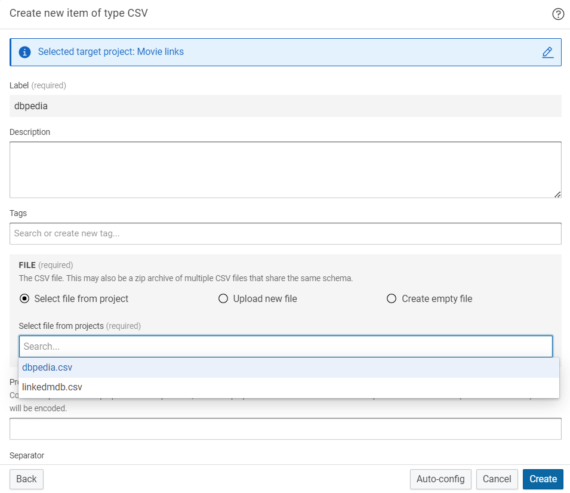
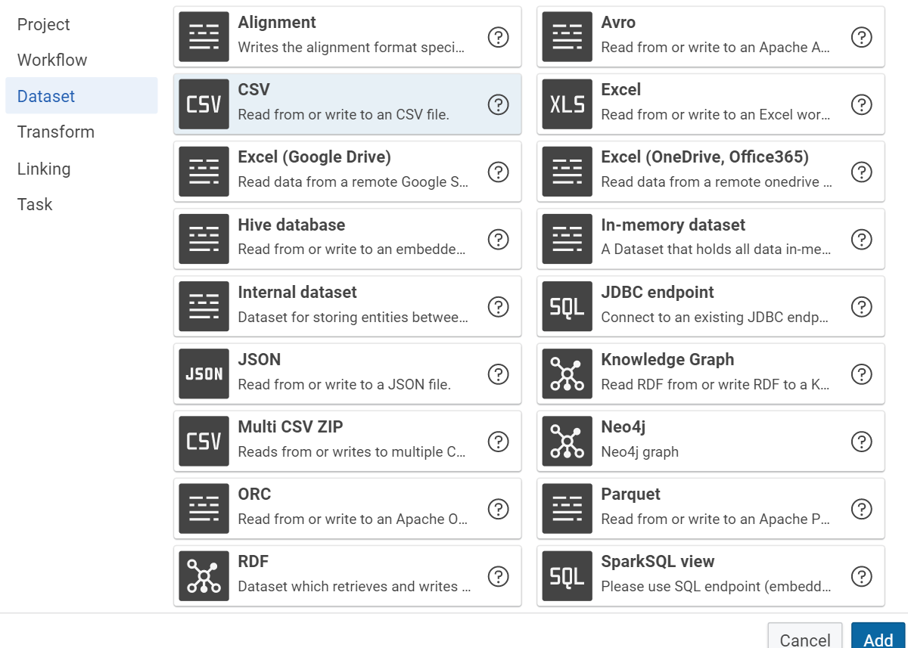
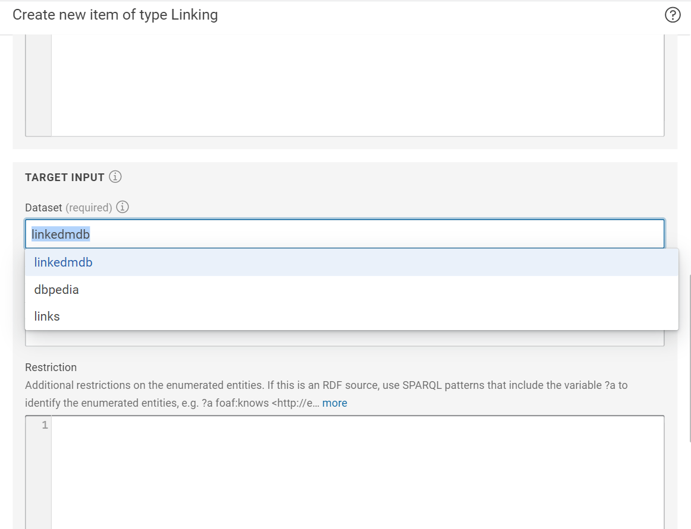

# Linking tutorial

## Introduction

The eccenca Corporate Memory platform is designed to support the process to **BUILD** a knowledge graph by integrating structured and unstructured data from multiple sources, including on-premises systems and cloud-based services.
The **BUILD** functionalities include data mapping, transformation, and cleansing tools, as well as DataIntegration and governance support.

This beginner-level tutorial explains how to **BUILD** a eccenca Corporate Memory project using linking rules.

The documentation consists of the following steps described in detail below:

-   [1. Create a new project](#1-create-a-new-project)
-   [2. Upload the files](#2-upload-the-files)
-   [3. Create datasets](#3-create-datasets)
-   [4. Create a linking task](#4-create-a-linking-task)
-   [5. Assemble a linking rule](#5-assemble-a-linking-rule)
    -   [Add source and target paths for the `title`](#add-source-and-target-paths-for-the-title)
    -   [Normalize the `title` for a better comparison result](#normalize-the-title-for-a-better-comparison-result)
    -   [Compare the `title` of the movies](#compare-the-title-of-the-movies)
    -   [Linking evaluation](#linking-evaluation)
    -   [Use a filter](#use-a-filter)

This tutorial shows how to connect two movie-related data sources and introduces some of Data-Integration’s fundamental functions.
Sources of information are LinkedMDB, the linked data version of the IMDb movie database, and DBpedia, the linked data version of Wikipedia.
Both files contain a list of movies with their names, titles, release dates, and an internal ID for each movie.
The task is to link the two datasets to find out which movie in DBpedia corresponds to which movie in LinkedMDB.

## Sample material

The following material is used in this tutorial, you should download the files and have them at hand throughout the tutorial:

-   [dbpedia.csv](dbpedia.csv)

    !!! info

        { style="border: 1px solid #555; border-radius: 5px;" }

-   [linkedmdb.csv](linkedmdb.csv)

    !!! info

        { style="border: 1px solid #555; border-radius: 5px;" }

## 1. Create a new project

-   Once logged in to eccenca Corporate memory on the right side click on **Create :eccenca-item-add-artefact:**.

    { style="border: 1px solid #555; border-radius: 5px;" }

    The screen gives an overview of the different projects created in your installation of eccenca Corporate Memory.
    It shows the item type on the left side like a project, workflow, dataset, transform, linking, and task.

-   Click on the **project** on the left side in the item type and double-click on the **project** in the centre.

    { style="border: 1px solid #555; border-radius: 5px;" }

-   Type the project name as **Movie links** in the title field and click on **create.**

    { style="border: 1px solid #555; border-radius: 5px;" }

!!! success "Step Result"

    The project was created with the name "Movie links" which is displayed in the page top left corner.

    { style="border: 1px solid #555; border-radius: 5px;" }

## 2. Upload the files

-   Click on **Add File** on the right side of the page.

    { style="border: 1px solid #555; border-radius: 5px;" }

-   Click on **Drop files here** select the both file and click on **Open**.

    { style="border: 1px solid #555; border-radius: 5px;" }

-   Once the file is successfully uploaded click on **close.**

    { style="border: 1px solid #555; border-radius: 5px;" }

!!! success "Step Result"

    The files are uploaded to the project and reflect on the right side as shown below.

    { style="border: 1px solid #555; border-radius: 5px;" }

## 3. Create datasets

-   Click on **Create :eccenca-item-add-artefact:**.

    { style="border: 1px solid #555; border-radius: 5px;" }

-   Click on the **dataset** on the left side in the item type and double-click on the **:eccenca-artefact-dataset-csv: CSV** file in the centre.

    { style="border: 1px solid #555; border-radius: 5px;" }

-   Type the file name as **dbpedia** in the label field.

    { style="border: 1px solid #555; border-radius: 5px;" }

-   Tick the option **Select file from project** and select the file from the drop-down list of files available in the project.

    { style="border: 1px solid #555; border-radius: 5px;" }

-   Click on **create**.

    { style="border: 1px solid #555; border-radius: 5px;" }

-   Repeat the same step and add another file linkedmdb in the dataset.

-   Create the empty dataset file for extracting both files' links as an output result.
    Click on the **dataset** on the left side of the item list and double-click on the **:eccenca-artefact-dataset-csv: CSV** file.

    { style="border: 1px solid #555; border-radius: 5px;" }

-   Type the label name **links** in the label field.

    { style="border: 1px solid #555; border-radius: 5px;" }

-   Tick the option **Create empty file** and select the file name from the drop-down list as **link.csv** then click on **Create**.

    { style="border: 1px solid #555; border-radius: 5px;" }

!!! success "Step result"

    Dataset for both the files dbpedia and linkedmdb has been created, and `link.csv` is created for the output result displayed in the page's center.

    { style="border: 1px solid #555; border-radius: 5px;" }

## 4. Create a linking task

-   Click on **Create :eccenca-item-add-artefact:**.

    { style="border: 1px solid #555; border-radius: 5px;" }

-   Click on **:eccenca-artefact-linking: Linking** on the left side in the item type and double-click on **linking** in the center.

    { style="border: 1px solid #555; border-radius: 5px;" }

-   Type the name as **linking** in the label field and select the **source input** data set as a **dbpedia** file.

    { style="border: 1px solid #555; border-radius: 5px;" }

-   Select the **Type** field (it gives the default name)

    { style="border: 1px solid #555; border-radius: 5px;" }

-   In the continuation to the same page go down, select the **TARGET INPUT** dataset as a **linkedmdb** file.

    { style="border: 1px solid #555; border-radius: 5px;" }

-   Select the **Type** field (it gives the default name) select the same.

    { style="border: 1px solid #555; border-radius: 5px;" }

-   Select the **Output dataset** as **links** file.

    { style="border: 1px solid #555; border-radius: 5px;" }

-   Click on **Create**.

    { style="border: 1px solid #555; border-radius: 5px;" }

!!! success "Step Result"

    Linking task is created for the project.
    It shows the source path, target path, and operators (transform, comparison, and aggregation) options on the left side of the page.

    { style="border: 1px solid #555; border-radius: 5px;" }

    It shows the linking editor, linking execution, linking evaluation, and reference link in the centre of the page to create and evaluate the linking rules.

    { style="border: 1px solid #555; border-radius: 5px;" }

    On the right side of the page, it shows datasets, configuration linking, and configuration linking rules.

    { style="border: 1px solid #555; border-radius: 5px;" }

## 5. Assemble a linking rule

<!--
the initial rule shown in the screenshots is incomplete.
a rule is only complete if if can be saved and validated.

the initial rule should have the source and target paths for title and a string equality comparator.
-->

!!! success "Task"

    Assemble a linking rule with the linking editor.
    To create a rule to say that movies from dbpedia and linkedmdb should be considered the same if their titles are identical.

### Add source and target paths for the `title`

-   Click on the **:eccenca-data-sourcepath: source path** and drag the title on the canvas.

    { style="border: 1px solid #555; border-radius: 5px;" }

-   Click on the **:eccenca-data-targetpath: target path** and drag the title on the canvas.

    { style="border: 1px solid #555; border-radius: 5px;" }

!!! success "Step Result"

    The titles from the source path and target are dragged on the canvas as shown below.

    { style="border: 1px solid #555; border-radius: 5px;" }

### Normalize the `title` for a better comparison result

!!! success "Task"

    Let's make this a little better and compare only the lowercase versions of the titles to get around issues with differences in the lower and upper case between the two datasets.

-   Click on **:eccenca-operation-transform: transform**, type the operator **lowercase**  in the search field and drag the same on the canvas twice.

    { style="border: 1px solid #555; border-radius: 5px;" }

-   Drag the little dot on the right side of the source path box onto the left dot of the transformation box (lower case) to connect the two with a line (you always must drag from the right side of one element to the left side of another to connect the two).

    { style="border: 1px solid #555; border-radius: 5px;" }

-   Drag the little dot on the right side of the target path box onto the left dot of the transformation box (lower case) to connect the two with a line (you always must drag from the right side of one element to the left side of another to connect the two).

    { style="border: 1px solid #555; border-radius: 5px;" }

!!! success "Step Result"

    The lines connected between the target path title and lowercase as shown below.

    { style="border: 1px solid #555; border-radius: 5px;" }

### Compare the `title` of the movies

!!! success "Task"

    Compare the movie title names of both the data `dbpedia.csv` and `linkedmdb.csv`.

-   Click on **:eccenca-operation-comparison: comparison** and type the **equality** in the search field and drag the `string equality` operation onto the canvas.

    { style="border: 1px solid #555; border-radius: 5px;" }

-   Drag the little dot on the right side of both lowercase boxes onto the left dot of the string equality box to connect the two with a line (you always must drag from the right side of one element to the left side of another to connect the two).

    { style="border: 1px solid #555; border-radius: 5px;" }

!!! success "Step Result"

    The lines are connected between both lowercase operators and string equality operators.

    { style="border: 1px solid #555; border-radius: 5px;" }

-   Click on **save** on the right side of the page.

    { style="border: 1px solid #555; border-radius: 5px;" }

### Linking evaluation

!!! success "Task"

    Now it is time to see your linking rule in action by running it on your datasets.
    So far, we have created a linking rule in which we changed the title names of both files in lowercase and compared the same.
    Now it’s time to generate the links by evaluating them.

-   Click on the **linking evaluation**.

    { style="border: 1px solid #555; border-radius: 5px;" }

-   Click on the **:eccenca-item-start: button** to start the evaluation and generate the links.

    { style="border: 1px solid #555; border-radius: 5px;" }

!!! success "Step Result"

    The links are generated as shown below. (It allows us to review the links and since eccenca Corporate Memory does not know which column to use as a unique identifier, it just uses the row number in the `.csv` file to identify each movie.

    { style="border: 1px solid #555; border-radius: 5px;" }

-   Click on the **:eccenca-toggler-showmore:** button to **expand all**.

    { style="border: 1px solid #555; border-radius: 5px;" }

!!! success "Step Result"

    This allows you to see how the linking rule was performed for each link and even the movie name compared in both files.

    { style="border: 1px solid #555; border-radius: 5px;" }

### Use a filter

!!! success "Task"

    It has a filter feature that helps to find links by movie names.
    An example is shown below.

    Let’s consider the movie name as shaft type **shaft** in the filter it shows the links with the shaft movie names links of both files.

    { style="border: 1px solid #555; border-radius: 5px;" }

    Cross-checking in the `dbpedia.csv` and `linkedmdb.csv` data sheet.

    { style="border: 1px solid #555; border-radius: 5px;" }

    The movie name is twice in both sheets, but the release dates differ.
    The shaft movie’s original release was in 1971 and the remake was in 2000.
    We have the tick option for the correct rule.

-   Click on the linking execution then click on the **:eccenca-item-start: button** to execute the links (It copies the links to our data file `links.csv` (which is our output file).

    { style="border: 1px solid #555; border-radius: 5px;" }

!!! success "Step Result"

    The links are executed and copied to the output data file `links.csv` and which shows the count of links on the page.

    { style="border: 1px solid #555; border-radius: 5px;" }
