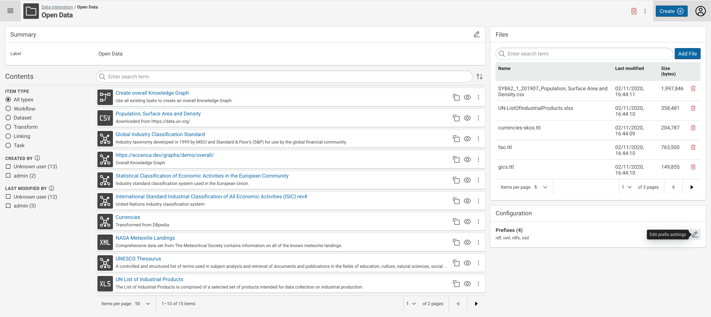

---
tags:
    - KnowledgeGraph
    - BestPractice
---
# Define Prefixes / Namespaces

## Introduction

Namespace declarations allow for abbreviation of IRIs by using a prefixed name instead of an IRI, in particular when writing SPARQL queries or Turtle.A namespace declaration consists of a **prefix name** and a **namespace IRI**.

For example, after defining a namespace with the values

- **prefix name** = `cohw`, and the
- **namespace IRI** = `https://data.company.org/hardware/`

you can use the term `cohw:test` as an abbreviation for the full IRI `https://data.company.org/hardware/test`.

This is in particular useful when you have to write source code in Turtle and SPARQL.

## Using the Vocabulary Catalog

After installing a vocabulary from the [Vocabulary Catalog](/explore-and-author/vocabulary-catalog), the vocabulary namespace declaration is automatically added to all integration projects.

In order to get the **prefix name** and the **namespace IRI** from the vocabulary graph, the following terms from the [VANN vocabulary](https://vocab.org/vann/) need to be used on the Ontology resource.

- [vann:preferredNamespacePrefix](https://vocab.org/vann/#preferredNamespacePrefix) - to specify the **prefix name**
- [vann:preferredNamespaceUri](https://vocab.org/vann/#preferredNamespaceUri) - to specify the **namespace IRI**

In the Explore area, an Ontology with a correct namespace declaration looks like this.

## Using the Project Configuration

In addition to the used vocabulary namespace declarations, you may want to add well-known namespaces for organizing to Knowledge Graphs.

Such organization use cases include:

- Namespaces per class / resource type:
    - **prefix name** = `persons`, **namespace IRI** = `https://example.org/data/persons/`
- Namespaces per data owner or origin:
    - **prefix name** = `sales`, **namespace IRI** = `https://example.org/data/sales/`

Prefixes in Data Integration are defined on a project base. When creating a new project, a list of well-know prefixes is already declared.

After selecting a project from the search results the prefix management is available in the project configuration in the lower right area:

By using the **Edit Prefix Settings** button in this Configuration are, you will see the **Manage Prefixes** dialog:

In this dialog, you are able to

- Delete a namespace declaration → **Delete Prefix**
- Add a new namespace declaration → **Add**

## Validating Namespace Declarations

After adding namespace declarations to a project, you are able to the abbreviated IRIs in user interface, such as the mapping editor:

