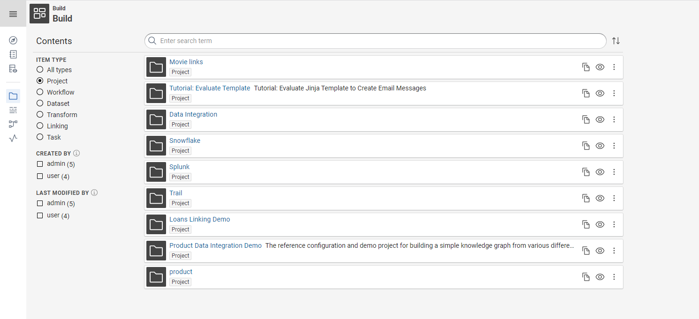
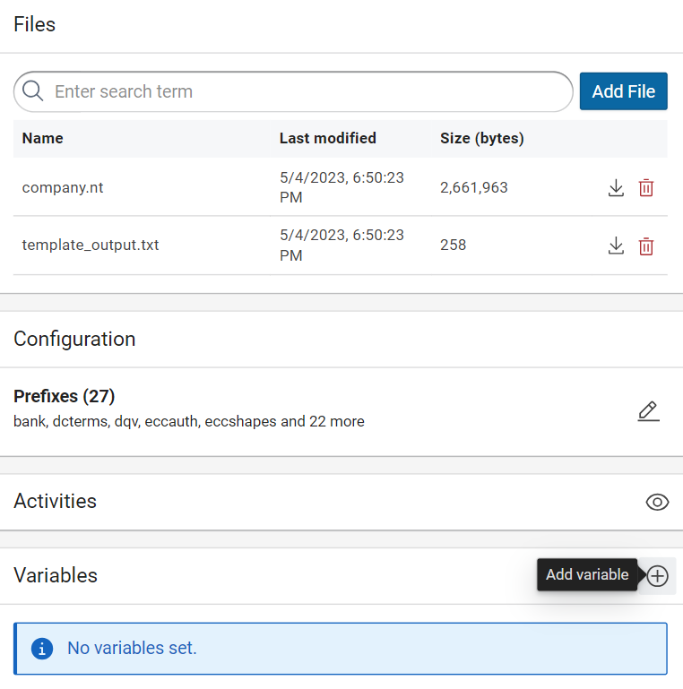
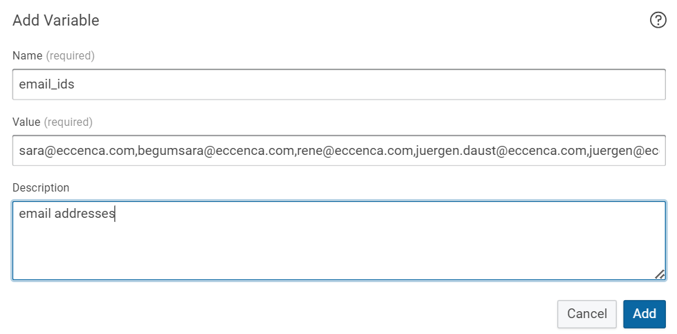
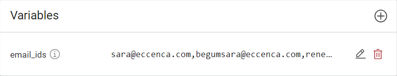
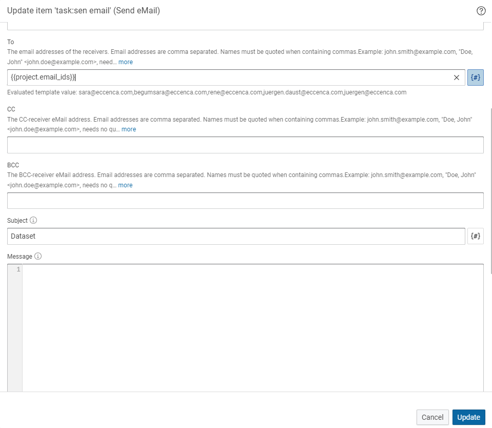
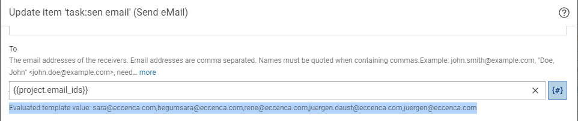
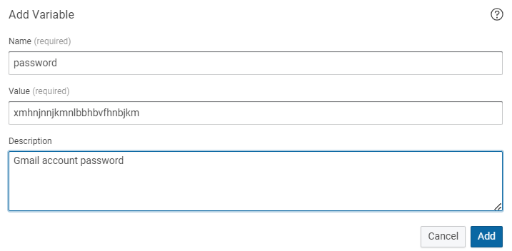
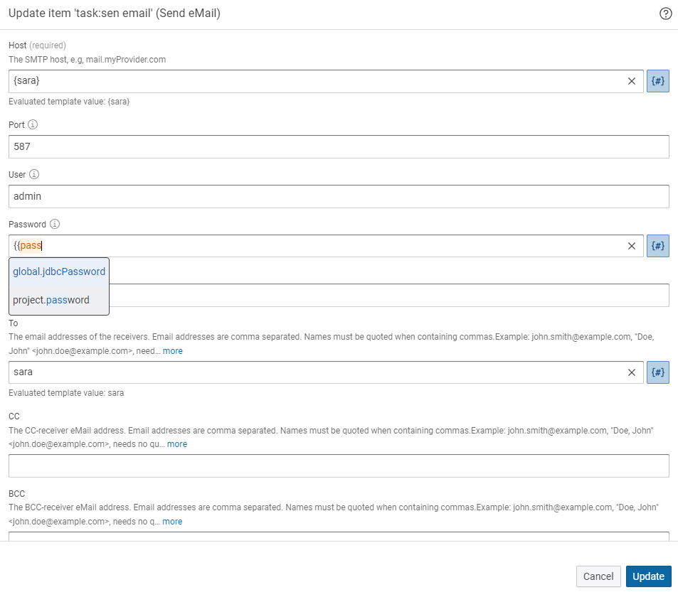

# Build Variables

## Introduction

Build variables are used to configure and customize build workflow and processes.
These variables define various aspects of the integration tasks, such as the source target data formats, transformation rules, mapping definitions etc.
The variables are not technically typed.
They can be used in most Build configuration and input fields that take inputs of the following data types:

-   simple text/string parameters (any string),
-   integer parameters (any integer),
-   and boolean values (`true`/`false`).

Two kinds of variables can be defined:

`Global variables`

:   It is defined by the administrator in the configuration file at deployment time and cannot be set by a normal user.

`Project variables (User-defined)`

:   It is defined by the user in the UI.
    Project variables can only be used in the same project.
    If a project is exported those will be exported as well.

Build variables can be particularly useful in scenarios where multiple tasks or components within a system need access to the same data or configuration values.
Instead of repeating the same information in multiple places, project variables provide a centralized and reusable way to store and retrieve these values.

## Benefits of using variables

1.  When sending an email to all employees, instead of manually typing or copy pasting each email address, you can conveniently store all the email addresses once and utilize them with a single word.
    This saves time and ensures that no email addresses are missed or incorrectly entered.

2.  Another scenario where variables can be beneficial is when dealing with lengthy or hard-to-remember values.
    For instance, consider the value "xmhnjnnjkmnlbbhbvfhnbjkm".
    By assigning it to a variable, you can store it once and easily recall it whenever needed.
    This avoids the need to repeatedly type or remember complex values, enhancing efficiency and accuracy in documentation and other tasks.

3.  In software development, when working with URLs or file paths that are long or subject to change, you can store them in variables.
    This allows for easy modification and reuse throughout the codebase, reducing the chances of errors and making maintenance more efficient.
    For example, you can assign a URL like "https://example.com/api/data" to a variable named `apiURL` for consistent referencing.

4.  When creating templates or form letters, variables can be used to personalize the content.
    For instance, you can include variables such as {firstName}, {lastName}, and {companyName} to dynamically populate the recipient's name and company information.
    This way, you can generate customized communications quickly without manually editing each instance.

5.  You can save the message, port, host or IP address, tokens, passwords, properties etc.

The use of variables provides flexibility, efficiency, and consistency, making it easier to manage complex or frequently used values across various tasks and documents.

## Global Variables

Global variables are statically defined in the `dataintegration.conf` configuration file.
They are set in a section like in the example below:

```conf
###############################################
### Global Variables
###############################################

config.variables = {
  # Template engine
  # Can be disabled by setting: engine = "disabled"
  engine = "jinja"

  global = {
    # Insert global variables here
    jdbcPassword = "secret"
    # more key/value pairs ...
    # key = "value"
  }
}
```

Global variables are used in the same way as project variables.
Which is described in the following sections.

## Project Variables

### Adding Variables

Login to eccenca Corporate Memory, select the build module and click on the project to open.

{ class="bordered" }

On the right side of the page you can see the variable section Click on :eccenca-item-add-artefact: to add the variables.

{ class="bordered" }

The variable definition dialog opens.
Type the name, value and description of the variable.

!!! note

    Variable names may only consist of uppercase and lowercase letters (`A-Z` , `a-z`), digits (`0-9`), and the underscore character (`_`).
    Space in variable names is not supported hence Instead of space we can use underscore `_` to name the variable.
    In addition, the first character of a variable name cannot be a digit.

!!! example

    We have to send an email to all the team members.
    Instead of typing or copy pasting all the mail id we can add all the email ids in variable and use whenever we require.

Type name as `email_ids`, in values we have updated all the email id’s of the team member’s and in description we have updated as email address then click on **Add**.

{ class="bordered" }

!!! success "Step Result"

    The email_ids variable is added as shown below.

    { class="bordered" }

### Using Variables

Let's see how these variables are useful.

Click on the symbol **{#}** it turns blue in colour it means the variables feature is active then click in the To option and type `{{email_ids}}`.

!!! note

    Always use double curly brackets `{{` to use the variables.
    When you start typing the variable name it shows you the variable name that you can use as shown below.

    { class="bordered" }

Select the `project.email_ids` and include the double curly brackets at last.

{ class="bordered" }

!!! success "Step Result"

    The email address of all the team members has been updated in the email field. 

    As shown in the below image you can see the Evaluated template value as all the email id addresses we have added in the variable.

    { class="bordered" }

!!! example

    The password is hard to remember and we used this password frequently then  we can add this password in variable for reusable.

Same as above, add the variable click on :eccenca-item-add-artefact: and type name as `password`, value as `xmhnjnnjkmnlbbhbvfhnbjkm` and in the description `Gmail account password` as shown below then click on **Add**.

{ class="bordered" }

!!! success "Step Result"

    The password variable is added.

Let's see how this variable can be used.

Click on the symbol **{#}** it turns blue in color. It means the variable's feature is active then click in the **Password** option and type `{{password}}` select the option as shown below and click on **Update**.

{ class="bordered" }

!!! success "Step result"

    The complex password is added in the password field easily.

!!! note

    Parameters that are typed as password will not show the evaluated template for security reasons and should only show after you saved the operator.
