# Evaluate Jinja Template to Create an Email Message

## Introduction

In this tutorial we dynamically produce text from a **Jinja** template and send it as en email message. The email contains a dataset as an attachment, that is sent went a workflow is completed. The dataset in this tutorial is sent as is. For tutorials on how to transform data. please refer to one of our other  [tutorials](https://documentation.eccenca.com/22.2/tutorials/) that demonstrate lifting data from a variety of data sources.

!!! Abstract

    The complete tutorial is available as a [project file](tutorial-template.project.zip). You can import the projects:

    - by using the [web interface](/build/introduction-to-the-user-interface) (Create → Project → Import project file) or
    - by using the [command line interface](/automate/cmemc-command-line-interface)

        ```shell
        cmemc -c my-cmem project import tutorial-template.project.zip tutorial-evaluate-template
        ```
    
The documentation consists of the following steps, which are described in detail below.

The following material is used in this tutorial:

- RDF graph containing company infomration regarding employees, products and services : [company-graph.ttl](company-graph.ttl)


    ```Turtle
    <http://ld.company.org/prod-instances/hw-A181-1118563> a prod:Hardware ;
    rdfs:label "A181-1118563 - Compensator Switch" ;
    prod:compatibleProduct <http://ld.company.org/prod-instances/hw-M558-2275045> ;
    prod:depth_mm 14 ;
    prod:hasCategory <http://ld.company.org/prod-instances/prod-cat-Switch> ;
    prod:hasProductManager <http://ld.company.org/prod-instances/empl-Adolfina.Hoch%40company.org> ;
    prod:height_mm 32 ;
    prod:id "A181-1118563" ;
    prod:name "Compensator Switch" ;
    prod:price <http://ld.company.org/prod-instances/price-hw-A181-1118563-EUR> ;
    prod:weight_g 5 ;
    prod:width_mm 22 .
    ...
    ```


## 1 Upload the company graph

The vocabulary contains the classes and properties needed to map the source data into entities in the Knowledge Graph.

1. In Corporate Memory, click **Knowledge Graphs** in the navigation under **Explore** on the left side of the page.

    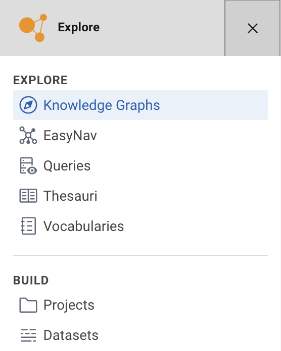width="30%"}{

2. Click on the **+** symbol next to the search field on the top left side of the page.

    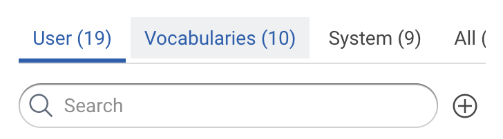{width="50%"}

3. In the dialog, click **New Graph from File**.

    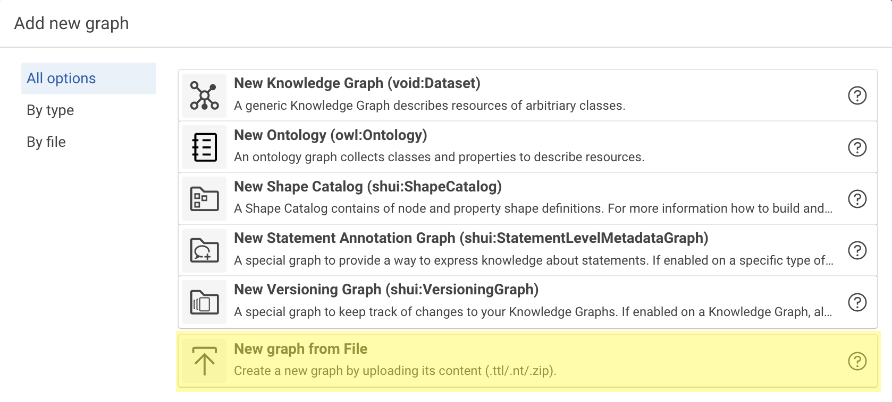{width="50%"}

4. Drop the file [company-graph.ttl](company-graph.ttl) onto the dialog, or click on **browse** to navigate to the file.

    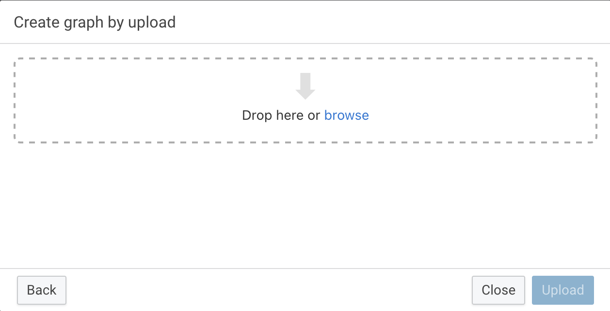{width="50%"}

5. In the **Target graph URI** field, enter **http://ld.company.org/prod-inst-jinja/** and click **Create option 'http://ld.company.org/prod-inst-jinja/'** 
   
    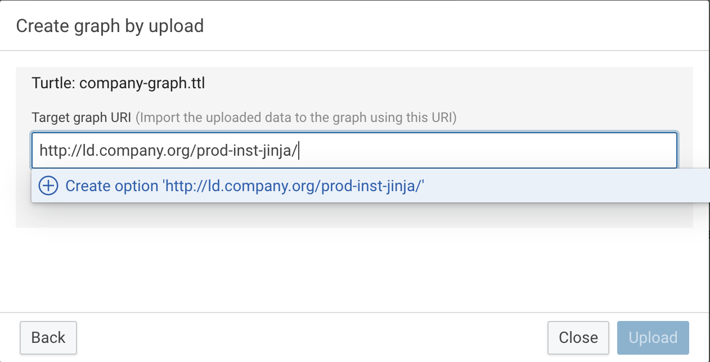{width="50%"}
   
6. Tick the **Add new graph** checkbox and click **Upload**.

    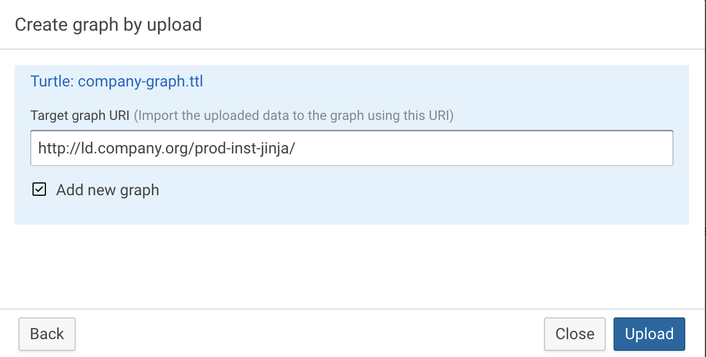{width="50%"}


## 3 Create a Project


1. Click **Projects** in the navigation under **Explore** on the left side of the page.
   
    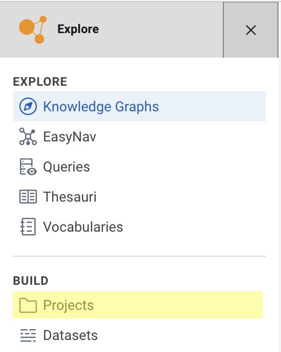{width="30%"}

2. Click **Create** at the top of the page.  

3. In the **Create new item** window, select **Project** and click **Add**. The Create new item of type Project window appears.

    

4. Fill in the required details (Title) and click **Create**.

    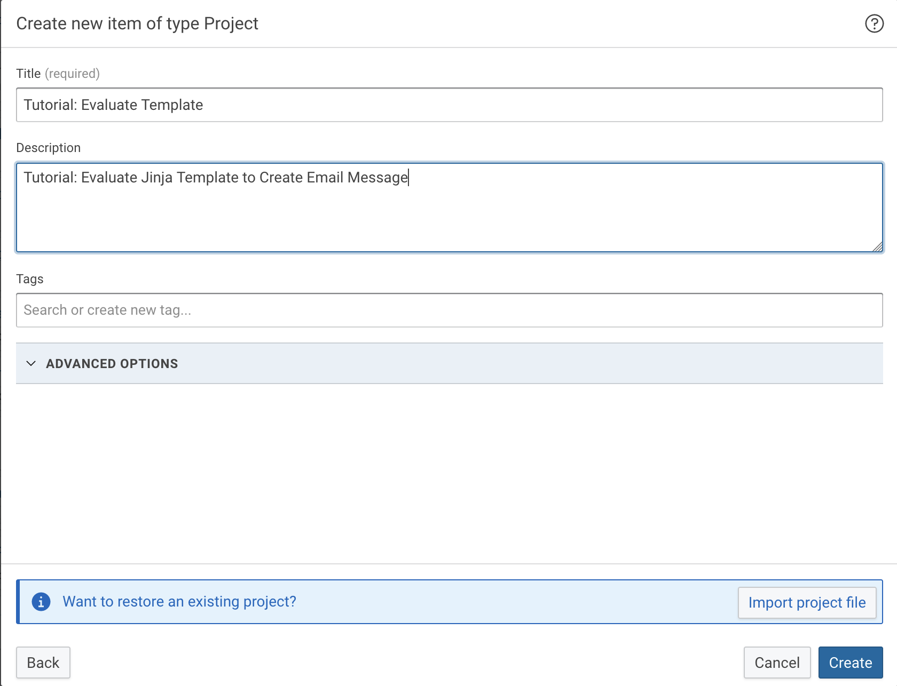

5. Navigate to the created project by clicking on the project title.

    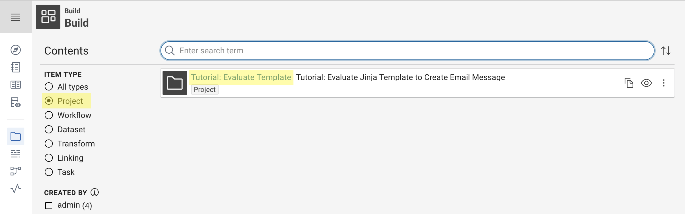


## 3 Create a Workflow

1. Click Create at the top of the page. 
   
2. In the **Create new item** window, select **Workflow** and click **Add**. The **Create new item of type Workflow** appears.

    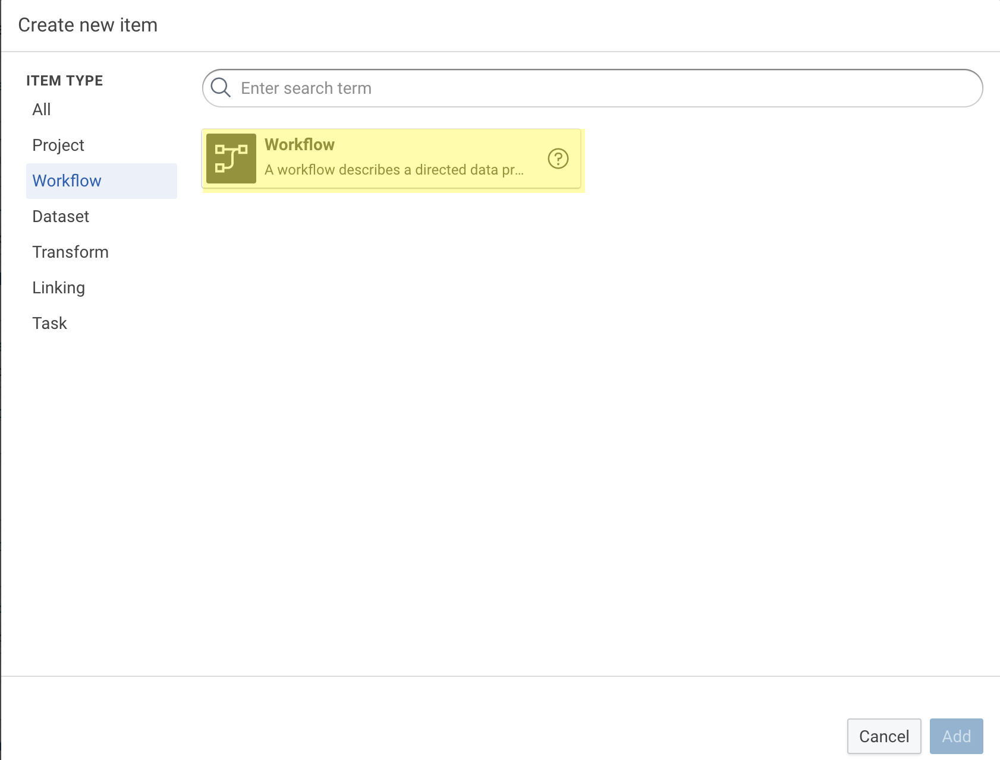

3. Fill in the required details (Label) and click **Create**.

    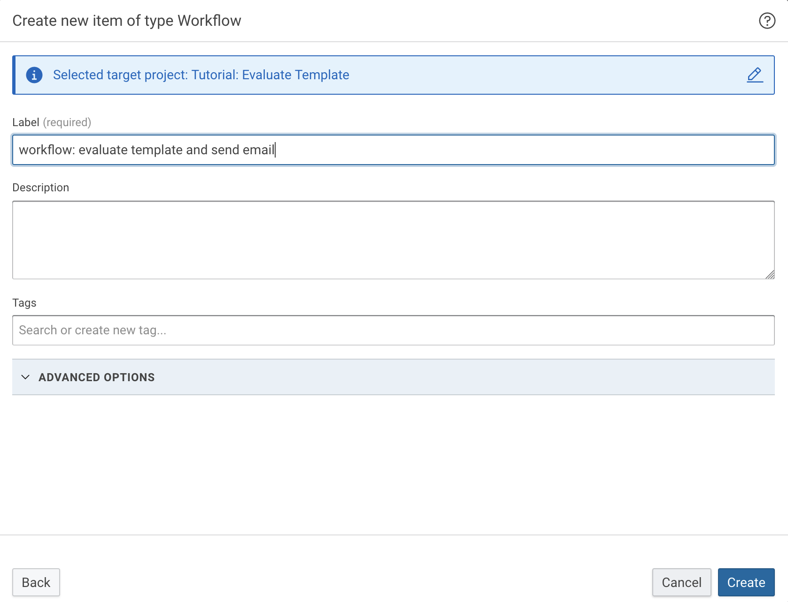


## 4 Create a SPARQL Select Query Task Item

The SPARQL select query is used to retrieve data from the cpmapny grapph that we want to include in our email.

1. Click **Create** at the top of the page. 

2. On the **Create New Item** window, select **SPARQL Select query** and click **Add**. The **Create new item of type SPARQL Select query** appears.

    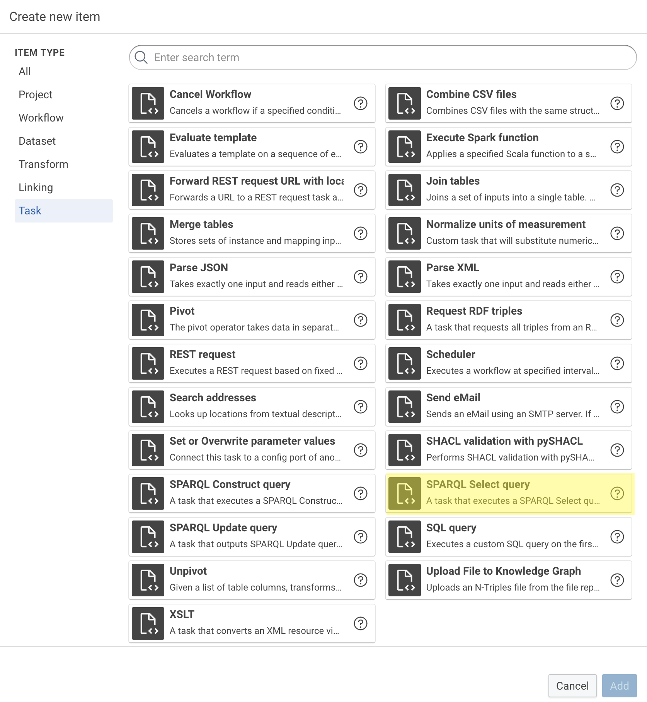

3. Fill in the required details. In the **Select query** field enter the following query which counts the instances of employees, managers, departments, products and products that have other compatible products in the database. When finished, click **Create**.

  ```sparql
    PREFIX pi: <http://ld.company.org/prod-instances/>
    PREFIX pv: <http://ld.company.org/prod-vocab/>
    PREFIX rdf: <http://www.w3.org/1999/02/22-rdf-syntax-ns#>
    PREFIX rdfs: <http://www.w3.org/2000/01/rdf-schema#>
    PREFIX pv:   <http://ld.company.org/prod-vocab/>

    SELECT ?employees
        ?managers
        ?departments
        ?products
        ?product_compatibility
        ?currentDateTime
        ?validation_result
    FROM <http://ld.company.org/prod-inst-jinja/>
    WHERE {
        { SELECT ( COUNT( DISTINCT ?employee ) AS ?employees ) {
            ?employee a pv:Employee } 
        }
        { SELECT ( COUNT( DISTINCT ?manager ) AS ?managers ) {
            ?manager a pv:Manager } 
        }
        { SELECT ( COUNT( DISTINCT ?department ) AS ?departments ) {
            ?department a pv:Department } 
        }
        { SELECT ( COUNT( DISTINCT ?product_) AS ?products ) {
            ?product_ a pv:Hardware } 
        }
        { SELECT ( COUNT( DISTINCT ?comp_product_ ) AS ?product_compatibility ) {
            ?comp_product_  pv:compatibleProduct ?prod } 
        }
        BIND( now() AS ?currentDateTime )
    } 
```

    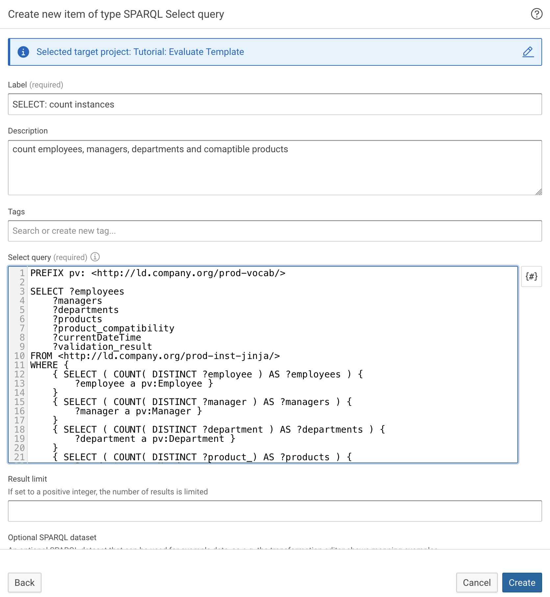


## 5 Create an Evaluate Template Task Item

The Jinja template in this item acts as the template for our email message.

1. Click Create at the top of the page. 

2. In the **Create new item** window, select **Workflow** and click **Add**. The **Create new item of type Workflow** appears.

    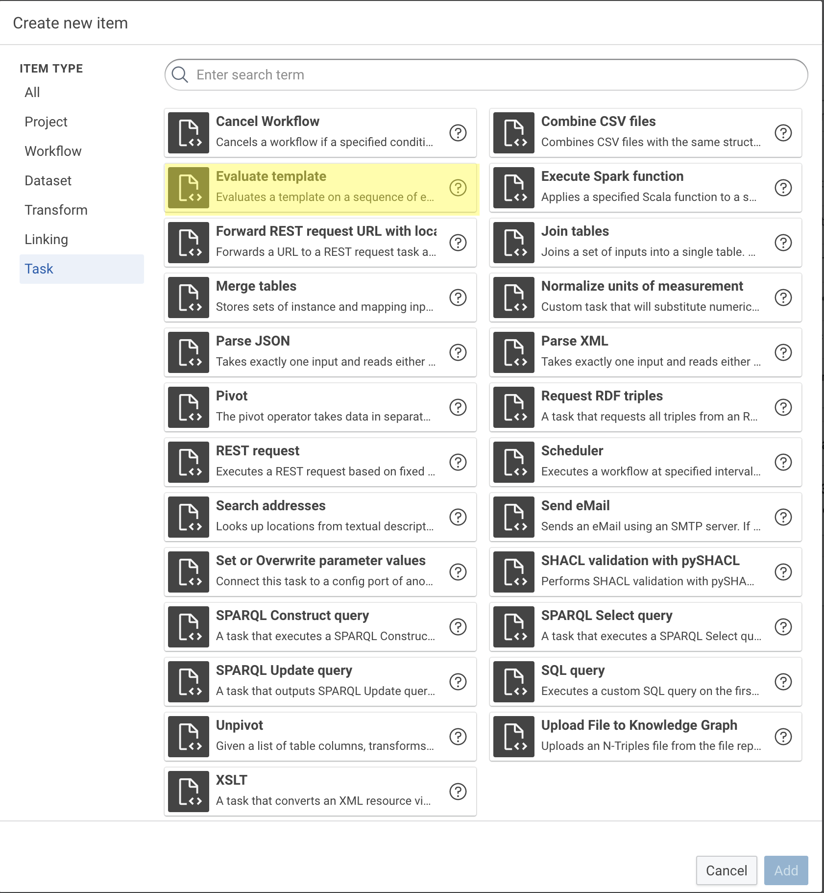

3. Fill in the required details, such as **Label** and **Template**. In the **Template** field enter the following Jinja template. Note, that the variable names correspond to those in the SPARQL query we previously created. Select **jinja** in the **Language** field. When finished, click **Create**.

    ```
    Hi,

    attached is the workflow result as an N-Triples file. 
    Timestamp: {{ currentDateTime }}

    Product compatibility:
    {{ product_compatibility }} out of {{ products }} products have compatible alternatives.

    Organization information:
    There are {{ managers }} managers and {{ employees }} employees in {{ departments }} departments.
    ```

    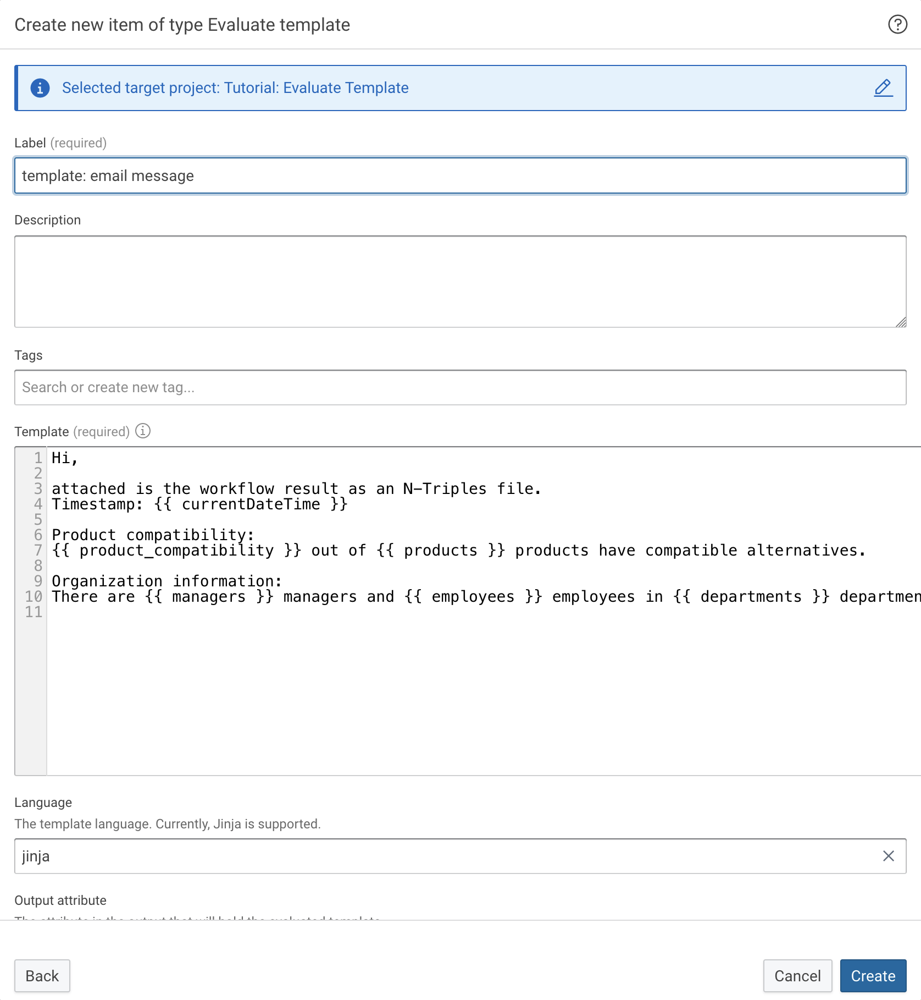


## 6 Create a Transformation

1. Click Create at the top of the page.

2. In the **Create new item** window, select **Send eMail** and click **Add**. The **Create new item of type Send eMail** appears.


## 7 Create a Request RDF Triples Task Item

The **Request RDF triples** task is used to write all tripled from the company graph into an RDF dataset in NTriples serialization.

1. Click Create at the top of the page. 

2. In the **Create new item** window, select **Request RDF triples** and click **Add**. The **Create new item of type Request RDF triples** appears.

    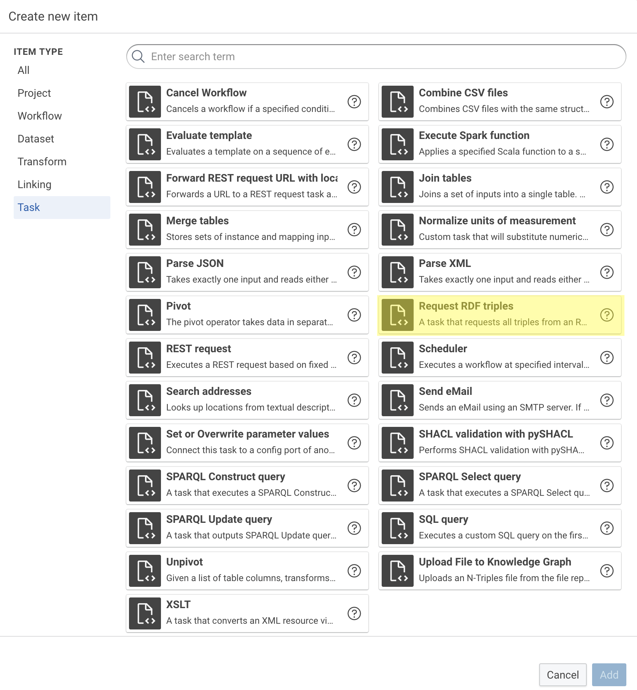

3. Fill in the required details, such as **Label** and click **Create**.

    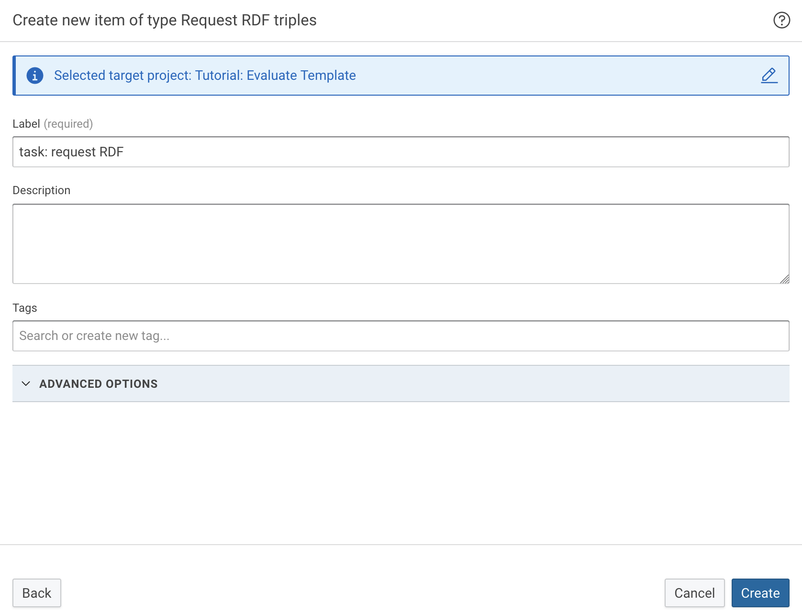


## 8 Create an RDF dataset

The **RDF** dataset holds an NTriples file that contains the triples requested by the **Request RDF triples** task, which we will send as the email attachment.

1. Click Create at the top of the page.

2. In the **Create new item** window, select **RDF** and click **Add**. The **Create new item of type Request RDF triples** appears.

    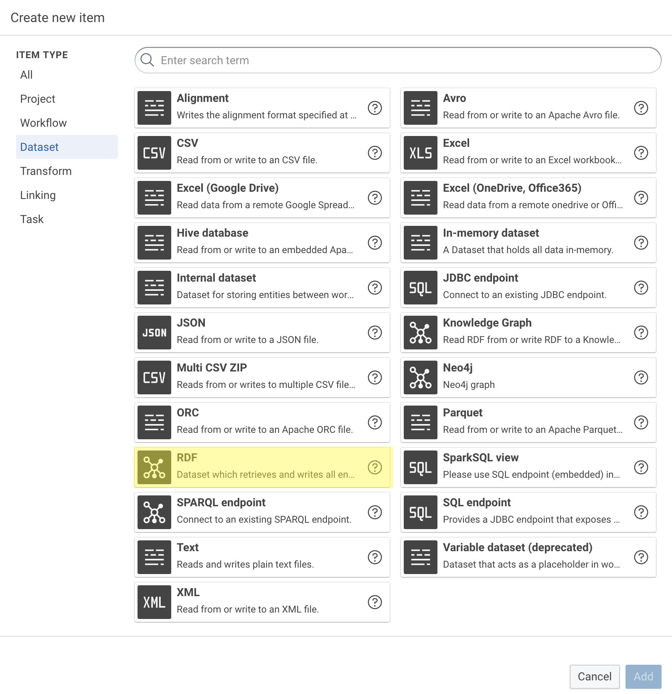

3. Fill in the required details, such as **Label** and **FILE**. Under **FILE**, select **Create empty file** and enter a filename for the NTriples file in the **New file name** field. When finished, click **Create**.

    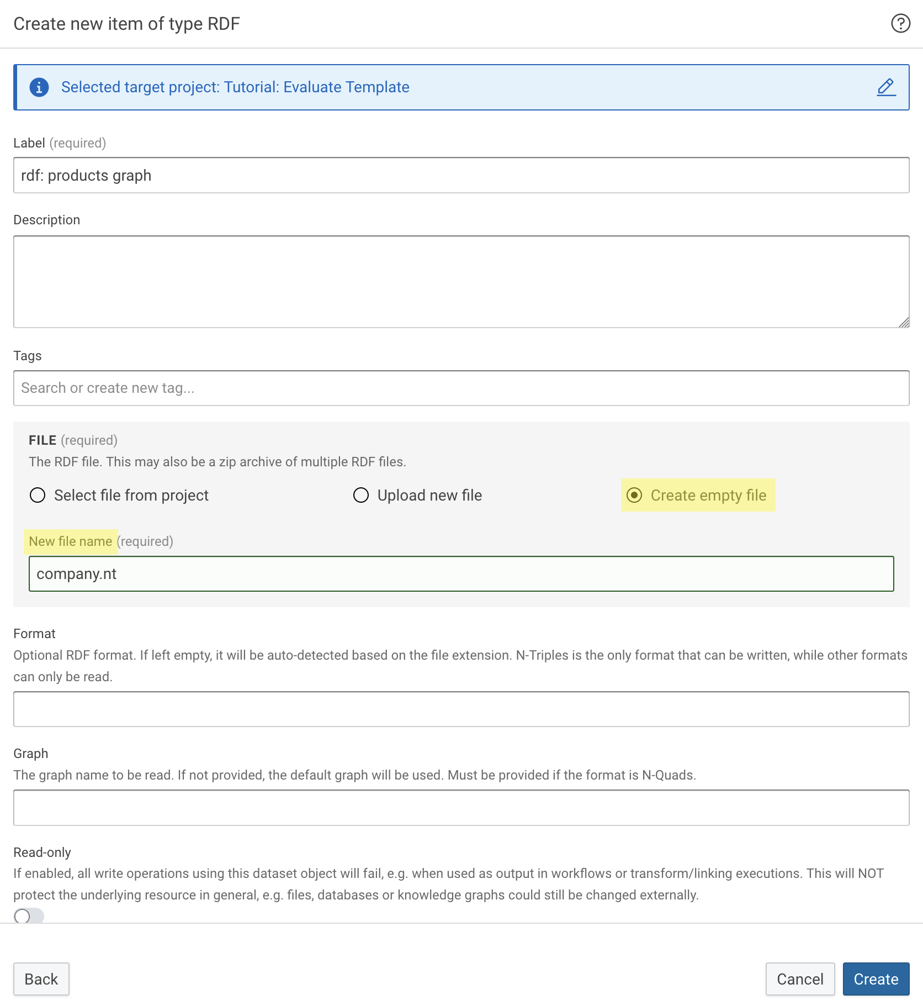

## 9 Create a Send Email Task Item

1. Click Create at the top of the page.

2. In the **Create new item** window, select **Send eMail** and click **Add**. The **Create new item of type Send eMail** appears.

    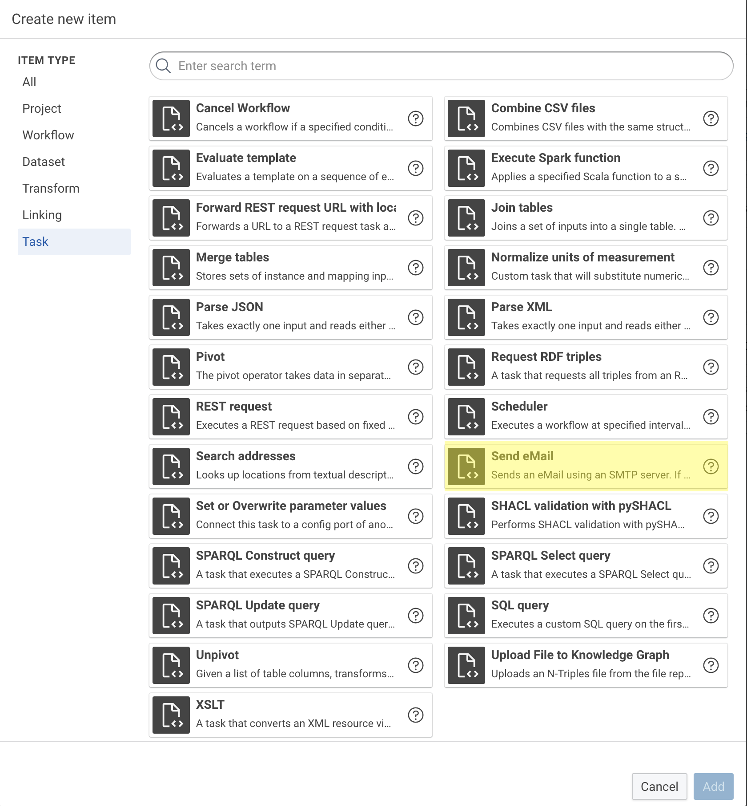

3. Fill in the required details, such as **Label**, your email credentials for sending, and the recipient email address(es). When finished, click **Create**.

    -  Host: The SMTP host, e.g, mail.myProvider.com
    -  Port: The SMTP port
    -  User: The username for the email account
    -  Password: The password for the email account
    -  To: The recipient email address(es)
  
    <br/>

    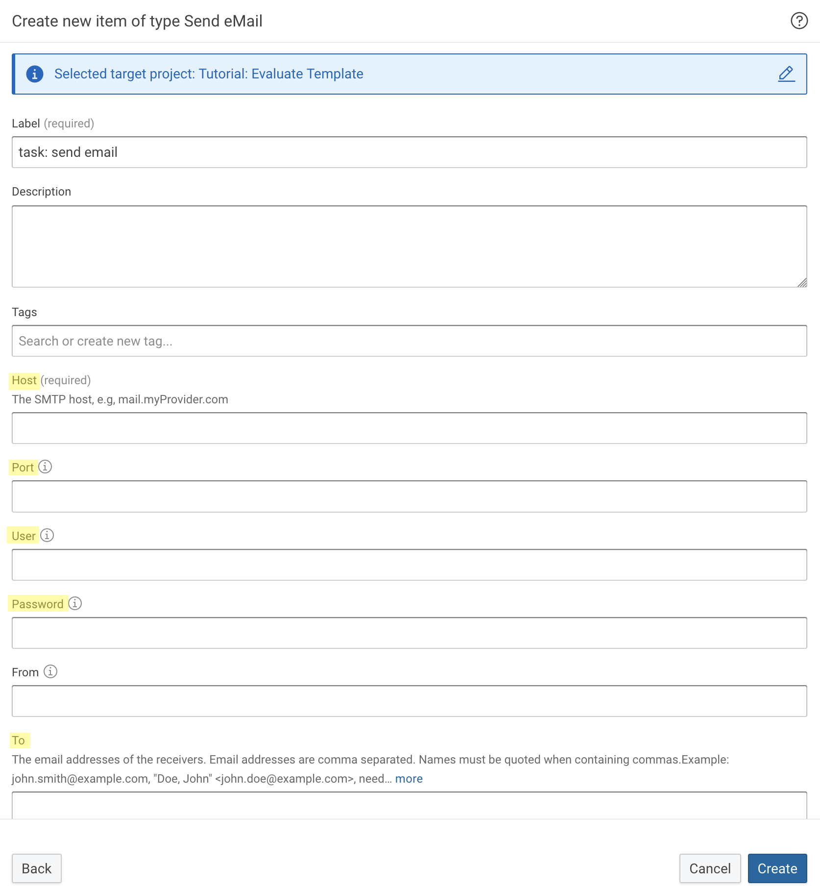


## 10 Construct the Workflow

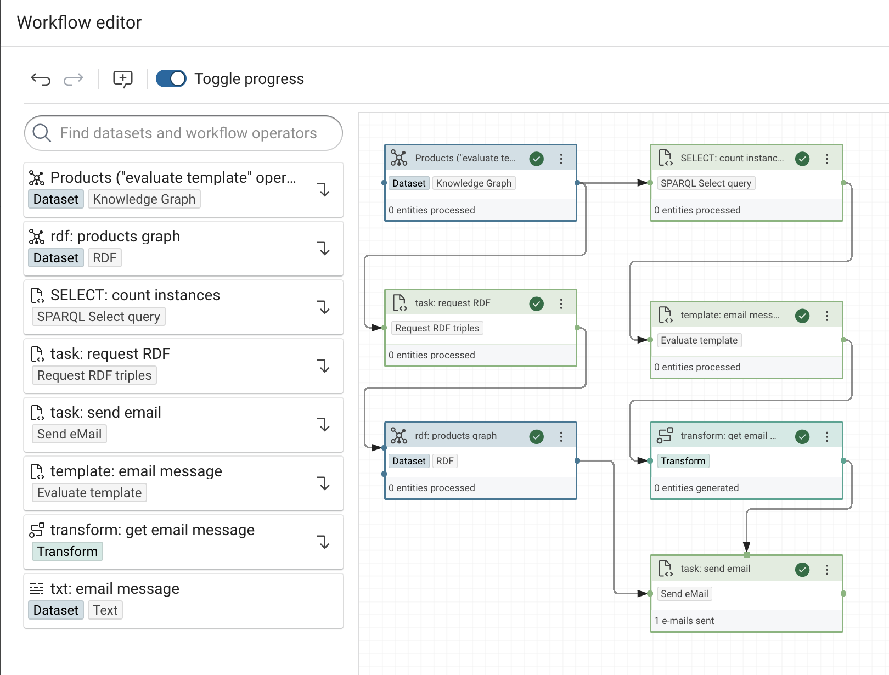

## 11 Execute Workflow

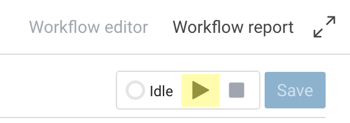{width="30%"}


