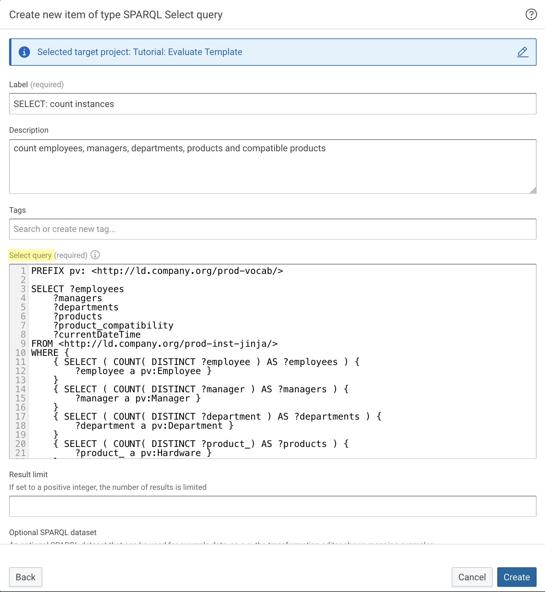
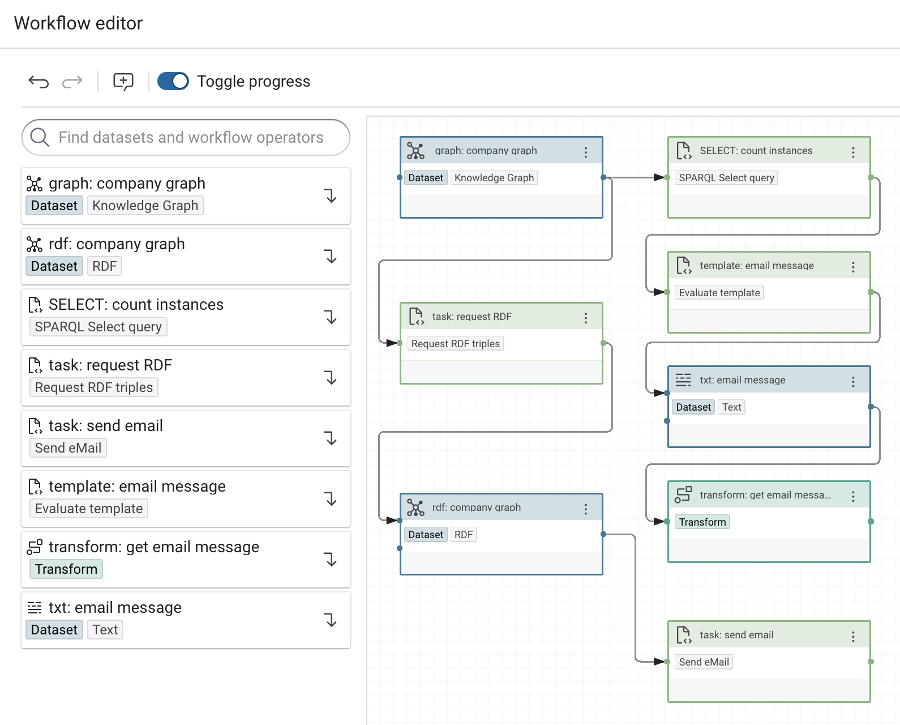
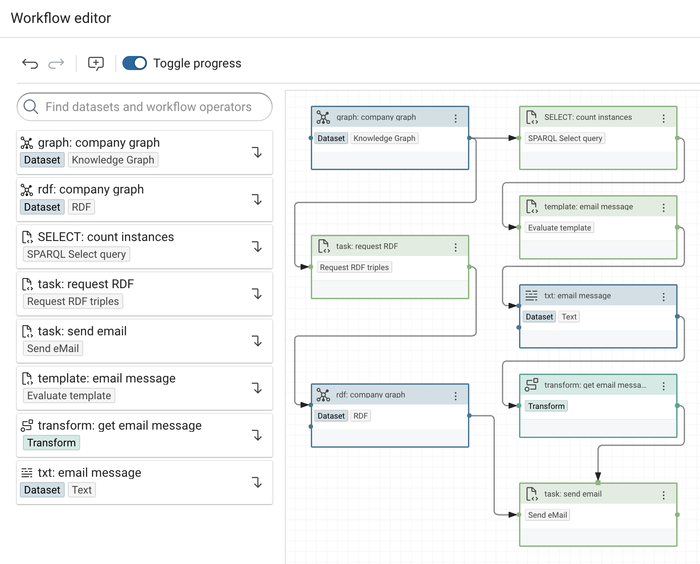

# Evaluate Jinja Template and Send an Email Message

## Introduction

In this tutorial we dynamically produce text with a **Jinja** template and send it in an email after the execution of a workflow. The email message contains information retrieved from a graph. The graph dataset is attached to the email as an N-triples file.

!!! Abstract

    The complete tutorial is available as a [project file](tutorial-template.project.zip). You can import the projects:

    - by using the [web interface](/build/introduction-to-the-user-interface) (Create → Project → Import project file) or
    - by using the [command line interface](/automate/cmemc-command-line-interface)

        ```shell
        cmemc -c my-cmem project import tutorial-template.project.zip tutorial-evaluate-template
        ```
    
The documentation consists of the following steps, which are described in detail below.

The following material is used in this tutorial:

- RDF graph containing company information regarding employees, products and services : [company.ttl](company.ttl)


    ```Turtle
    <http://ld.company.org/prod-instances/hw-A181-1118563> a prod:Hardware ;
    rdfs:label "A181-1118563 - Compensator Switch" ;
    prod:compatibleProduct <http://ld.company.org/prod-instances/hw-M558-2275045> ;
    prod:depth_mm 14 ;
    prod:hasCategory <http://ld.company.org/prod-instances/prod-cat-Switch> ;
    prod:hasProductManager <http://ld.company.org/prod-instances/empl-Adolfina.Hoch%40company.org> ;
    prod:height_mm 32 ;
    prod:id "A181-1118563" ;
    prod:name "Compensator Switch" ;
    prod:price <http://ld.company.org/prod-instances/price-hw-A181-1118563-EUR> ;
    prod:weight_g 5 ;
    prod:width_mm 22 .
    ...
    ```


## 1 Upload the Company Graph

!!! Info
    The vocabulary contains the classes and properties needed to map the source data into entities in the Knowledge Graph.

1. In Corporate Memory, click **Knowledge Graphs** in the navigation under **Explore** on the left side of the page.

    {width="40%"}

2. Click on the **+** symbol next to the search field on the top left side of the page.

    {width="40%"}

3. In the dialog box, click **New graph from File**.

    

4. Drop the file [company.ttl](company.ttl) onto the dialog box, or click on **browse** to navigate to the file.

    {width="75%"}

5. In the **Target graph URI** field, enter **http://ld.company.org/prod-inst-jinja/** and click **Create option 'http://ld.company.org/prod-inst-jinja/'** 
   
    {width="75%"}
   
6. Tick the **Add new graph** checkbox and click **Upload**.

    {width="75%"}


## 2 Create a Project


1. Click **Projects** in the navigation under **Build** on the left side of the page.
   
    {width="40%"}

2. Click **Create** at the top of the page.  

3. Select **Project** and click **Add**.

    

4. Fill in the required details (Title) and click **Create**.

    


## 3 Create a Knowledge Graph Dataset

!!! Info
    The **Knowledge graph** dataset holds the **Company graph** we uploaded earlier.

1. Click **Create** at the top of the page.

    {width="30%"}

2. Select **Knowledge Graph** and click **Add**.

    

3. Fill in the required details, such as **Label** and, for **Graph**, the IRI of the company graph **http://ld.company.org/prod-inst-jinja/**. When finished, click **Create**.

    


## 4 Create a SPARQL Select Query Task Item

!!! Info
    The SPARQL select query is used to retrieve the data from the company graph that we want to include in our email. It counts the instances of employees, managers, departments, products, and products that have other compatible products in the database.

1. Click **Create** at the top of the page. 

2. Select **SPARQL Select query** and click **Add**.

    

3. Fill in the required details such as **Title** and **Description**, then copy the above query and paste in the **Select query** field. When finished, click **Create**.
    
    ```sparql
    PREFIX pv: <http://ld.company.org/prod-vocab/>

    SELECT ?employees
        ?managers
        ?departments
        ?products
        ?product_compatibility
        ?currentDateTime
        ?validation_result
    FROM <http://ld.company.org/prod-inst-jinja/>
    WHERE {
        { SELECT ( COUNT( DISTINCT ?employee ) AS ?employees ) {
            ?employee a pv:Employee } 
        }
        { SELECT ( COUNT( DISTINCT ?manager ) AS ?managers ) {
            ?manager a pv:Manager } 
        }
        { SELECT ( COUNT( DISTINCT ?department ) AS ?departments ) {
            ?department a pv:Department } 
        }
        { SELECT ( COUNT( DISTINCT ?product_) AS ?products ) {
            ?product_ a pv:Hardware } 
        }
        { SELECT ( COUNT( DISTINCT ?comp_product_ ) AS ?product_compatibility ) {
            ?comp_product_  pv:compatibleProduct ?prod } 
        }
        BIND( now() AS ?currentDateTime )
    } 
    ```

    


## 5 Create an Evaluate Template Task Item

!!! Info
    The Jinja template in this item acts as the template for our email message.

1. Click **Create** at the top of the page. 

2. Select **Evaluate template** and click **Add**.

    

3. Fill in the required details, such as **Label** and **Template**. In the **Template** field enter the following Jinja template. Select **jinja** in the **Language** field. When finished, click **Create**.

!!! Note
     The variable names correspond to those in the SPARQL query we previously created.

    ```
    Hi,

    attached is the workflow result as an N-Triples file. 
    Timestamp: {{ currentDateTime }}

    Product compatibility:
    {{ product_compatibility }} out of {{ products }} products have compatible alternatives.

    Organization information:
    There are {{ managers }} managers and {{ employees }} employees in {{ departments }} departments.
    ```

    


## 6 Create a Text Dataset

!!! Info 
    The text dataset holds a text file that will contain the evaluated Jinja template that will be our email message.

1. Click **Create** at the top of the page.

2. Select **Text** and click **Add**.

    

3. Fill in the required details, such as **Label** and **FILE**. Under **FILE**, select **Create empty file** and enter the filename in the **New file name** field. When finished, click **Create**.

    

!!! Info 
    The **Evaluate template** operator can also be connected directly to the **Transform**. In this case, skip this section and enter **output** instead of **text** for the **Value path** of the value mapping in the **Transform** (see [§7.6](#7-create-a-transform)).

## 7 Create a Transform

!!! Info
    The Transform retrieves the text from the Text dataset to be sent as our email message.

1. Click **Create** at the top of the page.  

2. Select **Transform** and click **Add**.

    

3. Fill in the required fields, such as **Label** and **INPUT TASK Dataset**.

    

4. Expand the {width=11%} menu by clicking the arrow on the right side of the page to expand the menu.

5. Click the circular blue **+** icon on the lower right and select **Add value mapping**.

    

6. In the **Target property** field enter _message_ (the parameter name for the email message) and in the **Value path** field enter _text_ (the path for the text in the Text dataset). When finished, click **Save**.

    

## 8 Create a Request RDF Triples Task Item

!!! Info
    The **Request RDF triples** task is used to write all tripled from the company graph into an RDF dataset in NTriples serialization.

1. Click **Create** at the top of the page. 

2. Select **Request RDF triples** and click **Add**.

    

3. Fill in the **Label** field and click **Create**.

    


## 9 Create an RDF Dataset

!!! Info
    The **RDF** dataset holds an NTriples file that contains the triples requested by the **Request RDF triples** task, which we will send as the email attachment.

1. Click **Create** at the top of the page.

2. Select **RDF** and click **Add**..

    

3. Fill in the required details, such as **Label** and **FILE**. Under **FILE**, select **Create empty file** and enter a filename for the NTriples file in the **New file name** field. When finished, click **Create**.

    

## 10 Create a Send Email Task Item

1. Click **Create** at the top of the page.

2. Select **Send eMail** and click **Add**.

    

3. Fill in the required details, such as **Label**, your email credentials for sending, and the recipient email address(es). When finished, click **Create**.

    -  Host: The SMTP host, e.g, mail.myProvider.com
    -  Port: The SMTP port
    -  User: The username for the email account
    -  Password: The password for the email account
    -  To: The recipient email address(es)
  
    <br/>

    


## 11 Create the Workflow

1. Click **Create** at the top of the page. 
   
2. Select **Workflow** and click **Add**.

    

3. Fill in the required details (Label) and click **Create**.

    

4. In the workflow editor, arrange and connect the items as shown below. Items can be dragged from the list of items on the left side onto the canvas. To connect the outputs and inputs, click and hold the output on the right side of an item and drag it to the input on the left side of another item.

   -  The **Knowledge Graph dataset** connects to the **Request RDF triples task** and the **SPARQL Select query task**.
   -  The **Request RDF triples task** connects to the **RDF dataset**. It requests all triples from the products graph and sends them to the dataset.
   -  The **RDF dataset** connects to the **Send eMail task**. It holds the NTriples file that will be attached to the email.
   -  The **SPARQL Select query task** connects to the **Evaluate template task**. Note that the graph to be queried is specified in the SPARQL query itself with the FROM clause, while the input only triggers its execution. The query results are sent to its output.
   -  The **Evaluate template task** connects to the **Text dataset**. It receives the SPARQL query results and sends the evaluated Jinja template to its output.
   -  The **Text dataset** connects to the **Transform**. It holds the text file with the evaluated Jinja template and acts as input for the Transform.
  
    

!!! Info
    The **Evaluate template** operator can also be connected directly to the **Transform**. In this case, skip [§6](#6-create-a-text-dataset) and enter **output** instead of **text** for the **Value path** of the value mapping in the **Transform** (see [§7.6](#7-create-a-transform)).

 5. Click on three dots of the **Send eMail** task, select **Config** and tick the check box to enable the config port. 

    {width="55%"}
   
 6. Connect the output of the **Transform** to the config port located on the top of the **Send eMail** task. When finished, click **Save**. The complete workflow now looks as shown below.

    

!!! Info    
    The **Transform** sends the _message_ parameter with our message text as its value to the **Send eMail** task.
   
## 12 Execute the Workflow

1. Execute the **Workflow** by clicking the *play* button (▶).

    {width="40%"}

!!! Info
    After the workflow has finished you can find an email in the mailbox of the recipient address you specified for the **Send eMail** task.
