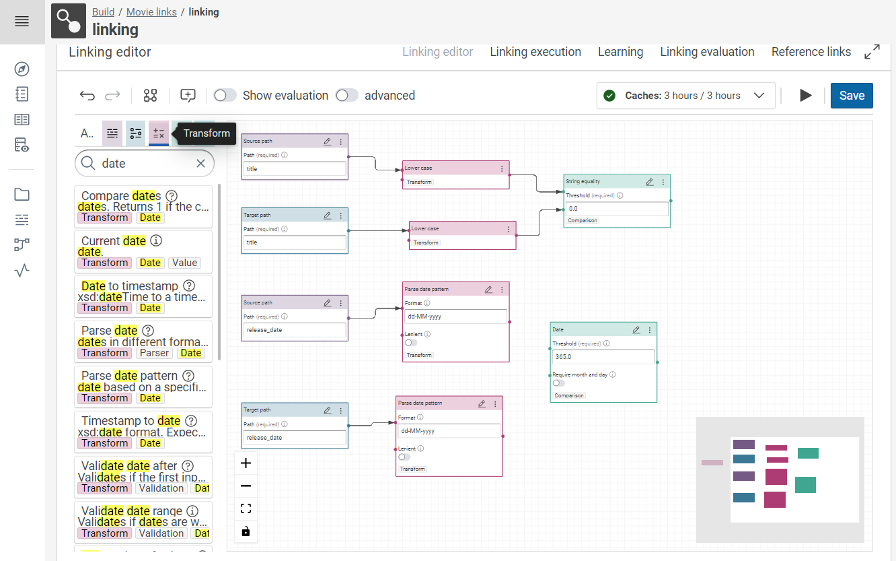

# Improve a linking rule

## Introduction

The eccenca DataIntegration platform is designed to support the process to "BUILD" a knowledge graph by integrating structured and unstructured data from multiple sources, including on-premises systems and cloud-based services.
The BUILD functionalities include data mapping, transformation, and cleansing tools, as well as DataIntegration and governance support.

This beginner-level tutorial builds on top of the [linking tutorial](../create-project-with-linkingrule/).
Here we show how to evolve and improve the precision of a linking rule by adding additional properties for comparison.

## Improving the initial linking rule

As a potential improvement to the initial linking rule built in [linking tutorial](../create-project-with-linkingrule/) we can compare the release date information.

-   Click on the **linking** editor then click on the **source path** and drag the release date on the canvas.
    

-   Click on the **target path** and drag the release date on the canvas.
    

-   Click on **transform** and type the date and drag the parse date pattern on the canvas twice.
    

-   Drag the little dot on the right side of the source path box and target path box (release date) onto the left dot of the transformation box(parse date) to connect the two with a line (you always must drag from the right side of one element to the left side of another to connect the two).
    

-   Click on transform type date and drag on the canvas and type **365** in the threshold field (to allow a distance of 365 days between two dates).
    

-   Drag the little dot on the right side of both parse date patterns onto the left dot of the transformation box(date) to connect the two with a line (you always must drag from the right side of one element to the left side of another to connect the two).
    

-   Click on **aggregation** type minimum and drag on the canvas (It allows to combine two similarities computed by the comparators)
    

-   Drag the little dot on the right side of string equality and date operators onto the left dot of the aggregation box (minimum) to connect the two with a line (you always must drag from the right side of one element to the left side of another to connect the two).
    

-   Click on **save** on the right side of the page.
    

## Linking evaluation

-   Click on the **linking evaluation**.
    

-   Click on the **play button** to start the evaluation and generate the links.
    

!!! note "Step Result"

    The links are generated as shown below. (It allows us to review the links and since DataIntegration does not know which column to use as a unique identifier, it just uses the row number in the `.csv` file to identify each movie.)
    

-   Click on the **linking execution** then click on the play button to execute the links (It copies the links to our data file `links.csv` (which is our output file).
    

!!! note "Step Result"

    The links are executed and copied to the output data file `links.csv`, showing the count of links on the page.
    
