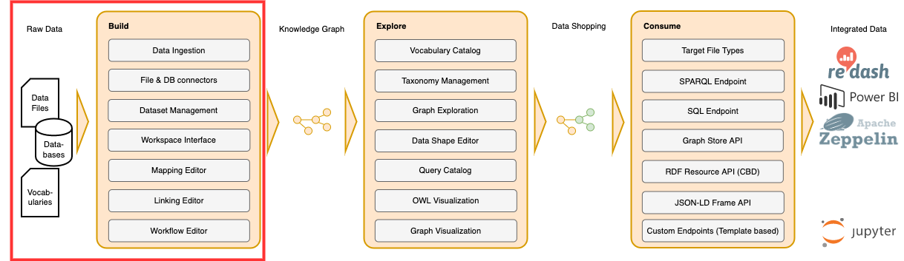

!!! info inline end ""

    

# :material-star: Build

The Build stage turns your source data—across files, databases, APIs, and streams—into an Enterprise Knowledge Graph. The sections below explain the Build workspace and guide you from first lifting steps to reusable patterns and reference material.

**:octicons-people-24: Intended audience:** Linked Data Experts

-   :eccenca-application-dataintegration: Foundations: Introduction and Best Practices

    ---

    - [Introduction to the User Interface](introduction-to-the-user-interface/index.md) --- a short introduction to the **Build** workspace incl. projects and tasks management.
    - [Rule Operators](rule-operators/index.md) --- Overview on operators that can be used to build linkage and transformation rules.
    - [Cool IRIs](cool-iris/index.md) --- URIs and IRIs are character strings identifying the nodes and edges in the graph. Defining them is an important step in creating an exploitable Knowledge Graph for your Company.
    - [Define Prefixes / Namespaces](define-prefixes-namespaces/index.md) --- Namespace declarations allow for abbreviation of IRIs by using a prefixed name instead of an IRI, in particular when writing SPARQL queries or Turtle.

-   :material-list-status: Tutorials

    ---

    - [Lift Data from Tabular Data](lift-data-from-tabular-data-such-as-csv-xslx-or-database-tables/index.md) --- Build a Knowledge Graph from Tabular Data such as CSV, XSLX or Database Tables.
    - [Lift data from JSON and XML sources](lift-data-from-json-and-xml-sources/index.md) --- Build a Knowledge Graph based on input data from hierarchical sources such as JSON and XML files.
    - [Extracting data from a Web API](extracting-data-from-a-web-api/index.md) --- Build a Knowledge Graph based on input data from a Web API.
    - [Incremental Database Loading](loading-jdbc-datasets-incrementally/index.md) --- Load data incrementally from a JDBC Dataset (relational database Table) into a Knowledge Graph.
    - [Connect to Snowflake](snowflake-tutorial/index.md) --- Connect Snowflake as a scalable cloud warehouse and lift/link its data in Corporate Memory to unify it with your other sources in one knowledge graph.
    - [Build Knowledge Graphs from Kafka Topics](kafka-consumer/index.md) --- Consume Kafka topics and lift event streams into a Knowledge Graph.
    - [Evaluate Jinja Template and Send an Email Message](evaluate-template/index.md) --- Template and send an email after a workflow execution.
    - [Link Intrusion Detection Systems to Open-Source INTelligence](tutorial-how-to-link-ids-to-osint/index.md) --- Link IDS data to OSINT sources.

-   :fontawesome-regular-snowflake: Patterns

    ---

    - [Reconfigure Workflow Tasks](workflow-reconfiguration/index.md) --- During its execution, new parameters can be loaded from any source, which overwrites originally set parameters.
    - [Project and Global Variables](variables/index.md) --- Define and reuse variables across tasks and projects.
    - [Active learning](active-learning/index.md) --- Advanced workflows that improve results iteratively by incorporating feedback signals.

-   :material-book-open-variant-outline: Reference

    ---

    - [Mapping Creator](mapping-creator/index.md) --- Create and manage mappings to lift legacy data into a Knowledge Graph.
    - [Integrations](integrations/index.md) --- Supported integrations and configuration options for connecting data sources and sinks.
    - [Task and Operator Reference](reference/index.md) --- Reference documentation for tasks and operators in the Build workspace.

