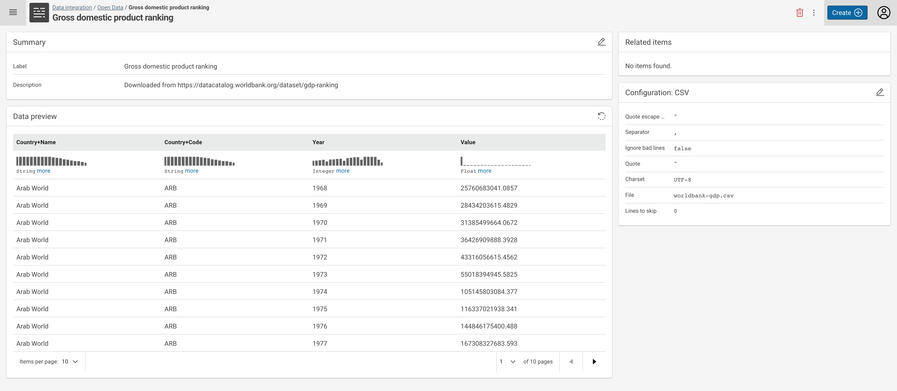

# Introduction to the user interface

This page provides a short introduction to the BUILD / Data Integration workspace incl. projects and different tasks.

## Workbench

The workbench is the main entry point to the BUILD interface and provides a list view of your work, structured in _projects_.

On the left-hand side, a facet list provides an overview over different item types:

- **Projects** are the main structure and consists of datasets, workflows and different tasks (transformations, linking and other tasks)
- **Datasets** are registered data sources from files, endpoints or internally managed.
- **Transform** tasks take an input dataset and execute a (hierarchical) set of mapping and transformation rules and generate data for an output dataset.
- **Linking** tasks compare entities from two datasets according to (hierarchical) set of comparators and generate links between these datasets in an output (link) dataset.
- **Workflows** can combine all items in a project in order to create a structured work plan which can be executed on demand, controlled remotely (e.g. via [cmemc](/automate/cmemc-command-line-interface)) or executed from a [scheduler](/automate/scheduling-workflows).

The interface can be used to browse from a global level to a project level as well as to search for items globally and project wide.

On the top right side in the header, there is a big blue **Create (+)** button which allows for creation of all possible data integration items:

## Projects

Selecting a project from the search results opens the project details view (see above).

The project is the main metaphor to structure your work. In the workspace, you can review your projects, create new or delete old ones, and import or export them.

Each project is self-contained and holds all relevant parts, such as the following:

- the raw **data resources** (local or remote data files) that form the starting point for your work
- the **data sets** that provide uniform access to different kinds of data resources
- **transformation tasks** to transform data sets (e.g., from one format or schema to another)
- **linking tasks** to integrate different data sets
- **workflows** to orchestrate the different tasks
- definitions of **URI prefixes** used in the project

Resources, data sets, tasks and other parts of a project can be added and configured from within the workspace. By clicking the `Show Details` button on any item in a project, you can ‘look inside’ it and define the actual transformation or linking rules, or assemble the actual workflow.

## Datasets

Selecting a dataset in a project or from the search results opens the dataset details view.

Here you have the following options:

- Change the meta data of the dataset (**Summary** - label and description, top left main area),
- Change the **Configuration** parameters of the dataset (lower right side area),
- Browse to other **Related Items**, such as transform, linking or workflow tasks which use this dataset (top right side area),
- Get a **Data Preview** as well as generate and view **profiling information** (lower left main area).

A dataset represents an abstraction over raw data. In order to work with data, you have to make it available in the form of a dataset. A dataset provides a source or destination for the different kinds of tasks. I.e., it may be used to read entities for transformation or linking, and it can be used to write transformed entities and generated links.

There is a range of different dataset types for different kinds of source data. Some most important ones are:

- **Knowledge Graph** - Read RDF from or write RDF to a Knowledge Graph embedded in Corporate Memory.
- **CSV** - Read from or write to an CSV file.
- **XML** - Read from or write to an XML file.
- **JSON** - Read from or write to a JSON file.
- **JDBC endpoint** - Connect to an existing JDBC endpoint.
- **Variable dataset** - Dataset that acts as a placeholder in workflows and is replaced at request time.
- **Excel** - Read from or write to an Excel workbook in Open XML format (XLSX).
- **Multi CSV ZIP** - Reads from or writes to multiple CSV files from/to a single ZIP file.

Other options include:

- **Internal dataset** - Dataset for storing entities between workflow steps.
- **RDF** - Dataset which retrieves and writes all entities from/to an RDF file. The dataset is loaded in-memory and thus the size is restricted by the available memory. Large datasets should be loaded into an external RDF store and retrieved using the SPARQL dataset instead.
- **SPARQL endpoint** - Connect to an existing SPARQL endpoint.
- **In-memory dataset** - A Dataset that holds all data in-memory.
- **Avro** - Read from or write to an Apache Avro file.
- **ORC** - Read from or write to an Apache ORC file.
- **Parquet** - Read from or write to an Apache Parquet file.
- **Hive database** - Read from or write to an embedded Apache Hive endpoint.
- **SQL endpoint** - Provides a JDBC endpoint that exposes workflow or transformation results as tables, which can be queried using SQL.
- **Neo4j** - Connect to an existing Neo4j property graph database system.

## Transform tasks

The purpose of transform tasks is to transform data sets (e.g., from one format or schema to another). More specifically Transform Task create Knowledge Graphs out of raw data sources.

Selecting a transform task in a project or from the search results opens the transform task details view.

<!-- TODO: update img -->

Here you have the following options:

- Change the meta data of the transformation task (**Summary** - label and description, top left main area)
- Change the **Configuration** parameters of the transformation task (lower right side area),
- Browse to other **Related Items**, such as used datasets or workflows using this task (top right side area),
- Open the **Mapping Editor** in order to change the transformation rules,
- **Evaluate the Transformation** to check for issues with the rules,
- **Execute the Transformation rules** in order to create new data,
- **Clone** the task, creating a new transform task with the same rules.

## Linking tasks

The purpose of linking tasks is to integrate two datasets (source and target) by generating a linkset that contains links from the source to the target dataset.

Selecting a linking task in a project or from the search results opens the transform task details view.

 <!-- TODO: update img -->

Here you have the following options:

- Change the meta data of the linking task (**Summary** - label and description, top left main area),
- Change the **Configuration** parameters of the linking task (lower right side area),
- Browse to other **Related Items**, such as used datasets or workflows using this task (top right side area),
- Open the **Linking Editor** in order to change the comparison rules,
- **Evaluate the Linking** to check for issues with the rules,
- **Execute the Linking task** in order to create a linkset,
- **Clone** the task, creating a new linking task with the same comparisons.

As in the case of transform tasks, the output linkset of a linking task can either be written directly to an output data set, or provide the input to another task if integrated into a workflow.

## Workflows

For projects that go beyond one or two simple transform or linking tasks, you can create complex workflows. In a workflow, you can orchestrate datasets, transform and linking tasks in terms of inputs and outputs to each other, and in this way perform complex tasks.

Selecting a workflow in a project or from the search results opens the workflow details view.

Here you have the following options:

- Change the meta data of the linking task (**Summary** - label and description, top left main area)
- Browse to **Related Items**, such as used datasets and tasks (top right side area),
- Open the **Worflow Editor** in order to change the workflow (here you can as well start the workflow),
- **Clone** the workflow, creating a new workflow with the same task.
