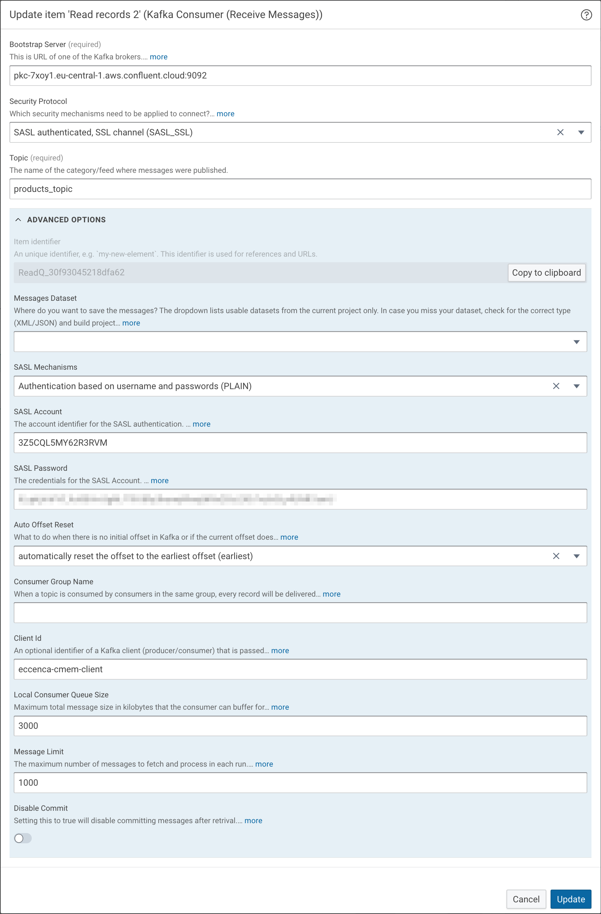
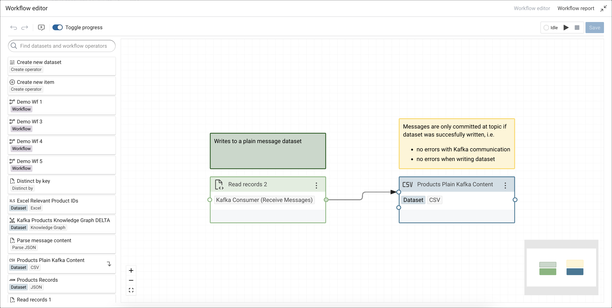
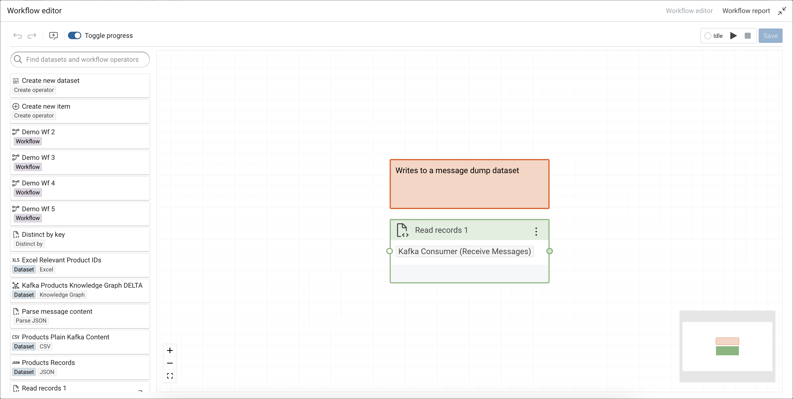
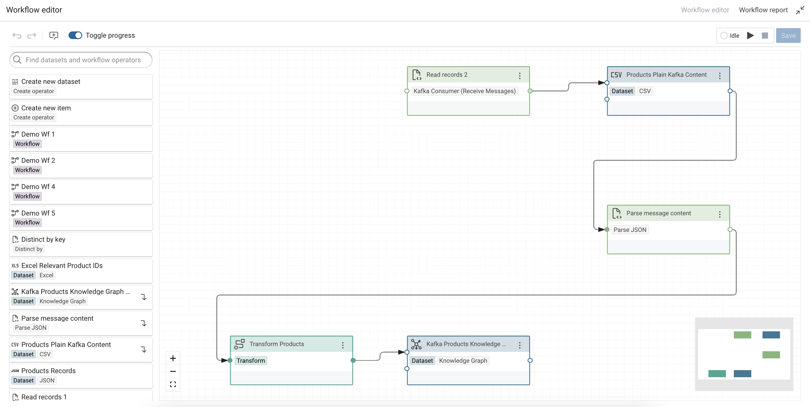
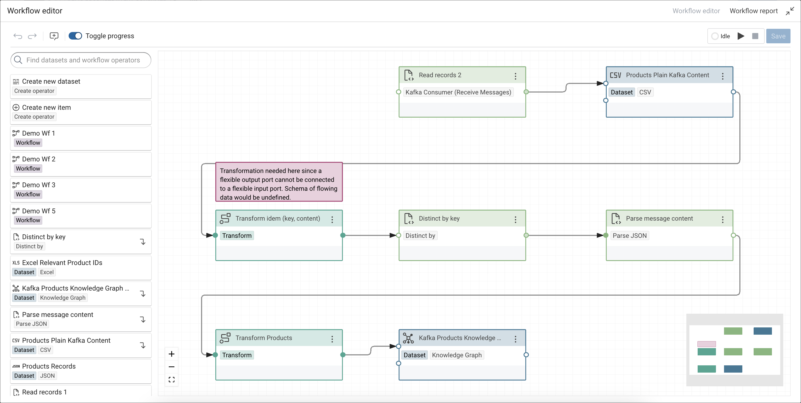

# Build Knowledge Graphs from Kafka Topics

## Introduction

[Apache Kafka](https://kafka.apache.org/) is a distributed event store and stream-processing platform.
Kafka is widely used in enterprises for data pipelines, streaming analytics, data integration and other applications.

By using the [cmem-plugin-kafka](https://pypi.org/project/cmem-plugin-kafka/) [Python Plugin](../../develop/python-plugins/index.md), you can consume messages from Apache Kafka and use them inside Corporate Memory Workflows.

## Installation

In order to use the Kafka Consumer workflow task, you need to extend your Corporate Memory instance with the `cmem-plugin-kafka` package.
This can be done by using cmemc:

```shell-session title="Installing cmem-plugin-kafka on the instance 'my-cmem'"
$ cmemc -c my-cmem admin workspace python install cmem-plugin-kafka
Install package cmem-plugin-kafka ... done
```

You can validate your installation by listing all installed plugins (from all packages):

```shell-session
$ cmemc -c my-cmem admin workspace python list-plugins
┏━━━━━━━━━━━━━━━━━━━━━━━━━━━━━━━━━━━┳━━━━━━━━━━━━━━━━━━━━━━━┳━━━━━━━━━━━━━━━━┳━━━━━━━━━━━━━━━━━━━━━━━━━━━━━━━━━━━┓
┃ ID                                ┃ Package ID            ┃ Type           ┃ Label                             ┃
┣━━━━━━━━━━━━━━━━━━━━━━━━━━━━━━━━━━━╋━━━━━━━━━━━━━━━━━━━━━━━╋━━━━━━━━━━━━━━━━╋━━━━━━━━━━━━━━━━━━━━━━━━━━━━━━━━━━━┫
┃ cmem_plugin_kafka-ReceiveMessages ┃ cmem-plugin-kafka     ┃ WorkflowPlugin ┃ Kafka Consumer (Receive Messages) ┃
┃ cmem_plugin_kafka-SendMessages    ┃ cmem-plugin-kafka     ┃ WorkflowPlugin ┃ Kafka Producer (Send Messages)    ┃
┗━━━━━━━━━━━━━━━━━━━━━━━━━━━━━━━━━━━┻━━━━━━━━━━━━━━━━━━━━━━━┻━━━━━━━━━━━━━━━━┻━━━━━━━━━━━━━━━━━━━━━━━━━━━━━━━━━━━┛
```

## Setup

Once you installed the package, you can create a Kafka Consumer task. This task connects to a topic on an Apache Kafka broker.

!!! warning

    The Kafka Consumer task will be executed inside a workflow. This means on each workflow execution this task retrieves new messages from the topic. Hence, the respective workflow needs to be [scheduled](../../automate/scheduling-workflows/index.md) regularly. It will not run continuously inside the workflow and consume messages. The Kafka Consumer task is finished when there are no more messages in the queue or a configurable message limit has been reached.

### Create and configure a Kafka Consumer

In Create new item window, select Kafka Consumer (Receive Messages) and click Add.

<!-- 24.1 -->

Configure the Kafka Consumer according to the topic that shall be consumed:

- **Bootstrap Server** - URL of the Kafka broker including the port number (commonly port ´9092)
- **Security Protocol** - Security mechanism used for authentication
- **Topic** - Name / ID of the topic where messages are published
- **Advanced Section**
  - **Messages Dataset** - A dataset (XML/JSON) where messages can be written to. Leave this field empty to output the messages as entities (see below).
  - **SASL** authentication settings as provided by your Kafka broker
  - **Auto Offset Reset** - Consumption starts either at the earliest offset or the latest offset.
  - **Consumer Group Name** - Consumer groups can be used to distribute the load of messages (partitions) between multiple consumers of the same group (c.f. [Kafka Concepts](https://docs.confluent.io/platform/current/clients/consumer.html#concepts)).
  - **Client Id** - An optional identifier of the client which is communicated to the server. When this field is empty, the plugin defaults to `DNS:PROJECT_ID:TASK_ID`.
  - **Local Consumer Queue Size** - Maximum total message size in kilobytes that the consumer can buffer for a specific partition. The consumer will stop fetching from the partition if it hits this limit. This helps prevent consumers from running out of memory.
  - **Message Limit** - The maximum number of messages to fetch and process in each run. If `0` or less, all messages will be fetched.
  - **Disable Commit** Setting this to `true` will disable committing messages after retrival. This means you will receive the same messages on the next execution (for testing, development, or debugging).

<!-- 24.1 -->

## Execute a Kafka Consumer within a Workflow

There are two main modes how the consumer handles received messages: either the messages are written to a single dataset *or* the messages are outputted as entities to be processed by subsequent processors in the workflow.

### Write Messages to a Dataset

In order to write the received messages to a dataset, the option **Messages Dataset** needs to be set. Only JSON and XML message formats are supported in this mode. So depending on the message format a [JSON](../../deploy-and-configure/configuration/dataintegration/plugin-reference/#json) or [XML Dataset](../../deploy-and-configure/configuration/dataintegration/plugin-reference/#xml) needs to be created and configured as the **Messages Dataset**.

<!-- 24.1 -->

To execute the Kafka Consumer it needs to be placed inside a Workflow. The messages will be written to the dataset, which can then be used as a source for [further processing](../lift-data-from-json-and-xml-sources/index.md).

<!-- 24.1 -->

### Messages as Entities

In the "message streaming mode" (**Messages Dataset** is not set) the received messages will be generated as entities and forwarded to the subsequent operator in the workflow. This mode is not limited to any message format. The generated message entities will have the following flat schema:

- **key** — the optional key of the message,
- **content** — the message itself as plain text,
- **offset** — the given offset of the message in the topic,
- **ts-production** — the timestamp when the message was written to the topic,
- **ts-consumption** — the timestamp when the message was consumed from the topic.

Connect the output of Kafka Consumer inside a Workflow to a tabular dataset (e.g. a [CSV Dataset](../../deploy-and-configure/configuration/dataintegration/plugin-reference/#csv)) or directly to a transformation task.

<!-- 24.1 -->

The message content is captured as plain text. In order to process complex message content, the `content` path needs to be parsed with operators such as [Parse JSON](../../deploy-and-configure/configuration/dataintegration/plugin-reference/#parse-json) or [Parse XML](../../deploy-and-configure/configuration/dataintegration/plugin-reference/#parse-xml) to process the message content in a transformation.

<!-- 24.1 -->

Any modifications to the message set, such as filtering, can be done prior to parsing the content. One could for example remove duplicates (according to the message key) from the messages by using the [Distinct-by task](../../deploy-and-configure/configuration/dataintegration/plugin-reference/#distinct-by).

<!-- 24.1 -->

## Sample Project

To walk through the examples of this tutorial [a sample project](DEMOKAFKACONSUMER.zip) is available for download. Note, that the Kafka Broker configured in this project is no longer reachable. You will need to setup your own Kafka Broker.
