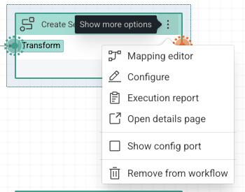
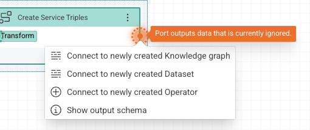
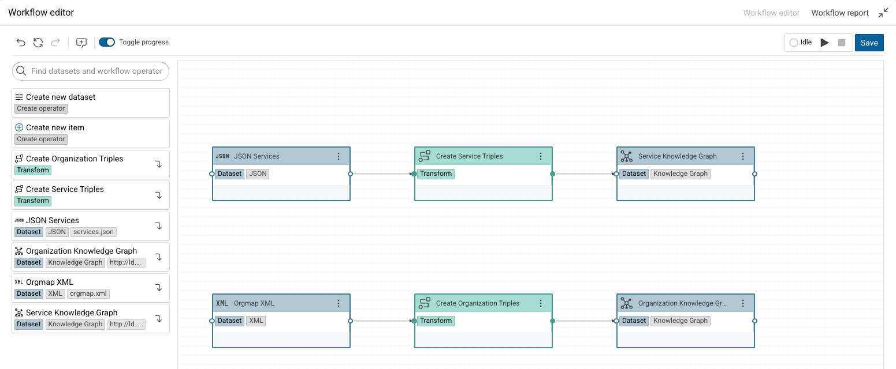
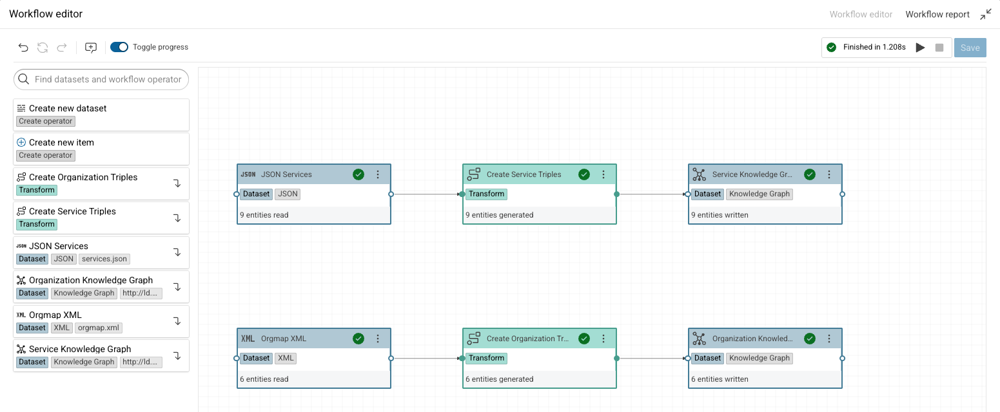

# Lift data from JSON and XML source

## Introduction

This tutorial shows how you can build a Knowledge Graph based on input data from hierarchical sources like a **JavaScript Object Notation** file (.json) or an **Extensible Markup Language** file (.xml).

!!! Tutorial Package

    The complete tutorial is available as a Marketplace Package.
    You can install this package

    - by using the web interface (:eccenca-module-marketplace: **Packages** → Search → "Product Data Demo") or
    - by using the [command line interface](../../automate/cmemc-command-line-interface/index.md)

        ``` shell-session
        cmemc -c my-cmem package install ecc-product-data-project
        ```

## Sample Material

The following material is used in this tutorial:

- Sample vocabulary describing the data in the JSON and XML files: [products_vocabulary.nt](products_vocabulary.nt)

    { class="bordered" }

- Sample JSON file: [services.json](services.json)

    ```json
    [
        {
            "Price": "748,40 EUR",
            "ProductManager": "Lambert.Faust@company.org",
            "Products": "O491-3823912, I965-1821441, Z655-3173353, ...",
            "ServiceID": "Y704-9764759",
            "ServiceName": "Product Analysis"
        },
        {
            "Price": "1082,00 EUR",
            "ProductManager": "Corinna.Ludwig@company.org",
            "Products": "Z249-1364492, L557-1467804, C721-7900144, ...",
            "ServiceID": "I241-8776317",
            "ServiceName": "Component Confabulation"
        },
        ...
    ]
    ```

- Sample XML file: [orgmap.xml](orgmap.xml)

    ```xml
    <orgmap>
        <dept id="73191" name="Engineering">
            <manager>
                <email>Thomas.Mueller@company.org</email>
                <name>Thomas Mueller</name>
                <address>Karl-Liebknecht-Straße 885, 82003 Tettnang</address>
                <phone>+49-8200-38218301</phone>
            </manager>
            <employees>
                <employee>
                    <email>Corinna.Ludwig@company.org</email>
                    <name>Corinna Ludwig</name>
                    <address>Ringstraße 276</address>
                    <phone>+49-1743-24836762</phone>
                    <productExpert>Memristor, Gauge, Encoder</productExpert>
                </employee>
                <employee>
                    <email>Karen.Brant@company.org</email>
                    <name>Karen Brant</name>
                    <address>Friedrichstraße 664, 30805 Willich</address>
                    <phone>(00530) 5040048</phone>
                    <productExpert>Inductor</productExpert>
                </employee>
                ...
            </employees>
            <products>
                <product id="Z249-1364492" />
                <product id="O184-6903943" />
                <product id="V404-9975399" />
                <product id="F344-7012314" />
                <product id="N463-8050264" />
                <product id="M605-5951566" />
                <product id="N733-1946687" />
            </products>
            <services>
                <service id="I241-8776317" />
                <service id="D215-3449390" />
            </services>
        </dept>
        <dept id="22183" name="Product Management">        
            ...
        </dept>
        ...
    </orgmap>
    ```

## 1 Install the required Ontologies / Vocabularies

The vocabulary contains the classes and properties needed to map the data into the new structure in the Knowledge Graph.


1. Click the :eccenca-application-explore: **Knowledge graphs** icon in the main menu under **EXPLORE**.
    In the **Graphs** drop-down, click :eccenca-item-add-artefact: **Add new graph** and select the **New graph from File** option.

    { class="bordered" width="70%" }

    { class="bordered" width="70%"}

2. In the next step, select the RDF file via **browse** or add it via drag-and-drop. Define the **Target graph URI** (should be populated automatically as `http://ld.company.org/prod-vocab/` as derived from the uploaded file) and confirm to add / replace this graph in the final dialog step. Tick the **Add new graph** checkbox and click **Upload**.

    { class="bordered" width="70%"}

## 2 Create the project

1. Click the :eccenca-artefact-project: **Projects** icon in the main menu under the **BUILD** section.
    Then click on **Create new** :eccenca-item-add-artefact: in the top right corner to create a new project.

    { class="bordered" }

2. In the **Create new item** window, select **Project** and click **Add**.
   The Create new item of type Project window appears.

    { class="bordered" width="50%" }

3. Fill in the required details such as Title and Description.
    In this example we will use:

    - Title: `Tutorial: Lift data from JSON and XML sources`
    - Description: `This tutorial shows how you can build a Knowledge Graph based on input data from hierarchical sources like a JavaScript Object Notation (.json) or Extensible Markup Language (.xml) file. https://documentation.eccenca.com/latest/build/lift-data-from-json-and-xml-sources`

    { class="bordered" width="70%" }

4. Click **Create**. Your project is created.

## 3 Create the workflow

The workflow holds the whole pipeline, from the source files to the Knowledge Graphs.
Every item of this tutorial is created from inside the workflow editor.

1. Click **Create workflow** in the **Contents** of the project.

    In a project that already contains items, click :eccenca-item-add-artefact: **Create new**, select **Workflow**, and click **Add** instead.

2. Enter the following value:

    - **Label:** `Lift JSON and XML sources`

3. Click **Create**.

    The workflow page opens with an empty **Workflow editor**.

4. Click the :eccenca-toggler-maximize: icon of the **Workflow editor** to use the full browser window.

## 4 Add the source files to the workflow

=== "JSON"

    1. Drag the [services.json](services.json) file from the file manager of the operating system and drop it on the canvas of the workflow editor.

        The file is uploaded, and the **Create new item of type JSON** dialog opens with the **JSON** type preselected for the file.

    2. Enter the following value:

        - **Label:** `JSON Services`

        All other fields can remain at their default values.

        { class="bordered" width="70%" }

    3. Click **Create**.

        The `JSON Services` dataset appears on the canvas.

=== "XML"

    1. Drag the [orgmap.xml](orgmap.xml) file from the file manager of the operating system and drop it on the canvas of the workflow editor.

        The file is uploaded, and the **Create new item of type XML** dialog opens with the **XML** type preselected for the file.

    2. Enter the following value:

        - **Label:** `Orgmap XML`

        All other fields can remain at their default values.

        { class="bordered" width="70%" }

    3. Click **Create**.

        The `Orgmap XML` dataset appears on the canvas.

## 5 Create a transformation

The transformation defines how an input dataset (JSON or XML) is transformed into an output dataset (a Knowledge Graph).

1. Click the dot on the right of the dataset node and select **Connect to newly created Transformation**.

2. Enter the following values:

    === "JSON"

        - **Label:** `Create Service Triples`
        - **Description (optional):** `Lifts the Service file into the Knowledge Graph`

        { class="bordered" width="70%" }

    === "XML"

        - **Label:** `Create Organization Triples`
        - **Description (optional):** `Lifts the Orgmap XML file into the Knowledge Graph`
        - **Type:** `dept`

        **Type** defines the XML element that is iterated when creating resources.

        { class="bordered" width="70%" }

    **Input** is already set to the dataset the transformation is connected to.

3. Click **Create**.

    The transformation appears on the canvas, connected to the dataset.

4. Click **Save** in the workflow editor.

5. Click the :eccenca-item-moremenu: menu of the transformation node and select **Mapping editor**.

    { class="bordered" width="50%" }

    The transformation opens in a window over the workflow, with the **Mapping editor** tab selected.

6. Expand the :eccenca-artefact-project: **Mapping** header by clicking the icon on its right side.

7. Click **Edit** to create a base mapping.

    { class="bordered" width="70%"}

8. Define the **Target entity type** from the vocabulary, the **URI pattern** and a **Label** for the mapping.

    The **URI pattern** field is read-only and shows `Default pattern.` until you click **Create custom pattern** next to it.

    === "JSON"

        Target Entity Type defines the class that will be instantiated when the mapping rule is applied.

        The URI pattern that defines the URI that shall be generated for each individual

        - _http://ld.company.org/prod-inst/_ is a common prefix for the instances in this use case,
        - _service-instances/_ complements the instances prefix by adding a common prefix for all service instances
        - and finally _{ServiceID}_ is a placeholder that will resolve to the json-key _ServiceID_ (e.g. _"ServiceID": "Y704-9764759"_)

        In this example we will use:

        - Target Entity Type: `Service`
        - URI Pattern: `http://ld.company.org/prod-inst/service-instances/{ServiceID}`
        - An optional Label: `Service`

        Click **Save**.

        { class="bordered" width="70%"}

        Example RDF triple in our Knowledge Graph based on the mapping definition:

        ```nt
        <http://ld.company.org/prod-inst/service-instances/Y704-9764759> <http://www.w3.org/1999/02/22-rdf-syntax-ns#type> <http://ld.company.org/prod-vocab/Service>
        ```

    === "XML"

        Target Entity Type defines the class that will be instantiated when the mapping rule is applied.

        The URI pattern that defines the URI that shall be generated for each individual:

        - http://ld.company.org/department/{@id}
        - http://ld.company.org/department/_ is a common prefix for the department instances in this use case,
        - and finally _{@id}_ is a placeholder that will resolve the XML attribute of the XML tag dept, which was configured as the Source Type of this transformation (see previous steps)

        In this example we will use:

        - Target Entity Type: `Department`
        - URI Pattern: `http://ld.company.org/department/{@id}`
        - An optional Label: `Department`

        Click **Save**.

        { class="bordered" width="70%"}

        Example RDF triple in our Knowledge Graph based on the mapping definition:

        ```nt
        <http://ld.company.org/department/73191> <http://www.w3.org/1999/02/22-rdf-syntax-ns#type> <http://ld.company.org/prod-vocab/Department>
        ```

9. Evaluate your mapping by pressing on the :eccenca-toggler-showmore: button in the **Examples of target data** property to see at most three generated base URIs.

    === "JSON"

        { class="bordered" }

    === "XML"

        { class="bordered" width="70%"}

    We have now created the entities in the Knowledge Graph.


10. Click the :eccenca-item-add-artefact: **Add Mapping** drop-down and select **Add value mapping**.

    { class="bordered" width="70%" }

    === "JSON"

        Define the **Target property**, the **Data type**, the **Value path** (path into the source data) and a **Label** for your value mapping. In this example, enter the following:

        - Target Property: `has product manager`
        - Data type: `String`
        - Value path: `ProductManager`
            - which corresponds to the `ProductManager` key of each object in the JSON array, e.g. `"ProductManager": "Lambert.Faust@company.org"`
            - the path is relative to the base mapping, which iterates over the objects of the array, so no leading path segment is needed
        - An optional Label: `has Product Manager`

        { class="bordered" width="70%" }

        Click **Save**.

    === "XML"

        Define the **Target property**, the **Data type**, the **Value path** (path into the source data) and a **Label** for your value mapping. In this example we will use:

        - Target Property: `name `
        - Data type: `String`
        - Value path: `@name`
            - which corresponds to the `department name` attribute in the XML file
        - An optional Label: `department name`

        { class="bordered" width="70%" }

        Click **Save**.

By clicking on the :eccenca-toggler-showmore: button in the **Examples of target data** property, a preview for result of the value mapping is shown.

=== "JSON"

    { class="bordered" width="70%" }

=== "XML"

    { class="bordered" width="70%" }

## 6 Evaluate a transformation

Select the **Transform evaluation** tab of the transformation window to evaluate the transformed entities.

=== "JSON"

    { class="bordered" width="70%" }

=== "XML"

    { class="bordered" width="70%" }

## 7 Build the Knowledge Graph

The Knowledge Graph is the last node of each pipeline in the workflow.

1. Click the close icon in the top right corner of the transformation window.

    The workflow editor is shown again.

2. Click the dot on the right of the transformation node and select **Connect to newly created Knowledge graph**.

    { class="bordered" width="50%" }

3. Enter the following values:

    === "JSON"

        - **Label:** `Service Knowledge Graph`
        - **Graph:** `http://ld.company.org/prod-instances/`

        { class="bordered" width="70%" }

    === "XML"

        - **Label:** `Organization Knowledge Graph`
        - **Graph:** `http://ld.company.org/organization-data/`

        { class="bordered" width="70%" }

    After entering the graph URI, select the **Custom entry** suggestion to confirm the value.
    All other fields can remain at their default values.

4. Click **Create**.

    The workflow now connects each dataset to its Knowledge Graph.

    { class="bordered" }

5. Click the :eccenca-item-start: start icon in the toolbar of the workflow editor and click **Save and run workflow**.

    Each node shows a check mark and the number of entities it processed: 9 `Service` entities from the JSON file and 6 `Department` entities from the XML file.

    { class="bordered" }

6. Click :eccenca-application-explore: **Knowledge graphs** under **EXPLORE** to view the created Knowledge Graphs.

7. Open the **Graphs** drop-down at the top of the left panel, enter the graph URI in its search field, and select the graph from the result list:

    - JSON / Service: `http://ld.company.org/prod-instances/`
    - XML / Department: `http://ld.company.org/organization-data/`

    Use the search field of the **Graphs** drop-down, not the **Enter search term** field of the **Navigation** panel below it, which filters the classes of the selected graph.

    { class="bordered" width="70%" }

=== "JSON"

    { class="bordered" width="70%" }

=== "XML"

    { class="bordered" width="70%" }
