# Lift data from JSON and XML source

## Introduction

This tutorial shows how you can build a Knowledge Graph based on input data from hierarchical sources like a **JavaScript Object Notation** file (.json) or an **Extensible Markup Language** file (.xml).

!!! Tutorial Package

    The complete tutorial is available as a Marketplace Package.
    You can install this package

    - by using the web interface (:eccenca-module-marketplace: **Packages** → Search → "Product Data Demo") or
    - by using the [command line interface](../cmemc-command-line-interface/index.md)

        ``` shell-session
        cmemc -c my-cmem package install ecc-product-data-project
        ```

## Sample Material

The following material is used in this tutorial:

- Sample vocabulary describing the data in the JSON and XML files: [products_vocabulary.nt](products_vocabulary.nt)

    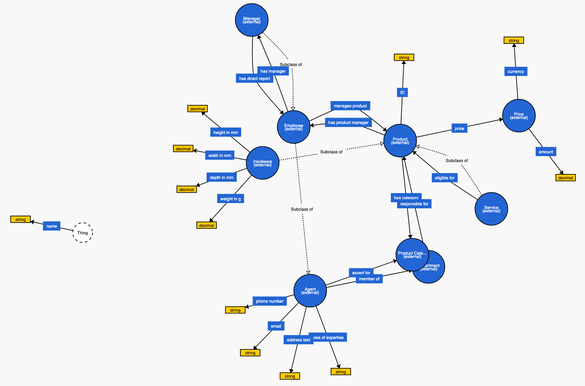{ class="bordered" }

- Sample JSON file: [services.json](services.json)

    ```json
    [
        {
            "Price": "748,40 EUR",
            "ProductManager": "Lambert.Faust@company.org",
            "Products": "O491-3823912, I965-1821441, Z655-3173353, ...",
            "ServiceID": "Y704-9764759",
            "ServiceName": "Product Analysis"
        },
        {
            "Price": "1082,00 EUR",
            "ProductManager": "Corinna.Ludwig@company.org",
            "Products": "Z249-1364492, L557-1467804, C721-7900144, ...",
            "ServiceID": "I241-8776317",
            "ServiceName": "Component Confabulation"
        },
        ...
    ]
    ```

- Sample XML file: [orgmap.xml](orgmap.xml)

    ```xml
    <orgmap>
        <dept id="73191" name="Engineering">
            <manager>
                <email>Thomas.Mueller@company.org</email>
                <name>Thomas Mueller</name>
                <address>Karl-Liebknecht-Straße 885, 82003 Tettnang</address>
                <phone>+49-8200-38218301</phone>
            </manager>
            <employees>
                <employee>
                    <email>Corinna.Ludwig@company.org</email>
                    <name>Corinna Ludwig</name>
                    <address>Ringstraße 276</address>
                    <phone>+49-1743-24836762</phone>
                    <productExpert>Memristor, Gauge, Encoder</productExpert>
                </employee>
                <employee>
                    <email>Karen.Brant@company.org</email>
                    <name>Karen Brant</name>
                    <address>Friedrichstraße 664, 30805 Willich</address>
                    <phone>(00530) 5040048</phone>
                    <productExpert>Inductor</productExpert>
                </employee>
                ...
            </employees>
            <products>
                <product id="Z249-1364492" />
                <product id="O184-6903943" />
                <product id="V404-9975399" />
                <product id="F344-7012314" />
                <product id="N463-8050264" />
                <product id="M605-5951566" />
                <product id="N733-1946687" />
            </products>
            <services>
                <service id="I241-8776317" />
                <service id="D215-3449390" />
            </services>
        </dept>
        <dept id="22183" name="Product Management">        
            ...
        </dept>
        ...
    </orgmap>
    ```

## 1 Install the required Ontologies / Vocabularies

The vocabulary contains the classes and properties needed to map the data into the new structure in the Knowledge Graph.


1. Click the :eccenca-application-explore: **Knowledge graphs** icon in the main menu under **EXPLORE**.
    In the **Graphs** drop-down, click :eccenca-item-add-artefact: **Add new graph** and select the **New graph from File** option.

    { class="bordered" width="70%" }

    { class="bordered" width="70%"}

2. In the next step, select the RDF file via **browse** or add it via drag-and-drop. Define the **Target graph URI** (should be populated automatically as `http://ld.company.org/prod-vocab/` as derived from the uploaded file) and confirm to add / replace this graph in the final dialog step. Tick the **Add new graph** checkbox and click **Upload**.

    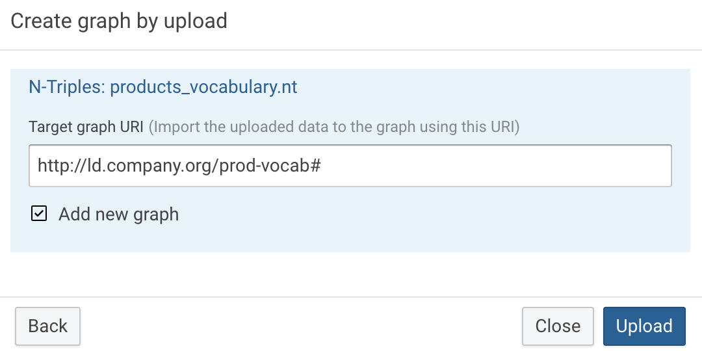{ class="bordered" width="70%"}

## 2 Uploading of the data (file)

1. Click the :eccenca-artefact-project: **Projects** icon in the main menu under the **BUILD** section.
    Then click on **Create new** :eccenca-item-add-artefact: in the top right corner to create a new project.

    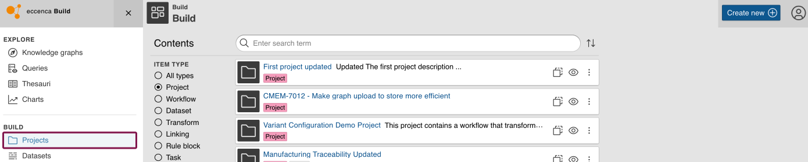{ class="bordered" }

2. In the **Create new item** window, select **Project** and click **Add**.
   The Create new item of type Project window appears.

    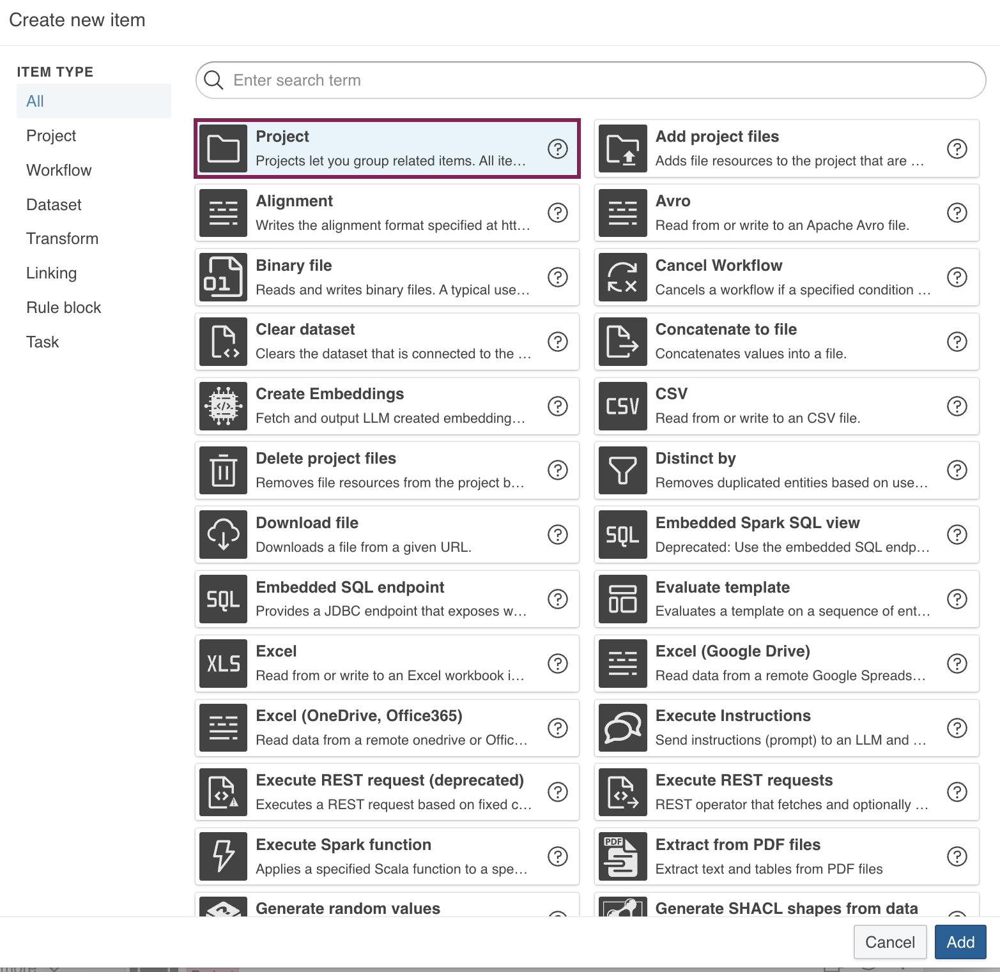{ class="bordered" width="50%" }

3. Fill in the required details such as Title and Description.
    In this example we will use:

    - Title: `Tutorial: Lift data from JSON and XML sources`
    - Description: `This tutorial shows how you can build a Knowledge Graph based on input data from hierarchical sources like a JavaScript Object Notation (.json) or Extensible Markup Language (.xml) file. https://documentation.eccenca.com/latest/build/lift-data-from-json-and-xml-sources`

    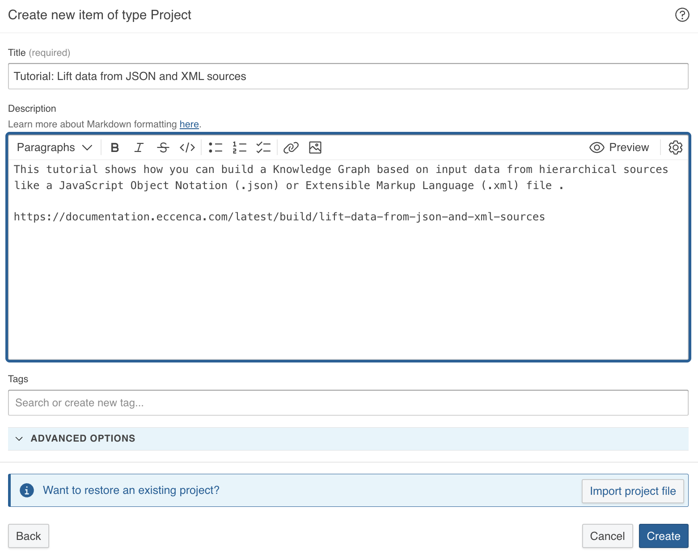{ class="bordered" width="70%" }

4. Click **Create**. Your project is created.

## 3 Create a new dataset

Follow the steps below for adding JSON and XML datasets.

=== "JSON"

    1. Click again on **Create new** :eccenca-item-add-artefact: in the top right corner to create a new JSON dataset. Select Dataset on the left, then select **JSON** and click **Add**.

        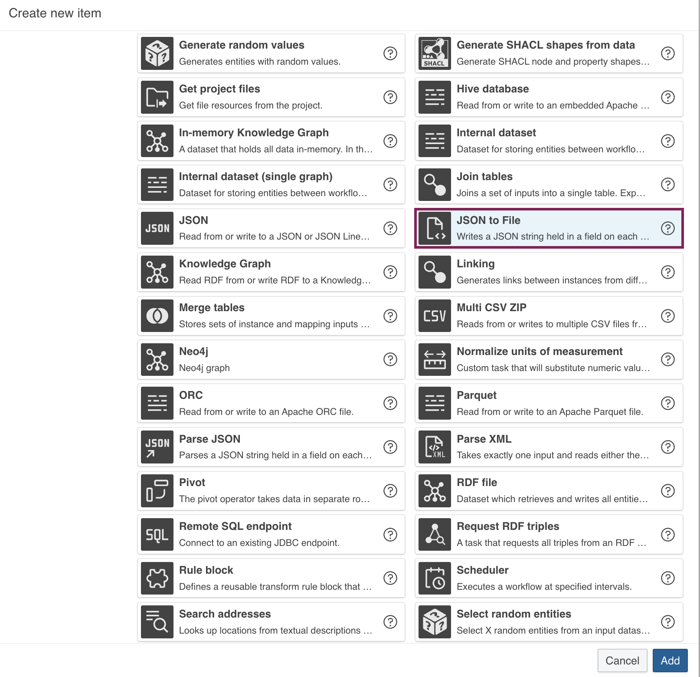{ class="bordered" width="50%" }

    2. Define a **Label** (in this example we use `JSON Services`), for the dataset, pick **Upload new file** and upload the [services.json](services.json) file. You can leave all the other fields at default values.

        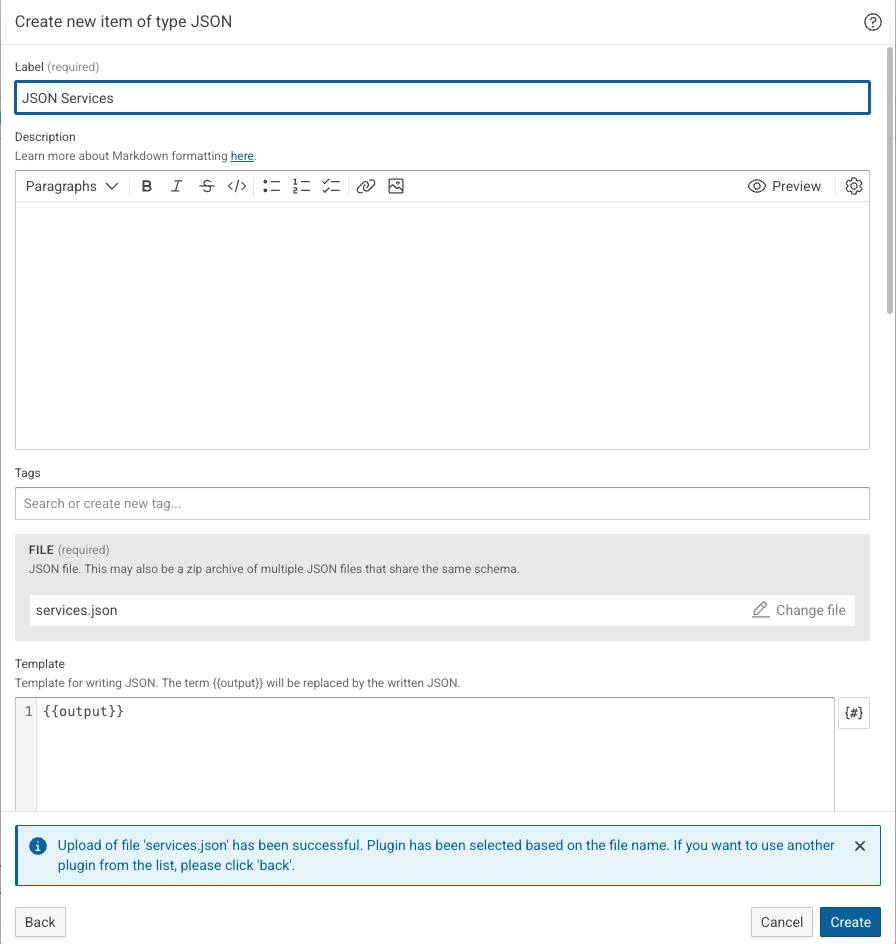{ class="bordered" width="70%"}

    3. Click **Create**.

=== "XML"

    1. Click again on **Create new** :eccenca-item-add-artefact: in the top right corner to create a new XML dataset. Select Dataset, then select **XML** and click **Add**.

        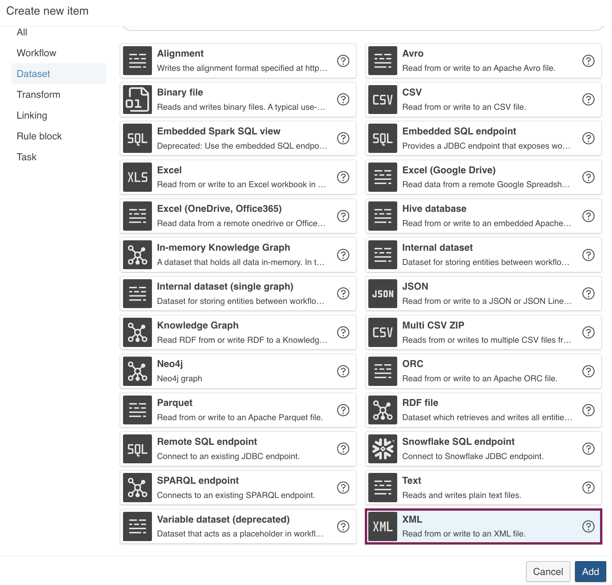{ class="bordered" width="50%"}

    2. Define a **Label** (in this example we use `Orgmap XML`) for the dataset, pick **Upload new file** and upload the [orgmap.xml](orgmap.xml) example file. You can leave all the other fields at default values.

        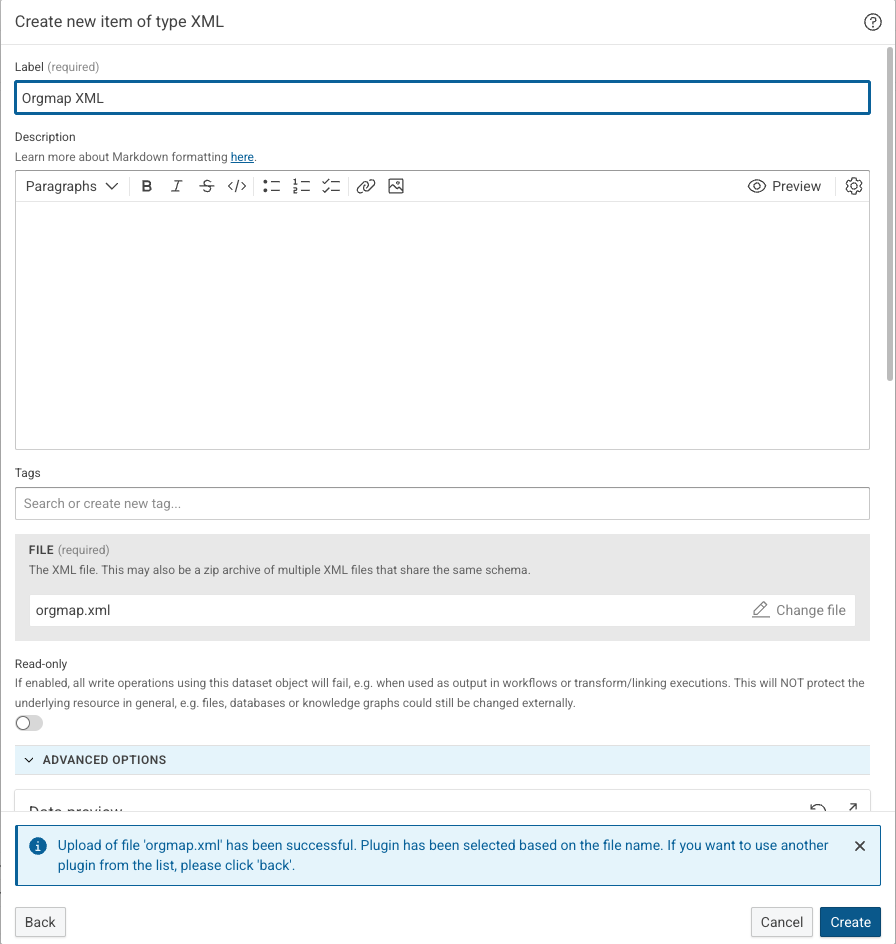{ class="bordered" width="70%"}

    3. Click **Create**.

## 4 Create a Knowledge Graph

1. Click on **Create new** :eccenca-item-add-artefact: in the top right corner to create a new **Knowledge Graph**.

2. In **Create new item** window, select Dataset, then select **Knowledge Graph** and click **Add**.

    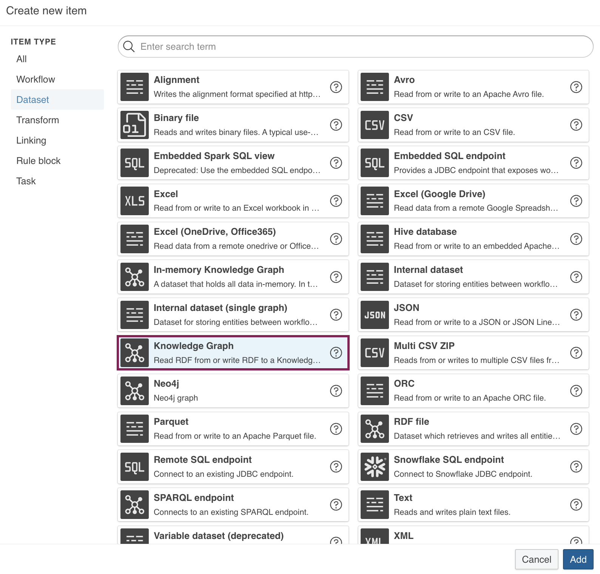{ class="bordered" width="50%" }

3. Fill in the required details such as Label and Description.

    === "JSON"

        Define a **Label** for the Knowledge Graph and provide **Graph** uri. You can leave all the other fields at default values. In this example we use:

        - Name: `Service Knowledge Graph`
        - Graph: `http://ld.company.org/prod-instances/`

        After typing the Graph URI you must click the Custom entry: '…' suggestion. Typing alone leaves it unset.

        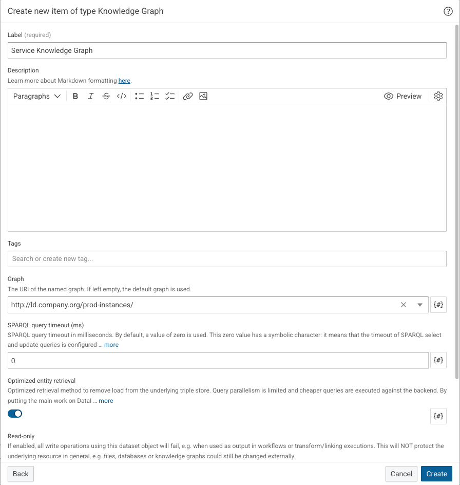{ class="bordered" width="70%"}

        Click **Create**.

    === "XML"

        Define a **Label** for the Knowledge Graph and provide **Graph** uri. You can leave all the other fields at default values. In this example we will use:

        - Name: `Organization Knowledge Graph`
        - Graph: `http://ld.company.org/organization-data/`

        After typing the Graph URI you must click the Custom entry: '…' suggestion. Typing alone leaves it unset.

        { class="bordered" width="70%"}

        Click **Create**.

## 5 Create a Transformation

The transformation defines how an input dataset (e.g.: JSON or XML) will be transformed into an output dataset (e.g.: Knowledge Graph).

1. Click **Create** in your project.

2. On the **Create New Item** window, select **Transform** and click **Add** to create a new transformation.

    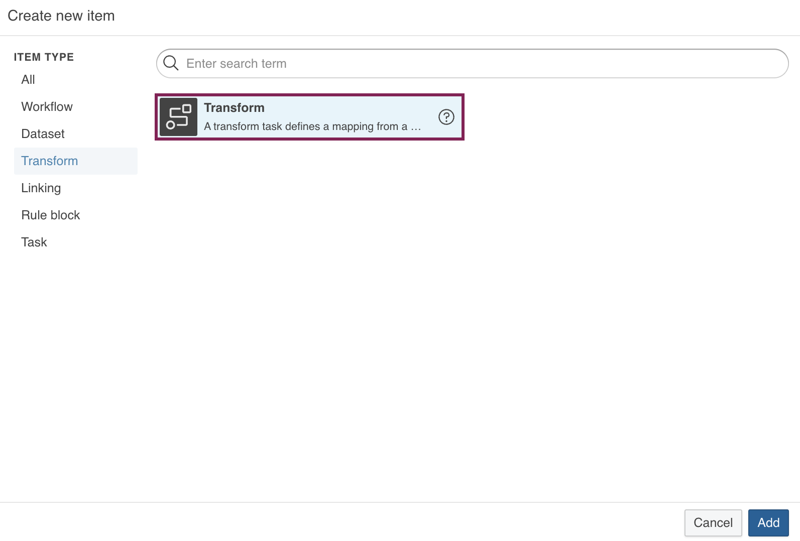{ class="bordered" width="50%" }

3. In the **Create new item of type Transform** window, enter the required fields.

    === "JSON"

        For this example, enter the following:

        - Name: `Create Service Triples`
        - (optional) Description: `Lifts the Service file into the Knowledge Graph`
        - Select the Source Dataset: `JSON Services`
        - Select the Output Dataset: `Service Knowledge Graph`

        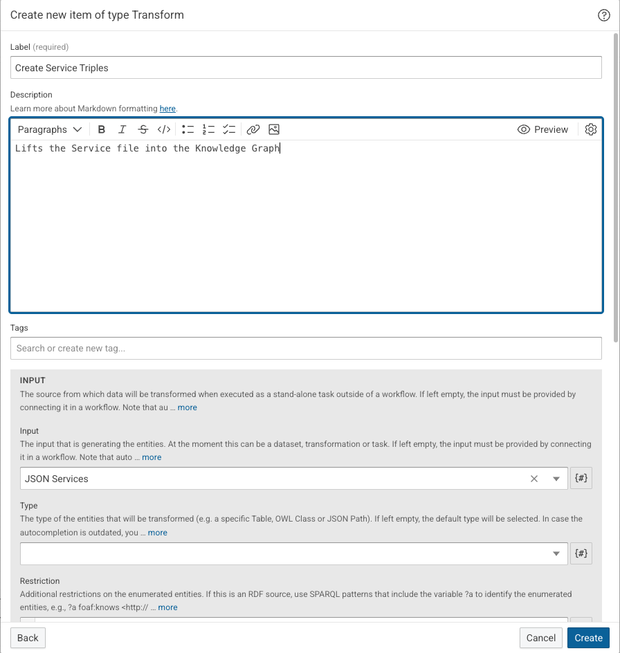{ class="bordered" width="70%"}

        Click **Create**.

    === "XML"

        For this example, enter the following:

        - Name: `Create Organization Triples`
        - (optional) Description: `Lifts the Orgmap XML file into the Knowledge Graph`
        - Select the Source Dataset: `Orgmap XML`
        - Type: `dept` (define the Source Type, which defines the XML element that should be iterated when creating resources)
        - Select the Output Dataset: `Organization Knowledge Graph`

        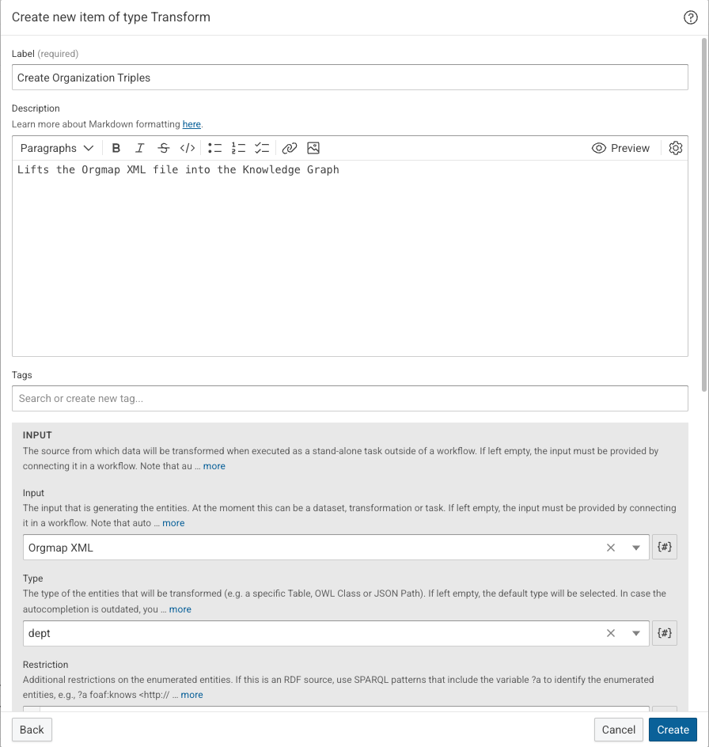{ class="bordered" width="70%"}

        Click **Create**.

4. Expand the :eccenca-artefact-project: **Mapping** menu by clicking the arrow on the right side of the page to expand the menu.

5. Click **Edit** to create a base mapping.

    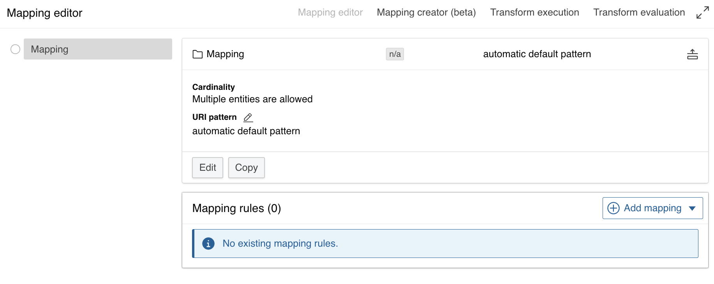{ class="bordered" width="70%"}

6. Define the **Target entity type** from the vocabulary, the **URI pattern** and a **Label** for the mapping.

    The **URI pattern** field is read-only and shows `Default pattern.` until you click **Create custom pattern** next to it.

    === "JSON"

        Target Entity Type defines the class that will be instantiated when the mapping rule is applied.

        The URI pattern that defines the URI that shall be generated for each individual

        - _http://ld.company.org/prod-inst/_ is a common prefix for the instances in this use case,
        - _service-instances/_ complements the instances prefix by adding a common prefix for all service instances
        - and finally _{ServiceID}_ is a placeholder that will resolve to the json-key _ServiceID_ (e.g. _"ServiceID": "Y704-9764759"_)

        In this example we will use:

        - Target Entity Type: `Service`
        - URI Pattern: `http://ld.company.org/prod-inst/service-instances/{ServiceID}`
        - An optional Label: `Service`

        Click **Save**.

        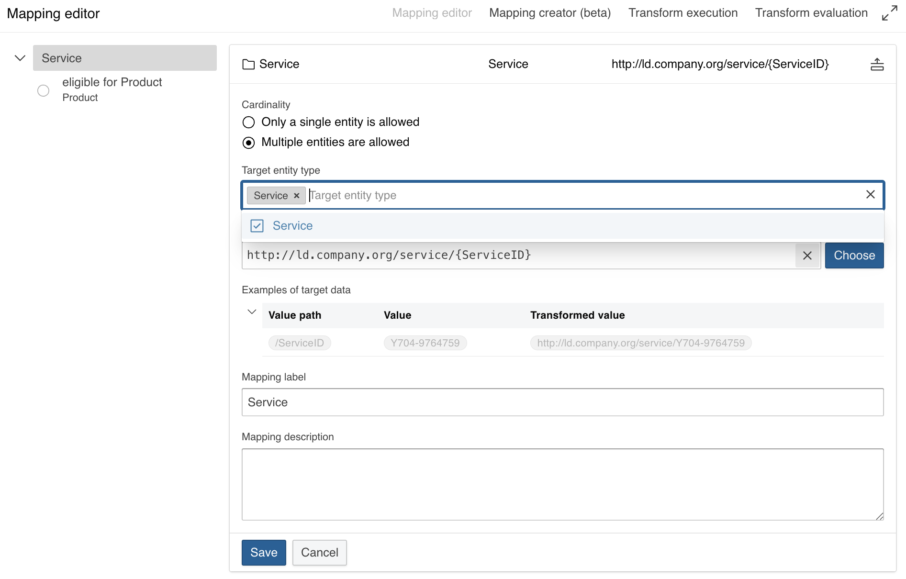{ class="bordered" width="70%"}

        Example RDF triple in our Knowledge Graph based on the mapping definition:

        ```nt
        <http://ld.company.org/prod-inst/service-instances/Y704-9764759> <http://www.w3.org/1999/02/22-rdf-syntax-ns#type> <http://ld.company.org/prod-vocab/Service>
        ```

    === "XML"

        Target Entity Type defines the class that will be instantiated when the mapping rule is applied.

        The URI pattern that defines the URI that shall be generated for each individual:

        - http://ld.company.org/department/{@id}
        - http://ld.company.org/department/_ is a common prefix for the department instances in this use case,
        - and finally _{@id}_ is a placeholder that will resolve the XML attribute of the XML tag dept, which was configured as the Source Type of this transformation (see previous steps)

        In this example we will use:

        - Target Entity Type: `Department`
        - URI Pattern: `http://ld.company.org/department/{@id}`
        - An optional Label: `Department`

        Click **Save**.

        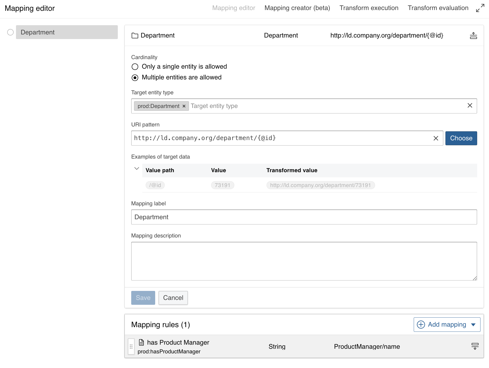{ class="bordered" width="70%"}

        Example RDF triple in our Knowledge Graph based on the mapping definition:

        ```nt
        <http://ld.company.org/department/73191> <http://www.w3.org/1999/02/22-rdf-syntax-ns#type> <http://ld.company.org/prod-vocab/Department>
        ```

7. Evaluate your mapping by pressing on the :eccenca-toggler-showmore: button in the **Examples of target data** property to see at most three generated base URIs.

    === "JSON"

        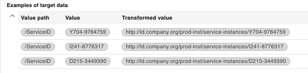{ class="bordered" }

    === "XML"

        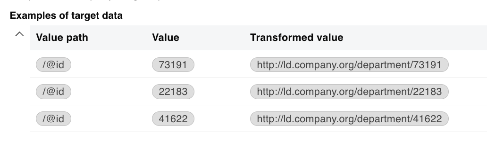{ class="bordered" width="70%"}

    We have now created the entities in the Knowledge Graph.


8. Click the :eccenca-item-add-artefact: **Add Mapping** drop-down and select **Add value mapping**.

    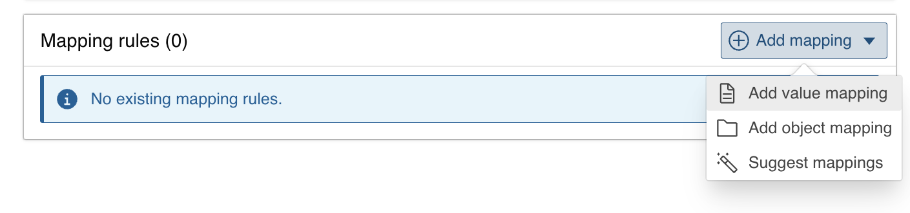{ class="bordered" width="70%" }

    === "JSON"

        Define the **Target property**, the **Data type**, the **Value path** (path into the source data) and a **Label** for your value mapping. In this example, enter the following:

        - Target Property: `has product manager`
        - Data type: `String`
        - Value path: `ProductManager`
            - which corresponds to the `ProductManager` key of each object in the JSON array, e.g. `"ProductManager": "Lambert.Faust@company.org"`
            - the path is relative to the base mapping, which iterates over the objects of the array, so no leading path segment is needed
        - An optional Label: `has Product Manager`

        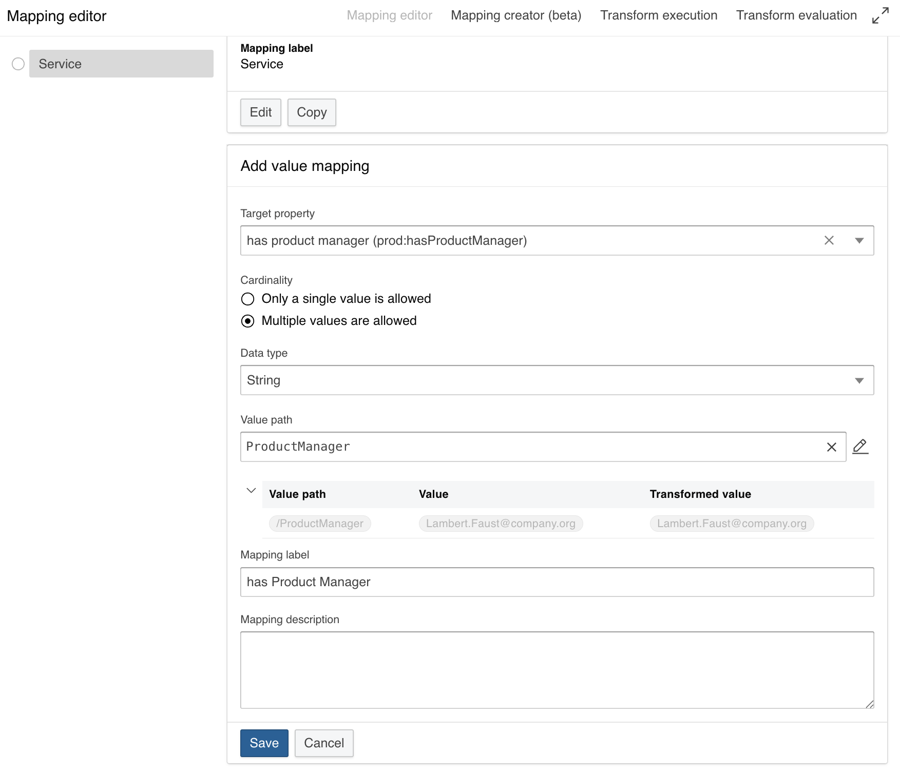{ class="bordered" width="70%" }

        Click **Save**.

    === "XML"

        Define the **Target property**, the **Data type**, the **Value path** (path into the source data) and a **Label** for your value mapping. In this example we will use:

        - Target Property: `name `
        - Data type: `String`
        - Value path: `@name`
            - which corresponds to the `department name` attribute in the XML file
        - An optional Label: `department name`

        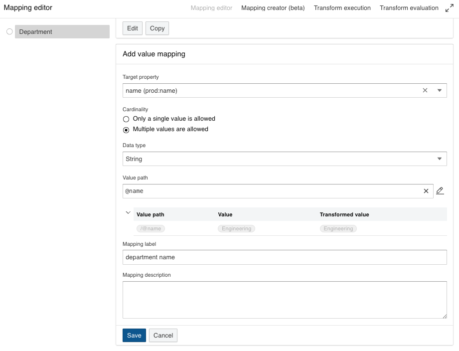{ class="bordered" width="70%" }

        Click **Save**.

By clicking on the :eccenca-toggler-showmore: button in the **Examples of target data** property, a preview for result of the value mapping is shown.

=== "JSON"

    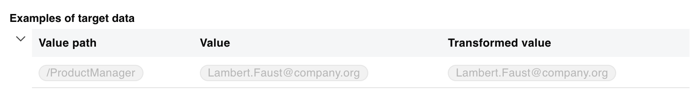{ class="bordered" width="70%" }

=== "XML"

    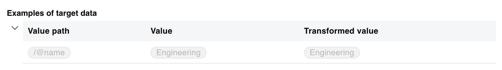{ class="bordered" width="70%" }

## 6 Evaluate a Transformation

Click **Transform evaluation** to evaluate the transformed entities.

=== "JSON"

    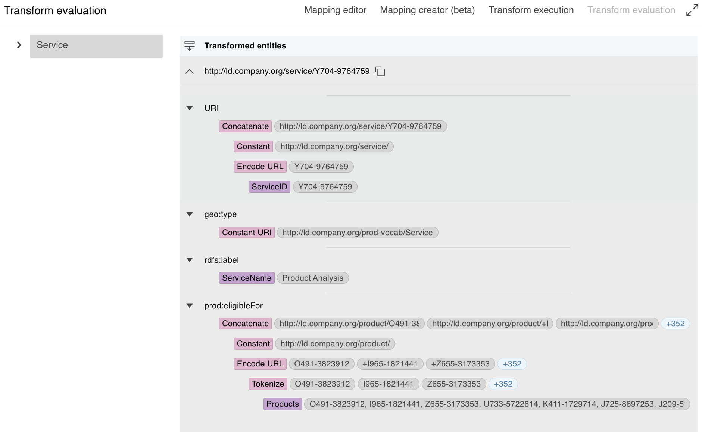{ class="bordered" width="70%" }

=== "XML"

    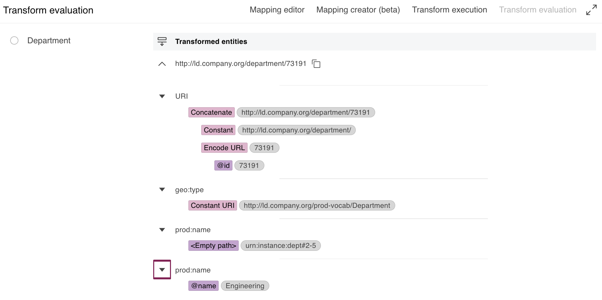{ class="bordered" width="70%" }


## 7 Build the Knowledge Graph

1. Click **Transform execution**
2. Click the :eccenca-item-start: button and validate the results. In this example, 6 Department (XML) or 9 Service (JSON) entities were created in our Knowledge Graph based on the mapping.
3. Click :eccenca-application-explore: **Knowledge graphs** under **EXPLORE** to view the created Knowledge Graphs.
4. Open the **Graphs** drop-down at the top of the left panel and enter the graph URI in its search field
   (not the **Enter search term** field of the **Navigation** panel below it — that one filters classes
   within the already-selected graph). Then select the graph from the result list.
    - JSON / Service: `http://ld.company.org/prod-instances/`
    - XML / Department: `http://ld.company.org/organization-data/`

   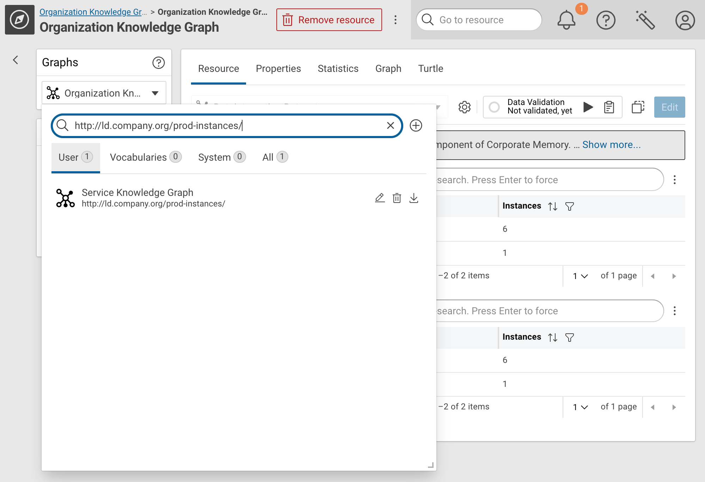{ class="bordered" width="70%" }

=== "JSON"

    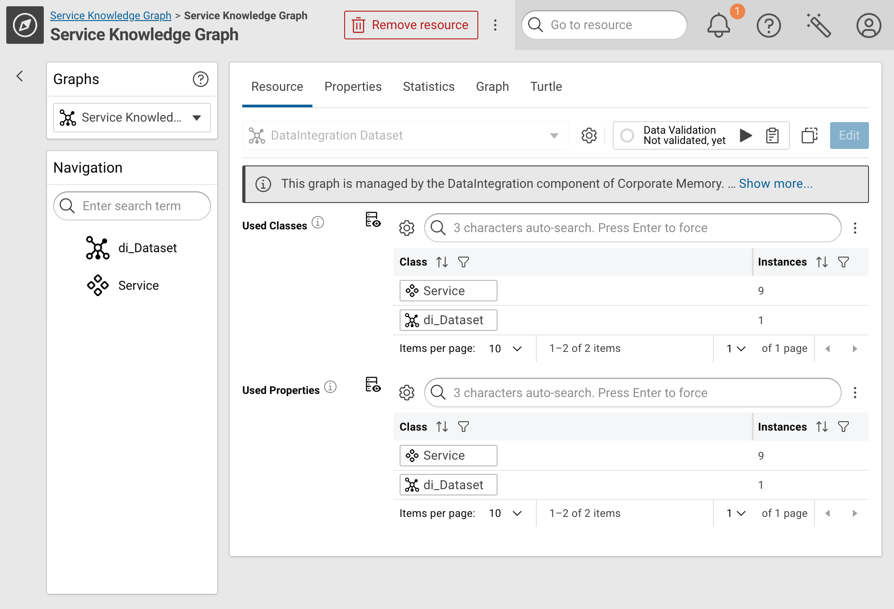{ class="bordered" width="70%" }

=== "XML"

    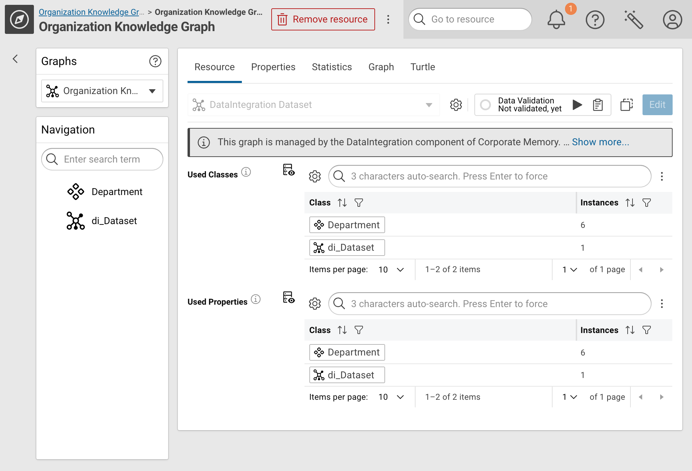{ class="bordered" width="70%" }
