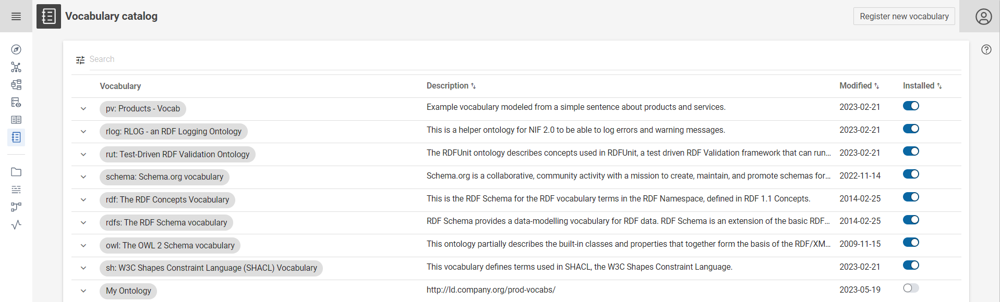

# Lift data from JSON and XML source

## Introduction

This tutorial shows how you can build a Knowledge Graph based on input data from hierarchical sources like a **JavaScript Object Notation** file (.json) or an **Extensible Markup Language** file (.xml).

!!! info

    The complete tutorial is available as a [project file (XML)](tutorial-xml.project.zip) and a [project file (JSON)](tutorial-json.project.zip). You can import these projects:

    - by using the [web interface](/build/introduction-to-the-user-interface) (Create → Project → Import project file) or
    - by using the [command line interface](/automate/cmemc-command-line-interface)

        ```shell
        cmemc -c my-cmem project import tutorial-xml.project.zip xml-transformation
        ```

        ```shell
        cmemc -c my-cmem project import tutorial-json.project.zip json-transformation
        ```

The documentation consists of the following steps, which are described in detail below.

The following material is used in this tutorial:

- Sample vocabulary describing the data in the JSON and XML files: [products_vocabulary.nt](products_vocabulary.nt)

    

- Sample JSON file: [services.json](services.json)

    ```json
    [
        {
            "Price": "748,40 EUR",
            "ProductManager": "Lambert.Faust@company.org",
            "Products": "O491-3823912, I965-1821441, Z655-3173353, ...",
            "ServiceID": "Y704-9764759",
            "ServiceName": "Product Analysis"
        },
        {
            "Price": "1082,00 EUR",
            "ProductManager": "Corinna.Ludwig@company.org",
            "Products": "Z249-1364492, L557-1467804, C721-7900144, ...",
            "ServiceID": "I241-8776317",
            "ServiceName": "Component Confabulation"
        },
        ...
    ]
    ```

- Sample XML file: [orgmap.xml](orgmap.xml)
    ```xml
    <orgmap>
        <dept id="73191" name="Engineering">
            <manager>
                <email>Thomas.Mueller@company.org</email>
                <name>Thomas Mueller</name>
                <address>Karl-Liebknecht-Straße 885, 82003 Tettnang</address>
                <phone>+49-8200-38218301</phone>
            </manager>
            <employees>
                <employee>
                    <email>Corinna.Ludwig@company.org</email>
                    <name>Corinna Ludwig</name>
                    <address>Ringstraße 276</address>
                    <phone>+49-1743-24836762</phone>
                    <productExpert>Memristor, Gauge, Encoder</productExpert>
                </employee>
                <employee>
                    <email>Karen.Brant@company.org</email>
                    <name>Karen Brant</name>
                    <address>Friedrichstraße 664, 30805 Willich</address>
                    <phone>(00530) 5040048</phone>
                    <productExpert>Inductor</productExpert>
                </employee>
                ...
            </employees>
            <products>
                <product id="Z249-1364492" />
                <product id="O184-6903943" />
                <product id="V404-9975399" />
                <product id="F344-7012314" />
                <product id="N463-8050264" />
                <product id="M605-5951566" />
                <product id="N733-1946687" />
            </products>
            <services>
                <service id="I241-8776317" />
                <service id="D215-3449390" />
            </services>
        </dept>
        <dept id="22183" name="Product Management">        
            ...
        </dept>
        ...
    </orgmap>
    ```

## 1 Register the vocabulary

The vocabulary contains the classes and properties needed to map the source data into entities in the Knowledge Graph.

1. In Corporate Memory, click **Vocabularies** in the navigation under **EXPLORE** on the left side of the page.

    {width="30%"}

2. Click **Register new vocabulary** on the top right of the **Vocabulary catalog** page in Corporate Memory.

    

3. Define a **Name**, a **Graph URI** and a **Description** of the vocabulary. _In this example we will use:_

    - Name: _**Product Vocabulary**_
    - Graph URI: _**http://ld.company.org/prod-vocab/**_
    - Description: _**Example vocabulary modeled to describe relations between products and services.**_

    {width="50%"}

4. Click **REGISTER**.

## 2 Upload the data file

To add the data files, click Projects under BUILD in the navigation on the left side of the page. Follow the steps below for adding JSON and XML datasets.

=== "JSON"

    1. Click **Create** at the top of the page.

    2. In **Create new item** window, select **JSON** and click Add.

        

    3. Define a **Label** for the dataset and upload the [services.json](services.json) file. You can leave all the other fields at default values.

        {width="45%"} {width="45%"}

    4. Click **Create**.

=== "XML"

    1. Press the **Create** button and select XML

        

    2. Define a **Label** for the dataset and upload the [orgmap.xml](orgmap.xml) example file. You can leave all the other fields at default values.

        

    3. Click **Create**.

## 3 Create a Knowledge Graph

1. Click Create at the top of the page.  

2. In **Create new item** window, select **Knowledge Graph** and click **Add**. The Create new item of type Knowledge Graph window appears.

    

3. Fill in the required details such as Label and Description.

    === "JSON"

        Define a **Label** for the Knowlege Graph and provide **Graph** uri. You can leave all the other fields at default values. _In this example we use:_

        - Name: _**Service Knowledge Graph**_
        - Graph: _**http://ld.company.org/prod-instances/**_

        

    === "XML"

        Define a **Label** for the Knowledge Graph and provide **Graph** uri. You can leave all the other fields at default values. _In this example we will use:_

        - Name: _**Organization Knowledge Graph**_
        - Graph: _**http://ld.company.org/organization-data/**_

        

## 4 Create a Transformation

The transformation defines how an input dataset (e.g.: JSON or XML) will be transformed into an output dataset (e.g.: Knowledge Graph).

1. Click **Create** in your project.  

2. On the **Create New Item** window, select **Transform** and click **Add** to create a new transformation.

    

3. In the **Create new item of type Transform** window, enter the required fields.

    === "JSON"

        _For this example, enter the following:_

        - Name: _**Create Service Triples**_
        - (optional) Description: _**Lifts the Service file into the Knowledge Graph**_
        - Select the Source Dataset: _**Services JSON**_
        - Select the Output Dataset: _**Service_Knowledge_Graph**_

        

        Click **Create**.

    === "XML"

        _For this example, enter the following:_

        - Name: _**Create Organization Triples**_
        - (optional) Description: _**Lifts the Orgmap XML file into the Knowledge GraphOrgmap XML**_
        - Select the Source Dataset: _**Orgmap XML**_
        - Type: _**dept**_ (define the Source Type, which defines the XML element that should be iterated when creating resources)
        - Select the Output Dataset: _**Organization_Knowledge_Graph**_

        

        Click **Create**.

4. Expand the  menu by clicking the arrow on the right side of the page to expand the menu.

5. Click **Edit** to create a base mapping.

    

6. Define the **Target entity type** from the vocabulary, the **URI pattern** and a **Label** for the mapping.

    === "JSON"

        Target Entity Type defines the class that will be instantiated when the mapping rule is applied.

        The URI pattern that defines the URI that shall be generated for each individual

        - _http://ld.company.org/prod-inst/_ is a common prefix for the instances in this use case,
        - _service-instances/_ complements the instances prefix by adding a common prefix for all service instances
        - and finally _{ServiceID}_ is a placeholder that will resolve to the json-key _ServiceID_ (e.g. _"ServiceID": "Y704-9764759"_)

        _In this example we will use:_

        - Target Entity Type: **_Service_**
        - URI Pattern: _**http://ld.company.org/prod-inst/service-instances/{ServiceID}**_
        - An optional Label: _**Service**_

        Click **SAVE**.

        _Example RDF triple in our Knowledge Graph based on the mapping definition:_

        ```nt
        <http://ld.company.org/services-instances/Y704-9764759> <http://www.w3.org/1999/02/22-rdf-syntax-ns#type> <http://ld.company.org/prod-vocab/Service>
        ```

    === "XML"

        Target Entity Type defines the class that will be instantiated when the mapping rule is applied: **_Department_**

        The URI pattern that defines the URI that shall be generated for each individual: _**http://ld.company.org/department/{@id}**_

        - _http://ld.company.org/department/_ is a common prefix for the department instances in this use case,
        - and finally _{@id}_ is a placeholder that will resolve the XML attribute of the XML tag dept, which was configured as the Source Type of this transformation (see previous steps)

        _In this example we will use:_

        - Target Entity Type: **_Department_**
        - URI Pattern: **_http://ld.company.org/department/{@id}_**
        - An optional Label: _**Department**_

        Click **Save**.

        _Example RDF triple in our Knowledge Graph based on the mapping definition:_

        ```nt
        <http://ld.company.org/department/73191 <http://www.w3.org/1999/02/22-rdf-syntax-ns#type> <http://ld.company.org/prod-vocab/Department>
        ```

7. Evaluate your mapping by pressing on the  button in the **Examples of target data** property to see at most three generated base URIs.

    

    We have now created the Service entities in the Knowledge Graph. Next we will now add the name of our entity.

8. Click the circular blue **+** icon on the lower right and select **Add value mapping**.

    

    === "JSON"

        Define the **Target property**, the **Data type**, the **Value path** (column name) and a **Label** for your value mapping. _In this example, enter the following:_

        - Target Property: **_has product manager_**
        - Data type: _**StringValueType**_
        - Value path: _**ProductManager/name**_
            - which corresponds to the following element in the json-file: _[ {"ProductManager": {  "name": "Corinna Ludwig"} ... } ...]_
        - An optional Label: _**has Product Manager**_

        

        Click **Save**.

    === "XML"

        Define the **Target property**, the **Data type**, the **Value path** (column name) and a **Label** for your value mapping. _In this example we will use:_

        - Target Property: **_name_**
        - Data type: _**StringValueType**_
        - Value path: _**dept/@name**_
            - which corresponds to the `department name` attribute in the XML file
        - An optional Label: _**department name**_

        

        Click **Save**.

By clicking on the  button in the **Examples of target data** property, you can get a preview for 3x value mapping to be created.

=== "JSON"

    

=== "XML"

    

## 5 Evaluate a Transformation

Click **Transform evaluation** to evaluate the transformed entities.


## 6 Build the Knowledge Graph

1. Click **Transform execution**
2. Press the  button and validate the results. In this example, 9x Service entities were created in our Knowledge Graph based on the mapping.
3. You can click **Knowledge Graphs** under **EXPLORE** to (re-)view of the created Knowledge Graphs
4. Enter the following URIs in the Enter search term for JSON and XML respectively.
    - JSON / Service: _**http://ld.company.org/prod-instances/**_
    - XML / Department: _**http://ld.company.org/organization-data/**_

    === "JSON"

        

    === "XML"

        
