# Lift data from tabular data such as CSV, XSLX or database tables

## Introduction

This beginner-level tutorial shows how you can build a Knowledge Graph based on input data from a **comma-separated value file** (.csv), an **excel file** (.xlsx) or a **database table** (jdbc).

!!! Abstract

    The complete tutorial is available as a [project file](tutorial-csv.project.zip). You can import this project

    - by using the [web interface](../../build/introduction-to-the-user-interface/index.md) (Create → Project → Import project file) or
    - by using the [command line interface](../../automate/cmemc-command-line-interface/index.md)

    ``` shell-session
    $ cmemc -c my-cmem project import tutorial-csv.project.zip tutorial-csv
    ```

    This step is optional and makes some of the following steps of the tutorial superfluous.

The documentation consists of the following steps, which are described in detail below:

1. Registration of the target vocabulary
2. Uploading of the data (file)
3. Creating the Transformation
4. Configure Mapping
5. Evaluate a Transformation
6. Build the Knowledge Graph


## Sample Material

The following material is used in this tutorial, you should download the files and have them at hand throughout the tutorial:

-   Sample vocabulary which describes the data in the CSV files: [products_vocabulary.nt](products_vocabulary.nt)

    { class="bordered" }

-   Sample CSV file: [services.csv](services.csv)

    !!! info

        | ServiceID    | ServiceName             | Products                                      | ProductManager             | Price       |
        | ------------ | ----------------------- | --------------------------------------------- | -------------------------- | ----------- |
        | Y704-9764759 | Product Analysis        | O491-3823912, I965-1821441, Z655-3173353, ... | Lambert.Faust@company.org  | 748,40 EUR  |
        | I241-8776317 | Component Confabulation | Z249-1364492, L557-1467804, C721-7900144, ... | Corinna.Ludwig@company.org | 1082,00 EUR |
        | …            | …                       | …                                             | …                          | …           |

-   Sample Excel file: [products.xlsx](products.xlsx)

    !!! info

        | ProductID    | ProductName        | Height | Width | Depth | Weigth | ProductManager              | Price    |
        | ------------ | ------------------ | ------ | ----- | ----- | ------ | --------------------------- | -------- |
        | I241-8776317 | Strain Compensator | 12     | 68    | 15    | 8      | Baldwin.Dirksen@company.org | 0,50 EUR |
        | D215-3449390 | Gauge Crystal      | 77     | 58    | 19    | 15     | Wanja.Hoffmann@company.org  | 2,00 EUR |
        | …            | …                  | …      | …     | …     | …      | …                           | …        |

---

## 1 Register the vocabulary

The vocabulary contains the classes and properties needed to map the data into the new structure in the Knowledge Graph.

=== "Corporate Memory"

    1. In Corporate Memory, click Vocabularies under **EXPLORE** in the navigation on the left side of the page.

        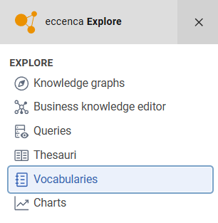{ class="bordered" width="50%" }

    2. Click **Register new vocabulary** on the top right.

        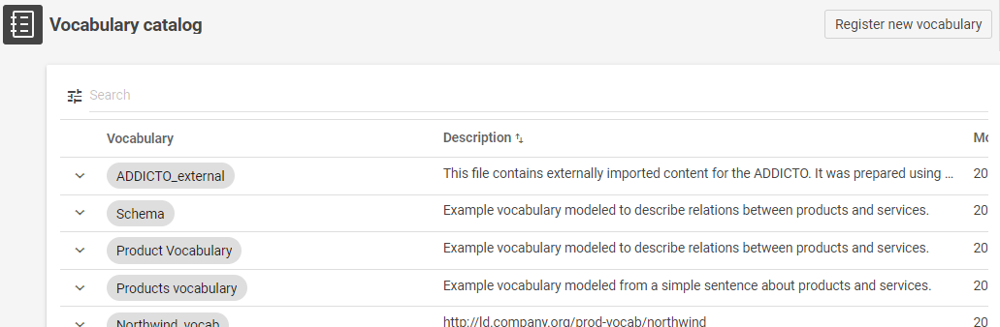{ class="bordered" width="50%" }

    3. Define a **Name**, a **Graph URI** and a **Description** of the vocabulary. _In this example we will use:_

        - Label: `Product Vocabulary`
        - Graph URI: `http://ld.company.org/prod-vocab/`
        - Description: `Example vocabulary modeled to describe relations between products and services.`
        - Upload File: Browse in your filesystem for the **[products_vocabulary.nt](products_vocabulary.nt)** file and select it to be uploaded.

        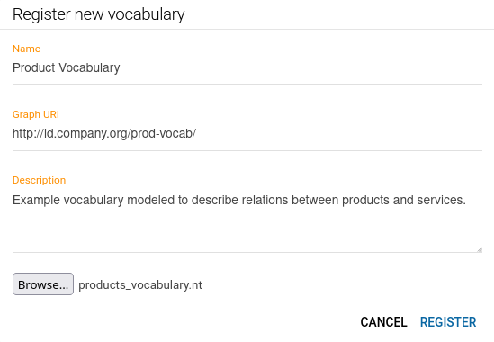{ class="bordered" width="50%" }


=== "cmemc"

    ``` shell-session
    $ cmemc vocabulary import products_vocabulary.nt
    ```

---

## 2 Uploading of the data (file)

1. In Corporate Memory, click **:fontawesome-regular-folder: Projects** under **BUILD** in the navigation on the left side of the page.

    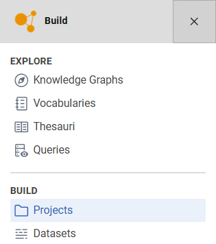{ class="bordered" width="50%" }

2. Click **Create :octicons-plus-circle-24:** at the top right of the page. 

3. In the **Create new item** window, select **Project** and click **Add**. The Create new item of type Project window appears.  

4. Fill in the required details such as Title and Description. Alternatively, import the existing project by clicking **Import Project File** and selecting the file from your system.  

5. Click **Create**. Your project is created.


---

=== "Workflow view"

    1. Within your project, click on  **Create workflow**.

        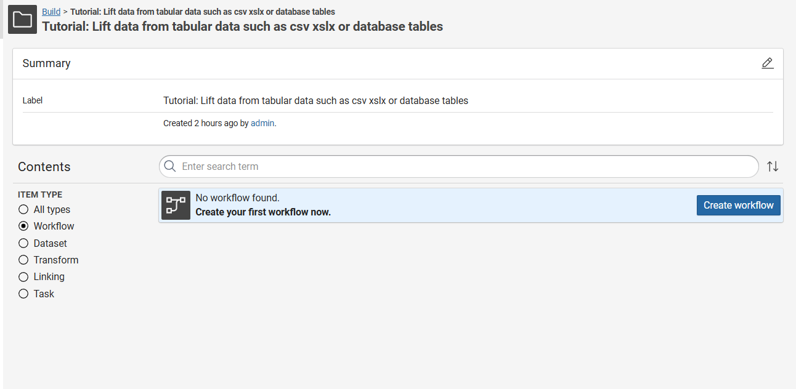{ class="bordered" width="50%" }

    2. Fill out a label and click **Create**.

        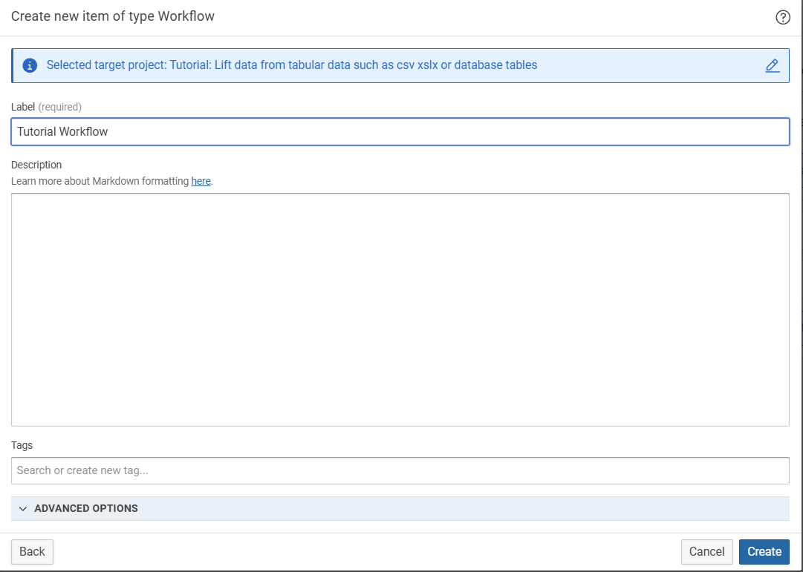{ class="bordered" width="50%" }

    3. Drag and drop the **[services.csv](services.csv) sample file** on the grid.

    4. Optionally change the Label, then click on **Create**.

        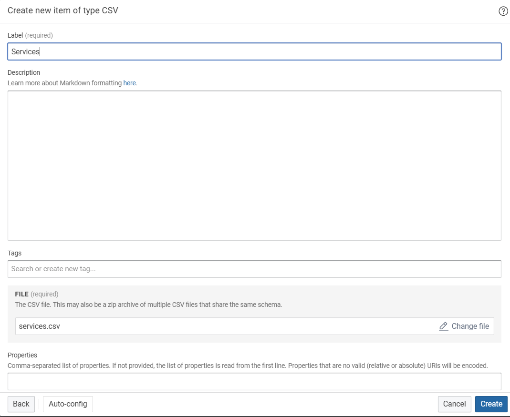{ class="bordered" width="50%" }

    5. Create a second **dataset** by drag & drop it on the grid using [products.xlsx](products.xlsx) file.

=== "cmemc"

    ``` shell-session
    $ cmemc project create tutorial-csv

    $ cmemc dataset create --project tutorial-csv services.csv

    $ cmemc dataset create --project tutorial-csv products.xlsx
    ```

=== "JDBC"

    Instead of uploading the [services.csv](services.csv) sample file into Corporate Memory, you can also load it into a SQL database and access it from Corporate Memory using the JDBC protocol.

    1. In the project, Click **Create** and select the **JDBC endpoint** type.

        { class="bordered" width="50%" }

    2. Define a **Label** for the dataset, specify the **JDBC Driver connection URL**, the **table** name and the **user** and **password** to connect to the database. _In this example we will use:_

        - Name: _**Services_ServiceDB**_
        - JDBC Driver Connection URL: _**jdbc:mysql://mysql:3306/ServicesDB**_
        - table: _**Services**_
        - username: _**root**_
        - password: _**\*\*\*\***_

        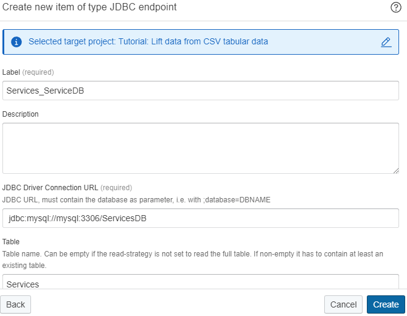{ class="bordered" width="50%" }

        The general form of the JDBC connection string is:

        ```
        jdbc:<vendor>://<hostname>:<portNumber>/<databaseName>
        ```

        Default JDBC connection strings for popular Relational Database Management Systems:

        | Vendor               | Default JDBC Connection String                  | Default Port |
        | -------------------- | ----------------------------------------------- | ------------ |
        | Microsoft SQL Server | jdbc:sqlserver:<hostname>:1433/<databaseName>   | 1433         |
        | PostgreSQL           | jdbc:postgresql:<hostname>:5432/<databaseName>  | 5432         |
        | MySQL                | jdbc:mysql:<hostname>:3306/<databaseName>       | 3306         |
        | MariaDB              | jdbc:mariadb:<hostname>:3306/<databaseName>     | 3306         |
        | IBM DB2*             | jdbc:db2:<hostname>:50000/<databaseName>        | 50000        |
        | Oracle*              | jdbc:oracle:thin:<hostname>:1521/<databaseName> | 1521         |

        !!! info

            \* IBM DB2 and Oracle JDBC drivers are not by default part of Corporate Memory, but can be added.

        !!! info

            Instead of selecting a table you can also specify a custom SQL query in the _source query_ field.

---

## 3 Creating the Transformation

The transformation defines how an input dataset (e.g. CSV) will be transformed into an output dataset (e.g. Knowledge Graph).

1. Click on the right dot and select **Connect to the newly created Transformation**.

    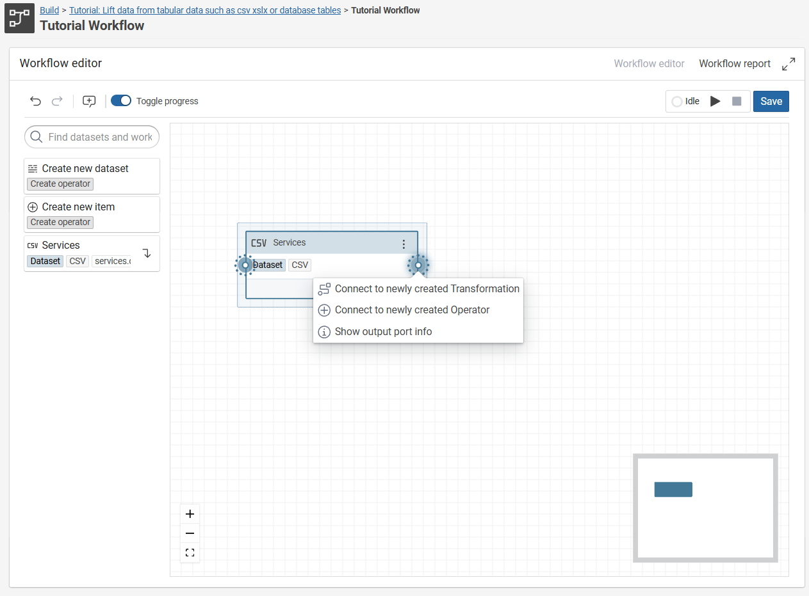{ class="bordered" width="50%" }

2. Fill out the **Label** with _**Lift Service Database**_.

    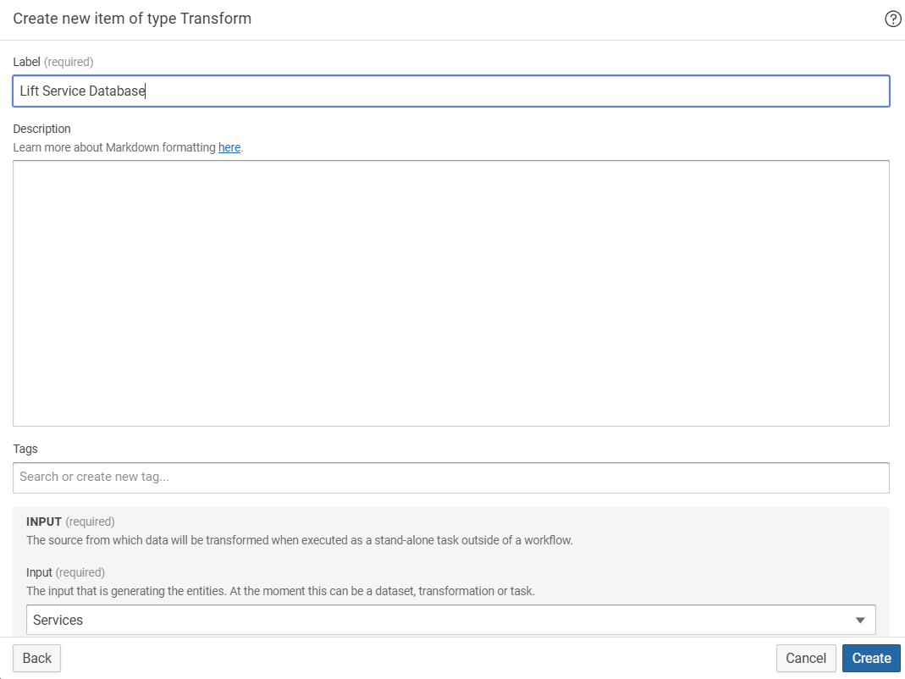{ class="bordered" width="50%" }


3. Scroll down to **Target vocabularies** and choose **Products vocabulary**.

    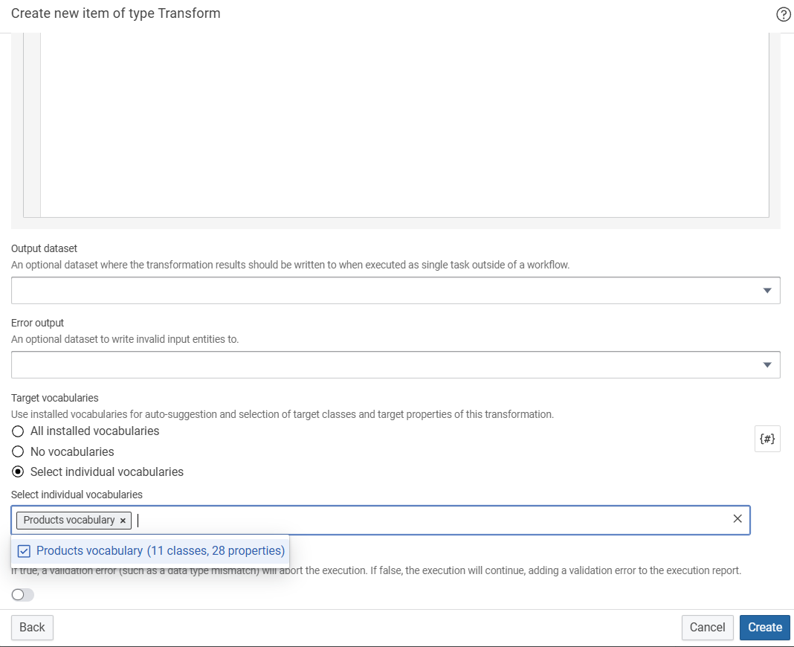{ class="bordered" width="50%" }

4. Click on **Create**.

---

## 4 Configure Mapping

1. Click on the 3 Dots from the previous created Transormation an choose **Mapping Editor**.

2. Click **Mapping** in the main area to expand its menu.

3. Click **Edit** to create a base mapping.

    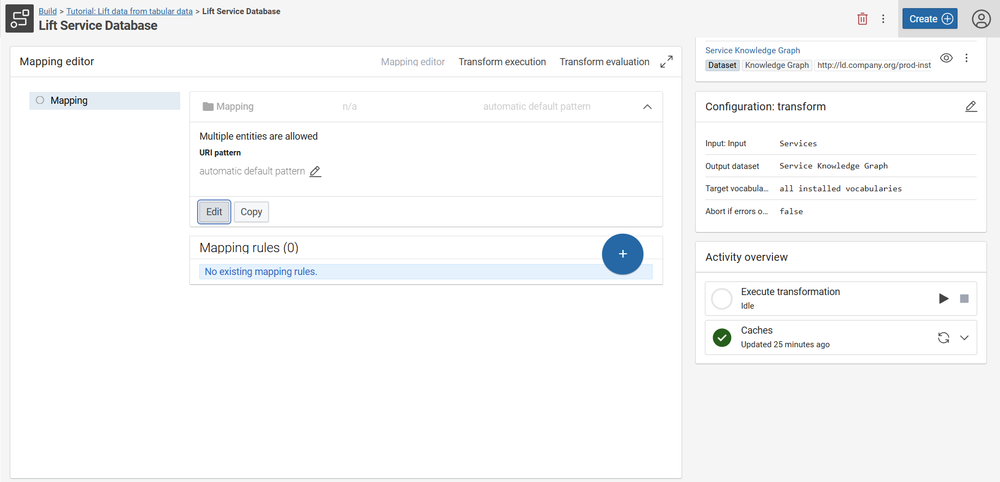{ class="bordered" width="50%" }

4. Define the **Target entity type** from the vocabulary, the **URI pattern** and a **label** for the mapping. _In this example we will use:_

    -   Target entity type: _**Service**_
    -   URI pattern:

        -   Click **Create custom pattern**
        -   Insert `http://ld.company.org/prod-inst/{ServiceID}`, where `http://ld.company.org/prod-inst/` is a common prefix for the instances in this use case, and `{ServiceID}` is a placeholder that will resolve to the column of that name.

    -   An optional Label: `Service`

    { class="bordered" width="50%" }

5. Click **Save**

_Example RDF triple in our Knowledge Graph based on the mapping definition:_

``` text
<http://ld.company.org/prod-inst/Y704-9764759> <http://www.w3.org/1999/02/22-rdf-syntax-ns#type> <http://ld.company.org/prod-vocab/Service>
```

6. Evaluate your mapping by clicking the Expand :material-greater-than: button in the **Examples of target data** property to see at most three generated base URIs.

    { class="bordered" width="50%" }

    We have now created the Service entities in the Knowledge Graph. As a next step, we will add the name of the Service entity.

7. Press the circular **Blue + button** on the lower right and select **Add value mapping**.

    { class="bordered" width="50%" }

8. Define the **Target property**, the **Data type**, the **Value path** (column name) and a **Label** for your value mapping. _In this example we will use:_

    -   Target Property: `name`
    -   Data type: _**String**_
    -   Value path: `ServiceName` (which corresponds to the column of that name)
    -   An optional Label: `service name`

    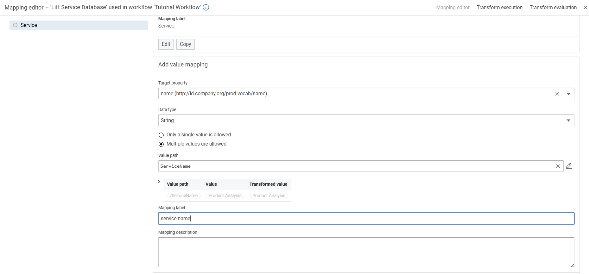{ class="bordered" width="50%" }

9. Click **Save**.

---

## 5 Evaluate a Transformation

Go the **Transform evaluation** tab of your transformation to view a list of generated entities. By clicking one of the generated entities, more details are provided.

{ class="bordered" width="50%" }


---

## 6 Build the Knowledge Graph

1. Switch back to the **Workflow view**.

2. Select the red dot on the right side and click **Connect to the newly created Knowledge graph**.

    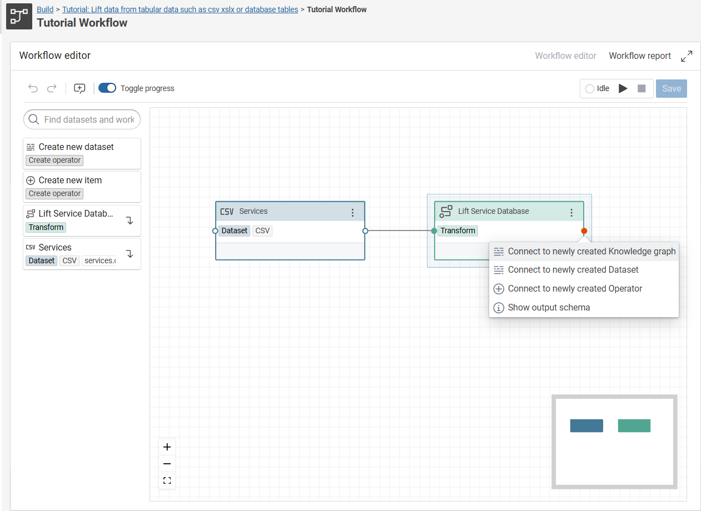{ class="bordered" width="50%" }

3. Define a **Label** for the Knowledge Graph and provide a **graph** uri. Leave all the other parameters at the default values. _In this example we will use:_

    -   Label: `Service Knowledge Graph`
    -   Graph: `http://ld.company.org/prod-instances/`

    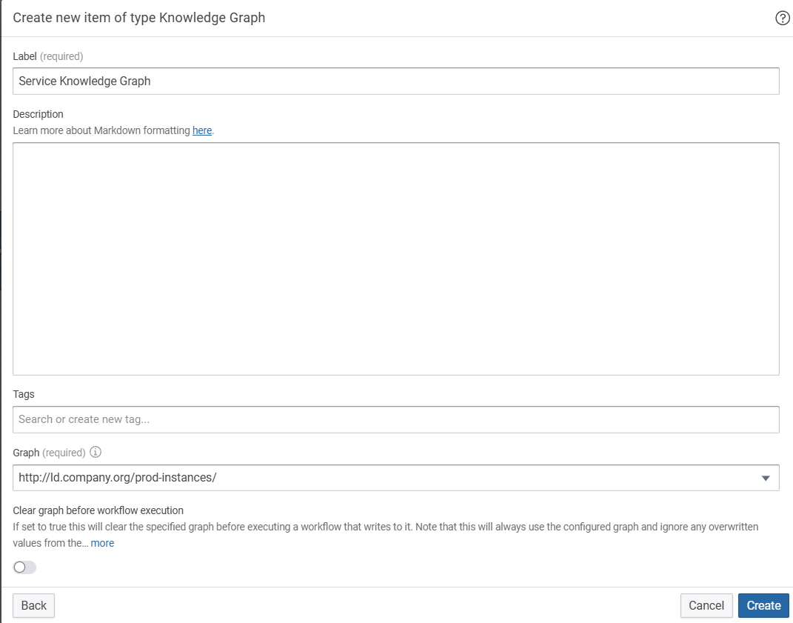{ class="bordered" width="50%" }

4. Click **Create**.

5. Press the :material-play: button and click on **Save and run workflow**.

6. Validate the results by selecting **Workflow report** In this example, 9x Service triples were created in our Knowledge Graph based on the mapping.

    { class="bordered" width="50%" }


7. Click Knowledge Graph under **Explore** in the navigation on the left side of the page.

    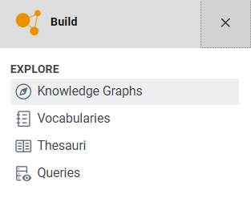{ class="bordered" width="50%" }

8. Optionally, you can click on the Settings Icon and add more columns to the viw.

    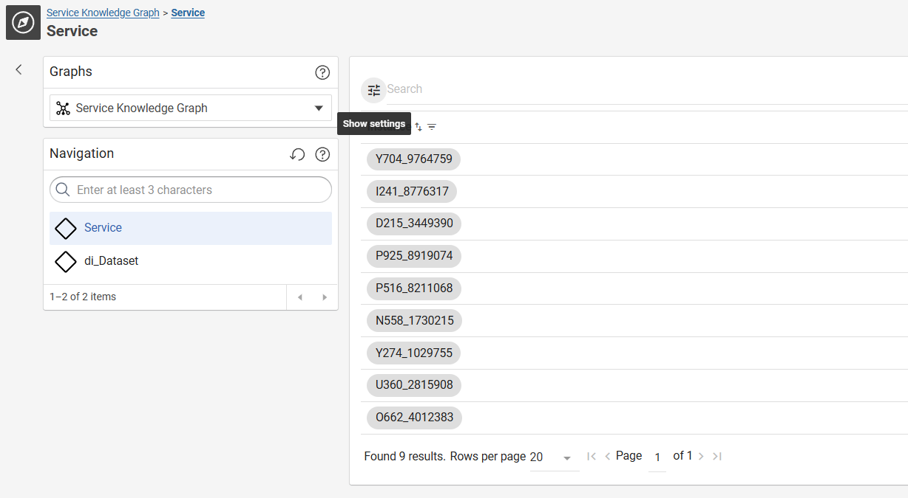{ class="bordered" width="50%" }

9. Here you can add `name` for example.

    { class="bordered" width="50%" }

10. Finally you can use the Explore **Knowledge Graphs** module to (re-)view of the created Knowledge Graph: `http://ld.company.org/prod-instances/`

    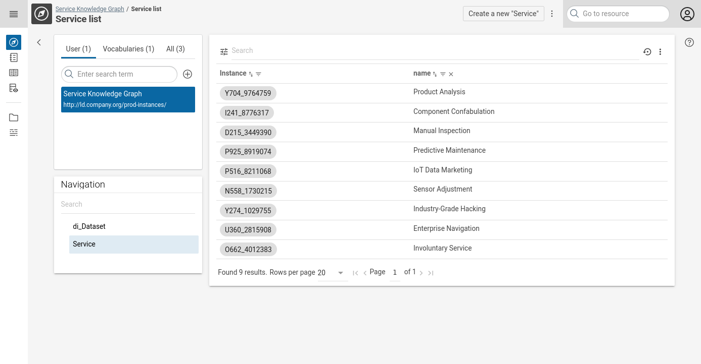{ class="bordered" width="50%" }

