# Lift data from tabular data

## Introduction

This beginner-level tutorial shows how you can build a Knowledge Graph based on tabular input data. This tutorial will use a **comma-separated value file** (.csv), it applied equally to other tabular inputs such as **excel files** (.xlsx) or **database tables** (jdbc).

!!! Tutorial Package

    The complete tutorial is available as a Marketplace Package.
    You can install this package

    - by using the web interface (:eccenca-module-marketplace: **Packages** → Search → "Product Data Demo") or
    - by using the [command line interface](../../automate/cmemc-command-line-interface/index.md)

        ``` shell-session
        cmemc -c my-cmem package install ecc-product-data-project
        ```

## Sample Material

The following material is used in this tutorial, you should download the files and have them at hand throughout the tutorial:

- Sample vocabulary which describes the data in the CSV files: [products_vocabulary.nt](products_vocabulary.nt)

    { class="bordered" }

- Sample CSV file: [services.csv](services.csv)

    !!! info

        | ServiceID    | ServiceName             | Products                                      | ProductManager             | Price       |
        | ------------ | ----------------------- | --------------------------------------------- | -------------------------- | ----------- |
        | Y704-9764759 | Product Analysis        | O491-3823912, I965-1821441, Z655-3173353, ... | Lambert.Faust@company.org  | 748,40 EUR  |
        | I241-8776317 | Component Confabulation | Z249-1364492, L557-1467804, C721-7900144, ... | Corinna.Ludwig@company.org | 1082,00 EUR |
        | …            | …                       | …                                             | …                          | …           |

---

## 1 Install the required Ontologies / Vocabularies

The vocabulary contains the classes and properties needed to map the data into the new structure in the Knowledge Graph.

=== "Corporate Memory"

    1. Click the :eccenca-application-explore: **Knowledge graphs** icon in the main menu under **EXPLORE**.
        In the **Graphs** drop-down, click :eccenca-item-add-artefact: **Add new graph** and select the **New graph from File** option.

        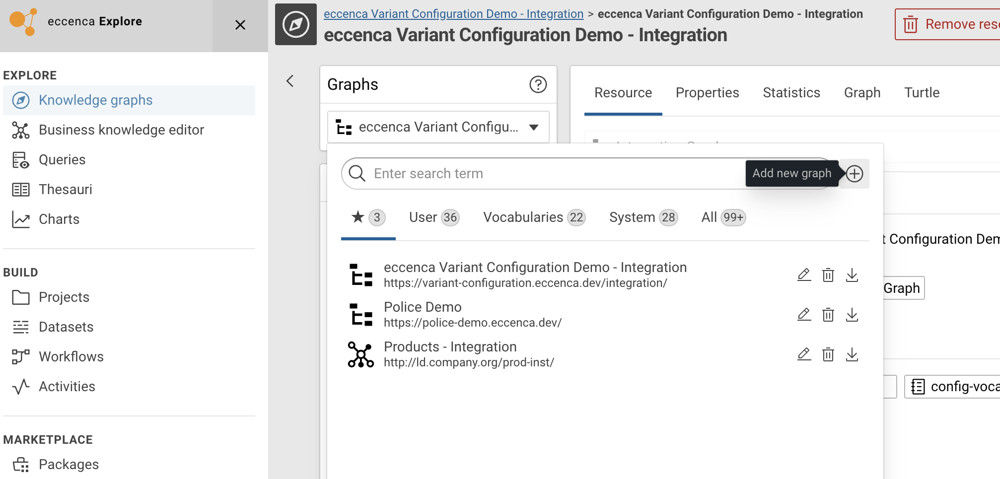{ class="bordered"}

        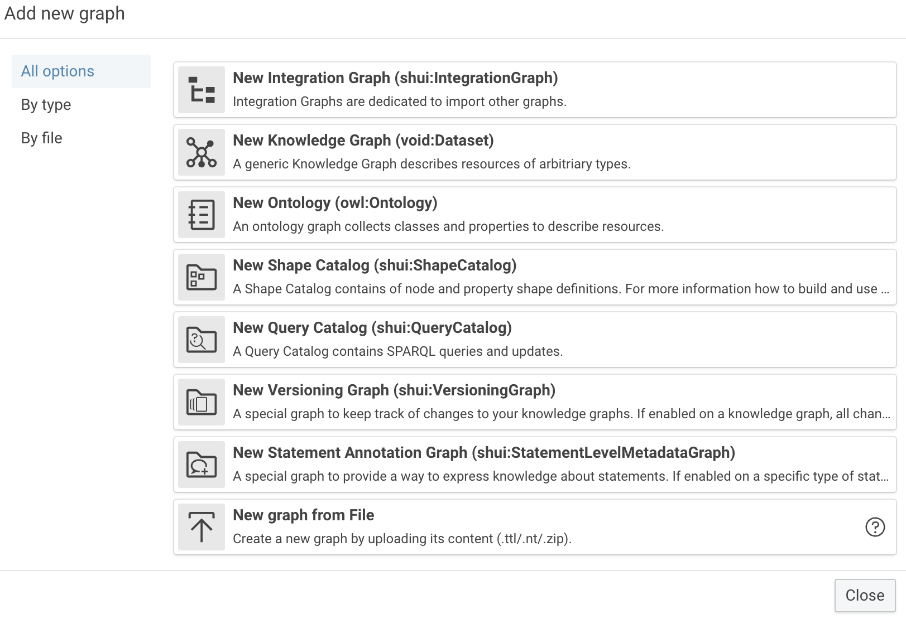{ class="bordered" width="70%"}

    2. In the next step, select the RDF file via **browse** or add it via drag-and-drop. Define the **Target graph URI** (should be populated automatically as `http://ld.company.org/prod-vocab/` as derived from the uploaded file) and confirm to add / replace this graph in the final dialog step. Tick the **Add new graph** checkbox and click **Upload**.

        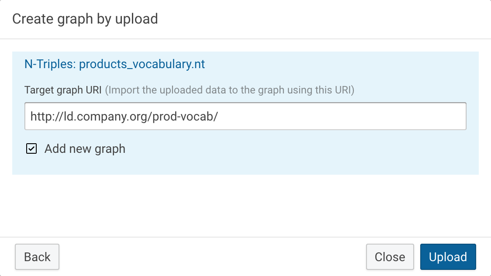{ class="bordered" width="70%"}

=== "cmemc"

    ``` shell-session
    cmemc vocabulary import products_vocabulary.nt
    ```

---

## 2 Uploading of the data (file)

1. Click the :eccenca-artefact-project: **Projects** icon in the main menu under the **BUILD** section.
    Then click on **Create new** :eccenca-item-add-artefact: in the top right corner to create a new project.

    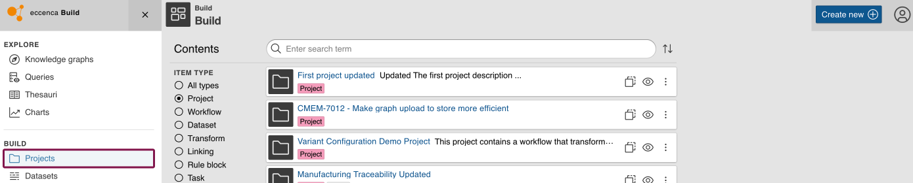{ class="bordered" }

2. In the **Create new item** window, select **Project** and click **Add**.
   The Create new item of type Project window appears.

    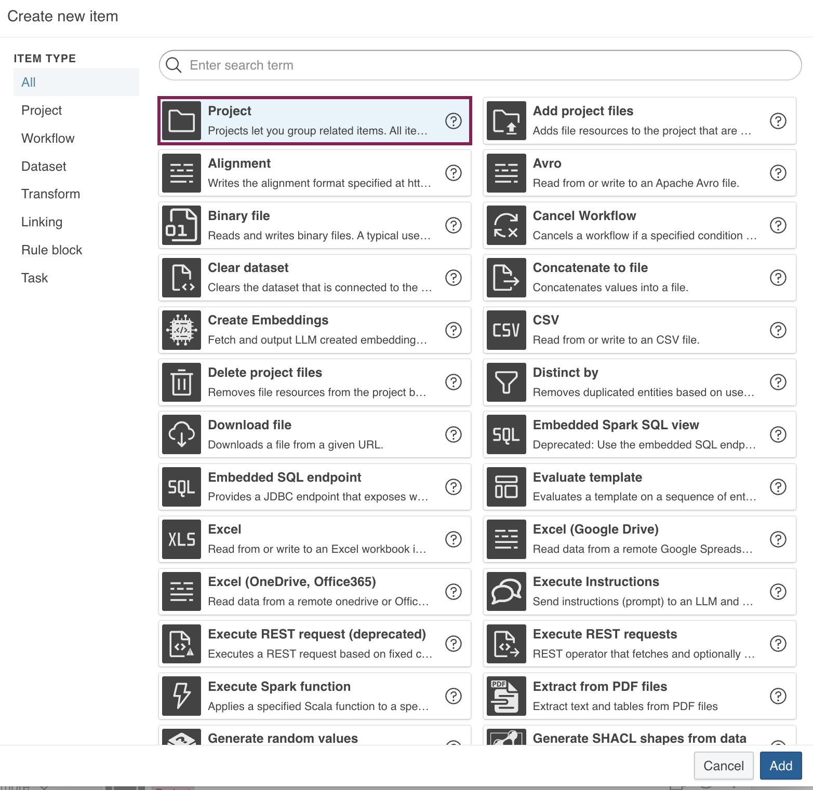{ class="bordered" width="50%" }

3. Fill in the required details such as Title and Description.
    In this example we will use:

    - Title: `Tutorial: Lift data from CSV tabular data`
    - Description: `This beginner-level tutorial shows how you can build a Knowledge Graph based on input data from a comma-separated value file (.csv). https://documentation.eccenca.com/latest/build/lift-data-from-tabular-data-such-as-csv-xslx-or-database-tables`

    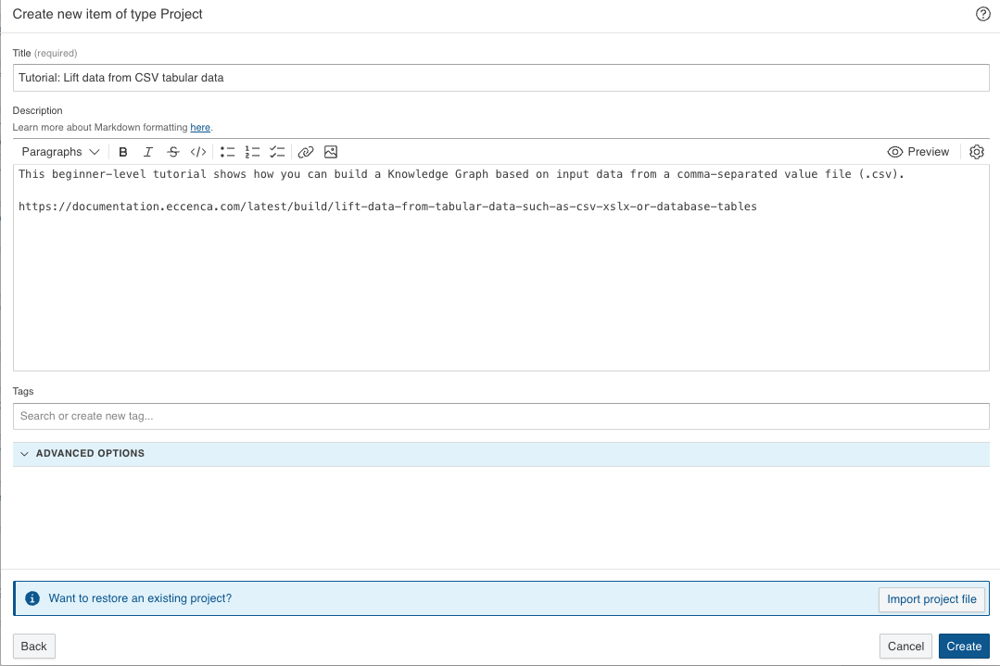{ class="bordered" width="70%" }

    Alternatively, import the existing project by clicking **Import Project File** and selecting the file from your system.  

4. Click **Create**. Your project is created.

---

=== "Workflow view"

    1. Within your project, click on  **Create workflow**.

        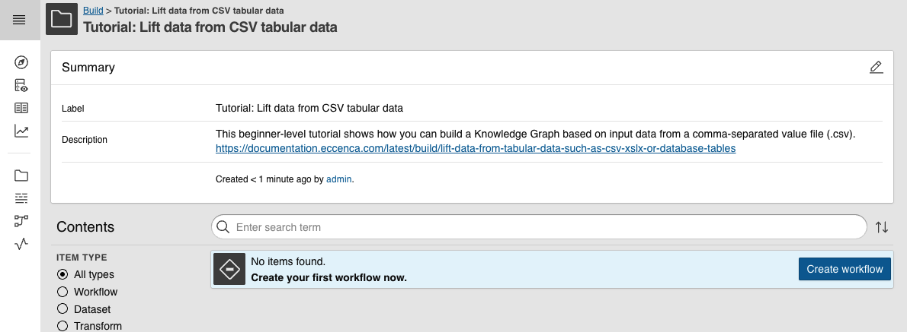{ class="bordered" }

    2. Fill out a label and click **Create**.

        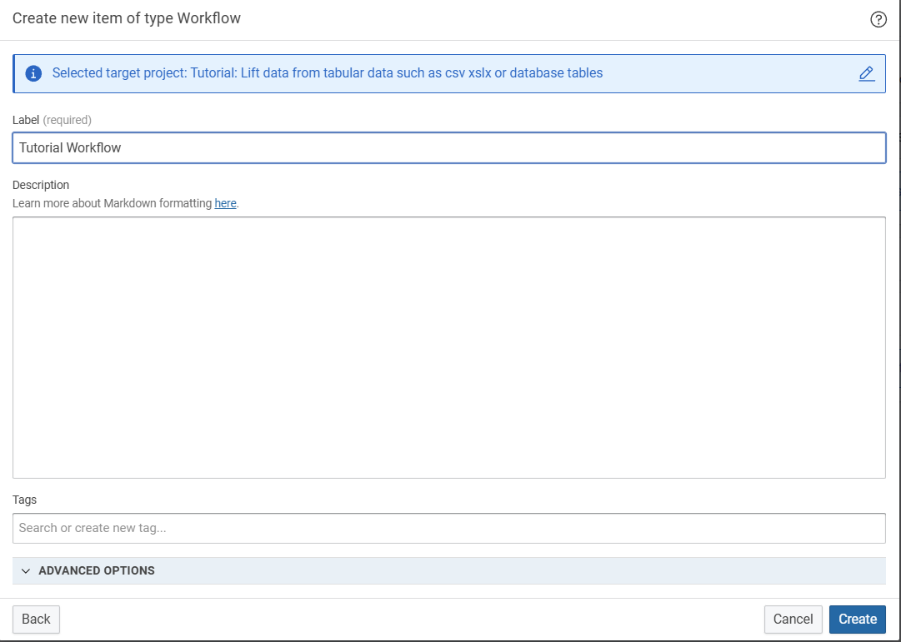{ class="bordered" width="50%" }

    3. Drag and drop the **[services.csv](services.csv) sample file** on the grid.

    4. Optionally change the Label, then click on **Create**.

        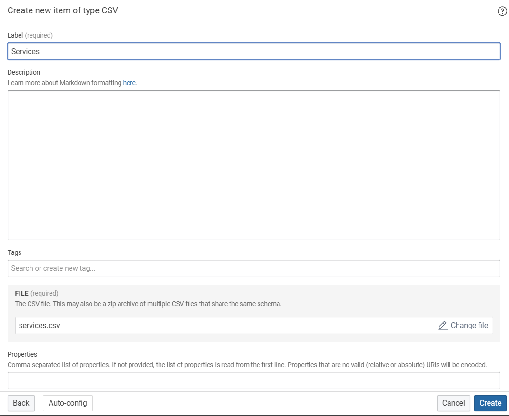{ class="bordered" width="50%" }

=== "cmemc"

    ``` shell-session
    $ cmemc project create tutorial-csv

    $ cmemc dataset create --project tutorial-csv services.csv
    ```

=== "JDBC"

    Instead of uploading the [services.csv](services.csv) sample file into Corporate Memory, you can also load it into a SQL database and access it from Corporate Memory using the JDBC protocol.

    1. Click again on **Create new** :eccenca-item-add-artefact: in the top right corner. In the **Create new item** window, select **JDBC endpoint** type and click **Add**.

        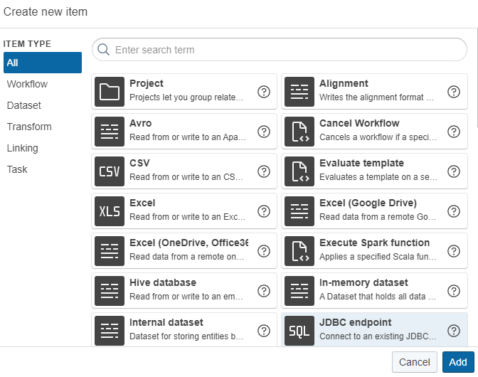{ class="bordered" width="50%" }

    2. Define a **Label** for the dataset, specify the **JDBC Driver connection URL**, the **table** name and the **user** and **password** to connect to the database.
    In this example we will use:

        - Name: `Services_ServiceDB`
        - JDBC Driver Connection URL: `jdbc:mysql://mysql:3306/ServicesDB`
        - table: `Services`
        - username: `root`
        - password: `***`

        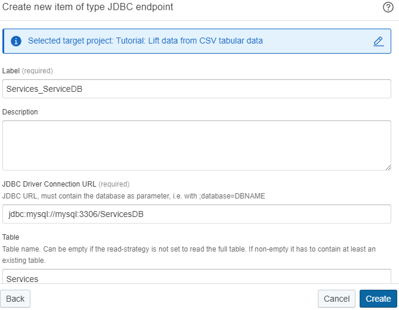{ class="bordered" width="50%" }

    3. Click **Create**.

        !!! info

            The general form of the JDBC connection string is:

            ```text
            jdbc:<vendor>://<hostname>:<portNumber>/<databaseName>
            ```

            Default JDBC connection strings for popular Relational Database Management Systems:

            | Vendor               | Default JDBC Connection String                  | Default Port |
            | -------------------- | ----------------------------------------------- | ------------ |
            | Microsoft SQL Server | jdbc:sqlserver:<hostname>:1433/<databaseName>   | 1433         |
            | PostgreSQL           | jdbc:postgresql:<hostname>:5432/<databaseName>  | 5432         |
            | MySQL                | jdbc:mysql:<hostname>:3306/<databaseName>       | 3306         |
            | MariaDB              | jdbc:mariadb:<hostname>:3306/<databaseName>     | 3306         |
            | IBM DB2*             | jdbc:db2:<hostname>:50000/<databaseName>        | 50000        |
            | Oracle*              | jdbc:oracle:thin:<hostname>:1521/<databaseName> | 1521         |

        !!! info

            \* IBM DB2 and Oracle JDBC drivers are not by default part of Corporate Memory, but can be added.

        !!! info

            Instead of selecting a table you can also specify a custom SQL query in the _source query_ field.

---

## 3 Creating the Transformation

The transformation defines how an input dataset (e.g. CSV) will be transformed into an output dataset (e.g. Knowledge Graph).

1. Click on the right dot and select **Connect to the newly created Transformation**.

    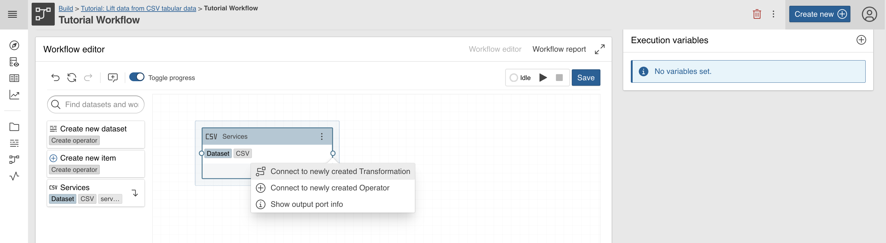{ class="bordered" }

2. Fill out the **Label** with `Lift Service Database`.

3. Scroll down to **Target vocabularies**, select **Select individual vocabularies** and choose `pv: Products-Vocab` in the drop-down list.


    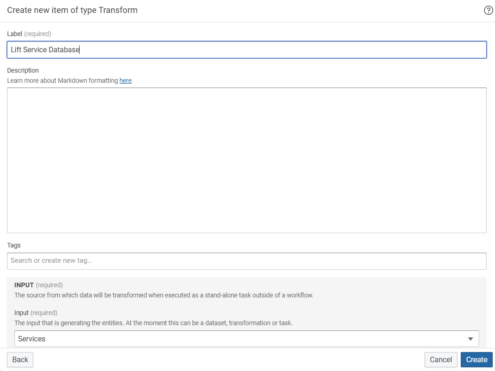{ class="bordered" width="50%" }

    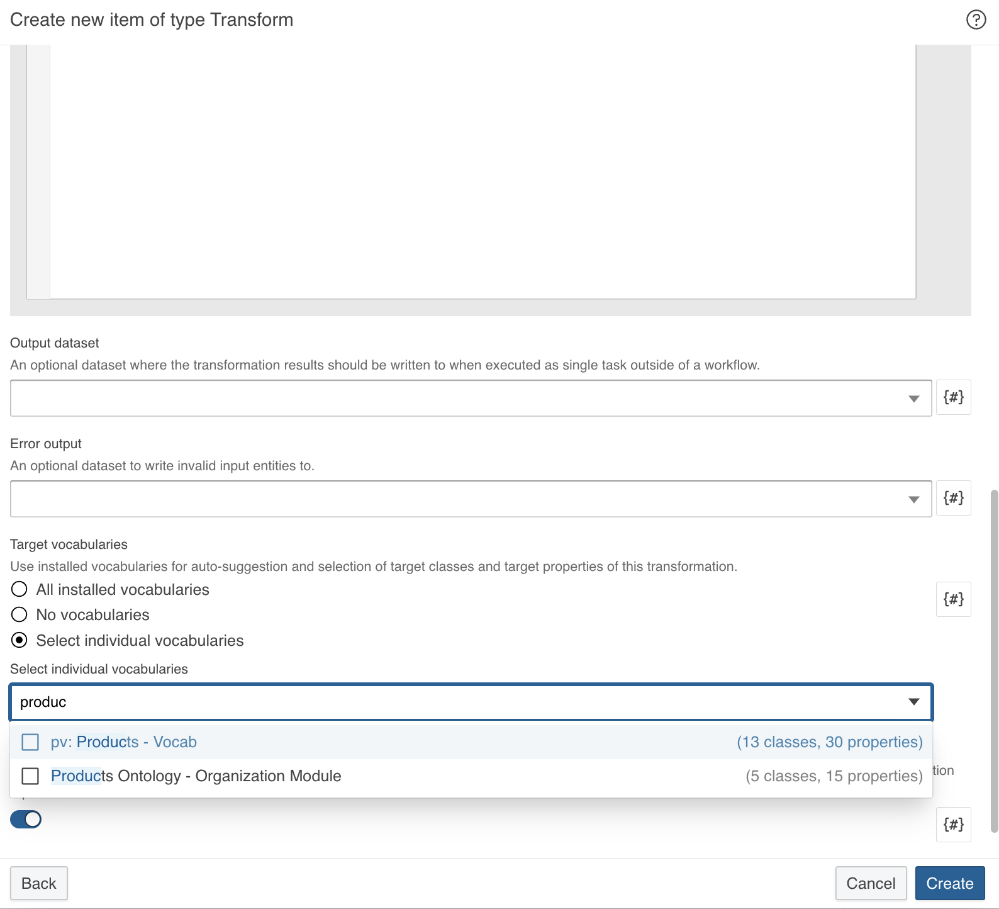{ class="bordered" width="50%" }

4. Click on **Create**.

---

## 4 Configure Mapping

1. Click on the 3 dots from the previous created Transformation an choose **Mapping Editor**.

    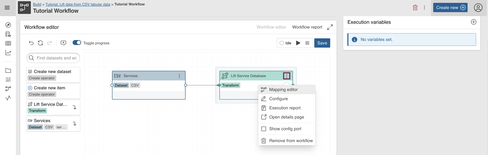{ class="bordered" }

2. Expand the :eccenca-artefact-project: **Mapping** menu with the small arrow in the top right corner.

    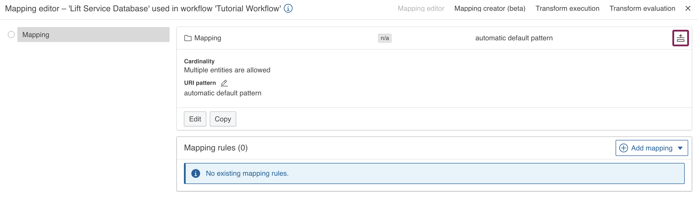{ class="bordered" width="70%" }

3. Click **Edit** to create a base mapping.

4. Define the **Target entity type** from the vocabulary, the **URI pattern** and a **label** for the mapping. After typing the **Target entity type** you must click the custom entry: `Service` suggestion. Typing alone leaves it unset. In this example we will use:

    - Target entity type: `Service`
    - URI pattern:

        - Click **Create custom pattern**
        - Insert `http://ld.company.org/prod-inst/{ServiceID}`, where `http://ld.company.org/prod-inst/` is a common prefix for the instances in this use case, and `{ServiceID}` is a placeholder that will resolve to the column of that name.

    - An optional Label: `Service`

    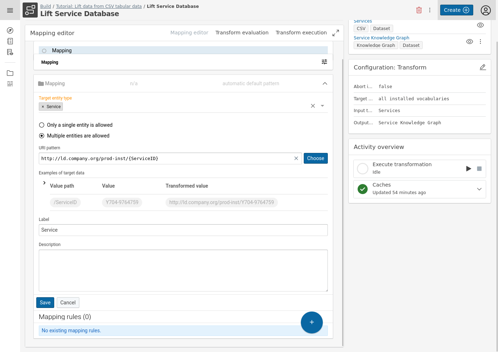{ class="bordered" width="50%" }

5. Click **Save**

_Example RDF triple in our Knowledge Graph based on the mapping definition:_

``` text
<http://ld.company.org/prod-inst/Y704-9764759> <http://www.w3.org/1999/02/22-rdf-syntax-ns#type> <http://ld.company.org/prod-vocab/Service>
```

6. Evaluate your mapping by clicking the :eccenca-toggler-showmore: button in the **Examples of target data** property to see at most three generated base URIs.

    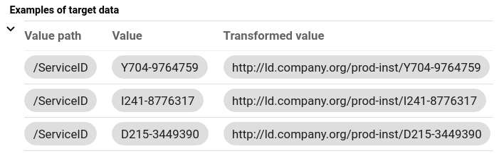{ class="bordered" width="50%" }

    We have now created the Service entities in the Knowledge Graph. As a next step, we will add the name of the Service entity.

7. Click :eccenca-item-add-artefact: **Add mapping** on the lower right and select **Add value mapping**.

    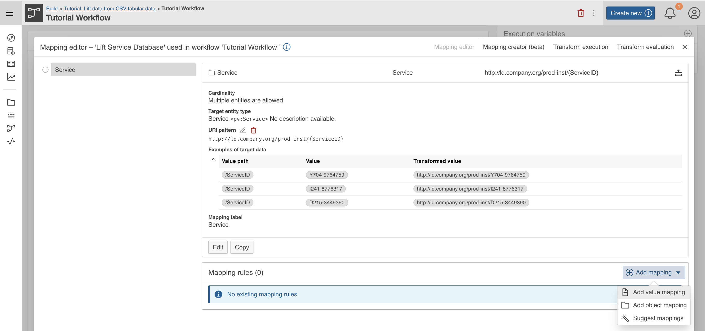{ class="bordered" }

8. Define the **Target property**, the **Data type**, the **Value path** (column name) and a **Label** for your value mapping. In this example we will use:

    - Target Property: `name`
    - Data type: `String`
    - Value path: `ServiceName` (which corresponds to the column of that name)
    - An optional Label: `service name`

    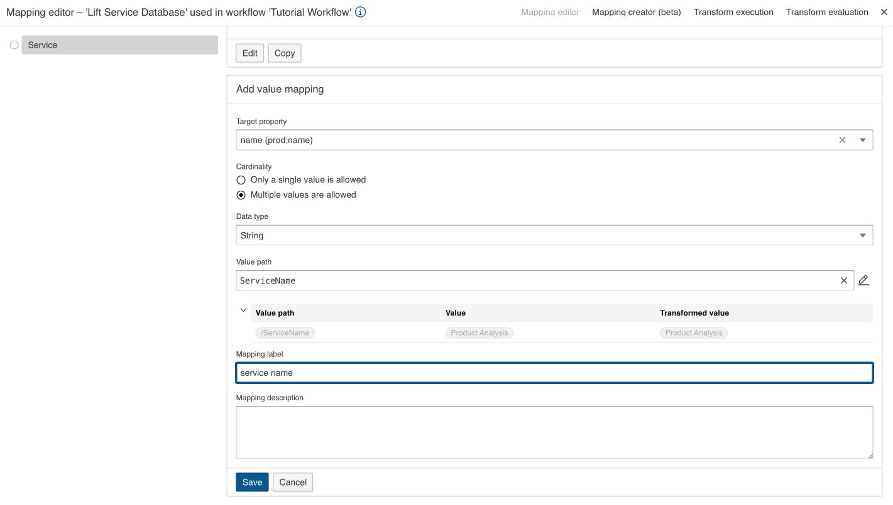{ class="bordered" width="50%" }

9. Click **Save**.

---

## 5 Evaluate a Transformation

Go to the **Transform evaluation** tab of your transformation to view a list of generated entities. By clicking one of the generated entities, more details are provided.

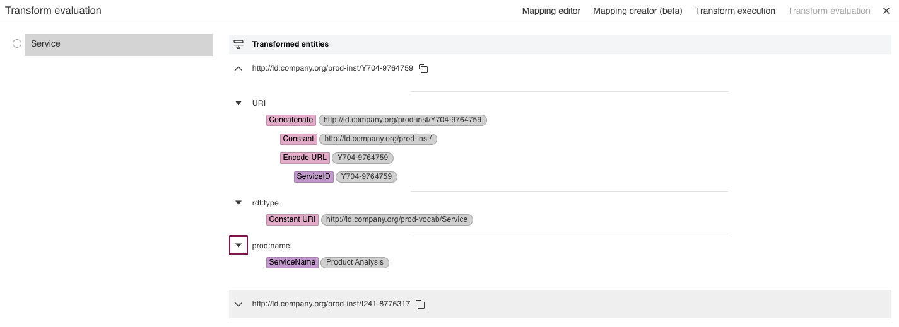{ class="bordered" width="70%" }

---

## 6 Build the Knowledge Graph

1. Switch back to the **Workflow view**.

2. Select the orange dot on the right side and click **Connect to newly created Knowledge graph**.

    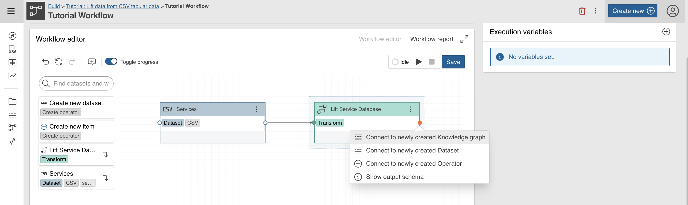{ class="bordered" }

3. Define a **Label** for the Knowledge Graph and provide a **Graph** URI. Leave all the other parameters at the default values. In this example we will use:

    - Label: `Service Knowledge Graph`
    - Graph: `http://ld.company.org/prod-instances/`

    After typing the Graph URI you must click the Custom entry: `Service Knowledge Graph` suggestion. Typing alone leaves it unset.

    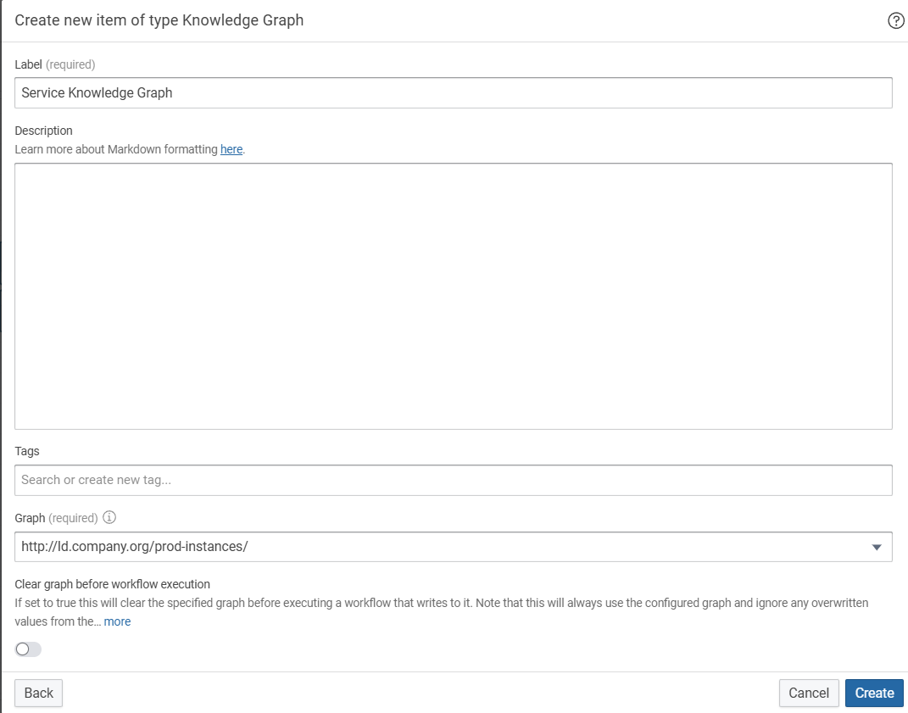{ class="bordered" width="50%" }

4. Click **Create**.

5. Press the :material-play: button and click on **Save and run workflow**.

6. Verify a successful run by selecting **Workflow report**.

    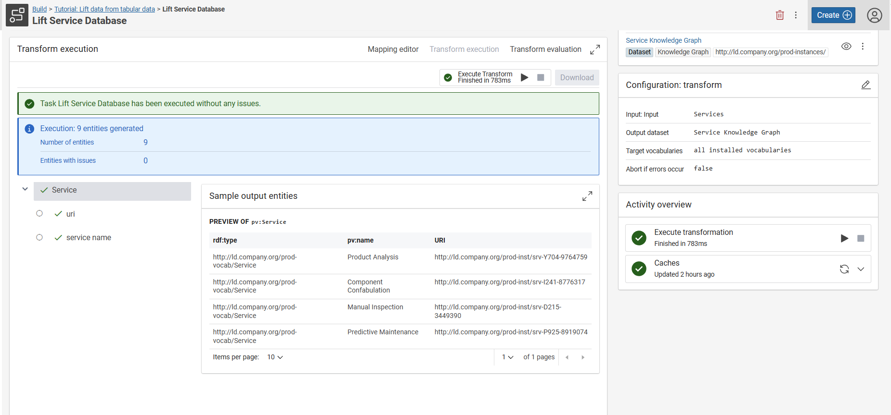{ class="bordered" width="70%" }

7. Click the :eccenca-application-explore: **Knowledge graphs** icon in the main menu under **EXPLORE**.

    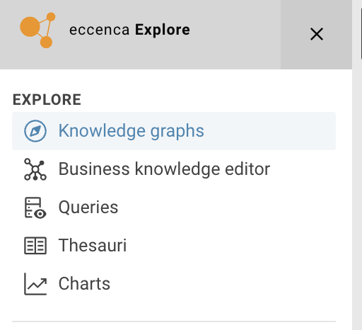{ class="bordered" width="50%" }

8. Optionally, you can click on the Settings Icon and add more columns to the view.

    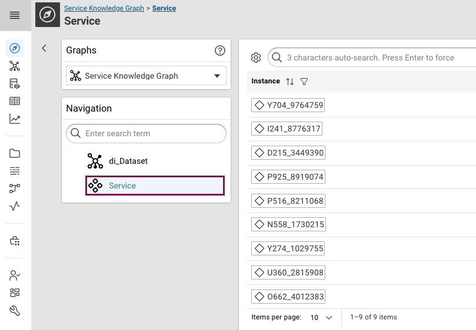{ class="bordered" width="50%" }

9. Here you can add `name` for example.

    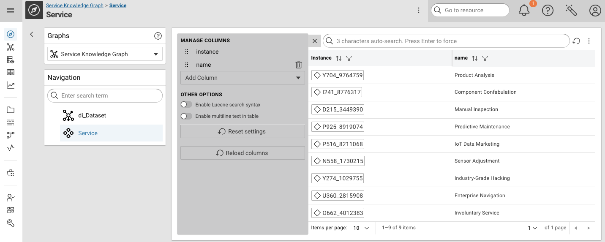{ class="bordered" }

10. Finally you can use the Explore **Knowledge Graphs** module to (re-)view of the created Knowledge Graph: `http://ld.company.org/prod-instances/`

    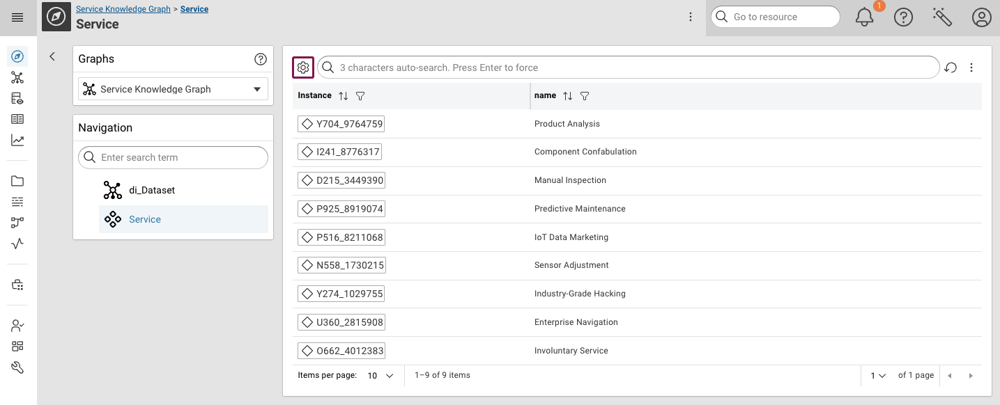{ class="bordered" }
