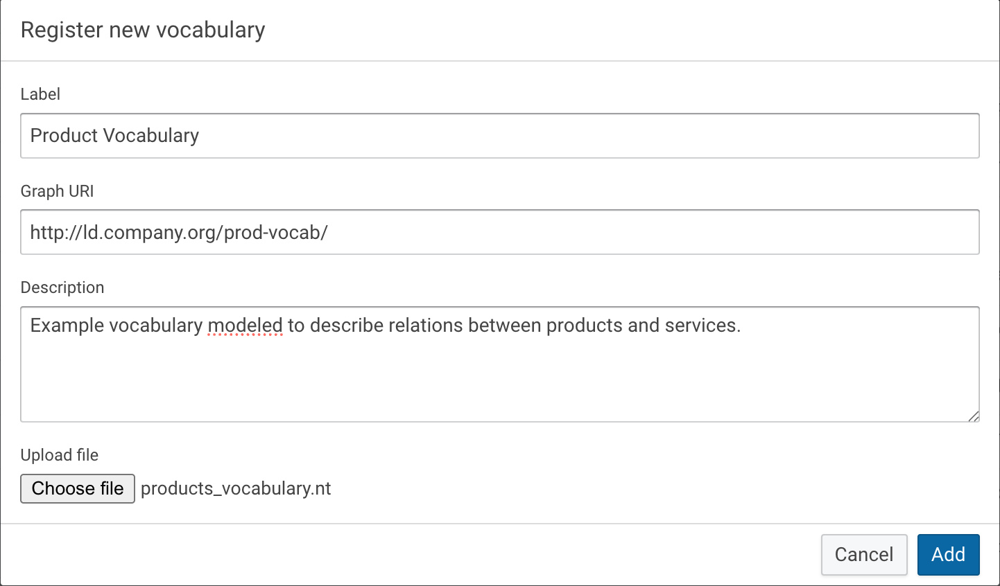
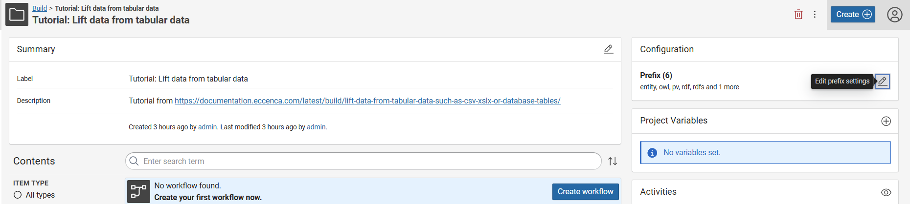
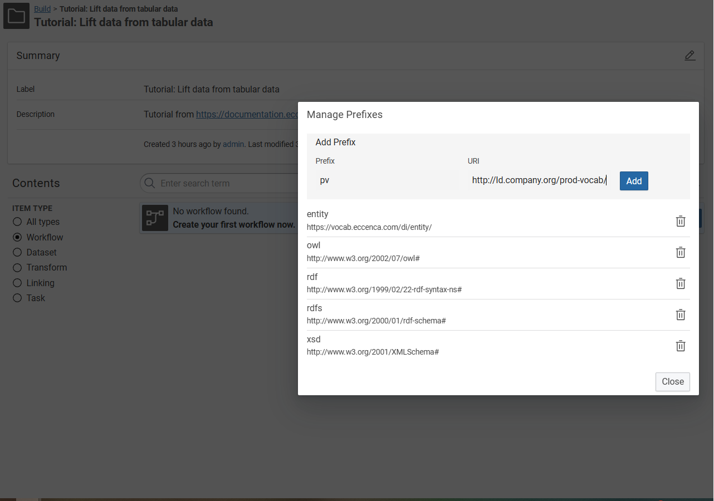
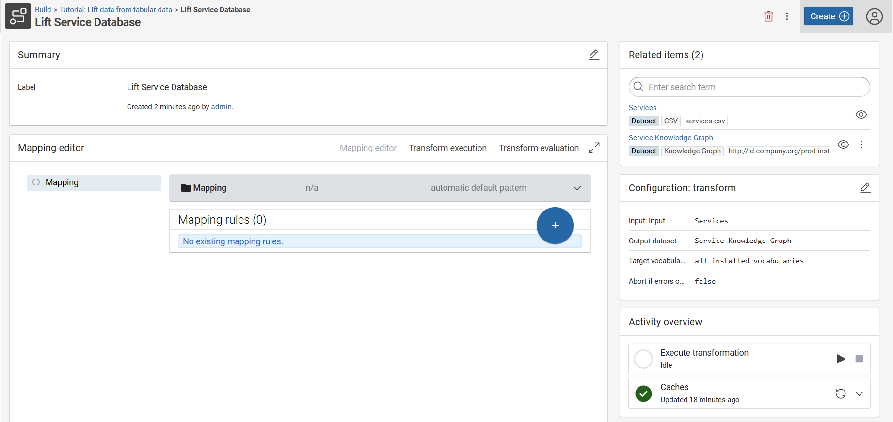
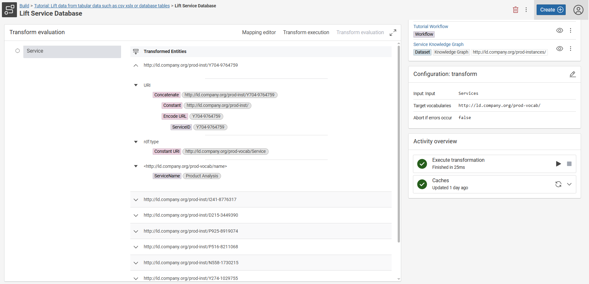
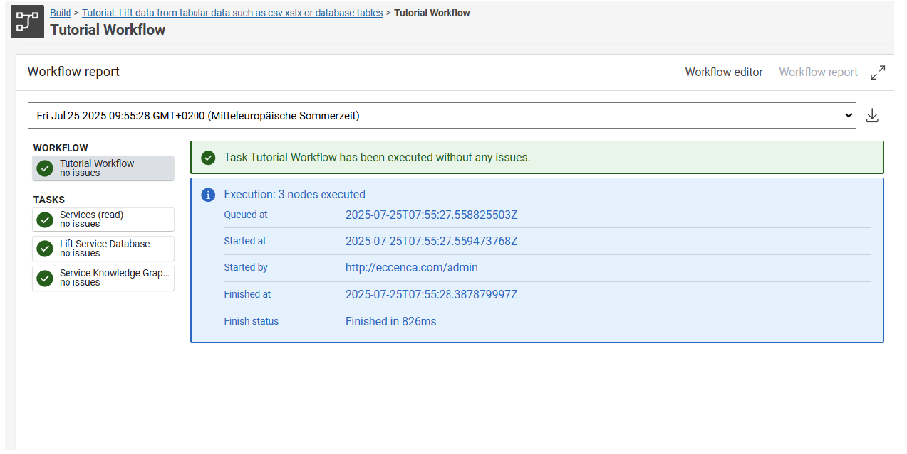
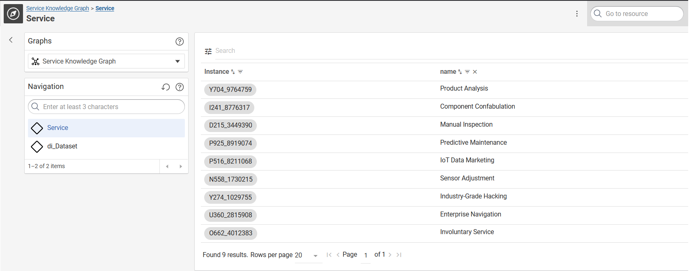

# Lift data from tabular data such as CSV, XSLX or database tables

## Introduction

This beginner-level tutorial shows how you can build a Knowledge Graph based on input data from a **comma-separated value file** (.csv), an **excel file** (.xlsx) or a **database table** (jdbc).

!!! Abstract

    The complete tutorial is available as a [project file](tutorial-csv.project.zip). You can import this project

    - by using the [web interface](../../build/introduction-to-the-user-interface/index.md) (Create → Project → Import project file) or
    - by using the [command line interface](../../automate/cmemc-command-line-interface/index.md)

    ``` shell-session
    $ cmemc -c my-cmem project import tutorial-csv.project.zip tutorial-csv
    ```

    This step is optional and makes some of the following steps of the tutorial superfluous.

The documentation consists of the following steps, which are described in detail below:

1. Registration of the target vocabulary
2. Uploading of the data (file)/Connect to JDBC endpoint
3. (Re-)View your data table
4. Creation of a (target) graph
5. Creation of the transformation rules
6. Evaluation of the results of the transformation rules
7. Execution of the transformation to populate the target graph

## Sample Material

The following material is used in this tutorial, you should download the files and have them at hand throughout the tutorial:

-   Sample vocabulary which describes the data in the CSV files: [products_vocabulary.nt](products_vocabulary.nt)

    { class="bordered" }

-   Sample CSV file: [services.csv](services.csv)

    !!! info

        | ServiceID    | ServiceName             | Products                                      | ProductManager             | Price       |
        | ------------ | ----------------------- | --------------------------------------------- | -------------------------- | ----------- |
        | Y704-9764759 | Product Analysis        | O491-3823912, I965-1821441, Z655-3173353, ... | Lambert.Faust@company.org  | 748,40 EUR  |
        | I241-8776317 | Component Confabulation | Z249-1364492, L557-1467804, C721-7900144, ... | Corinna.Ludwig@company.org | 1082,00 EUR |
        | …            | …                       | …                                             | …                          | …           |

-   Sample Excel file: [products.xlsx](products.xlsx)

    !!! info

        | ProductID    | ProductName        | Height | Width | Depth | Weigth | ProductManager              | Price    |
        | ------------ | ------------------ | ------ | ----- | ----- | ------ | --------------------------- | -------- |
        | I241-8776317 | Strain Compensator | 12     | 68    | 15    | 8      | Baldwin.Dirksen@company.org | 0,50 EUR |
        | D215-3449390 | Gauge Crystal      | 77     | 58    | 19    | 15     | Wanja.Hoffmann@company.org  | 2,00 EUR |
        | …            | …                  | …      | …     | …     | …      | …                           | …        |

---

## 1 Register the vocabulary

The vocabulary contains the classes and properties needed to map the data into the new structure in the Knowledge Graph.

=== "Corporate Memory"

    1. In Corporate Memory, click Vocabularies under **EXPLORE** in the navigation on the left side of the page.

        { class="bordered" width="30%" }

    2. Click **Register new vocabulary** on the top right.

        { class="bordered" }

    3. Define a **Name**, a **Graph URI** and a **Description** of the vocabulary. _In this example we will use:_

        - Name: _**Product Vocabulary**_
        - Graph URI: _**<http://ld.company.org/prod-vocab/>**_
        - Description: _**Example vocabulary modeled to describe relations between products and services.**_
        - Vocabulary File: Browse in your filesystem for the **[products_vocabulary.nt](products_vocabulary.nt)** file and select it to be uploaded.

        { class="bordered" width="50%" }

=== "cmemc"

    ``` shell-session
    $ cmemc vocabulary import products_vocabulary.nt
    ```

---

## 2 Upload the data file / Connect to the JDBC endpoint

=== "CSV + XLSX"

    1. In Corporate Memory, click Projects under **BUILD** in the navigation on the left side of the page.

        { class="bordered" width="30%" }

    2. Click **Create** at the top of the page. 

    3. In **Create new item** window, select **Project** and click **Add**. The Create new item of type Project window appears.  

    4. Fill in the required details such as Title and Description. Alternatively, import the existing project by clicking **Import Project File** and selecting the file from your system.  

    5. Click **Create**. Your project is created.

    6. Optionally, click **Edit** within your project

        { class="bordered" }

    7. Add a prefix and a URI

        - Prefix: _**pv**_
        - URI: _**<http://ld.company.org/prod-vocab/>**_

        { class="bordered" }

    8. Click **Create** or **Create item**.

    9. In the **Create new item** dialog, select **CSV**.

        { class="bordered" }

    10. Fill out a label and upload the **[services.csv](services.csv) sample file**.

        { class="bordered" }

    11.  Click **Create**.** Leave all other parameters at their default values.

    12. Create a second **dataset**. Choose **Excel** and upload the [products.xlsx](products.xlsx) file.

=== "JDBC"

    Instead of uploading the [services.csv](services.csv) sample file into Corporate Memory, you can also load it into a SQL database and access it from Corporate Memory using the JDBC protocol.

    1. In the project, Click **Create** and select the **JDBC endpoint** type.

        { class="bordered" }

    2. Define a **Label** for the dataset, specify the **JDBC Driver connection URL**, the **table** name and the **user** and **password** to connect to the database. _In this example we will use:_

        - Name: _**Services_ServiceDB**_
        - JDBC Driver Connection URL: _**jdbc:mysql://mysql:3306/ServicesDB**_
        - table: _**Services**_
        - username: _**root**_
        - password: _**\*\*\*\***_

        { class="bordered" }

        The general form of the JDBC connection string is:

        ```
        jdbc:<vendor>://<hostname>:<portNumber>/<databaseName>
        ```

        Default JDBC connection strings for popular Relational Database Management Systems:

        | Vendor               | Default JDBC Connection String                  | Default Port |
        | -------------------- | ----------------------------------------------- | ------------ |
        | Microsoft SQL Server | jdbc:sqlserver:<hostname>:1433/<databaseName>   | 1433         |
        | PostgreSQL           | jdbc:postgresql:<hostname>:5432/<databaseName>  | 5432         |
        | MySQL                | jdbc:mysql:<hostname>:3306/<databaseName>       | 3306         |
        | MariaDB              | jdbc:mariadb:<hostname>:3306/<databaseName>     | 3306         |
        | IBM DB2*             | jdbc:db2:<hostname>:50000/<databaseName>        | 50000        |
        | Oracle*              | jdbc:oracle:thin:<hostname>:1521/<databaseName> | 1521         |

        !!! info

            \* IBM DB2 and Oracle JDBC drivers are not by default part of Corporate Memory, but can be added.

        !!! info

            Instead of selecting a table you can also specify a custom SQL query in the _source query_ field.

=== "cmemc"

    ``` shell-session
    $ cmemc project create tutorial-csv

    $ cmemc dataset create --project tutorial-csv services.csv

    $ cmemc dataset create --project tutorial-csv products.xlsx
    ```

---

## 3 (Re-)View your Data Table

To validate that the input data is correct, you can preview the data table in Corporate Memory.

1. On the dataset page, press the **Load preview** button

    { class="bordered" }

2. Once the preview is loaded, you can view a couple of rows to check that your data is accessible.

    { class="bordered" }

3. Optionally, you can click **start profiling** and explore statistics about the dataset.

    { class="bordered" }

---

## 4 Create a Knowledge Graph

1. Click Create at the top of the page.

2. In Create new item window, select Knowledge Graph and click Add.

    { class="bordered" }

3. The Create new item of type Knowledge Graph window appears.

4. Define a **Label** for the Knowledge Graph and provide a **graph** uri. Leave all the other parameters at the default values. _In this example we will use:_

    -   Label: _**Service Knowledge Graph**_
    -   Graph: _**<http://ld.company.org/prod-instances/>**_

5. Click **Create**.

---

## 5 Create a Transformation

The transformation defines how an input dataset (e.g. CSV) will be transformed into an output dataset (e.g. Knowledge Graph).

1. Click **Create** in your project.  

2. On the **Create New Item** window, select **Transform** and click **Add** to create a new transformation.

3. Fill out the the details leaving the **target vocabularies** field at its default value **all installed vocabularies,** which will enable us to create a transformation to the previously installed products vocabulary. _In this example we will use:_

    -   Name: _**Lift Service Database**_
    -   _In the section **INPUT TASK** in the field **Dataset**, select the previously created dataset: **Services** (Input Dataset)._
    -   _Select the previously created dataset as the Output Dataset: **Service Knowledge Graph**_

4. In the main area you will find the **Mapping editor**.

    { class="bordered" }

5. Click **Mapping** in the main area to expand its menu.

    { class="bordered" }

6. Click **Edit** to create a base mapping.

    { class="bordered" }

7. Define the **Target entity type** from the vocabulary, the **URI pattern** and a **label** for the mapping. _In this example we will use:_

    -   Target entity type: _**Service**_
    -   URI pattern:

        -   Click **Create custom pattern**
        -   Insert _**<http://ld.company.org/prod-inst/{ServiceID}>**_
        -   where _<http://ld.company.org/prod-inst/>_ is a common prefix for the instances in this use case,
        -   and _{ServiceID}_ is a placeholder that will resolve to the column of that name

    -   _An optional Label: **Service**_

    { class="bordered" }

8. Click **Save** _Example RDF triple in our Knowledge Graph based on the mapping definition:_

    ```nt
    <http://ld.company.org/prod-inst/Y704-9764759> <http://www.w3.org/1999/02/22-rdf-syntax-ns#type> <http://ld.company.org/prod-vocab/Service>
    ```

9. Evaluate your mapping by clicking the Expand  button in the **Examples of target data** property to see at most three generated base URIs.

    { class="bordered" }

    We have now created the Service entities in the Knowledge Graph. As a next step, we will add the name of the Service entity.

10. Press the circular **Blue + button** on the lower right and select **Add value mapping**.

    { class="bordered" }

11. Define the **Target property**, the **Data type**, the **Value path** (column name) and a **Label** for your value mapping. _In this example we will use:_

    -   Target Property: **_name_**
    -   Data type: _**String**_
    -   Value path: _**ServiceName**_ (which corresponds to the column of that name)
    -   An optional Label: _**service name**_

    { class="bordered" }

12. Click **Save.**

---

## 6 Evaluate a Transformation

Go the **Transform evaluation** tab of your transformation to view a list of generated entities. By clicking one of the generated entities, more details are provided.

{ class="bordered" }

---

## 7 Build the Knowledge Graph

1. Go into the mapping and visit the **Transform execution** tab.

    { class="bordered" }

2. Press the  button and validate the results. In this example, 9x Service triples were created in our Knowledge Graph based on the mapping.

    { class="bordered" }

3. Finally you can use the Explore **Knowledge Graphs** module to (re-)view of the created Knowledge Graph: <http://ld.company.org/prod-instances/>

    { class="bordered" }
