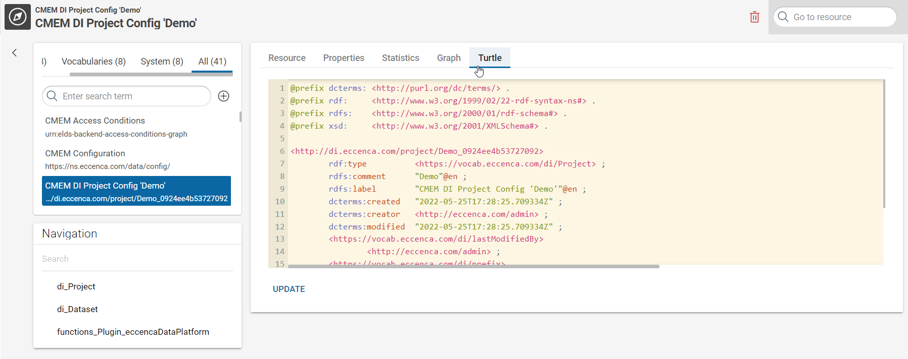

# Loading JDBC datasets incrementally

## Introduction

This tutorial walks you through the process of loading data incrementally from a JDBC Dataset (relational database table) into a Knowledge Graph.

!!! Abstract

    The complete tutorial is available as a [project file](tutorial-jdbc.project.zip). You can import this project:

    - by using the [web interface](/build/introduction-to-the-user-interface) (Create → Project → Import project file) or
    - by using the [command line interface](/automate/cmemc-command-line-interface)

    ```shell
    cmemc -c my-cmem project import tutorial-webapi.project.zip web-api
    ```

!!! info "Example SQL query for selecting a predefined range of rows"

    We use the `LIMIT` and  `OFFSET` clauses in SQL to retrieve only a portion of rows. This prevents loading all data at once from a table, SQL Query with OFFSET AND LIMIT:

    ```sql
    SELECT * FROM services OFFSET 0 LIMIT 5
    ```

    This query retrieves the first 5 rows of a table named "services". If the OFFSET is changed to 5, it will retrieve the next 5 rows.

## 1 Create the JDBC dataset

To extract data from a relational database, you need to first register a **JDBC endpoint** in Corporate Memory. This tutorial assumes that you have access to the relational database from the Corporate Memory instance.

1. In Corporate Memory, click Projects under **BUILD** in the navigation on the left side of the page.

    

2. Click **Create** at the top of the page.
3. In the Create new item window, select Project and click Add. The Create new item of type Project window appears.
4. In the Create new item window, select Dataset under **Item Type**, search for JDBC endpoint, and click **Add**.

    

5. Provide the required configuration details for the JDBC endpoint:
    -   **Label**: Provide a table name.
    -   **Description:** Optionally describe your table.
    -   **JDBC Driver Connection URL:** Provide the JDBC connection. In this tutorial we use a MySQL database. The database server is named _mysql_ and the database is named _serviceDB_.
    -   **Table:** Provide the name of the table in the database.
    -   **Source query**: Provide a default source query. In this tutorial, the source query will be modified later as the OFFSET changes.
    -   **Limit:** Provide a LIMIT for the SQL query. In this tutorial, we choose 5 for demonstrating the functionality. You may select any value which works for your use case.
    -   **Query strategy**: Select: _Execute the given source query. No paging or virtual Query._ In this tutorial, this needs to be changed so that when this JDBC endpoint is being used, Corporate Memory will always check for the _Source Query_ that was provided earlier.
    -   **User**: Provide the user name which is allowed to access the database.
    -   **Password**: Provide the user password that is allowed to access the database.


## 2 Create a Metadata Graph

To incrementally extract data in Corporate Memory, we need to store the information about the OFFSET that will change with each extraction. To accomplish this, we need to define a new Graph named _Services Metadata Graph_ that will hold this information. To identify the changing OFFSET with the JDBC endpoint we previously created, we will use the Graph IRI that Corporate Memory created for us.

### To find the JDBC endpoint IRI

1. Visit the **Exploration** Tab of Corporate Memory
2. Select in Graph (top left) your project, which starts with "**CMEM DI Project** ... " (if you cannot see it, you might not have the necessary access rights. In this case, please contact your administrator)
3. Select in Navigation (bottom left): **functions_Plugins_Jdbc**
4. Select the previously created JDBC endpoint (in our example: "Services Table (JDBC)"
5. Press the **Turtle** tab inside your JDBC endpoint view (right)

In our example, the JDBC Endpoint IRI looks like this: _<http://dataintegration.eccenca.com/00e0ed25-e76b-42f2-a37d-22b773431210>_IncrementalJDBCdatasetload/8d0e4895-1d45-442f-8fd8-b1459ec3dbde_ServicesTableJDBC_

See screenshot below for example:



Now that we have the JDBC endpoint IRI, we will build the Metadata Graph to store the OFFSET information.

The following three RDF triples hold the (minimal) necessary information we need for this tutorial:

1. The first triple imports the CMEM DI Project graph into our Metadata Graph to enable access to the LIMIT property defined earlier and to additional information we may need in the future.
2. The second triple defines a label for the Graph.
3. The third triple defines the <...**lastOffset**> property we need for this tutorial. As a default, we set it to 0 to start with the first row in the table.

**services_metadata_graph**

```nt
<http://di.eccenca.com/project/services/metadata>
    <http://www.w3.org/2002/07/owl#imports>
         <http://di.eccenca.com/project/00e0ed25-e76b-42f2-a37d-22b773431210_IncrementalJDBCdatasetload> . # import the original project
<http://di.eccenca.com/project/services/metadata>
    <http://www.w3.org/2000/01/rdf-schema#label>
        "Services Metadata"@en . # provide the graph with a label
<http://dataintegration.eccenca.com/00e0ed25-e76b-42f2-a37d-22b773431210_IncrementalJDBCdatasetload/8d0e4895-1d45-442f-8fd8-b1459ec3dbde_ServicesTableJDBC>
     <https://vocab.eccenca.com/di/functions/param_Jdbc_lastOffset>
    "0" . # set the initial offset to zero to start with the first row in the table
```

For your project, please:

1. adjust the CMEM DI Project IRI and
2. the JDBC endpoint IRI.

**Import the Graph** in the Exploration tab → Graph (menu) → Add new Graph → Provide Graph IRI + Select file

In our example, we used the following Graph IRI for the Metadata Graph: _<http://di.eccenca.com/project/services/metadata>_

## 3 Create a Transformation to dynamically compose a SQL Query

To extract rows based on the predefined (changing) OFFSET and LIMIT from a table, we need to create a Transformation to compose the SQL with each execution.

1. Click **Create** (top right) in the data integration workspace and select the type **Transformation**.
    1. Provide a **Label**.
    2. Provide **Description** (Optional).
    3. Select the _Services Metadata Graph_ we previously created.

    

2. Create only a value mapping with the property **sourceQuery**. The sourceQuery will be used as an input for the JDBC endpoint. A root mapping does not need to be defined. In this screenshot everything is already configured while yours will be empty when you create it for the first time.

    

3. Press the circular pen button to jump into the advanced mapping editor. As source paths we select the data from our Metadata Graph: **table**, **lastOffset** and **limit**. Everything else is defined as a constant as it does not change in the query. For our source paths we defined a "di" prefix. In case this defintion is missing, your source path may look longer (full IRI).

    

## 4 Create a Transformation to update the SQL Offset

Each time we execute the transformation, we want to forward the OFFSET in our SQL Query to extract the next rows. As an example, we have a start OFFSET of 0 and LIMIT of 5. After one execution we want to have an OFFSET of 5, after another execution an OFFSET of 10 and so on. In this tutorial, we assume that the table contains an ID column which incrementally increases by 1 in each row.

To store the updated OFFSET, we update the triple with a SPARQL Update query:

1. Press the **Create** button (top right) in the data integration workspace and select the type **Transformation**
    1. Provide a **Label**
    2. Provide a **Description** (optional)
    3. Paste the query into the **SPARQL update query** form.
        1. The following IRIs need to be adapted for your use cases:
            1. Service Metadata Graph
            2. JDBC endpoint `jdbc_table_data_config`
            3. Knowledge Graph `http://ld.company.org/services/`

This query will look for the last max service ID found in the Knowledge Graph and update the OFFSET information in the Metadata Graph.

### Last Offset

```sparql
PREFIX service_metadata_graph: <http://di.eccenca.com/project/services/metadata>
PREFIX jdbc_table_dataset_config: <http://dataintegration.eccenca.com/00e0ed25-e76b-42f2-a37d-22b773431210_IncrementalJDBCdatasetload/8d0e4895-1d45-442f-8fd8-b1459ec3dbde_ServicesTableJDBC>
PREFIX func: <https://vocab.eccenca.com/di/functions/param_Jdbc_>
PREFIX prod: <http://ld.company.org/prod-vocab/>

WITH service_metadata_graph:
DELETE { jdbc_table_dataset_config: func:lastOffset ?lastOffset .}
INSERT { jdbc_table_dataset_config: func:lastOffset ?newOffset . }
WHERE {
  {
    SELECT ?lastOffset
    WHERE {
      GRAPH service_metadata_graph: {
        jdbc_table_dataset_config: func:lastOffset ?lastOffset
      }
    }
  }
  {
   SELECT (max(?id) as ?newOffset)
    WHERE{
      GRAPH <http://ld.company.org/services/> {
        ?services a prod:Service .
        ?services prod:id ?id .
      }
    }
  }
}
```

Finally, we can build a Workflow which demonstrates how each step works.

We compose the SQL query based on the OFFSET and LIMIT information in our Metadata Graph. This SQL query will be used to configure the sourceQuery of the JDBC endpoint. Next, we do a "regular" transformation of data from a JDBC endpoint to RDF. As this step was omitted here, please feel free to read how this Transformation can be built here: [Lift data from tabular data such as CSV, XSLX or database tables](/build/lift-data-from-tabular-data-such-as-csv-xslx-or-database-tables). As a final step, we use our SPARQL update query to select the max service ID in our Knowledge Graph and update the RDF Triples in our Metadata Graph accordingly.


