# Build a mapping with the Mapping Creator

## Introduction

This beginner-level tutorial builds a Knowledge Graph from a hierarchical XML file with the Mapping Creator of eccenca Corporate Memory.

The Mapping Creator connects a source schema to a target schema visually.
Instead of adding one mapping rule after another, the target schema is assembled from classes and properties of a vocabulary, and the source elements are connected to it by drag-and-drop or by AI-generated suggestions.

Along the way the tutorial uses the features of the editor:
adding classes and properties from a vocabulary, direct mappings by drag-and-drop, AI suggestions with their reasons, nested entities, the direction and the role of a property, focus mode, and the editor for a saved mapping rule.
[Mapping Creator](../mapping-creator/index.md) describes the same features as a reference.

The result is a Knowledge Graph of departments, their managers, their employees, and the products a department is responsible for.

!!! info "Configuration"

    The Mapping Creator must be activated, and the suggestion features need a configured Large Language Model.
    See [Mapping Creator and LLM Configuration](../../deploy-and-configure/configuration/dataintegration/index.md#mapping-creator-and-llm-configuration).

!!! Tutorial Package

    The material of this tutorial is part of a Marketplace Package.
    Install this package

    - by using the web interface (:eccenca-module-marketplace: **Packages** → Search → "Product Data Demo") or
    - by using the [command line interface](../../automate/cmemc-command-line-interface/index.md)

        ``` shell-session
        cmemc -c my-cmem package install ecc-product-data-project
        ```

## Sample material

The following material is used in this tutorial.
Download both files and keep them at hand.

- Vocabulary which describes the target structure of the Knowledge Graph: [products_vocabulary.nt](products_vocabulary.nt)

    { class="bordered" }

- Source file with the organizational structure of a company: [orgmap.xml](orgmap.xml)

    !!! info

        The file contains six departments.
        Each department carries an `id` and a `name`, one `manager`, a list of `employee` elements, and lists of `product` and `service` references:

        ``` xml
        <orgmap>
            <dept id="73191" name="Engineering">
                <manager>
                    <email>Thomas.Mueller@company.org</email>
                    <name>Thomas Mueller</name>
                    <address>Karl-Liebknecht-Straße 885, 82003 Tettnang</address>
                    <phone>+49-8200-38218301</phone>
                </manager>
                <employees>
                    <employee>
                        <email>Corinna.Ludwig@company.org</email>
                        <name>Corinna Ludwig</name>
                        <address>Ringstraße 276</address>
                        <phone>+49-1743-24836762</phone>
                        <productExpert>Memristor, Gauge, Encoder</productExpert>
                    </employee>
                    …
                </employees>
                <products>
                    <product id="Z249-1364492" />
                    …
                </products>
                <services>
                    <service id="I241-8776317" />
                    …
                </services>
            </dept>
            …
        </orgmap>
        ```

---

## 1 Install the vocabulary

The vocabulary provides the classes and properties the mapping maps the XML data to.

=== "Corporate Memory"

    1. Click the :eccenca-application-explore: **Knowledge graphs** icon in the main menu under **EXPLORE**.

    2. In the **Graphs** drop-down, click :eccenca-item-add-artefact: **Add new graph** and select **New graph from File**.

    3. Select the `products_vocabulary.nt` file, confirm the **Target graph URI** `http://ld.company.org/prod-vocab/`, select the **Add new graph** checkbox, and click **Upload**.

=== "cmemc"

    ``` shell-session
    cmemc vocabulary import products_vocabulary.nt
    ```

---

## 2 Create the project

1. Click the :eccenca-artefact-project: **Projects** icon in the main menu under **BUILD**.

2. Click :eccenca-item-add-artefact: **Create new** in the top right corner.

3. Select **Project** and click **Add**.

4. Enter the following value:

    - **Title:** `Tutorial: Mapping Creator`

    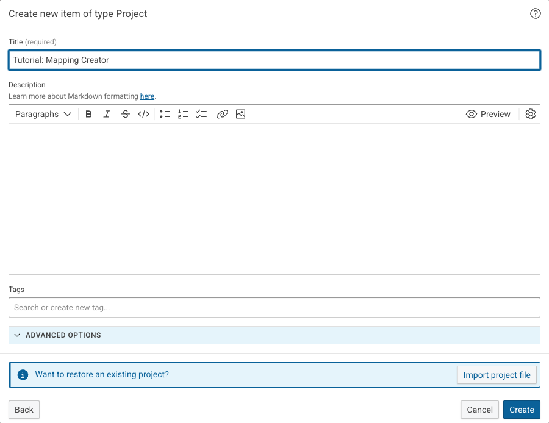{ class="bordered" width="70%" }

5. Click **Create**.

---

## 3 Add the XML file as a dataset

1. Click :eccenca-item-add-artefact: **Create new** inside the project.

2. Select **XML** and click **Add**.

3. Enter the following values:

    - **Label:** `Org Map`
    - **FILE:** select **Upload new file** and upload the `orgmap.xml` file

    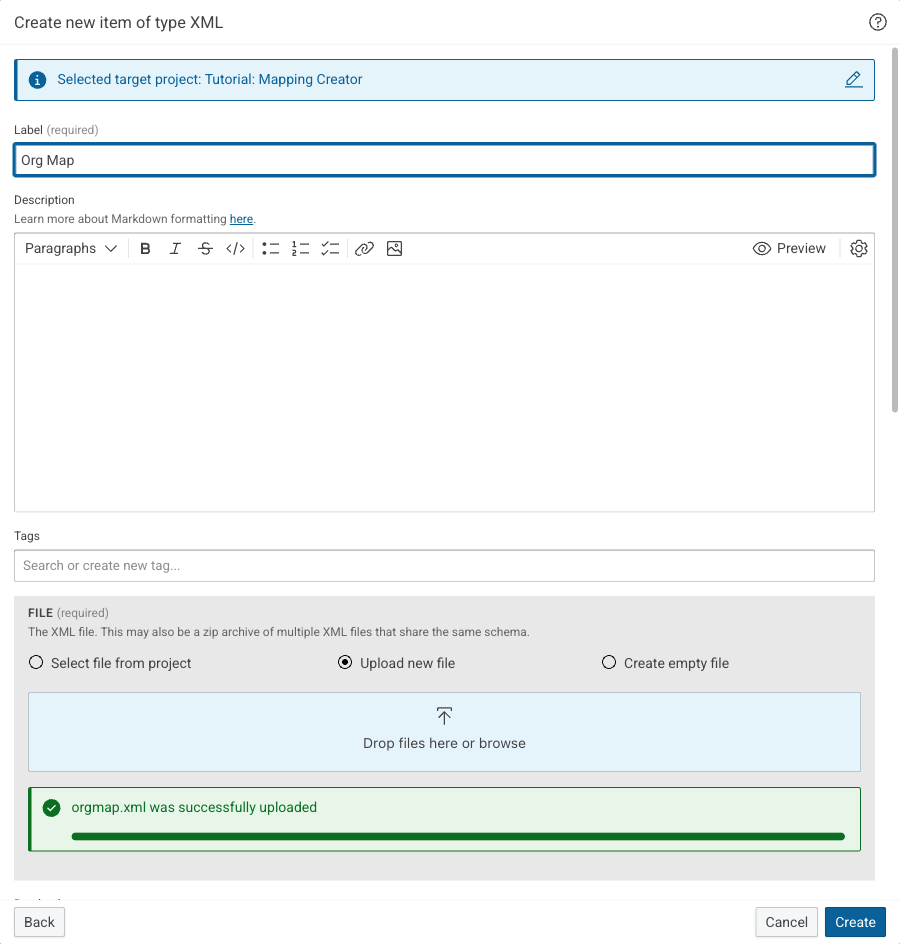{ class="bordered" width="70%" }

4. Expand **ADVANCED OPTIONS** and disable **Streaming**.

    Streaming reads large XML files without holding them in memory, but it does not support backward paths.
    The mapping built in this tutorial navigates from the manager of a department back to its employees, which is such a path.

5. Click **Create**.

    The **Data preview** of the dataset lists the paths of the XML file under **TYPE SELECTION**.
    Select `dept` to see the six departments.

    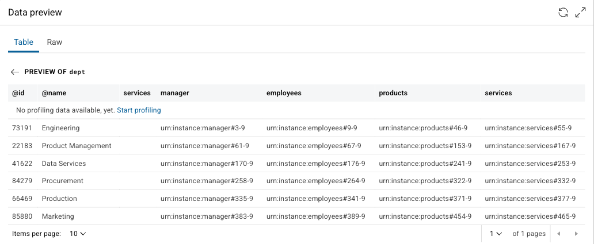{ class="bordered" }

---

## 4 Create the transformation

A transformation task holds the mapping rules.
Its **Type** defines which XML element becomes one entity of the Knowledge Graph.

1. Click :eccenca-item-add-artefact: **Create new** inside the project.

2. Select **Transform** and click **Add**.

3. Enter the following values:

    - **Label:** `Lift Departments`
    - **Input:** `Org Map`
    - **Type:** `dept`

    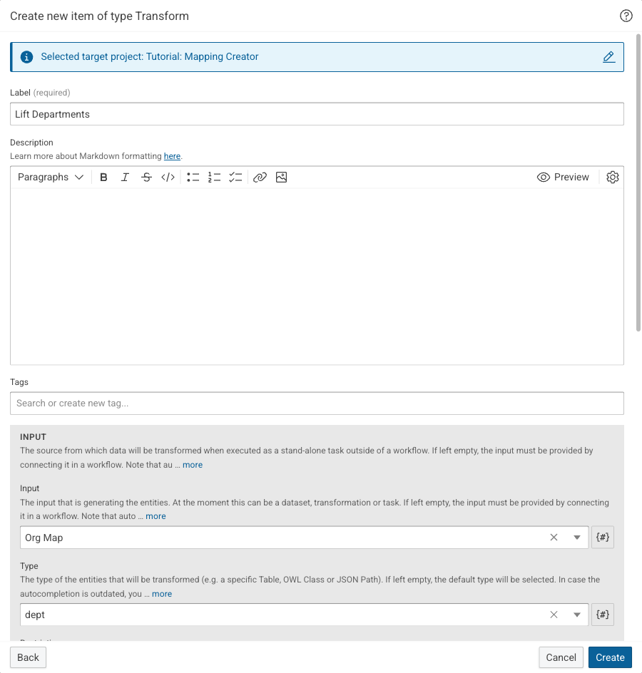{ class="bordered" width="70%" }

4. Scroll down to **Target vocabularies**, select **Select individual vocabularies**, and select `pv: Products - Vocab`.

    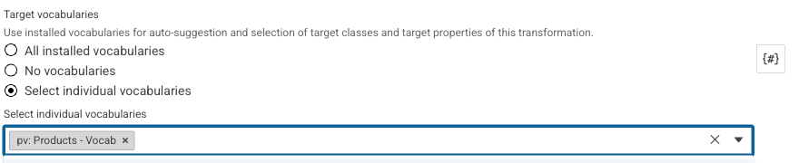{ class="bordered" width="70%" }

    Restricting the vocabularies keeps the class and property lists of the Mapping Creator short.

5. Click **Create**.

---

## 5 Open the Mapping Creator

1. Select the **Mapping creator (beta)** tab of the transformation.

    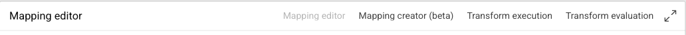{ class="bordered" }

2. Click the :eccenca-toggler-maximize: icon on the right of the tabs to use the full browser window.

    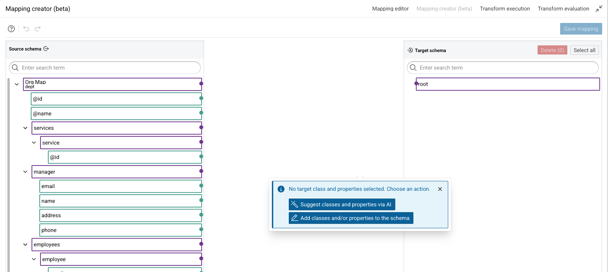{ class="bordered" }

The Mapping Creator consists of three parts:

- the **Source schema** on the left, the paths of the `orgmap.xml` file
- the **Target schema** on the right, the classes and properties the data is mapped to
- the connections between both, drawn in the area in the middle

Both schemas have a search field, and each element with children can be collapsed and expanded.

### Color legend and tour

Every color and line type in the editor has a meaning.
Click the :eccenca-item-question: help icon to reach three entries.

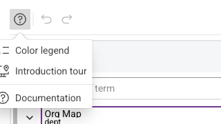{ class="bordered" }

- **Color legend** explains the node and edge colors.
- **Introduction tour** walks through the editor step by step.
- **Documentation** opens the [Mapping Creator](../mapping-creator/index.md) reference.

Select **Color legend** and keep the meaning of the dashed lines in mind:
a dashed element or connection is not saved yet.

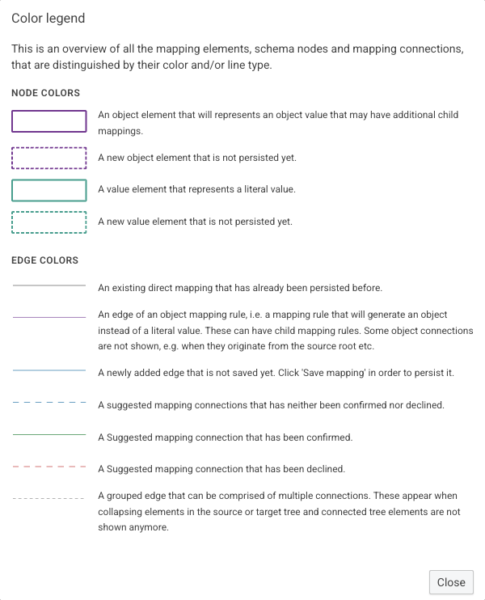{ class="bordered" width="70%" }

---

## 6 Add the target class

A mapping starts with a target class.
The target class defines what the entities of the Knowledge Graph are.

1. Click **Add classes and/or properties to the schema** and select **Add class**.

    !!! tip

        **Suggest classes and properties via AI** starts from the other side:
        the AI proposes the classes of the selected vocabularies that fit the source data best.

2. Enter `Department` in the search field and select the `pv:Department` entry.

3. Enable all three switches:

    - **Add class properties** adds the properties whose domain is the class or one of its super-classes.
    - **Add default properties** adds well-known properties such as `rdfs:label` and `rdfs:comment`.
    - **Include generic properties (owl:Thing and undefined domains)?** adds properties without an explicit domain, such as `pv:name` and `pv:id`.

    **Preview of properties that would be added** shows how many properties each option contributes.

    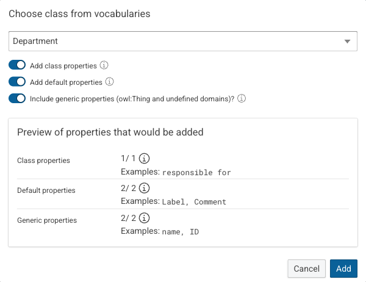{ class="bordered" width="70%" }

4. Click **Add**.

    The target schema now holds the `Department` class and five properties.
    All of them are dashed: nothing is saved yet, and a property that stays unconnected is not written to the transformation at all.

    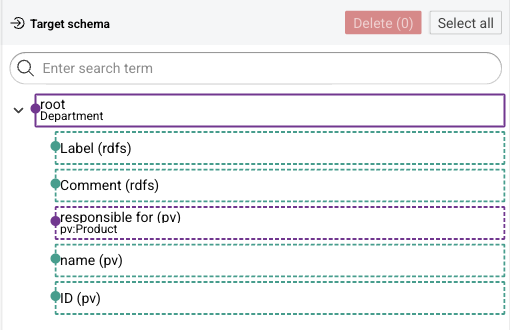{ class="bordered" width="70%" }

---

## 7 Map a value by drag-and-drop

Drag from the dot on the right of a source element to the dot on the left of a target element to create a mapping.

Drag `@name` onto `name (pv)`.

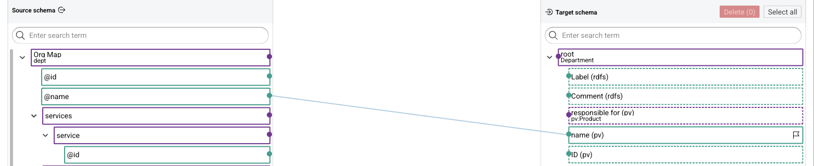{ class="bordered" }

The new connection is drawn as a solid line in the "not saved yet" color, and the target element loses its dashed border.

---

## 8 Generate property mappings with AI

The magic wand generates mapping suggestions for the direct children of a target element.

!!! info

    This step needs a configured Large Language Model.
    Without one, map the remaining properties by drag-and-drop as in step 7.

1. Hover over the root element of the target schema to show its action icons.

    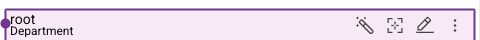{ class="bordered" }

    From left to right: suggest classes and properties via AI, focus element, element menu, and collapse or expand all children.

2. Click the :eccenca-application-ai-suggestion: magic wand.

3. Read the **AI disclaimer** and click **Close**.

    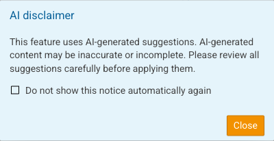{ class="bordered" width="70%" }

    The editor switches to the suggestion mode.
    Suggested connections are drawn as dashed blue lines, and a toolbar above the schemas collects the actions for the whole set of suggestions.

    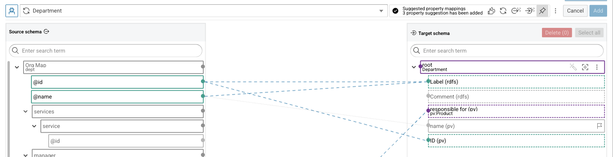{ class="bordered" }

4. Click a suggested connection to decide on it.

    The menu offers **Confirm**, **Set to undecided**, and **Decline**, and **REASON** states why the suggestion was made.
    A suggestion that combines several source elements into one rule offers **Confirm all** and **Decline all** instead.

    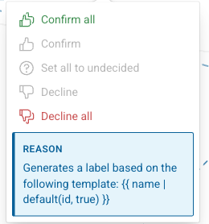{ class="bordered" }

5. Work through the suggestions and check the source element of each one.

    The suggestions are generated for every run and can differ from the ones described here.
    This run produced three of them:

    - `Label (rdfs)` from `@name` and `@id`, combined by a template. Confirm it.
    - `ID (pv)` from `@id`. Confirm it.
    - `responsible for (pv)` from `products`. Decline it: `products` occurs once per department, so the mapping would create a single product per department instead of one product per `product` element.

    A confirmed connection turns green, a declined one turns red.

    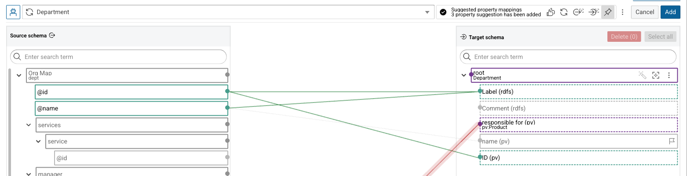{ class="bordered" }

6. Click **Add**.

    The confirmed suggestions become connections, the declined ones are discarded.

---

## 9 Map the products

`responsible for (pv)` is an object property: it does not carry a value, it points to another entity.
Connecting it to a source element defines which element becomes that entity.

1. Drag `products/product` onto `responsible for (pv)`.

    One `Product` entity is created per `product` element.

2. Hover over `responsible for (pv)`, click the :eccenca-item-edit: element menu, and select **Add properties** → **Add property from vocabularies**.

3. Enter `ID` in the search field and select the `pv:id` entry.

    `pv:id` is a datatype property, so **Add as object property** stays switched off and the direction options below it remain inactive.

4. Click **Add**.

5. Drag `products/product/@id` onto the new `ID` element.

    !!! tip

        Collapse the `services`, `manager`, and `employees` source elements to bring `products` into view.
        A connection can only be drawn between two dots that are both visible.

---

## 10 Add the manager as a nested entity

The department manager is a separate entity of the Knowledge Graph, connected to the department.
No property of the `Department` class points to a `Manager`, so the property is taken from the vocabulary directly.

1. Hover over the root element of the target schema, click the :eccenca-item-edit: element menu, and select **Add properties** → **Add property from vocabularies**.

2. Enter `has manager` in the search field and select the `pv:hasManager` entry.

3. Keep **Add as object property** enabled and **Connect from parent element** selected.

    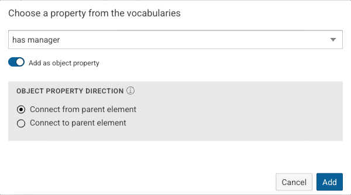{ class="bordered" width="70%" }

    **OBJECT PROPERTY DIRECTION** decides which of the two entities is the subject of the generated triple.
    **Connect from parent element** writes `Department pv:hasManager Manager`.
    **Connect to parent element** reverses it and writes `Manager pv:hasManager Department`.

4. Click **Add**.

    The new element carries the range of the property, `Manager`, as its class.

5. Drag `manager` onto `has manager`.

6. Click the :eccenca-application-ai-suggestion: magic wand of `has manager` and close the disclaimer.

7. Check the suggestions and decline the one for `ID (pv)`.

    It uses the `@id` of the department, which identifies the department and not the manager.

8. Click :octicons-thumbsup-16: in the toolbar to confirm all remaining suggestions and confirm the dialog with **Confirm all**.

    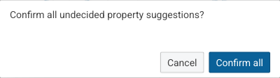{ class="bordered" width="70%" }

9. Click **Add**.

    The manager is mapped with a label, an email address, a name, an address, and a phone number.

    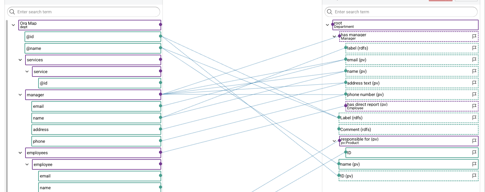{ class="bordered" }

---

## 11 Map the employees

The suggestions for the manager also propose `has direct report (pv)`, which points from the manager to the employees of the department.

1. Check which source element `has direct report (pv)` is connected to.

    The connection must start at `employees/employee`, not at `employees`.
    `employees` occurs once per department and would produce one employee per department.

2. If the connection starts at `employees`, click it and select **Delete**.

    { class="bordered" }

3. Drag `employees/employee` onto `has direct report (pv)`.

4. Click the :eccenca-application-ai-suggestion: magic wand of `has direct report (pv)` and close the disclaimer.

5. Decline the suggestion for `has manager (pv)`.

    It points back to the `manager` element outside the employee, which repeats a relation the mapping already describes.

6. Confirm the remaining suggestions and click **Add**.

7. Add the area of expertise, which the suggestions do not cover.

    1. Open the :eccenca-item-edit: element menu of `has direct report (pv)` and select **Add properties** → **Add property from vocabularies**.

    2. Enter `expertise` in the search field and select the `pv:areaOfExpertise` entry.

    3. Disable **Add as object property**.

        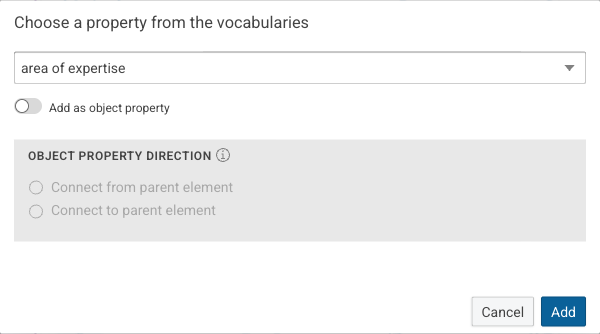{ class="bordered" width="70%" }

        `pv:areaOfExpertise` is defined as an object property, but the `productExpert` element holds a text.
        Disabling the switch uses the property in the role of a datatype property, so the text is written as a literal.

    4. Click **Add**.

    5. Drag `productExpert` onto the new `area of expertise` element.

!!! tip "Focus mode"

    The target schema now spans three levels of entities.
    Click the focus icon of an element to show only that element, its parent, and its direct children.

    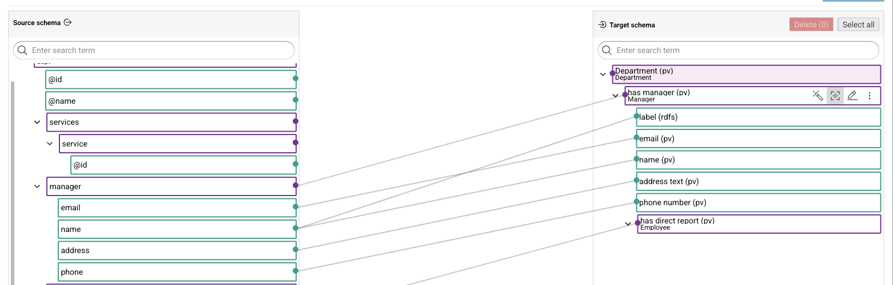{ class="bordered" }

    Click the icon again to show the whole schema.

---

## 12 Remove unused elements and save

Target elements that stay unconnected are not written to the transformation, but removing them keeps the editor readable.

1. Hover over `Comment (rdfs)` and select its checkbox on the right.

    **Delete** in the header of the target schema counts the selected elements.

    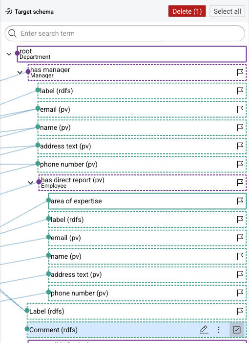{ class="bordered" width="70%" }

2. Click **Delete (1)** and confirm.

    !!! tip

        :eccenca-operation-undo: and :eccenca-operation-redo: in the toolbar revert and repeat the steps taken since the editor was opened.

3. Compare the result with the mapping below.

    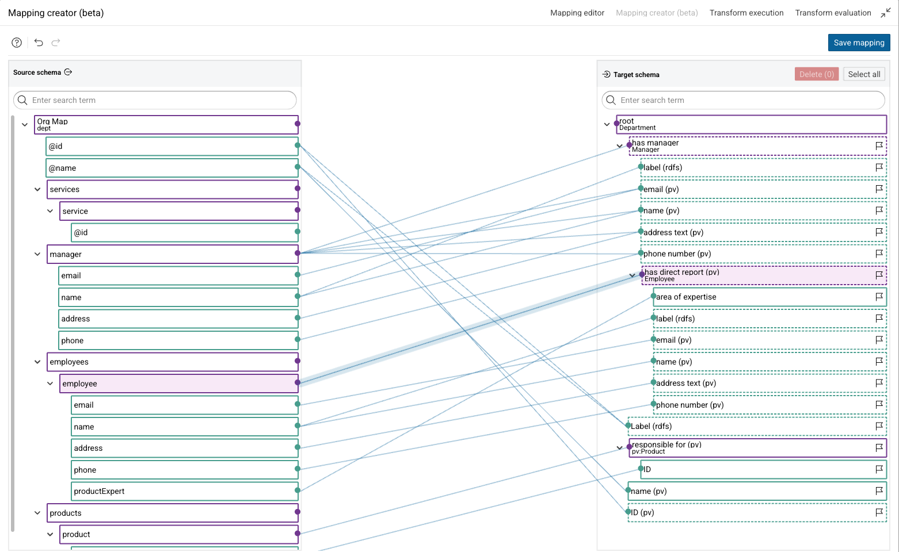{ class="bordered" }

4. Click **Save mapping**.

    The mapping rules are written to the transformation task.
    All elements and connections change to the saved colors, and the root element is renamed to `Department (pv)`.

---

## 13 Set a custom URI pattern

Without a URI pattern, the entities of the Knowledge Graph get generated identifiers.
A pattern built from the source data produces stable and readable IRIs.

1. Click the `Department (pv)` element.

    The **Mapping info** sidebar shows the saved mapping rule.

    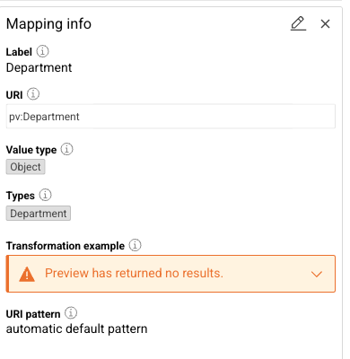{ class="bordered" width="70%" }

2. Click the :eccenca-item-edit: pencil icon in the sidebar.

3. Click **Create custom pattern** and enter the following value:

    - **URI pattern:** `http://ld.company.org/prod-inst/dept-{@id}`

    **Examples of target data** shows the IRI the pattern produces for the first department.

    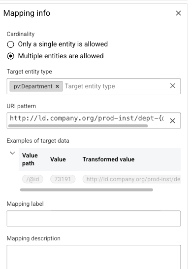{ class="bordered" width="70%" }

4. Click **Save**.

    !!! note

        The same editor sets the URI pattern of a nested entity such as `has manager (pv)`, and **Mapping label** and **Mapping description** document a rule for the next reader.
        [Cool IRIs](../cool-iris/index.md) explains how to choose an IRI scheme.

---

## 14 Evaluate the transformation

1. Select the **Transform evaluation** tab.

2. Expand one of the generated entities.

    The tab lists the entities the mapping produces and the triples of each one, without writing anything to a Knowledge Graph.

    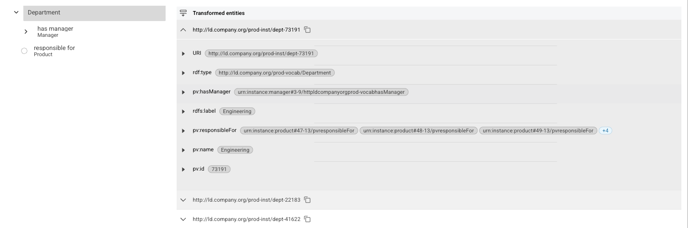{ class="bordered" }

---

## 15 Build the Knowledge Graph

The mapping is complete, but nothing has been written to a Knowledge Graph yet.

1. Click :eccenca-item-add-artefact: **Create new** inside the project, select **Knowledge Graph**, and click **Add**.

2. Enter the following values:

    - **Label:** `Org Map Knowledge Graph`
    - **Graph:** `http://ld.company.org/prod-orgmap/`

    After entering the graph URI, select the **Custom entry** suggestion to confirm the value.

    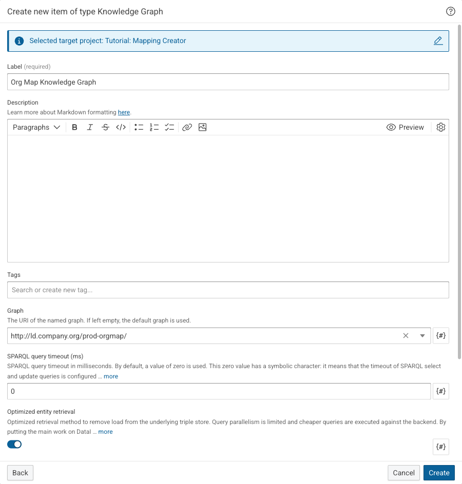{ class="bordered" width="70%" }

3. Click **Create**.

4. Open the `Lift Departments` transformation and click the :eccenca-item-edit: pencil icon of **Configuration: transform**.

5. Set **Output dataset** to `Org Map Knowledge Graph` and click **Update**.

    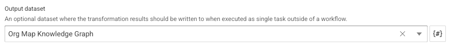{ class="bordered" width="70%" }

6. Select the **Transform execution** tab and click the :eccenca-item-start: start icon next to **Execute Transform**.

    The transformation writes the generated entities into the Knowledge Graph.

    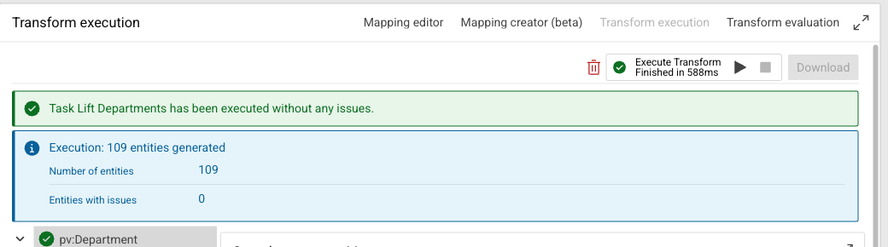{ class="bordered" }

7. Click the :eccenca-application-queries: **Queries** icon in the main menu under **EXPLORE** and run the following query in the **Query editor**:

    ``` sparql
    PREFIX pv: <http://ld.company.org/prod-vocab/>
    PREFIX rdfs: <http://www.w3.org/2000/01/rdf-schema#>

    SELECT ?department ?manager ?employee
    FROM <http://ld.company.org/prod-orgmap/>
    WHERE {
      ?dept a pv:Department ;
            rdfs:label ?department ;
            pv:hasManager ?m .
      ?m rdfs:label ?manager ;
         pv:hasDirectReport ?e .
      ?e rdfs:label ?employee .
    }
    ORDER BY ?department ?employee
    ```

    The result joins the three classes the mapping created.

    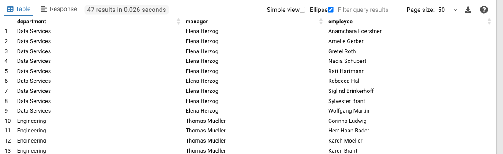{ class="bordered" }

---

## What to try next

- [Lift data from tabular data](../lift-data-from-tabular-data-such-as-csv-xslx-or-database-tables/index.md) builds a Knowledge Graph from the CSV part of the same sample data.
- [Lift data from JSON and XML sources](../lift-data-from-json-and-xml-sources/index.md) maps hierarchical sources with the classic mapping editor.
- [Mapping Creator](../mapping-creator/index.md) describes every feature used here as a reference.
