# Mapping Creator

!!! info "AI Disclaimer"

    Mapping Creator uses AI-generated suggestions.
    AI-generated content may be inaccurate or incomplete.
    Please review all suggestions carefully before applying them.

The Mapping Creator connects source data to a semantic model.
It shows the source schema on the left, the target schema on the right, and the mapping rules between them as connections.
Connections are created by dragging them, by adding classes and properties from the installed vocabularies, or by accepting AI-generated suggestions.
The result is stored as the mapping rules of a transformation task, which can be refined in the **Mapping editor** and executed like any other transformation.

The Mapping Creator is a feature of eccenca Corporate Memory and is labeled **Mapping creator (beta)** in the user interface.

## Prerequisites

!!! info "Configuration"

    See [Mapping Creator and LLM Configuration](../../deploy-and-configure/configuration/dataintegration/index.md#mapping-creator-and-llm-configuration) to learn how to enable and configure this feature.

- The feature is enabled in the configuration of the deployment.
- A transformation task exists.
  Its **Input** provides the source schema, or the input is connected in a workflow.
- The vocabularies that provide the target classes and properties are installed.
  The **Target vocabularies** parameter of the transformation task defines which of them are available, either `all installed vocabularies` or a selection.
- Smart suggestions additionally require a configured Large Language Model (LLM).

## Open the Mapping Creator

The Mapping Creator is one of the task views of a transformation task.
It is reached from the task itself or from a workflow that uses the task.

### From a transformation task

1. Open the transformation task in its project.

2. Select **Mapping creator (beta)** in the header of the **Mapping editor** panel.

    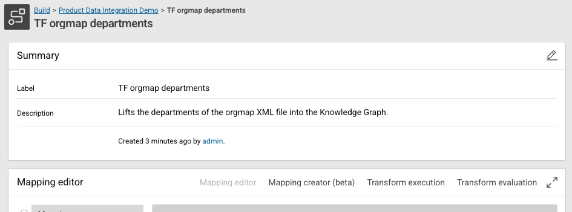{ class="bordered" width="80%" }

3. Click :eccenca-toggler-maximize: in the same header to use the full browser window.

### From a workflow

A transformation task without an **Input** receives its input from the workflow it is connected in.
Opened from the project, such a task shows only the source paths that its existing rules use.
Opened from the workflow, it shows the complete source schema of the connected input.

1. Open the workflow.

2. Click :eccenca-item-moremenu: on the transformation node.

    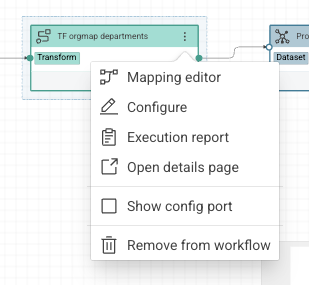{ class="bordered" width="40%" }

3. Select **Mapping editor**.

4. Select **Mapping creator (beta)** in the header of the dialog.

## The mapping canvas

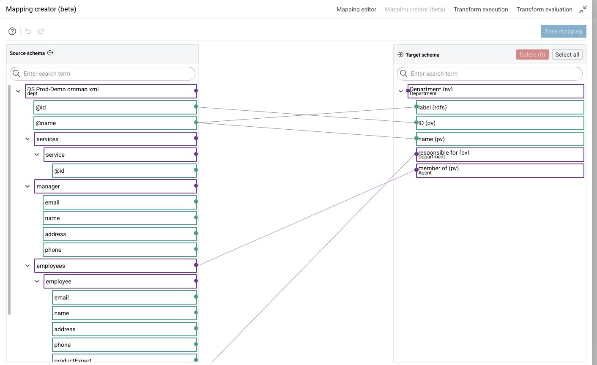{ class="bordered" }

The canvas consists of three parts:

- **Source schema** on the left, with the elements of the input data
- **Target schema** on the right, with the classes and properties of the target vocabularies
- The connections between both, which represent the mapping rules

Each element carries its own actions, which appear when the pointer is over the element:

- :eccenca-application-ai-suggestion: suggests classes and properties for the element.
- **Focus element** reduces the tree to the parent and the direct child elements.
- :eccenca-item-edit: opens the menu that adds classes and properties.
- :eccenca-item-moremenu: opens the remaining actions of the element.

Clicking an element of the source schema opens **Source element info**, described in [Inspect a source element](#inspect-a-source-element).
Clicking an element of the target schema opens **Mapping info**, described in [Inspect and edit a mapping rule](#inspect-and-edit-a-mapping-rule).

Several target elements can be removed in one step.
Select them with their checkboxes or with **Select all**, then click **Delete**, which states the number of selected elements.

!!! question "Help"

    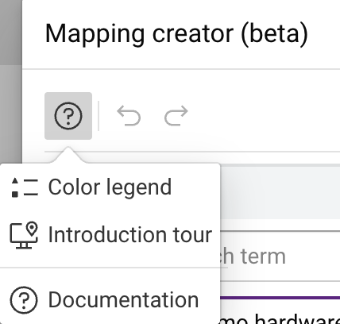{ class="bordered" width="20%" align=right }

    Click :eccenca-item-question: to open the **Color legend**, the **Introduction tour** through the important elements, and this **Documentation**.

### Color legend

Each color and line type has a specific meaning.

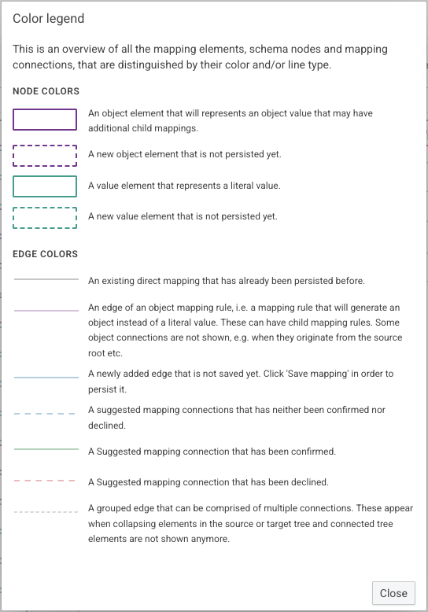{ class="bordered" width="60%" }

| Element | Meaning |
| --- | --- |
| Purple box | Object element that represents an object value and can have child mappings |
| Dashed purple box | Object element that is not persisted yet |
| Green box | Value element that represents a literal value |
| Dashed green box | Value element that is not persisted yet |
| Grey line | Direct mapping that is already persisted |
| Purple line | Edge of an object mapping rule, which generates an object instead of a literal value |
| Blue line | Newly added edge that is not saved yet |
| Dashed blue line | Suggested mapping connection that is neither confirmed nor declined |
| Green line | Suggested mapping connection that is confirmed |
| Dashed red line | Suggested mapping connection that is declined |
| Dashed grey line | Grouped edge that combines the connections of a collapsed element |

### Inspect a source element

Click an element of the source schema to open **Source element info**.
The panel opens to the left of the source schema and shows the details of the element and of the data behind it.

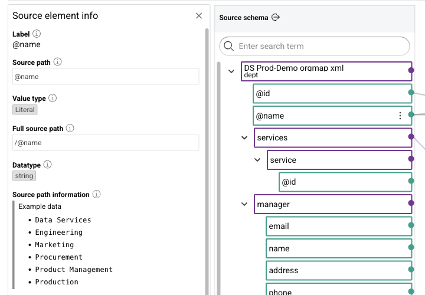{ class="bordered" width="80%" }

- **Label:** the label of the element
- **Source path:** the path of the element relative to its parent element
- **Value type:** `Object` for an object element, `Literal` for a value element
- **Full source path:** the path of the element starting at the root element of the source schema
- **Datatype:** the data type of the values, shown for value elements only
- **Source path information:** **Example data** with values that the input provides for the path

**Source path profiling information** follows when profiling data is available for the source path.

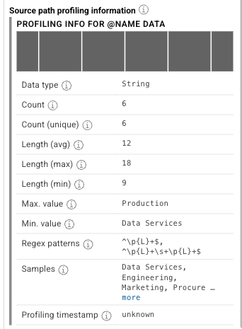{ class="bordered" width="40%" }

The table lists the statistics of the values, among them **Data type**, **Count**, **Count (unique)**, the minimum, maximum and average length, **Max. value**, **Min. value**, **Regex patterns** that the values match, **Samples** and **Profiling timestamp**.

Click :eccenca-navigation-close: to close the panel.

## Create a mapping manually

A mapping starts with a target class.
The target class defines where the data is mapped in the knowledge graph.

### Add a target class

1. Click :eccenca-item-edit: on the target element that receives the class.

    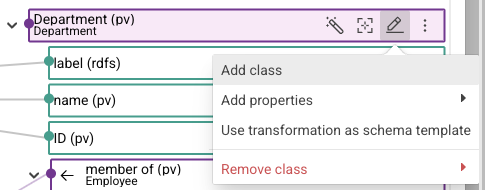{ class="bordered" width="60%" }

2. Select **Add class**.

3. Select a class in **Choose class from vocabularies**.

    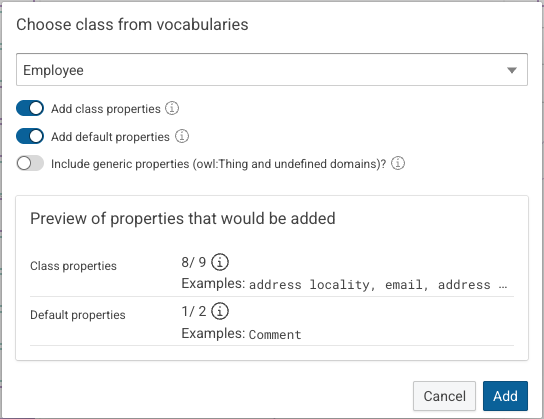{ class="bordered" width="60%" }

    The dialog adds properties together with the class:

    - **Add class properties:** properties defined in the domain of the selected class or its super-classes
    - **Add default properties:** well-known properties such as `rdfs:label` or `rdfs:comment`
    - **Include generic properties (owl:Thing and undefined domains)?:** properties defined with no explicit domain

    **Preview of properties that would be added** states how many properties each option contributes and gives examples.

4. Click **Add**.

**Remove class** in the same menu removes the class from the element again.

### Add properties

Properties can also be added on their own, through **Add properties** in the menu of the target element.

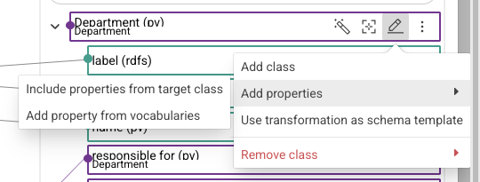{ class="bordered" width="60%" }

- **Include properties from target class** adds the properties of the class that is assigned to the element.

    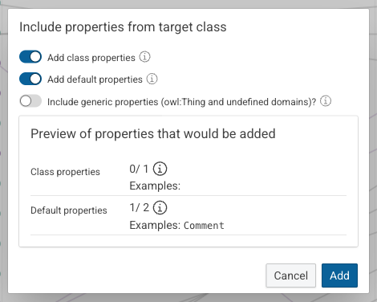{ class="bordered" width="60%" }

    The dialog offers the same options as **Choose class from vocabularies**: **Add class properties**, **Add default properties** and **Include generic properties (owl:Thing and undefined domains)?**.
    **Preview of properties that would be added** states, for each category, the number of properties that would be added and the number of properties that the category provides.
    Properties that the element already has are not added again, for example `0/ 1` for a class whose only property is already in the target schema.
    **Add** adds the properties as child elements of the target element.
    They are not persisted until the mapping is saved.

- **Add property from vocabularies** opens a dialog to search for a single property.

    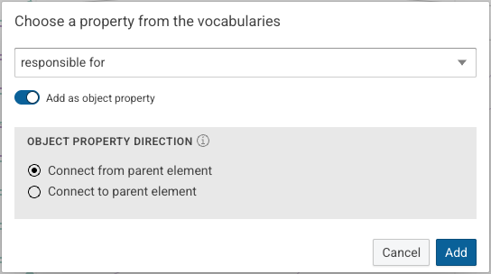{ class="bordered" width="60%" }

    **Add as object property** uses a property in the role of an object property, or, when it is turned off, in the role of a datatype property.
    For an object property, **Object property direction** defines whether the element is connected with **Connect from parent element** or **Connect to parent element**.

### Connect source and target elements

Drag the connector of a source element onto a target element to create a mapping between them.
The new connection is not persisted until the mapping is saved.
This is the way to map elements that the suggestions do not cover.

### Inspect and edit a mapping rule

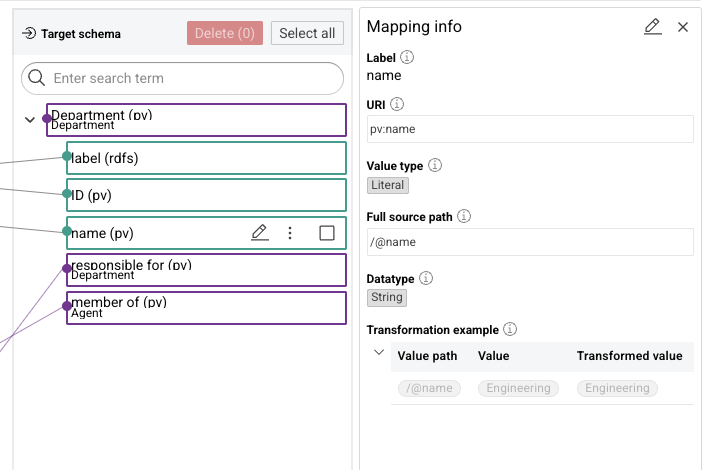{ class="bordered" width="80%" }

Click a target element to open **Mapping info**.
The panel shows the label, the URI of the target property, the value type, the full source path and the data type.
**Transformation example** shows a source value and the value that the rule produces from it.

Click :eccenca-item-edit: in **Mapping info** to edit the rule.
The form changes **Target property**, **Cardinality**, **Data type**, **Value path**, **Mapping label** and **Mapping description**.
More complex transformation logic is defined in the **Mapping editor** of the transformation task.

## Create a mapping with smart suggestions

!!! info

    Smart suggestions are only available if a Large Language Model is configured.

While the target schema is empty, the canvas offers **Suggest classes and properties via AI** and **Add classes and/or properties to the schema**.
The same suggestions are available later through :eccenca-application-ai-suggestion: on a target element.
The first AI action of a session opens **AI disclaimer**, which is closed with **Close** or suppressed with **Do not show this notice automatically again**.

### Get class suggestions

Click **Suggest classes and properties via AI**.
A class selector replaces the toolbar and lists the classes of the target vocabularies that fit the source data.

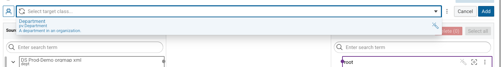{ class="bordered" }

Hover over :eccenca-application-ai-suggestion: of a suggestion to read why the class has been suggested.
Classes can also be searched by typing into the field.

!!! tip

    If the list stays empty and reports `No classes found`, click :eccenca-item-reload: in the field to request the suggestions again.

### Get property suggestions

Selecting a class from the list generates the property mappings between the source elements and the properties defined on that class.
The status in the toolbar states how many suggestions have been added.

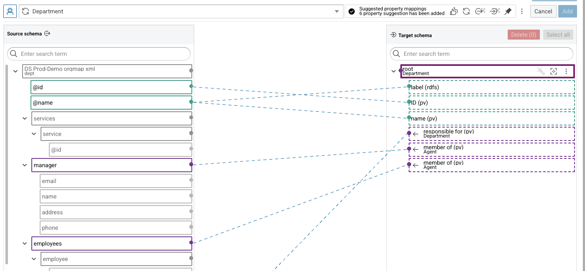{ class="bordered" }

The buttons next to the status act on all suggestions:

- Confirm all undecided property suggestions, which asks for confirmation before it is applied
- Request the property suggestions again
- Hide the source elements that are not part of a suggestion
- Hide the target elements that are not part of a suggestion
- Restrict the suggestions to the target properties that are currently loaded in the target schema

### Confirm or decline a suggestion

Click a suggested connection to decide on it.

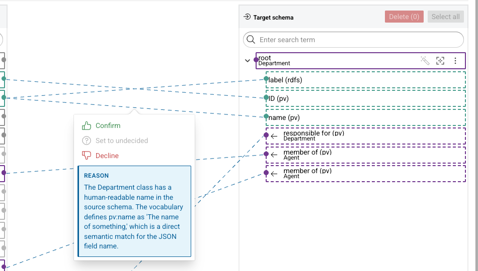{ class="bordered" width="80%" }

- **Confirm** accepts the suggestion.
- **Decline** rejects it.
- **Set to undecided** returns a decided suggestion to its original state.

**REASON** in the same menu explains why the connection has been suggested.

### Apply and save the suggestions

1. Click **Add** to apply the confirmed suggestions to the target schema.
    **Cancel** discards all suggestions instead.

2. Click **Save mapping** to persist the mapping rules in the transformation task.

### Provide additional context

Click :eccenca-item-moremenu: next to the class selector and select **Show suggestion context** to improve the suggestions.
**Suggestion context** takes an example input, an example output, an extra user prompt and PDF files, and applies them with **Update**.

## Reuse the target schema of another transformation

**Use transformation as schema template** in the menu of a target element extracts the target schema of another transformation task and inserts it under the selected element.
