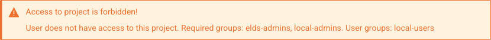
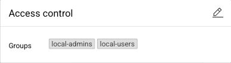
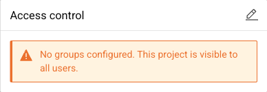
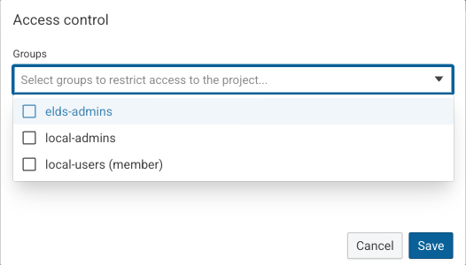
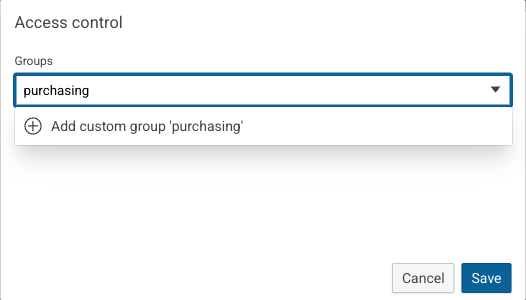
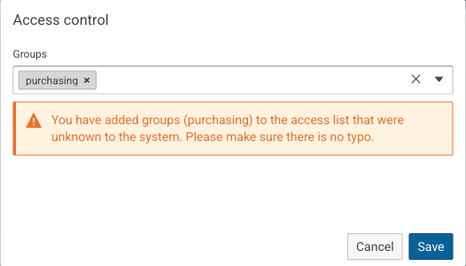
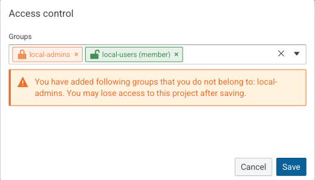
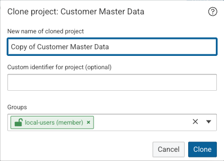

# Project access control

!!! info "Beta"

    Project access control is a beta feature.
    Its behavior, configuration and user interface are subject to change.

## Introduction

In eccenca Corporate Memory, project access control restricts a Build project to the members of selected user groups.
Users who are not a member of one of these groups do not see the project and cannot open it.

!!! info "Project access control is disabled by default"

    An administrator enables project access control in the Build configuration, see [Project access control](../../deploy-and-configure/configuration/dataintegration/index.md#project-access-control).
    While it is disabled, the **Access control** section and the **Groups** field described on this page are not shown.

## Who can access a project

The groups assigned to a project determine who can access it:

- A project without groups is accessible to all users.
- A project with groups is accessible to every user who is a member of at least one of these groups.
- Administrators can access all projects, regardless of the assigned groups.

Administrators are the accounts that hold the admin action of the Build configuration, see [Administrators](../../deploy-and-configure/configuration/dataintegration/index.md#administrators).

Access is not divided into read access and write access.
A user who can access a project can use it without restrictions, which includes changing its groups.

A project that a user cannot access is not listed in the workspace.
Opening a link to such a project shows the message **Access to project is forbidden!** instead of the project.
The message lists the groups assigned to the project and the groups of the current user.

{ class="bordered" width="88%" }

## View the groups of a project

Open the project.
The **Access control** section shows the assigned groups under **Groups**.

{ class="bordered" width="41%" }

If no groups are assigned, the section shows the message "No groups configured. This project is visible to all users." instead.

{ class="bordered" width="41%" }

## Restrict a project to groups

1. Open the project.
2. In the **Access control** section, click :eccenca-item-edit: **Edit access control**.
3. Select one or more groups in the **Groups** field.
4. Click **Save**.

The **Groups** field marks each group that the current user is a member of with "(member)".
For administrators, the groups are not marked.

{ class="bordered" width="55%" }

To make the project accessible to all users again, remove all groups from the **Groups** field and click **Save**.

### Add a group that is not listed

The list of groups in the **Groups** field can be incomplete.
To assign a group that is not listed, enter its name in the **Groups** field and select the **Add custom group** entry, which repeats the entered name.

{ class="bordered" width="55%" }

The name must match the name of the group exactly, including capitalization.
A misspelled group matches no user, so a warning lists the custom groups for review before saving.

{ class="bordered" width="55%" }

### Avoid losing access

A warning appears when a group is added that the current user is not a member of.
The selected groups show whether the current user is a member: a green group with an open lock is a group of the user, an orange group with a closed lock is not.

{ class="bordered" width="55%" }

The warning remains when a group of the user is selected as well.
After saving, the current user keeps access only if at least one of the selected groups is a group of this user.
Administrators do not see this warning, because they keep access to all projects.

!!! warning "Loss of access"

    A user who is not a member of any assigned group can no longer open the project or change its groups.
    Only a member of one of the assigned groups or an administrator can restore the access.

## Groups of new projects

The **Groups** field is also part of the dialogs that create, clone, and import a project:

- When a project is created, the field is empty, so the project is accessible to all users unless groups are selected.
- When a project is cloned, the field is prefilled with the groups of the original project that the current user is a member of.
- When a project is imported, the field is empty.
  If the import replaces an existing project, the field is not shown and the project keeps its groups.

{ class="bordered" width="46%" }

A project created with `cmemc project create` or through the API without groups is assigned the groups of the account that creates it.
It is therefore accessible only to members of these groups and to administrators.

!!! warning "Groups are not part of a project export"

    By default, a project export does not contain the groups of the project.
    Select the groups again when importing a restricted project.
    Otherwise, the imported project is accessible to all users.
