# Rule Blocks

## Introduction

Transformation rules repeat themselves.
The same handful of operators which normalizes a person name, mints an IRI from a set of identifying values, or cleans up a product code shows up in mapping after mapping - copied from rule to rule, and drifting apart from its copies as soon as one of them is corrected.

A **rule block** turns such a sequence into a named, reusable unit, comparable to a function in a programming language.
You build it once as a project item, give it input ports, and reference it from any number of transformation and linking rules.

The essential point is that the referencing rules do not hold a copy - they hold a **reference**.
A rule block is therefore managed centrally:
correct it, extend it or tune it once, and every rule which uses it picks up the change.
Conversely, a rule which uses a rule block stays small and readable, because the details are hidden behind a single node.

Since a rule block is a regular project item, it travels with the project:
it is contained in project exports and imports, and it can be shipped inside a [Marketplace Package](../../distribution/marketplace/index.md).
This makes rule blocks a natural carrier for conventions which should not be re-invented per project or per team - an IRI minting rule which implements your [Cool IRI](../cool-iris/index.md) policy, a normalization of company names, or the canonical way to build a label.
Published as [a package](../../develop/packages/index.md), such a set of rule blocks becomes a shared, versioned guideline which other units or organizations install instead of re-implementing.

!!! info "Availability"

    Rule blocks are available starting with eccenca Corporate Memory version 26.2.

## Anatomy of a Rule Block

A rule block consists of three parts:

**Input ports**
:   The parameters of the rule block.
    Each port has a label, a position in the port order and an optional description.
    Ports appear as source nodes inside the rule block and as input handles on the node which references the rule block.

**A rule tree**
:   The transformation itself, built from the same [rule operators](../rule-operators/index.md) you use in any transformation rule.
    The operator the tree ends in produces the values the rule block returns.

**Example values**
:   Sets of input values stored with the rule block.
    They are used to evaluate the rule block on its own, without a dataset and without a surrounding rule.

## Create a Rule Block

To create a rule block:

- Open the project you want to add it to.
- Click **:material-plus-circle-outline: Create new** and select the item type **Rule block**.
- Click **Add**, enter a **Label** and optionally a description and tags, then click **Create**.

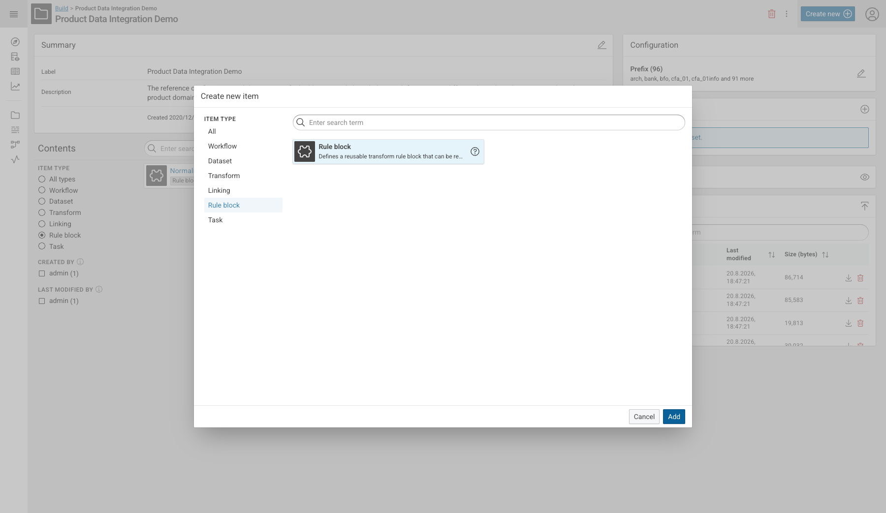{ class="bordered" }

Rule blocks are ordinary project items.
They are listed in the project contents and can be filtered there with the **Rule block** item type.

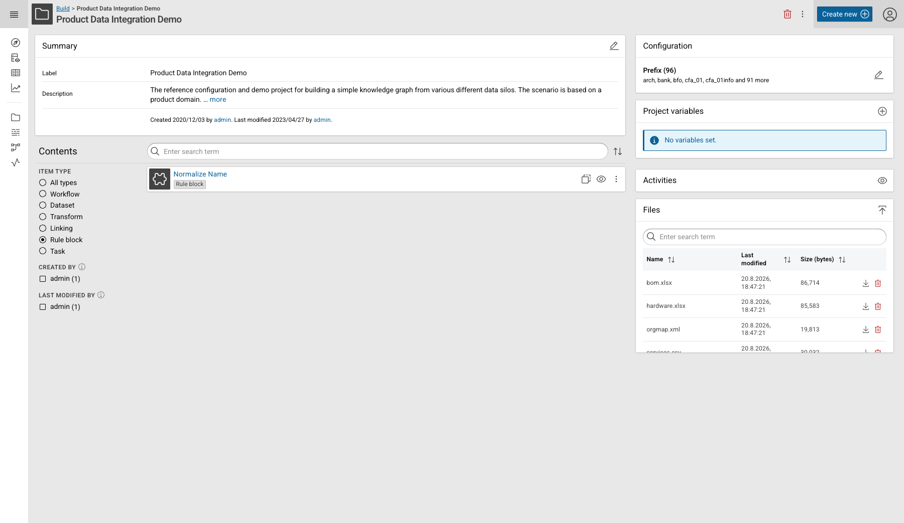{ class="bordered" }

## The Rule Block Editor

Opening a rule block shows the **Rule block editor**, together with a **Related items** widget which lists the transformation and linking tasks that use it.

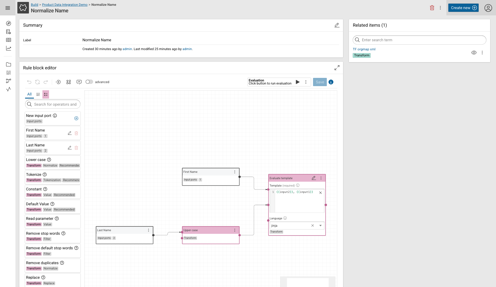{ class="bordered" }

The editor works like the value formula editor of a transformation rule:
drag operators from the sidebar onto the canvas, connect them, and configure their parameters in the node.
Two things are specific to rule blocks:

- The sidebar has an **Input ports** category at the top, holding the **New input port** entry and one entry per existing port.
- The toolbar offers **Normalize port order**, which renumbers the display order of the ports without gaps, and an **Evaluation** section which runs the rule block against its example values.

!!! note "Rule blocks cannot be nested"

    A rule block is built from operators only.
    It cannot reference another rule block.

### Manage Input Ports

To add a port, click the **:material-plus-circle-outline:** button of the **New input port** entry and fill in the **Create input port** dialog.
Dragging **New input port** onto the canvas creates a port as well.

Existing ports are listed below that entry.
Click the **:material-pencil-outline: edit** icon of a port to open the **Edit input port** dialog, or the **:material-delete-outline: delete** icon to remove it:

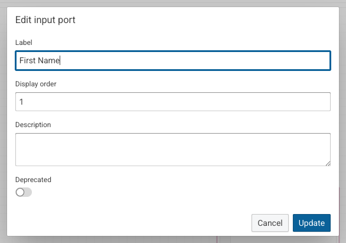

**Label**
:   The name of the port.
    It is shown on the port node inside the rule block and next to the input handle of the referencing node.

**Display order**
:   The position of the port in the port order.
    The order decides which incoming connection of a referencing rule feeds which port.

**Description**
:   An optional explanation of what the port expects.

**Deprecated**
:   Marks the port as outdated.
    Use this for ports which should no longer be connected but cannot be removed because the rule block is already in use.

### Define Example Values

A rule block has no dataset of its own, so it is evaluated against example values you provide.
Open them with **:material-dots-vertical: Show more options** next to the evaluation controls and select **Example values**.

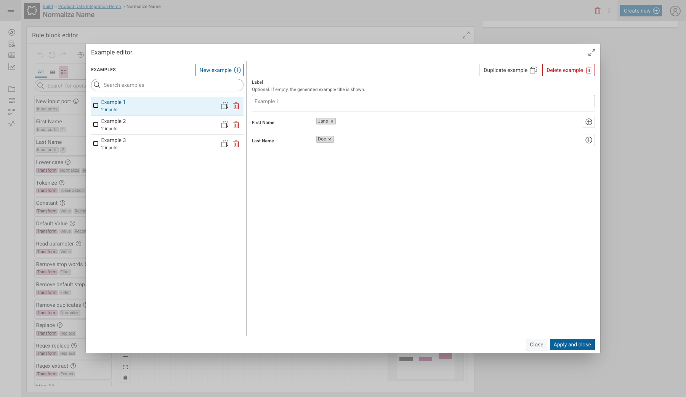{ class="bordered" }

Each example carries one set of values per input port, and a port can hold more than one value.
Use **New example** to add another set, **Duplicate example** to start from an existing one, and the optional **Label** to give an example a descriptive name.
Click **Apply and close** to store the examples with the rule block.

!!! tip "Examples are documentation"

    Examples are saved together with the rule block and are therefore visible to everybody who opens it later.
    Well-chosen examples - the normal case, the empty case, the awkward case - explain the intent of a rule block faster than a description does.

### Evaluate a Rule Block

Click **:material-play: Start evaluation** to run the rule block against its examples.
The editor annotates every node with the values it produced, so you can follow the values from the input ports through the operators to the result.

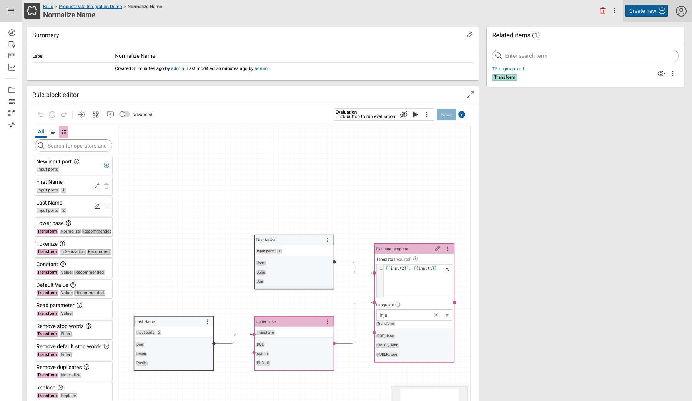{ class="bordered" }

## Use a Rule Block

Rule blocks can be used in transformation rules and in linking rules.

- Open the rule you want to extend, for example a value mapping in the mapping editor, and open its **Value formula editor**.
- Switch the sidebar to the **:material-puzzle-outline: rule block** tab.
    It lists the rule blocks of the current project.
- Drag the rule block onto the canvas and connect one operator to each of its input handles.

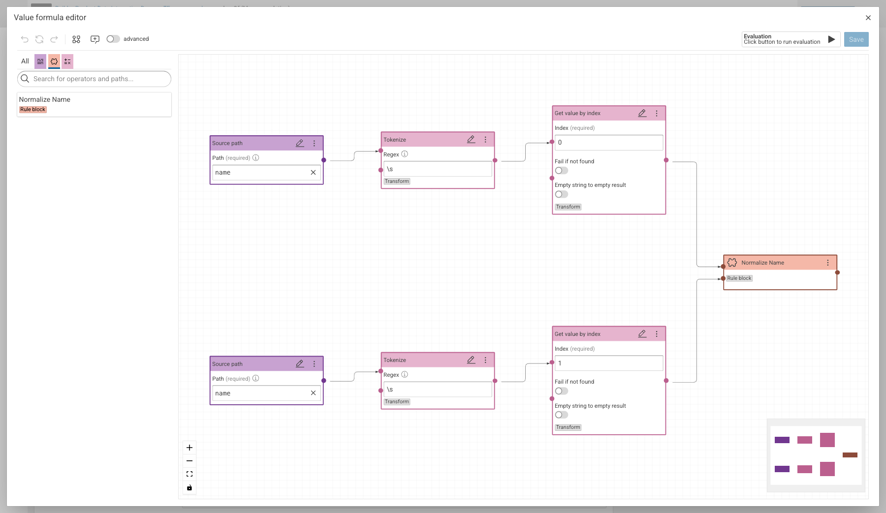{ class="bordered" }

The referencing node carries the label of the rule block and a **Rule block** tag.
It has one input handle per input port, in the port order defined in the rule block, and a single output.

Its context menu offers the actions specific to the reference:

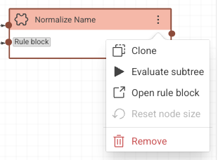

**Clone**
:   Adds a second reference to the same rule block.

**Evaluate subtree**
:   Evaluates everything which feeds into this node, including the rule block itself.

**Open rule block**
:   Navigates to the rule block item, so you can edit it.

**Remove**
:   Removes the reference from this rule.
    The rule block itself is not deleted.

### Look Inside

For the surrounding rule, a rule block is a black box:
the evaluation shows the values which go in and the values which come out, but not the operators in between.

To see the inside, run the evaluation and click **:material-eye-outline: Show internal evaluation** on the rule block node.
A read-only view opens which shows the rule block with the values of the current rule flowing through it.

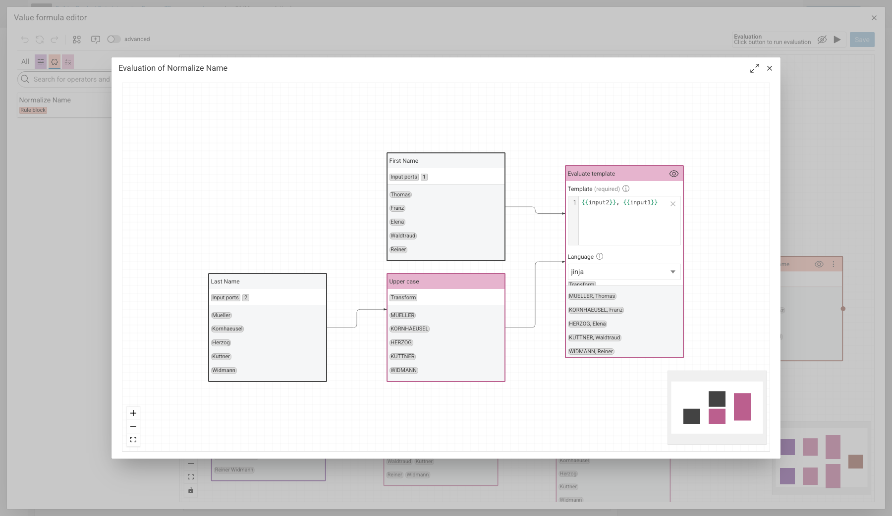{ class="bordered" }

This view is for inspection only.
Change the rule block in its own editor.

### In the Evaluation Views

The **Transform evaluation** and the linking evaluation resolve the rule block label as well.
A rule block appears as one labelled step in the operator tree, with the value it contributed:

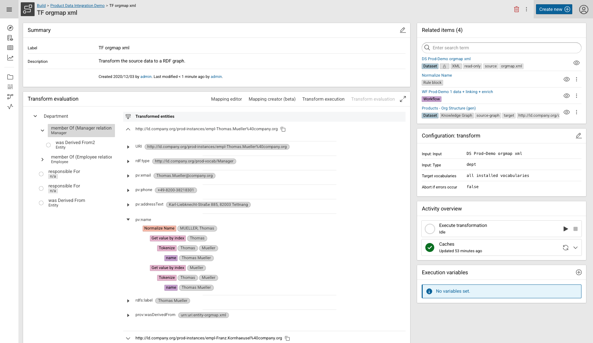{ class="bordered" }

## Change a used Rule Block

The whole point of a rule block is that a change reaches every rule which references it.
That also means a change can break those rules, so the editor restricts what may be changed once a rule block is used somewhere.

Click the **:material-information-outline: Usage status** button next to **Save** to see the current state:

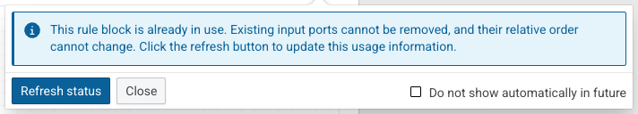

While a rule block is in use:

- Existing input ports cannot be removed.
- The relative order of the existing input ports cannot change.

Both restrictions protect the connections in the referencing rules, which are matched to the ports by their position.
Adding a port is always possible, and a port which must not be used any more can be marked as **Deprecated** instead of being removed.

Use **Refresh status** after you added or removed a usage in another browser tab, and **Do not show automatically in future** if you do not want the notice to open by itself.

!!! warning "Changing the logic affects all usages"

    Editing the operators of a rule block changes the result of every transformation and linking rule which references it.
    Check **Related items** on the rule block page to see which tasks are affected, and re-run their evaluation before you execute a workflow.

## Share Rule Blocks

A rule block belongs to exactly one project and can only be referenced from rules in that project.
To use the same rule block elsewhere, distribute the project item:

- **Project export and import** - rule blocks are contained in the project archive, like every other project item.
    See the [project command group](../../automate/cmemc-command-line-interface/command-reference/project/index.md) of [cmemc](../../automate/cmemc-command-line-interface/index.md).
- **Marketplace Packages** - a package which ships a Build project ships its rule blocks with it.
    This is the way to publish a set of agreed-upon rule blocks - IRI minting, name and address normalization, code cleanup - as a versioned artifact which other teams install.
    See [Marketplace Packages: Development and Publication](../../develop/packages/development/index.md) and the [Marketplace](../../distribution/marketplace/index.md).

## Limitations

- A rule block cannot reference another rule block.
- A rule block can only be referenced from rules in the same project.
- Input ports of a rule block which is in use cannot be removed or reordered.
