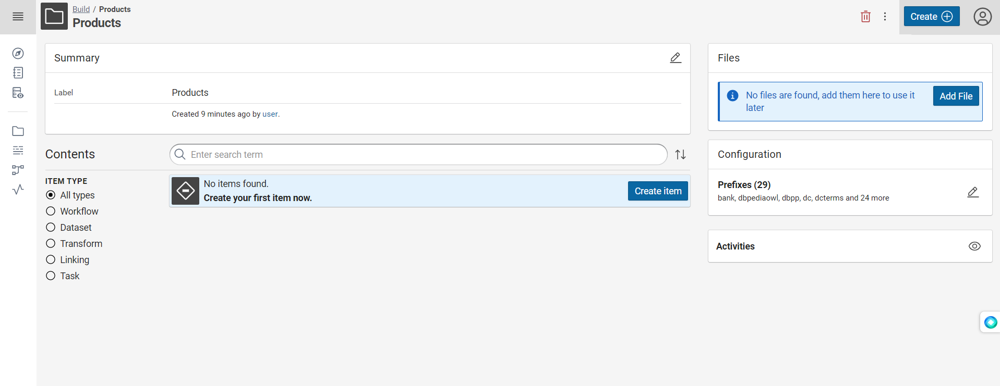
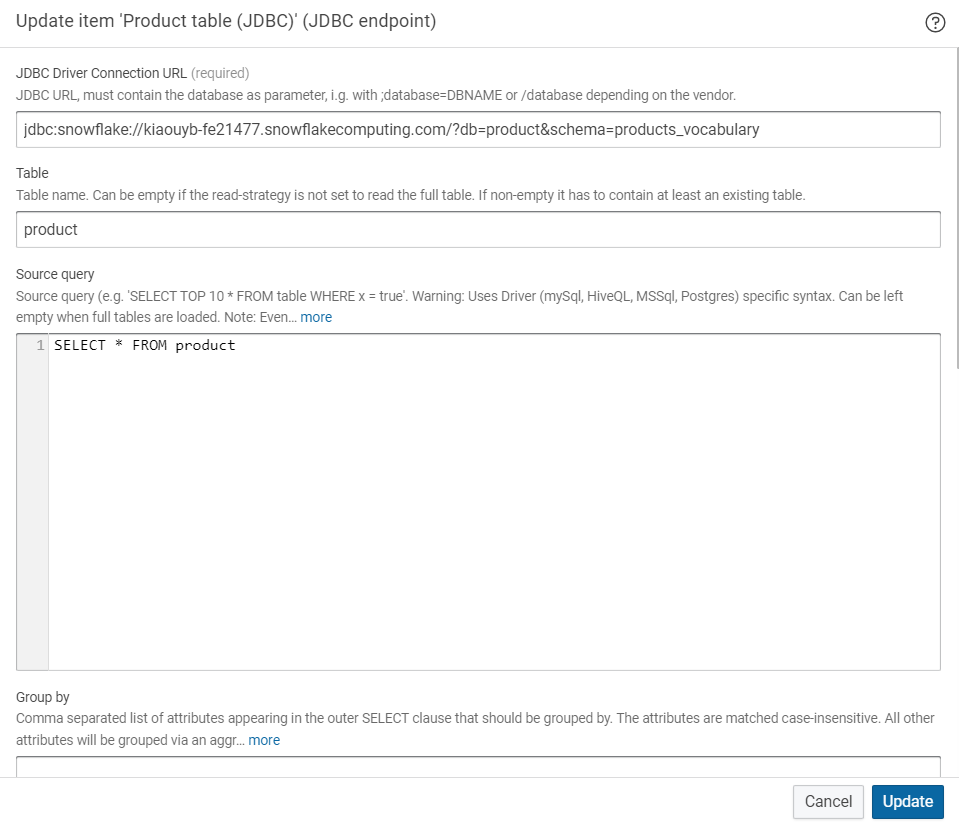
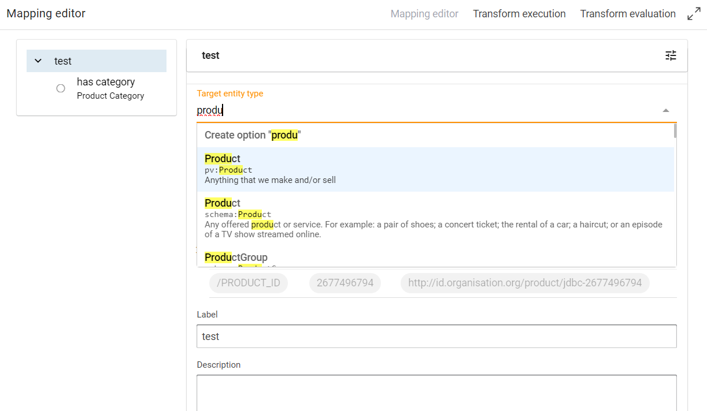
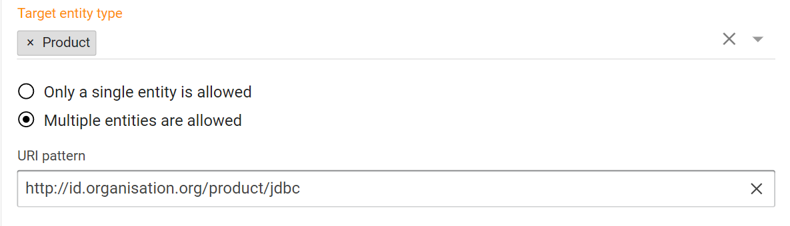
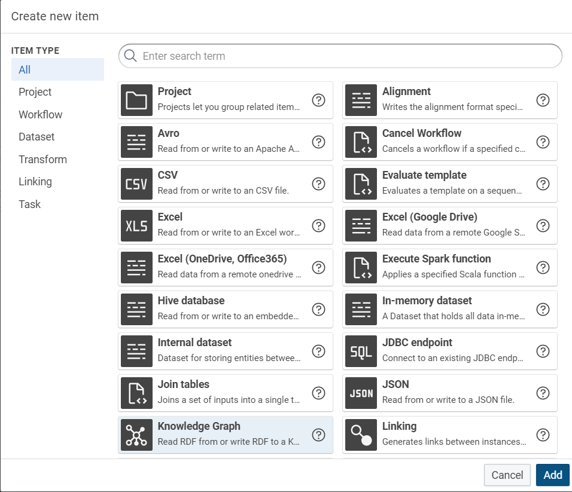

# Connect to Snowflake

## Introduction

eccenca Corporate Memory is a semantic data management platform that allows organizations to store, manage, and interconnect vast amounts of structured data.

Snowflake is a cloud-based data warehousing solution that provides a scalable and flexible platform for data storage and analysis.

The eccenca Corporate Memory platform can connect to Snowflake to take advantage of Snowflake’s scalability and flexibility for cloud data warehousing.
This connection allows organizations to store and manage large amounts of data in Snowflake while using eccenca Corporate Memory to link and interconnect with other data sources, such as databases and cloud applications, to form a comprehensive and unified view of all data assets.

By integrating Snowflake with eccenca Corporate Memory, organizations can achieve a centralized and unified data management system that allows them to gain a complete and accurate view of all their data assets.
This integration enables organizations to make informed decisions, improve their business processes, and drive growth and innovation by leveraging their data assets.

This tutorial contains the following step-by-step instructions to connect the Snowflake data-warehouse with eccenca corporate memory:

-   [1. Configure Custom JDBC Driver](#1-configure-custom-jdbc-driver)
-   [2. Create a database in snowflake](#2-create-a-database-in-snowflake)
-   [3. Create a project in eccenca Corporate Memory](#3-create-a-project-in-eccenca-corporate-memory)
-   [4. Create a transformation to build mapping rules](#4-create-a-transformation-to-build-mapping-rules)
-   [5. Create a knowledge graph](#5-create-a-knowledge-graph)

## Sample material

The following material is used in this tutorial, you should download the files and have them at hand throughout the tutorial:

-   The product data vocabulary [products_vocabulary.nt](products_vocabulary.nt)

## 1. Configure Custom JDBC Driver

To connect to the Snowflake cloud data warehouse a JDBC driver is required.

The SQL-Dataset of eccenca Corporate Memory can access any database that offers a (supported/tested) JDBC driver.
This happens partly via Apache Spark SQL but requires no Spark specific configuration for eccenca Corporate Memory.
For Snowflake supported (e.g. 3.13.30) JDBC drivers can be found at:

-   [MVN Repository](https://mvnrepository.com/artifact/net.snowflake/snowflake-jdbc/3.13.30) ([direct jar download](https://repo1.maven.org/maven2/net/snowflake/snowflake-jdbc/3.13.30/snowflake-jdbc-3.13.30.jar))
-   to verify and build yourself: [github.com/snowflakedb/snowflake-jdbc](https://github.com/snowflakedb/snowflake-jdbc)

To use the driver it needs to be part of the classpath of eccenca DataIntegration.
That can be achieved in multiple ways but it is recommended to register the driver via the `dataintegration.conf` configuration file.

There are 3 settings to specify:

1. The most important is to add the driver name to `spark.sql.options.jdbc.drivers` - a comma separated list of drivers.
    The names in this list are the same as the database name in its JDBC-connection string (i.e. snowflake for its connection URL which looks like `jdbc:snowflake://<account_identifier>.snowflakecomputing.com/?<connection_params>`).
2. Snowflake specific property for the jar file location: `spark.sql.options.jdbc.snowflake.jar="/location/for/snowflake-*-jdbc.jar"`
3. Snowflake specific property for the driver class name: `spark.sql.options.jdbc.snowflake.name="com.snowflake.client.jdbc.SnowflakeDriver"`

!!! example "Example configuration snippet"

    ```properties
    # …
    spark.sql.options {
        # …
        # configure snowflake JDBC driver
        jdbc.drivers = "snowflake"
        jdbc.snowflake.jar = ${ELDS_HOME}"/etc/dataintegration/conf/snowflake-jdbc-3.13.30.jar"
        jdbc.snowflake.name = "net.snowflake.client.jdbc.SnowflakeDriver"
        # …
    }
    # …
    ```

## 2. Create a database in snowflake

-   Login to Snowflake enter the **username** and **password**, then click on **Sign in**.

{ width="50%" class="bordered" }

-   Click on **Database** on the left side of the page.

{ class="bordered" }

-   Click on **+Database** on the right side of the page.

{ class="bordered" }

-   Type the database name **Product**, then click on **Create**.

{ width="50%" class="bordered" }

-   Click on database **product**, then click on **+Schema** on the right side of the page.

{ class="bordered" }

-   Type the schema name **products_vocabulary** and click on **Create**.

{ width="50%" class="bordered" }

-   Click on scheme **products_vocabulary** on the left side of the page then click on **Create** on the right side of the page, then click on **Table**, then select then **Standard**.

{ class="bordered" }

-   Click on schema name **products_vocabulary** on the left side of the page and type the  **sql query** for creating a table in the center, then click on **Run** on the right side of the page.

You can create the _PRODUCT_ table with the following SQL query:

```sql
CREATE TABLE product(
   product_id      VARCHAR(12) NOT NULL PRIMARY KEY
  ,product_name    VARCHAR(50) NOT NULL
  ,height          INTEGER  NOT NULL
  ,width           INTEGER  NOT NULL
  ,depth           INTEGER  NOT NULL
  ,weigth          INTEGER  NOT NULL
  ,product_manager VARCHAR(50) NOT NULL
  ,price           VARCHAR(10) NOT NULL
) ;
```

-   Type or copy the **SQL** query for creating a database in the table that is created, then click on **Run**.

{ class="bordered" }

In the **Worksheets** view (you might need to create a new worksheet), select the **product** database, the **products_vocabulary** schema and finally the **product** table.
Here you can populate some test data with the following SQL query:

??? example "INSERT query"

    ```sql
    INSERT INTO product(product_id,product_name,height,width,depth,weigth,product_manager,price) VALUES
     ('I241-8776317','Strain Compensator',12,68,15,8,'Baldwin.Dirksen@company.org','0,50 EUR')
    ,('D215-3449390','Gauge Crystal',77,58,19,15,'Wanja.Hoffmann@company.org','2,00 EUR')
    ,('P925-8919074','Inductor Switch',72,61,13,8,'Sabrina.Geiger@company.org','1,86 EUR')
    ,('P516-8211068','Film Multiplexer Rheostat Warp',80,57,15,6,'Kristen.Bauers@company.org','0,43 EUR')
    ,('N558-1730215','Flow Coil Dipole Strain',43,12,14,14,'Kevin.Feigenbaum@company.org','1,62 EUR')
    ,('Y274-1029755','Polymer Transistor Transformer',80,80,12,7,'Adolfina.Hoch@company.org','4,49 EUR')
    ,('U360-2815908','Potentiometer Rheostat',65,19,14,3,'Manfred.Foth@company.org','3,09 EUR')
    ,('O662-4012383','Resistor Crystal Encoder',70,60,18,19,'Karen.Brant@company.org','3,17 EUR')
    ,('D642-3058791','Polymer LCD Dipole Switch',33,68,17,6,'Valda.Everhart@company.org','1,01 EUR')
    ,('K167-1377420','Coil Potentiometer Transducer',58,16,17,5,'Siglind.Brinkerhoff@company.org','2,66 EUR')
    ,('C977-9932879','Memristor Encoder',30,22,19,2,'Siglind.Brinkerhoff@company.org','3,79 EUR')
    ,('E585-3605747','Resistor Dipole',30,67,16,6,'Heinrich.Hoch@company.org','1,09 EUR')
    ,('Q523-3322183','Resistor Gauge Capacitor',13,46,13,3,'Lambert.Faust@company.org','2,76 EUR')
    ,('G934-5417476','Aluminum Multiplexer Memristor Transformer',57,44,16,17,'Erhard.Fried@company.org','1,84 EUR')
    ,('N180-3300253','Encoder Transducer',57,46,17,9,'Rebecca.Hall@company.org','1,35 EUR')
    ,('X874-7370643','Network Resistor',54,29,20,10,'Franz.Kornhaeusel@company.org','1,94 EUR')
    ,('H745-5284103','Gauge Breaker Compensator',76,51,17,5,'Manfred.Foth@company.org','0,23 EUR')
    ,('L275-4377274','Inductor Transformer',27,52,19,6,'Lambert.Faust@company.org','1,23 EUR')
    ,('R181-9365849','Log-periodic LCD Transformer',64,52,15,4,'Jarvis.Jans@company.org','2,40 EUR')
    ,('U341-6920661','Capacitor Transducer',69,63,14,7,'Franziska.Acker@company.org','5,55 EUR')
    ,('K764-8378288','Aluminum Resistor Warp',66,19,13,8,'Nadia.Schubert@company.org','5,06 EUR')
    ,('I409-8215134','Film LCD Transducer',67,17,20,1,'Baldwin.Dirksen@company.org','2,46 EUR')
    ,('X510-5668523','Coil Resistor Encoder',70,14,12,3,'Karch.Moeller@company.org','3,60 EUR')
    ,('T792-4232124','Encoder',26,14,19,6,'Ulrik.Denzel@company.org','5,74 EUR')
    ,('Y134-8040496','Oscillator Memristor',37,76,20,11,'Kristen.Bauers@company.org','1,85 EUR')
    ,('V436-9027098','Polymer Gauge Crystal',37,14,14,5,'Gretel.Roth@company.org','1,97 EUR')
    ,('P844-4114854','Field-effect Strain Compensator',42,73,12,19,'Herr.Haan.Bader@company.org','0,96 EUR')
    ,('H389-3327633','Flow Driver Strain',36,36,11,14,'Miles.Amsel@company.org','0,16 EUR')
    ,('J259-5185660','Memristor Encoder',40,55,12,16,'Heinrich.Hoch@company.org','4,86 EUR')
    ,('I590-4406621','Heisenberg Coil Resistor Meter',32,78,17,12,'Sabrina.Bayer@company.org','0,60 EUR')
    ,('A816-3021832','Rheostat Breaker',19,28,14,18,'Lili.Geier@company.org','3,86 EUR')
    ,('E424-4700158','Rheostat Compensator Meter',72,58,20,1,'Sabrina.Bayer@company.org','1,80 EUR')
    ,('K334-8882985','Network Resonator Encoder',21,49,17,10,'Bert.Blumstein@company.org','3,09 EUR')
    ,('H690-4065164','Heisenberg Oscillator Memristor Meter',47,55,20,1,'Jarvis.Jans@company.org','1,81 EUR')
    ,('J625-3464908','Sensor Crystal Warp',24,57,11,17,'Thomas.Mueller@company.org','0,75 EUR')
    ,('V104-2082346','Flow Dipole Transformer',64,73,17,12,'Anamchara.Foerstner@company.org','3,36 EUR')
    ,('R298-1578179','Gauge Strain Breaker',30,17,12,14,'Reiner.Widmann@company.org','4,45 EUR')
    ,('O761-2575092','Switch Transformer Transducer',51,71,20,13,'Nadia.Schubert@company.org','4,18 EUR')
    ,('N560-4369045','Resistor Compensator',21,57,11,4,'Herr.Burgh.Eichel@company.org','2,61 EUR')
    ,('D903-5325470','Flow Crystal Rheostat',70,17,13,20,'Franziska.Acker@company.org','0,45 EUR')
    ,('Y632-7948469','Multiplexer Coil',14,67,13,5,'Lili.Geier@company.org','2,24 EUR')
    ,('O204-4321819','Field-effect Resistor Potentiometer Rheostat',76,14,19,7,'Karch.Moeller@company.org','5,86 EUR')
    ,('C527-6179790','LCD Oscillator Sensor',67,61,13,2,'Arnelle.Gerber@company.org','0,16 EUR')
    ,('A981-3634031','Driver Memristor',50,59,20,13,'Jarvis.Jans@company.org','5,55 EUR')
    ,('R774-2450170','Log-periodic Network Warp',16,19,13,9,'Ida.Halle@company.org','5,23 EUR')
    ,('E709-4829800','Transducer Warp',18,14,13,18,'Henny.Foth@company.org','4,51 EUR')
    ,('W268-8954866','Gauge Warp',15,24,11,9,'Ida.Halle@company.org','3,80 EUR')
    ,('J628-9483622','Field-effect Transistor Crystal',77,76,13,16,'Emil.Gotti@company.org','0,16 EUR')
    ,('E661-6880042','Crystal Rheostat Breaker',76,39,20,10,'Adolfina.Hoch@company.org','2,60 EUR')
    ,('F553-8518538','Aluminum Sensor Capacitor',52,39,14,3,'Lambert.Faust@company.org','2,99 EUR')
    ,('P982-4384687','Oscillator Sensor Resonator',47,62,11,4,'Franz.Kornhaeusel@company.org','4,40 EUR')
    ,('R187-6602262','Film Resistor Crystal Encoder',61,67,11,8,'Reiner.Widmann@company.org','1,27 EUR')
    ,('N478-8857002','Transformer Capacitor Breaker',19,32,11,12,'Nadia.Schubert@company.org','3,33 EUR')
    ,('I884-8763759','Ceramic Inductor Breaker',69,22,19,11,'Bert.Blumstein@company.org','2,64 EUR')
    ,('F424-2241578','Strain Meter',66,79,11,9,'Elena.Herzog@company.org','1,80 EUR')
    ,('J178-5863159','Crystal Transducer',38,13,20,7,'Waldtraud.Kuttner@company.org','4,82 EUR')
    ,('C699-1385746','Resistor Driver Breaker',59,59,17,4,'Herr.Haan.Bader@company.org','5,97 EUR')
    ,('L433-1376544','LCD Gauge Warp',25,12,18,7,'Liese.Adam@company.org','0,78 EUR')
    ,('O270-3409076','Flow Network Dipole Warp',55,33,19,4,'Corinna.Ludwig@company.org','2,05 EUR')
    ,('T592-5377501','Field-effect Strain Capacitor',13,63,13,5,'Berlin.Schulz@company.org','4,28 EUR')
    ,('F383-6450755','Strain Encoder',33,53,11,17,'Frauke.Faerber@company.org','0,25 EUR')
    ,('K313-8452822','Heisenberg Crystal Transformer',15,71,18,17,'Franz.Kornhaeusel@company.org','2,92 EUR')
    ,('C844-8161134','Crystal Compensator',19,39,13,11,'Miles.Amsel@company.org','2,90 EUR')
    ,('E296-9034321','Heisenberg Inductor Breaker Encoder',63,11,12,6,'Corinna.Ludwig@company.org','4,09 EUR')
    ,('A548-4778785','Coil Potentiometer Dipole',45,36,18,20,'Frauke.Faerber@company.org','0,41 EUR')
    ,('E563-8448172','Warp Capacitor Meter',20,57,13,14,'Lili.Geier@company.org','5,78 EUR')
    ,('E267-7496794','Crystal Rheostat',34,47,11,6,'Frau.Irmalinda‘.Becker@company.org','1,11 EUR')
    ,('V881-4674578','Planck Dipole Driver Crystal',73,24,16,2,'Dietlinde.Boehme@company.org','4,23 EUR')
    ,('R112-2955867','Oscillator Encoder Compensator',53,67,13,14,'Sylvester.Brant@company.org','0,64 EUR')
    ,('H577-3512936','Film Coil Crystal Strain',52,46,17,15,'Arnelle.Gerber@company.org','0,10 EUR')
    ,('U990-5234138','LCD Inductor',15,78,16,15,'Anamchara.Foerstner@company.org','1,52 EUR')
    ,('E358-6492536','Resistor Crystal',40,69,11,15,'Reiner.Widmann@company.org','2,18 EUR')
    ,('R287-3749176','Log-periodic Memristor Encoder',64,14,17,12,'Manfred.Foth@company.org','3,78 EUR')
    ,('N915-2423517','Aluminum Encoder Transformer Meter',47,75,20,1,'Frauke.Faerber@company.org','4,02 EUR')
    ,('C770-9751514','Transistor Resonator Breaker',74,45,17,1,'Xochitl.Aue@company.org','4,97 EUR')
    ,('X863-5063447','Coil Potentiometer Transducer',41,53,19,2,'Thomas.Mueller@company.org','5,69 EUR')
    ,('Z553-4314789','Dipole Capacitor',76,11,15,1,'Marius.Fux@company.org','3,23 EUR')
    ,('M244-7026376','Coil Compensator',34,55,17,11,'Sabrina.Geiger@company.org','3,22 EUR')
    ,('J859-3337215','Inductor Memristor',74,50,13,14,'Liese.Adam@company.org','5,59 EUR')
    ,('R786-6586508','Coil LCD Rheostat',42,32,19,19,'Thomas.Mueller@company.org','1,79 EUR')
    ,('G858-9670227','Network Transducer',57,39,15,5,'Siglind.Brinkerhoff@company.org','0,38 EUR')
    ,('J884-3242067','Network Inductor',29,26,18,3,'Sabrina.Geiger@company.org','2,57 EUR')
    ,('F812-7003324','Rheostat Compensator',31,56,15,18,'Baldwin.Guenther@company.org','1,73 EUR')
    ,('U507-1853778','LCD Dipole Capacitor',45,78,18,13,'Lili.Geier@company.org','2,93 EUR')
    ,('M253-4759368','Multiplexer Resonator',71,66,12,1,'Ratt.Hartmann@company.org','4,16 EUR')
    ,('Y185-1184618','Gauge Compensator',12,38,14,12,'Waldtraud.Kuttner@company.org','1,64 EUR')
    ,('J481-5585150','Multiplexer Potentiometer Strain',77,19,14,9,'Wolfgang.Martin@company.org','5,81 EUR')
    ,('Z452-1805723','Capacitor Switch',34,67,17,11,'Yanka.Schreiber@company.org','3,24 EUR')
    ,('F525-2265345','Oscillator Driver',12,39,13,19,'Sigmund.Gros@company.org','0,85 EUR')
    ,('N279-5579447','Sensor Potentiometer Dipole',30,16,17,12,'Sigmund.Gros@company.org','0,28 EUR')
    ,('F326-8777433','Polymer Inductor Transistor Warp',23,22,18,18,'Herr.Haan.Bader@company.org','2,68 EUR')
    ,('A998-9941987','Flow Compensator',55,18,11,1,'Herr.Haan.Bader@company.org','5,29 EUR')
    ,('F611-6226129','Phase LCD Dipole',59,62,12,3,'Jarvis.Jans@company.org','5,33 EUR')
    ,('I314-5607546','Polymer Resistor Dipole Gauge',57,69,16,7,'Yanka.Schreiber@company.org','5,06 EUR')
    ,('W988-3702091','Inductor Rheostat Warp',79,35,12,12,'Kevin.Feigenbaum@company.org','5,65 EUR')
    ,('X663-2500265','Transformer Transducer',47,27,19,1,'Arnelle.Gerber@company.org','4,78 EUR')
    ,('M750-1800450','Crystal Encoder',26,51,14,10,'Wolfgang.Martin@company.org','2,68 EUR')
    ,('W156-1748173','Crystal Rheostat Warp',58,11,11,13,'Jarvis.Jans@company.org','2,50 EUR')
    ,('Z739-3332146','Polymer LCD Transistor',39,58,17,7,'Erhard.Fried@company.org','3,29 EUR')
    ,('J872-7568181','Encoder Breaker',18,37,16,8,'Berlin.Schulz@company.org','1,22 EUR')
    ,('L485-8083934','Inductor Warp Switch',68,20,15,7,'Valda.Everhart@company.org','0,78 EUR')
    ,('J628-3649699','Breaker Meter',78,34,17,15,'Nadia.Schubert@company.org','4,21 EUR')
    ,('T831-2675171','Planck Coil Oscillator',40,24,13,20,'Bert.Blumstein@company.org','2,26 EUR')
    ,('B436-6020212','Potentiometer Crystal',59,18,14,19,'Minnie.Kuehn@company.org','3,59 EUR')
    ,('L691-1489542','Phase Multiplexer Driver Capacitor',62,55,13,14,'Lukas.Gerver@company.org','3,77 EUR')
    ,('T808-9704137','Gauge Encoder Breaker',48,39,18,9,'Karch.Moeller@company.org','3,22 EUR')
    ,('P774-3681449','Resonator Switch',52,35,13,19,'Karen.Brant@company.org','1,82 EUR')
    ,('I264-7314323','Film Inductor Memristor',66,24,19,11,'Yanka.Schreiber@company.org','3,39 EUR')
    ,('R477-9013874','Coil Warp',76,46,17,6,'Berlin.Schulz@company.org','5,88 EUR')
    ,('Y467-5818685','Memristor Compensator',22,30,18,1,'Bert.Blumstein@company.org','3,93 EUR')
    ,('N673-7692368','Driver Resonator',65,60,15,13,'Nadia.Schubert@company.org','5,57 EUR')
    ,('E576-3538706','Encoder Breaker',45,55,14,8,'Lili.Geier@company.org','4,27 EUR')
    ,('B507-9536014','LCD Network',48,49,17,11,'Sylvester.Brant@company.org','1,76 EUR')
    ,('P253-1288849','Dipole Compensator',55,24,12,15,'Sylvester.Brant@company.org','0,98 EUR')
    ,('S418-2584457','Bipolar-junction Dipole',17,47,13,16,'Ratt.Beyer@company.org','4,32 EUR')
    ,('V940-2277346','Aluminum Oscillator Potentiometer Encoder',78,52,18,2,'Manfred.Foth@company.org','4,16 EUR')
    ,('P323-7286189','Sensor Encoder Warp',16,27,16,14,'Reiner.Widmann@company.org','1,66 EUR')
    ,('T341-6404509','LCD Transducer Meter',78,29,20,17,'Marius.Fux@company.org','0,39 EUR')
    ,('S388-7116324','Polymer Inductor Transistor Oscillator',44,66,11,11,'Emil.Gotti@company.org','1,70 EUR')
    ,('G439-8153345','Memristor Driver Breaker',52,49,13,10,'Henny.Foth@company.org','2,33 EUR')
    ,('F496-3982542','Resonator Rheostat Breaker',67,27,11,16,'Herr.Burgh.Eichel@company.org','2,79 EUR')
    ,('G494-2537921','Coil Encoder Switch',62,59,13,11,'Kevin.Feigenbaum@company.org','3,16 EUR')
    ,('D516-5106885','Driver Rheostat Capacitor',54,42,13,1,'Herr.Burgh.Eichel@company.org','0,96 EUR')
    ,('R902-1645052','Film Network Gauge Compensator',72,65,11,8,'Emil.Gotti@company.org','0,65 EUR')
    ,('P494-3529490','Ceramic Crystal Switch',76,64,12,9,'Henny.Foth@company.org','1,72 EUR')
    ,('K199-8327732','Phase Transistor Crystal',49,79,13,12,'Karen.Brant@company.org','3,60 EUR')
    ,('C200-5363446','Network Transducer',27,59,12,3,'Ratt.Beyer@company.org','4,55 EUR')
    ,('P785-3702584','Log-periodic Multiplexer Potentiometer Memristor',59,26,18,6,'Sylvester.Brant@company.org','4,57 EUR')
    ,('L940-7353182','Resonator Warp',41,28,18,20,'Ida.Halle@company.org','3,21 EUR')
    ,('H747-8053953','Resonator Meter',25,37,16,1,'Elisabeth.Harman@company.org','0,52 EUR')
    ,('U681-7406159','Film Driver Switch',68,73,14,8,'Sabrina.Bayer@company.org','0,27 EUR')
    ,('A360-3041803','Inductor Transformer Warp',33,62,14,16,'Marius.Fux@company.org','4,89 EUR')
    ,('F675-6890144','Resistor Inductor Strain',66,31,12,10,'Arnelle.Gerber@company.org','1,06 EUR')
    ,('E938-3071637','LCD Dipole',15,24,15,17,'Ida.Halle@company.org','5,44 EUR')
    ,('Q694-8417409','Sensor Crystal',58,55,15,9,'Baldwin.Dirksen@company.org','2,44 EUR')
    ,('K780-7736227','Driver Rheostat',18,36,14,20,'Ida.Halle@company.org','2,95 EUR')
    ,('E365-4375068','Strain Compensator',72,28,17,17,'Bert.Blumstein@company.org','2,09 EUR')
    ,('M774-4843227','Breaker Transducer',38,21,18,18,'Dietlinde.Boehme@company.org','1,32 EUR')
    ,('A994-9085459','LCD Compensator',41,49,18,5,'Franziska.Acker@company.org','4,08 EUR')
    ,('X204-1803083','Crystal Strain Compensator',18,33,14,20,'Karen.Brant@company.org','5,67 EUR')
    ,('H197-3970480','Coil Gauge Transformer',56,72,19,6,'Valda.Everhart@company.org','5,55 EUR')
    ,('L827-5554014','Flow Oscillator Dipole',80,15,18,8,'Corinna.Ludwig@company.org','5,58 EUR')
    ,('L103-3316729','Multiplexer Potentiometer',49,66,12,9,'Siglind.Brinkerhoff@company.org','3,69 EUR')
    ,('C171-3616793','Coil Resonator Capacitor',16,70,12,8,'Wanja.Hoffmann@company.org','2,34 EUR')
    ,('W780-8057984','Planck Transformer Compensator',52,67,11,20,'Kevin.Feigenbaum@company.org','2,46 EUR')
    ,('I395-2294150','Gauge Resonator',80,65,13,10,'Heinrich.Hoch@company.org','0,00 EUR')
    ,('M367-8246717','Potentiometer Gauge Warp',56,54,20,7,'Miles.Amsel@company.org','1,07 EUR')
    ,('Z165-5413714','Gauge Transducer',13,59,16,10,'Franz.Kornhaeusel@company.org','2,05 EUR')
    ,('E246-3200290','Field-effect Network Rheostat',75,28,12,13,'Dietlinde.Boehme@company.org','1,06 EUR')
    ,('U733-5722614','Network Breaker Compensator',62,17,13,5,'Ulrik.Denzel@company.org','2,14 EUR')
    ,('T735-5591779','Memristor Encoder',48,34,20,12,'Manfred.Foth@company.org','0,22 EUR')
    ,('W726-4190110','Ceramic Multiplexer Transistor LCD',43,41,12,10,'Ratt.Hartmann@company.org','4,90 EUR')
    ,('F204-7999856','Meter Warp',52,37,14,8,'Elisabeth.Harman@company.org','5,99 EUR')
    ,('N773-8807466','Multiplexer Switch',79,18,17,18,'Elisabeth.Harman@company.org','5,77 EUR')
    ,('L984-7886943','Resistor Oscillator',23,33,13,8,'Sabrina.Geiger@company.org','0,18 EUR')
    ,('F735-3322876','Planck Potentiometer Capacitor',68,15,19,13,'Xochitl.Aue@company.org','0,95 EUR')
    ,('N832-1055352','Coil Driver',25,13,12,13,'Elisabeth.Harman@company.org','3,48 EUR')
    ,('R410-7957011','Planck Network Dipole',22,79,15,2,'Emil.Gotti@company.org','5,07 EUR')
    ,('Z373-9393076','Resonator Transformer',40,71,17,10,'Franziska.Acker@company.org','5,45 EUR')
    ,('H956-3958783','Aluminum Resistor Transistor Transformer',18,40,11,14,'Elisabeth.Harman@company.org','4,57 EUR')
    ,('H482-4970770','Transistor Rheostat Switch',21,71,11,1,'Marius.Fux@company.org','2,84 EUR')
    ,('D483-7794770','Memristor Gauge',20,69,20,1,'Herr.Haan.Bader@company.org','2,12 EUR')
    ,('I892-8435352','Heisenberg LCD Driver',55,30,11,3,'Sigmund.Gros@company.org','4,19 EUR')
    ,('G547-8961166','Bipolar-junction Oscillator Compensator',51,51,12,15,'Siglind.Brinkerhoff@company.org','0,81 EUR')
    ,('B161-8326597','Inductor Potentiometer',65,27,20,14,'Waldtraud.Kuttner@company.org','5,68 EUR')
    ,('L760-6079543','Resistor Breaker',24,35,17,4,'Thomas.Mueller@company.org','1,49 EUR')
    ,('O256-6180697','Heisenberg Rheostat Switch',31,49,17,2,'Bert.Blumstein@company.org','5,42 EUR')
    ,('V285-7238338','LCD Inductor',61,25,12,14,'Bert.Blumstein@company.org','2,55 EUR')
    ,('Q992-9818584','Flow Oscillator Inductor Compensator',12,27,18,2,'Nadia.Schubert@company.org','3,20 EUR')
    ,('Y695-6135491','Polymer Warp',76,49,20,16,'Arendt.Beitel@company.org','4,59 EUR')
    ,('Y966-2972645','Field-effect Driver',30,42,14,4,'Wolfgang.Martin@company.org','0,89 EUR')
    ,('W434-6067873','Network Encoder',24,65,11,17,'Gretel.Roth@company.org','1,87 EUR')
    ,('U889-6360502','Encoder Capacitor Compensator',40,35,12,19,'Adolfina.Hoch@company.org','5,07 EUR')
    ,('Z170-8513315','Sensor Crystal Resonator',23,52,16,20,'Anamchara.Foerstner@company.org','5,57 EUR')
    ,('C409-9349178','Multiplexer Rheostat Encoder',35,80,15,6,'Ulrik.Denzel@company.org','4,77 EUR')
    ,('B131-7597100','LCD Sensor Transducer',51,44,16,18,'Sabrina.Geiger@company.org','3,70 EUR')
    ,('N869-4606944','Film Memristor Compensator',57,63,16,18,'Sigmund.Gros@company.org','3,11 EUR')
    ,('H973-6742173','Bipolar-junction Transistor Transformer',78,75,17,15,'Arendt.Beitel@company.org','0,21 EUR')
    ,('M210-9470943','Network Transducer',75,27,16,6,'Siglind.Brinkerhoff@company.org','4,94 EUR')
    ,('J209-5198739','Phase Memristor Capacitor',15,28,14,4,'Wolfgang.Martin@company.org','3,87 EUR')
    ,('L205-6345377','Planck Coil Potentiometer',51,57,15,10,'Kevin.Feigenbaum@company.org','4,65 EUR')
    ,('C633-6541408','Field-effect Potentiometer Transformer Switch',59,14,12,5,'Adolfina.Hoch@company.org','5,28 EUR')
    ,('G205-5318100','LCD Gauge',41,79,11,15,'Elena.Herzog@company.org','5,90 EUR')
    ,('R135-6598379','Capacitor Meter',54,33,16,8,'Reiner.Widmann@company.org','5,52 EUR')
    ,('Z222-5977620','Transformer Switch',80,14,14,13,'Minnie.Kuehn@company.org','4,94 EUR')
    ,('V787-2710358','Ceramic Sensor Encoder',62,71,18,5,'Jarvis.Jans@company.org','4,18 EUR')
    ,('W892-1983772','Log-periodic Coil Sensor Transducer',55,68,12,12,'Yanka.Schreiber@company.org','4,86 EUR')
    ,('Y440-4146454','Resistor Memristor',77,74,18,12,'Arendt.Beitel@company.org','1,40 EUR')
    ,('E529-9160800','Network Inductor',16,62,12,19,'Arendt.Beitel@company.org','3,83 EUR')
    ,('E355-4376121','Film Oscillator Dipole',57,50,17,2,'Karch.Moeller@company.org','5,53 EUR')
    ,('W988-9267091','Transistor Strain',66,58,11,3,'Sabrina.Geiger@company.org','1,40 EUR')
    ,('X517-5656435','Multiplexer Capacitor',35,32,15,15,'Karen.Brant@company.org','5,45 EUR')
    ,('J824-9483042','Dipole Resonator Breaker',38,38,18,17,'Manfred.Foth@company.org','2,58 EUR')
    ,('M292-6646786','Phase Sensor Crystal Capacitor',33,64,12,19,'Emil.Gotti@company.org','4,18 EUR')
    ,('M703-4614993','Coil Potentiometer Transducer',77,66,13,4,'Miles.Amsel@company.org','5,11 EUR')
    ,('P903-7514284','Dipole Capacitor',47,56,20,14,'Reiner.Widmann@company.org','5,97 EUR')
    ,('I122-1391097','Inductor Memristor Oscillator',40,32,13,19,'Karch.Moeller@company.org','3,67 EUR')
    ,('D817-8084362','Multiplexer Resistor Compensator',74,79,20,19,'Heinrich.Hoch@company.org','2,53 EUR')
    ,('W744-1785439','Film Multiplexer Dipole Strain',62,74,19,8,'Ulrik.Denzel@company.org','1,98 EUR')
    ,('C402-5072074','Coil Inductor Encoder',27,49,17,12,'Herr.Haan.Bader@company.org','0,76 EUR')
    ,('E660-5579477','Film Oscillator Transistor Capacitor',41,38,14,1,'Berlin.Schulz@company.org','0,38 EUR')
    ,('W776-4360677','Field-effect Transducer Meter',75,77,14,13,'Franziska.Acker@company.org','3,26 EUR')
    ,('F179-4094930','Bipolar-junction Sensor Crystal',27,24,19,12,'Adolfina.Hoch@company.org','2,96 EUR')
    ,('Z293-3675192','Ceramic Potentiometer Gauge Encoder',79,56,13,7,'Nadia.Schubert@company.org','2,33 EUR')
    ,('B818-8738213','Crystal Capacitor',37,52,11,17,'Berlin.Schulz@company.org','2,45 EUR')
    ,('A243-3332548','Bipolar-junction Crystal Meter',43,46,17,10,'Ulrik.Denzel@company.org','3,18 EUR')
    ,('G420-6271055','Potentiometer Driver',70,36,17,13,'Kristen.Bauers@company.org','1,82 EUR')
    ,('R930-5997475','Coil Driver Capacitor',31,61,15,13,'Minnie.Kuehn@company.org','4,33 EUR')
    ,('J129-5121523','Inductor Driver Transducer',20,63,18,11,'Reiner.Widmann@company.org','0,23 EUR')
    ,('Y162-1430218','Ceramic Dipole Memristor Breaker',28,63,13,11,'Jarvis.Jans@company.org','4,11 EUR')
    ,('K630-6895992','LCD Gauge Switch',34,58,13,17,'Ratt.Hartmann@company.org','1,58 EUR')
    ,('Z190-5822042','Polymer Multiplexer Crystal Capacitor',48,60,12,10,'Jarvis.Jans@company.org','0,20 EUR')
    ,('J734-1368842','Inductor Gauge Meter',55,70,18,7,'Baldwin.Guenther@company.org','4,99 EUR')
    ,('H664-9736043','Log-periodic Potentiometer Resonator',18,40,20,19,'Lambert.Faust@company.org','5,02 EUR')
    ,('C614-4108640','Log-periodic LCD Breaker',27,75,18,14,'Bert.Blumstein@company.org','1,79 EUR')
    ,('N377-1619045','Capacitor Encoder Compensator',47,70,13,2,'Corinna.Ludwig@company.org','5,70 EUR')
    ,('S424-4152456','Potentiometer',22,17,19,12,'Lambert.Faust@company.org','0,45 EUR')
    ,('T319-6530857','Sensor Transducer',43,41,20,15,'Sigmund.Gros@company.org','1,37 EUR')
    ,('S680-6146547','Rheostat Capacitor',68,57,20,5,'Erhard.Fried@company.org','1,04 EUR')
    ,('V437-5667353','Sensor Driver Strain',36,14,20,3,'Emil.Gotti@company.org','0,84 EUR')
    ,('P717-5835879','Rheostat Transformer',22,43,13,14,'Ulrik.Denzel@company.org','5,31 EUR')
    ,('X234-5007377','Polymer Multiplexer Potentiometer Resistor',21,73,19,7,'Dieterich.Blau@company.org','5,38 EUR')
    ,('V673-7881809','Heisenberg Resistor Resonator Compensator',57,56,15,13,'Dieterich.Blau@company.org','0,26 EUR')
    ,('E471-9316820','Bipolar-junction Coil Dipole Transformer',65,56,14,14,'Anamchara.Foerstner@company.org','2,66 EUR')
    ,('S429-3352092','Dipole Switch',77,41,14,17,'Henny.Foth@company.org','2,16 EUR')
    ,('E189-1255687','LCD Potentiometer Breaker',79,13,13,18,'Rebecca.Hall@company.org','2,68 EUR')
    ,('Z617-4660142','Ceramic Potentiometer Compensator',15,41,16,12,'Arnelle.Gerber@company.org','3,37 EUR')
    ,('W493-4799721','Network Warp',64,50,16,20,'Kristen.Bauers@company.org','5,69 EUR')
    ,('H338-7439287','Field-effect Resistor Potentiometer Meter',21,51,15,2,'Franz.Kornhaeusel@company.org','1,69 EUR')
    ,('T348-1607769','LCD Resistor Sensor',36,14,16,10,'Kristen.Bauers@company.org','1,27 EUR')
    ,('B365-4394675','Flow Gauge Resonator Breaker',27,13,13,12,'Kevin.Feigenbaum@company.org','2,50 EUR')
    ,('R231-2442628','Transformer Transducer',58,20,14,9,'Frau.Irmalinda‘.Becker@company.org','3,29 EUR')
    ,('R383-8831143','Flow Potentiometer Resonator',41,47,12,16,'Franziska.Acker@company.org','1,14 EUR')
    ,('V509-7873455','LCD Potentiometer Transformer',61,14,17,13,'Yanka.Schreiber@company.org','2,40 EUR')
    ,('W903-2104201','Bipolar-junction Encoder Compensator',52,66,15,15,'Baldwin.Guenther@company.org','5,28 EUR')
    ,('R675-2629492','Sensor Breaker Warp',56,67,13,7,'Emil.Gotti@company.org','1,81 EUR')
    ,('N823-7028680','LCD Potentiometer Switch',58,57,18,9,'Arendt.Beitel@company.org','3,76 EUR')
    ,('Y616-2122188','Potentiometer Driver',49,63,11,14,'Henny.Foth@company.org','5,42 EUR')
    ,('H426-2605604','Film Network Multiplexer Compensator',15,22,12,2,'Miles.Amsel@company.org','2,57 EUR')
    ,('N105-3985051','Multiplexer Resistor',71,49,19,20,'Lukas.Gerver@company.org','1,83 EUR')
    ,('S915-2398244','Bipolar-junction Capacitor Crystal Breaker',41,76,19,19,'Nadia.Schubert@company.org','4,52 EUR')
    ,('V178-8820348','LCD Inductor',60,16,20,11,'Herr.Burgh.Eichel@company.org','2,30 EUR')
    ,('H660-8942410','Sensor Warp',39,53,20,2,'Waldtraud.Kuttner@company.org','4,24 EUR')
    ,('W769-8151254','Field-effect LCD Multiplexer Capacitor',66,40,12,12,'Thomas.Mueller@company.org','3,57 EUR')
    ,('I571-8597034','Transistor Compensator',51,74,17,7,'Manfred.Foth@company.org','0,49 EUR')
    ,('D965-2729258','Film Sensor Switch',48,68,13,3,'Elena.Herzog@company.org','0,03 EUR')
    ,('D605-8095260','Network Inductor',38,64,19,18,'Gretel.Roth@company.org','2,31 EUR')
    ,('A837-2549775','LCD Gauge',25,46,18,19,'Siglind.Brinkerhoff@company.org','3,23 EUR')
    ,('R599-8820686','Film Sensor Dipole',31,67,14,5,'Liese.Adam@company.org','2,58 EUR')
    ,('Y728-2083256','Gauge Crystal Encoder',51,31,13,14,'Ratt.Hartmann@company.org','1,74 EUR')
    ,('C799-8367143','Coil Strain Meter',32,50,20,4,'Frau.Irmalinda‘.Becker@company.org','2,28 EUR')
    ,('X148-3354774','Multiplexer Compensator',25,44,18,3,'Lili.Geier@company.org','2,04 EUR')
    ,('I966-3317124','Dipole Breaker Transducer',14,51,14,7,'Elena.Herzog@company.org','3,64 EUR')
    ,('X946-6308579','Field-effect Resistor Encoder',43,48,12,11,'Baldwin.Guenther@company.org','4,00 EUR')
    ,('D690-6928884','Flow Network Oscillator Encoder',71,50,17,3,'Sabrina.Bayer@company.org','1,54 EUR')
    ,('F565-7076382','Dipole Resonator Transducer',54,21,19,10,'Manfred.Foth@company.org','1,40 EUR')
    ,('U714-9883090','Aluminum Multiplexer LCD Capacitor',73,33,13,1,'Wanja.Hoffmann@company.org','1,07 EUR')
    ,('P228-7323906','Bipolar-junction Network Inductor Oscillator',36,38,12,3,'Anamchara.Foerstner@company.org','1,39 EUR')
    ,('C916-8310851','Bipolar-junction Oscillator Transformer',34,23,18,19,'Sabrina.Geiger@company.org','1,71 EUR')
    ,('N269-8309461','LCD Potentiometer Warp',41,17,12,9,'Sabrina.Bayer@company.org','4,99 EUR')
    ,('B120-9942467','Coil Driver',45,66,12,3,'Henny.Foth@company.org','1,06 EUR')
    ,('U967-6553099','Bipolar-junction Gauge Warp',52,80,14,19,'Sabrina.Geiger@company.org','2,82 EUR')
    ,('V759-7427700','LCD Dipole Resonator',53,29,17,19,'Ratt.Beyer@company.org','2,21 EUR')
    ,('N583-9253059','Dipole Breaker',68,12,17,7,'Manfred.Foth@company.org','1,06 EUR')
    ,('Z775-8853334','Aluminum Multiplexer Dipole',33,63,18,8,'Nadia.Schubert@company.org','3,89 EUR')
    ,('E917-4866901','Capacitor Warp',15,52,14,5,'Dietlinde.Boehme@company.org','0,42 EUR')
    ,('M175-2087039','Film Oscillator',28,70,17,1,'Franziska.Acker@company.org','2,18 EUR')
    ,('W985-1612943','Aluminum Switch',31,38,13,13,'Sylvester.Brant@company.org','1,48 EUR')
    ,('C119-5354812','Planck Sensor Strain',19,68,18,11,'Sabrina.Geiger@company.org','0,40 EUR')
    ,('L619-5092078','Crystal Resonator Transformer',44,66,16,20,'Wolfgang.Martin@company.org','5,97 EUR')
    ,('E652-6887116','Gauge Compensator',26,56,17,3,'Franziska.Acker@company.org','2,29 EUR')
    ,('E617-6594892','Field-effect Driver Strain Compensator',37,56,13,8,'Wanja.Hoffmann@company.org','4,38 EUR')
    ,('M449-5231838','Transistor Crystal',50,30,17,12,'Miles.Amsel@company.org','4,22 EUR')
    ,('J856-1304399','Resistor Transducer',72,54,11,13,'Xochitl.Aue@company.org','2,88 EUR')
    ,('W295-9452529','Sensor Encoder',67,72,14,7,'Lukas.Gerver@company.org','5,90 EUR')
    ,('X235-5406274','Sensor Transducer',15,34,16,7,'Franz.Kornhaeusel@company.org','3,00 EUR')
    ,('F330-3792974','Coil',51,23,12,5,'Sigmund.Gros@company.org','3,13 EUR')
    ,('S840-8753783','Polymer Multiplexer Sensor',80,21,20,14,'Yanka.Schreiber@company.org','0,36 EUR')
    ,('A607-3251492','Bipolar-junction Transistor Compensator',63,51,11,6,'Bert.Blumstein@company.org','2,79 EUR')
    ,('T814-8858070','Multiplexer Transistor',40,60,19,16,'Karch.Moeller@company.org','2,54 EUR')
    ,('B541-8783084','Flow Potentiometer Gauge',30,28,12,14,'Minnie.Kuehn@company.org','0,76 EUR')
    ,('Q176-6210359','Oscillator Transistor Crystal',74,28,20,10,'Valda.Everhart@company.org','5,56 EUR')
    ,('U128-5766392','Multiplexer Resistor',35,73,17,14,'Liese.Adam@company.org','1,48 EUR')
    ,('C551-8482722','Planck Transducer',39,40,16,17,'Jarvis.Jans@company.org','2,22 EUR')
    ,('L569-8145670','Capacitor Transistor Compensator',35,45,17,1,'Arendt.Beitel@company.org','2,85 EUR')
    ,('F251-2666285','Bipolar-junction Strain Transducer',43,60,20,18,'Frauke.Faerber@company.org','0,11 EUR')
    ,('J154-2269983','Capacitor Compensator',48,34,17,4,'Elena.Herzog@company.org','4,85 EUR')
    ,('S877-1860797','Driver Transistor',53,26,16,11,'Gretel.Roth@company.org','3,95 EUR')
    ,('W521-8006606','Flow Memristor Transistor Compensator',65,31,12,6,'Elena.Herzog@company.org','0,02 EUR')
    ,('I679-1230971','Memristor Compensator',64,55,18,1,'Berlin.Schulz@company.org','1,74 EUR')
    ,('Q881-7871943','Oscillator Resonator Compensator',45,53,17,4,'Wolfgang.Martin@company.org','5,93 EUR')
    ,('X342-6389543','Planck Resistor Crystal Breaker',80,71,13,8,'Sabrina.Geiger@company.org','3,81 EUR')
    ,('E813-9861759','Ceramic Memristor Warp',24,16,19,17,'Elena.Herzog@company.org','1,62 EUR')
    ,('L173-2699667','Coil LCD',51,70,16,17,'Bert.Blumstein@company.org','4,44 EUR')
    ,('S859-8143033','Field-effect Breaker Strain Transformer',63,74,13,20,'Xochitl.Aue@company.org','0,08 EUR')
    ,('E558-1962104','Planck Breaker Compensator',64,58,13,20,'Miles.Amsel@company.org','5,12 EUR')
    ,('H660-6112027','Network Multiplexer Encoder',62,74,16,10,'Manfred.Foth@company.org','3,89 EUR')
    ,('N982-3577798','Network Transformer',68,28,11,16,'Manfred.Foth@company.org','3,78 EUR')
    ,('X407-9945990','Transistor Breaker',55,61,17,17,'Yanka.Schreiber@company.org','2,36 EUR')
    ,('M650-8586992','Memristor Gauge',59,28,14,4,'Lambert.Faust@company.org','4,88 EUR')
    ,('Z887-4941382','Encoder Compensator',51,15,13,10,'Kristen.Bauers@company.org','4,57 EUR')
    ,('J986-8306638','Phase Multiplexer Crystal Transducer',15,39,20,5,'Wanja.Hoffmann@company.org','0,81 EUR')
    ,('C431-5986267','Transformer Meter',16,26,17,5,'Ulrik.Denzel@company.org','2,09 EUR')
    ,('I468-8034393','Network Rheostat',23,49,17,5,'Wolfgang.Martin@company.org','3,79 EUR')
    ,('L748-3922794','Phase Driver Switch',70,74,14,9,'Lili.Geier@company.org','1,40 EUR')
    ,('B934-4668099','Sensor Potentiometer',79,43,15,14,'Karen.Brant@company.org','3,08 EUR')
    ,('O944-9764063','Inductor Memristor Resonator',50,59,11,5,'Heinrich.Hoch@company.org','5,38 EUR')
    ,('L365-6842646','Driver Transducer',23,22,12,2,'Sigmund.Gros@company.org','1,70 EUR')
    ,('E502-4333702','Heisenberg Resistor Gauge Dipole',15,22,16,1,'Minnie.Kuehn@company.org','0,38 EUR')
    ,('J234-3498557','Inductor Driver Breaker',50,28,16,7,'Wolfgang.Martin@company.org','5,92 EUR')
    ,('Q516-8248086','Transducer Switch',24,30,20,9,'Lili.Geier@company.org','5,41 EUR')
    ,('P360-3533771','Aluminum Transducer Capacitor Switch',46,31,13,9,'Waldtraud.Kuttner@company.org','2,45 EUR')
    ,('K367-1320550','Strain Encoder',62,27,16,8,'Dietlinde.Boehme@company.org','4,08 EUR')
    ,('M812-1436368','Bipolar-junction Crystal Rheostat',25,42,11,8,'Adolfina.Hoch@company.org','2,03 EUR')
    ,('A750-6901242','Film Resistor Memristor Meter',37,37,19,4,'Kristen.Bauers@company.org','5,49 EUR')
    ,('B150-4370781','Planck Coil Crystal Meter',31,52,14,18,'Ulrik.Denzel@company.org','5,87 EUR')
    ,('D160-4387774','Gauge Transformer',56,26,12,17,'Herr.Burgh.Eichel@company.org','5,51 EUR')
    ,('S176-7294665','Planck Gauge Compensator',23,64,16,15,'Ulrik.Denzel@company.org','0,76 EUR')
    ,('L189-7913415','Oscillator Warp',57,33,14,11,'Baldwin.Dirksen@company.org','5,95 EUR')
    ,('C917-9516418','LCD Coil',73,32,18,16,'Miles.Amsel@company.org','3,30 EUR')
    ,('R725-9753976','Coil Resistor Encoder',44,66,11,13,'Baldwin.Dirksen@company.org','3,31 EUR')
    ,('T721-4459242','Coil Compensator',38,56,14,16,'Marius.Fux@company.org','5,55 EUR')
    ,('U229-5087557','Log-periodic Sensor Inductor Transistor',58,19,19,14,'Ida.Halle@company.org','2,12 EUR')
    ,('L371-9651048','Inductor Sensor',30,61,15,19,'Nadia.Schubert@company.org','1,17 EUR')
    ,('J391-2253339','Heisenberg LCD Resonator',26,28,19,17,'Karen.Brant@company.org','3,73 EUR')
    ,('G840-8611458','Aluminum Sensor Memristor',26,11,15,5,'Henny.Foth@company.org','4,07 EUR')
    ,('D975-3237312','Planck Coil Memristor',13,31,12,7,'Sigmund.Gros@company.org','2,00 EUR')
    ,('P957-8177638','Multiplexer Dipole Transducer',52,45,14,17,'Arnelle.Gerber@company.org','3,31 EUR')
    ,('E585-4643170','LCD Memristor Rheostat',36,75,18,7,'Minnie.Kuehn@company.org','0,71 EUR')
    ,('N206-9059859','Polymer Memristor Capacitor',43,80,19,1,'Bert.Blumstein@company.org','4,10 EUR')
    ,('U623-2779596','Multiplexer LCD Switch',17,66,19,10,'Bert.Blumstein@company.org','5,95 EUR')
    ,('P989-7962038','Bipolar-junction LCD Resistor',37,75,19,5,'Bert.Blumstein@company.org','4,60 EUR')
    ,('J653-7148856','Coil Transducer Warp',42,65,12,11,'Waldtraud.Kuttner@company.org','2,67 EUR')
    ,('P966-3555304','Planck Dipole Rheostat Breaker',67,22,12,4,'Erhard.Fried@company.org','5,44 EUR')
    ,('J178-7002767','Flow LCD Transistor Transducer',40,56,13,15,'Liese.Adam@company.org','1,78 EUR')
    ,('A932-9527078','Ceramic Multiplexer Potentiometer Gauge',67,49,13,12,'Heinrich.Hoch@company.org','1,48 EUR')
    ,('M885-1885470','Field-effect Transistor Crystal Switch',48,23,11,5,'Erhard.Fried@company.org','4,22 EUR')
    ,('H747-8390476','Flow Multiplexer Inductor Breaker',25,16,14,18,'Elisabeth.Harman@company.org','5,14 EUR')
    ,('J370-9195708','Multiplexer Potentiometer Compensator',61,14,13,3,'Lambert.Faust@company.org','4,54 EUR')
    ,('Z288-2942538','Network Dipole Capacitor',28,46,15,18,'Thomas.Mueller@company.org','0,00 EUR')
    ,('L592-1084147','Coil Potentiometer Compensator',52,61,12,20,'Ida.Halle@company.org','4,90 EUR')
    ,('H491-2171849','Multiplexer Meter',52,74,11,5,'Ratt.Hartmann@company.org','0,29 EUR')
    ,('M827-2856044','Driver Warp',28,36,16,3,'Kevin.Feigenbaum@company.org','2,87 EUR')
    ,('Y714-9954664','Bipolar-junction Oscillator Gauge',58,29,17,15,'Arendt.Beitel@company.org','2,09 EUR')
    ,('X502-7135246','Heisenberg Resonator Rheostat Transducer',55,11,16,5,'Jarvis.Jans@company.org','2,77 EUR')
    ,('J498-2858887','Bipolar-junction Oscillator Memristor Capacitor',66,77,12,11,'Kevin.Feigenbaum@company.org','0,25 EUR')
    ,('W847-4354260','Aluminum Resistor Gauge',72,39,19,5,'Gretel.Roth@company.org','4,66 EUR')
    ,('U333-8518360','Driver Switch Transducer',25,13,19,19,'Frau.Irmalinda‘.Becker@company.org','0,73 EUR')
    ,('A964-7949458','Bipolar-junction Encoder Transducer',72,46,19,10,'Miles.Amsel@company.org','2,91 EUR')
    ,('X365-6429727','Coil Inductor Multiplexer',58,60,11,16,'Lukas.Gerver@company.org','4,77 EUR')
    ,('N654-6497636','Coil Transformer Compensator',46,43,16,18,'Liese.Adam@company.org','0,80 EUR')
    ,('S314-3937138','Heisenberg Memristor Breaker Switch',33,34,15,14,'Sabrina.Bayer@company.org','0,14 EUR')
    ,('G261-8681976','Multiplexer Oscillator Inductor',52,21,15,1,'Rebecca.Hall@company.org','4,62 EUR')
    ,('N411-3014396','Network Compensator',65,72,13,10,'Baldwin.Dirksen@company.org','1,59 EUR')
    ,('K296-6028981','Inductor Strain',76,73,20,20,'Franziska.Acker@company.org','1,75 EUR')
    ,('P174-7697886','Dipole Transducer',66,62,15,12,'Elisabeth.Harman@company.org','3,74 EUR')
    ,('L612-4428366','Resonator Rheostat',53,15,18,20,'Arendt.Beitel@company.org','2,76 EUR')
    ,('W436-5301120','Encoder Transducer',32,63,19,20,'Baldwin.Dirksen@company.org','5,21 EUR')
    ,('F969-8946081','Inductor Rheostat',19,69,13,2,'Baldwin.Dirksen@company.org','5,83 EUR')
    ,('O531-4282131','Multiplexer',70,28,19,20,'Kristen.Bauers@company.org','4,67 EUR')
    ,('N366-8062929','Network Oscillator Strain',15,70,19,17,'Reiner.Widmann@company.org','3,40 EUR')
    ,('X989-6385984','Sensor Encoder Transformer',41,40,17,8,'Adolfina.Hoch@company.org','1,00 EUR')
    ,('X308-3411861','Aluminum Breaker Capacitor Warp',38,17,12,7,'Wanja.Hoffmann@company.org','3,22 EUR')
    ,('Y117-1025328','Planck Switch',46,29,12,5,'Elena.Herzog@company.org','1,67 EUR')
    ,('R524-4869682','Planck Multiplexer Inductor',13,67,20,10,'Gretel.Roth@company.org','3,50 EUR')
    ,('E812-9665212','Bipolar-junction LCD Potentiometer Encoder',44,40,13,3,'Wanja.Hoffmann@company.org','1,11 EUR')
    ,('C970-6304679','Ceramic Coil Rheostat',47,69,20,9,'Henny.Foth@company.org','1,62 EUR')
    ,('E103-2799984','Encoder Transducer',26,23,17,11,'Baldwin.Guenther@company.org','4,67 EUR')
    ,('X643-1063819','Dipole Compensator',20,55,17,6,'Franziska.Acker@company.org','0,06 EUR')
    ,('H598-5149929','Transistor Rheostat',53,48,19,8,'Franziska.Acker@company.org','2,17 EUR')
    ,('T769-2350399','Multiplexer LCD',62,11,12,5,'Karch.Moeller@company.org','1,70 EUR')
    ,('H631-9376983','Aluminum Network Oscillator Capacitor',19,28,19,10,'Berlin.Schulz@company.org','5,36 EUR')
    ,('C213-4995667','Potentiometer Crystal Encoder',14,43,12,1,'Sabrina.Geiger@company.org','0,12 EUR')
    ,('V382-3883746','Network Dipole Warp',74,77,13,12,'Kristen.Bauers@company.org','3,68 EUR')
    ,('O636-3428529','Resonator Strain Meter',34,33,17,2,'Dietlinde.Boehme@company.org','0,77 EUR')
    ,('R774-3816629','Log-periodic Encoder Transducer',19,40,18,3,'Ratt.Hartmann@company.org','4,21 EUR')
    ,('P913-2073572','Network Dipole Rheostat',48,16,15,5,'Adolfina.Hoch@company.org','4,07 EUR')
    ,('B567-3760235','LCD Resonator',12,20,18,9,'Ida.Halle@company.org','3,57 EUR')
    ,('B488-6957957','Strain Capacitor',26,48,15,18,'Minnie.Kuehn@company.org','2,91 EUR')
    ,('I696-9739398','Breaker Resonator Encoder',45,60,15,20,'Manfred.Foth@company.org','4,28 EUR')
    ,('E890-4143899','Coil Crystal Strain',40,70,14,1,'Thomas.Mueller@company.org','4,62 EUR')
    ,('D525-4805979','Compensator Transducer',16,68,14,6,'Herr.Burgh.Eichel@company.org','2,92 EUR')
    ,('H962-4715431','Phase Dipole Transformer',12,49,14,20,'Henny.Foth@company.org','4,75 EUR')
    ,('P708-1537318','Bipolar-junction Network Strain',62,68,13,10,'Ratt.Hartmann@company.org','5,99 EUR')
    ,('E868-5063965','Coil Compensator',64,21,13,1,'Emil.Gotti@company.org','5,26 EUR')
    ,('N568-8608034','Coil Oscillator Switch',49,71,16,5,'Herr.Burgh.Eichel@company.org','1,80 EUR')
    ,('C402-4354819','Film Potentiometer',65,48,11,8,'Lili.Geier@company.org','4,92 EUR')
    ,('Z655-3173353','Multiplexer Inductor Crystal',21,19,14,5,'Baldwin.Guenther@company.org','2,84 EUR')
    ,('Q696-9337626','Ceramic Coil Breaker',40,17,20,10,'Ratt.Beyer@company.org','2,72 EUR')
    ,('K288-9703549','Sensor Rheostat',23,49,12,16,'Berlin.Schulz@company.org','1,27 EUR')
    ,('F332-3707903','Gauge Breaker',24,39,12,16,'Elisabeth.Harman@company.org','2,44 EUR')
    ,('N879-4735381','Multiplexer Inductor Crystal',29,15,12,5,'Sigmund.Gros@company.org','0,55 EUR')
    ,('X620-7792033','Ceramic Resistor Rheostat',38,36,20,19,'Lukas.Gerver@company.org','3,80 EUR')
    ,('P453-8155326','Encoder Breaker',22,71,19,12,'Karen.Brant@company.org','0,39 EUR')
    ,('X602-2515162','Dipole Warp',40,32,17,10,'Karch.Moeller@company.org','1,64 EUR')
    ,('D548-3561584','Potentiometer Gauge Compensator',72,32,18,14,'Franziska.Acker@company.org','2,09 EUR')
    ,('H267-1492366','Sensor Transducer',79,74,19,12,'Elisabeth.Harman@company.org','5,05 EUR')
    ,('Z739-8572107','Network Potentiometer Gauge',54,19,12,19,'Gretel.Roth@company.org','2,23 EUR')
    ,('C390-4121800','Sensor Strain',74,17,18,6,'Yanka.Schreiber@company.org','5,75 EUR')
    ,('T941-8766844','Planck Inductor Gauge Resonator',43,11,17,10,'Lukas.Gerver@company.org','1,63 EUR')
    ,('F264-7752472','Resonator Switch',21,44,12,17,'Karch.Moeller@company.org','0,71 EUR')
    ,('F266-5876962','Multiplexer Transistor',73,32,13,9,'Ulrik.Denzel@company.org','0,29 EUR')
    ,('P602-5728865','Phase Compensator Capacitor Switch',45,30,13,5,'Sigmund.Gros@company.org','1,39 EUR')
    ,('F708-2915261','Crystal Resonator',23,79,11,6,'Yanka.Schreiber@company.org','4,23 EUR')
    ,('C371-9169438','Polymer Transducer Meter',79,68,19,12,'Henny.Foth@company.org','2,27 EUR')
    ,('A769-5120124','Flow Memristor Gauge',62,63,12,6,'Karch.Moeller@company.org','5,23 EUR')
    ,('Q248-7597886','Oscillator Strain',17,76,12,15,'Emil.Gotti@company.org','3,36 EUR')
    ,('Z848-4991684','Multiplexer Dipole',79,24,15,9,'Frauke.Faerber@company.org','1,92 EUR')
    ,('H972-9616381','Film Coil Inductor Transformer',28,34,19,16,'Elena.Herzog@company.org','1,99 EUR')
    ,('J505-2473322','Coil Rheostat Transducer',69,23,19,5,'Manfred.Foth@company.org','3,32 EUR')
    ,('N153-4376308','Aluminum Inductor Breaker',80,47,16,19,'Elena.Herzog@company.org','0,39 EUR')
    ,('S113-2439377','LCD Potentiometer',34,56,19,9,'Herr.Haan.Bader@company.org','2,44 EUR')
    ,('W821-9428247','Dipole Memristor Encoder',50,55,20,4,'Liese.Adam@company.org','1,44 EUR')
    ,('B693-5414825','Planck Transformer Transistor Capacitor',50,14,15,15,'Gretel.Roth@company.org','5,09 EUR')
    ,('X634-4382180','Inductor Driver Potentiometer',14,44,13,3,'Valda.Everhart@company.org','2,16 EUR')
    ,('Q189-5857908','Phase Multiplexer Crystal Warp',39,73,19,15,'Nadia.Schubert@company.org','3,90 EUR')
    ,('M206-5050706','Resistor Transducer',12,44,12,12,'Minnie.Kuehn@company.org','0,56 EUR')
    ,('U614-3483402','Sensor Compensator Transducer',38,50,15,14,'Sabrina.Bayer@company.org','0,04 EUR')
    ,('N324-6810821','Aluminum Rheostat Transformer Warp',20,67,15,20,'Kristen.Bauers@company.org','3,71 EUR')
    ,('B646-2108570','Dipole Transducer',46,26,16,9,'Kristen.Bauers@company.org','1,14 EUR')
    ,('P577-5587693','Network Dipole Memristor',15,51,18,6,'Ida.Halle@company.org','3,86 EUR')
    ,('Y505-9919340','Ceramic Capacitor Transformer Warp',59,78,20,13,'Ratt.Hartmann@company.org','1,23 EUR')
    ,('U389-9635839','Multiplexer Switch',24,58,12,19,'Jarvis.Jans@company.org','0,51 EUR')
    ,('J820-7132026','Polymer Inductor',41,65,15,4,'Arnelle.Gerber@company.org','3,67 EUR')
    ,('A225-1988393','Field-effect Dipole Gauge',59,77,18,4,'Bert.Blumstein@company.org','0,06 EUR')
    ,('K651-4147885','LCD Crystal',48,50,16,15,'Rebecca.Hall@company.org','2,14 EUR')
    ,('K850-3410875','Transducer Gauge Switch',55,11,16,6,'Baldwin.Guenther@company.org','3,82 EUR')
    ,('Q187-2944814','Multiplexer Potentiometer LCD',33,12,13,9,'Adolfina.Hoch@company.org','5,64 EUR')
    ,('M205-1376206','Dipole Memristor Encoder',17,80,15,19,'Kevin.Feigenbaum@company.org','1,02 EUR')
    ,('R302-4754313','Aluminum Inductor Gauge Capacitor',43,66,15,7,'Wolfgang.Martin@company.org','1,49 EUR')
    ,('S100-7238368','Sensor Potentiometer',62,20,12,5,'Xochitl.Aue@company.org','0,28 EUR')
    ,('L816-8238278','Inductor',48,70,14,7,'Yanka.Schreiber@company.org','3,21 EUR')
    ,('M810-8954183','Aluminum Gauge Resonator',13,16,12,4,'Gretel.Roth@company.org','3,09 EUR')
    ,('X283-7840276','Planck Sensor Dipole Capacitor',55,20,12,6,'Corinna.Ludwig@company.org','1,87 EUR')
    ,('M974-1997588','Potentiometer Dipole',41,19,18,4,'Herr.Haan.Bader@company.org','3,38 EUR')
    ,('Y863-3538159','Multiplexer Rheostat',69,15,11,17,'Thomas.Mueller@company.org','4,77 EUR')
    ,('H510-3094779','Resonator Transformer',16,65,15,20,'Yanka.Schreiber@company.org','0,81 EUR')
    ,('N998-2489600','Bipolar-junction Strain',19,43,13,7,'Liese.Adam@company.org','1,15 EUR')
    ,('Z646-5864967','Coil Encoder Switch',77,62,13,20,'Ratt.Hartmann@company.org','0,19 EUR')
    ,('H244-4330589','LCD Strain',29,40,20,13,'Franz.Kornhaeusel@company.org','0,63 EUR')
    ,('L792-8374906','Sensor Memristor Meter',29,66,15,3,'Erhard.Fried@company.org','1,58 EUR')
    ,('X897-7676293','Coil Potentiometer Strain',42,33,18,13,'Manfred.Foth@company.org','1,66 EUR')
    ,('W304-6414305','Transducer',42,22,17,16,'Baldwin.Dirksen@company.org','3,37 EUR')
    ,('T504-8448784','Flow Potentiometer Gauge Oscillator',75,11,12,1,'Arendt.Beitel@company.org','5,90 EUR')
    ,('J731-7469427','Transformer Compensator',75,28,20,2,'Ratt.Beyer@company.org','2,75 EUR')
    ,('Y889-4226936','Coil Oscillator',24,34,13,17,'Corinna.Ludwig@company.org','5,64 EUR')
    ,('A909-7626614','Transistor Encoder',36,15,19,20,'Valda.Everhart@company.org','5,43 EUR')
    ,('R414-3098561','Multiplexer Meter',52,56,16,16,'Berlin.Schulz@company.org','4,35 EUR')
    ,('M436-2993715','LCD Resonator Compensator',26,41,17,3,'Heinrich.Hoch@company.org','5,66 EUR')
    ,('G826-1197003','Heisenberg LCD Oscillator Breaker',53,28,15,4,'Anamchara.Foerstner@company.org','0,44 EUR')
    ,('C375-1115425','Polymer Inductor Gauge Rheostat',74,38,14,17,'Ratt.Hartmann@company.org','1,63 EUR')
    ,('V645-2413888','Log-periodic Oscillator Transistor Rheostat',46,62,13,13,'Elisabeth.Harman@company.org','2,24 EUR')
    ,('P787-7863897','Switch Transducer',72,20,17,6,'Nadia.Schubert@company.org','0,18 EUR')
    ,('T995-5683542','Resonator Rheostat',55,21,14,7,'Valda.Everhart@company.org','4,33 EUR')
    ,('U169-4232721','Driver Breaker Warp',21,68,19,15,'Reiner.Widmann@company.org','4,54 EUR')
    ,('V876-7098157','Potentiometer Transistor',71,16,15,5,'Gretel.Roth@company.org','1,26 EUR')
    ,('W358-5750223','Coil Warp',67,34,17,20,'Sigmund.Gros@company.org','4,01 EUR')
    ,('E971-2487589','Network Encoder',21,13,16,8,'Henny.Foth@company.org','1,84 EUR')
    ,('P360-3765415','LCD Dipole',71,22,14,1,'Manfred.Foth@company.org','1,00 EUR')
    ,('T806-6069877','Planck Crystal Rheostat Switch',27,37,19,18,'Jarvis.Jans@company.org','4,20 EUR')
    ,('U619-9969216','Coil Inductor Transistor',72,56,13,4,'Dieterich.Blau@company.org','2,00 EUR')
    ,('L262-1109442','Polymer Inductor Rheostat Breaker',58,37,17,2,'Bert.Blumstein@company.org','0,31 EUR')
    ,('N881-4812973','Meter',49,22,17,6,'Wolfgang.Martin@company.org','1,60 EUR')
    ,('R389-4348258','Network Gauge',69,77,18,2,'Baldwin.Guenther@company.org','3,92 EUR')
    ,('M400-3382615','Field-effect Transistor Compensator',29,77,20,14,'Xochitl.Aue@company.org','5,50 EUR')
    ,('D243-3238752','Log-periodic Transistor Encoder Compensator',63,47,15,4,'Henny.Foth@company.org','0,98 EUR')
    ,('Q861-1618446','Bipolar-junction Driver Crystal',50,24,14,14,'Gretel.Roth@company.org','2,17 EUR')
    ,('N709-2262876','Multiplexer Memristor Switch',35,25,12,15,'Karen.Brant@company.org','3,05 EUR')
    ,('Q546-7014038','Field-effect Memristor Rheostat',56,62,18,14,'Franziska.Acker@company.org','2,48 EUR')
    ,('C622-9716605','Oscillator Transducer',58,20,14,7,'Franziska.Acker@company.org','4,09 EUR')
    ,('R247-6538517','Crystal Breaker',47,66,17,13,'Liese.Adam@company.org','1,53 EUR')
    ,('J470-3164222','Multiplexer Memristor Rheostat',41,54,19,4,'Franziska.Acker@company.org','2,70 EUR')
    ,('V600-6144297','Driver Transducer',70,45,18,19,'Ulrik.Denzel@company.org','5,54 EUR')
    ,('E162-5553215','Film Inductor Rheostat',43,14,17,14,'Liese.Adam@company.org','2,27 EUR')
    ,('E187-6115721','LCD Inductor Transducer',56,11,13,5,'Sabrina.Bayer@company.org','5,61 EUR')
    ,('F559-6763700','Gauge Capacitor',37,79,12,19,'Henny.Foth@company.org','0,55 EUR')
    ,('N704-3896920','Strain Encoder',25,48,14,3,'Thomas.Mueller@company.org','0,16 EUR')
    ,('U318-1465198','Aluminum Network Dipole Transducer',50,57,19,17,'Ulrik.Denzel@company.org','3,83 EUR')
    ,('Y788-9882822','Planck Multiplexer Capacitor',24,31,13,10,'Thomas.Mueller@company.org','5,24 EUR')
    ,('Z587-4413312','Aluminum Dipole Sensor Capacitor',17,45,12,5,'Elena.Herzog@company.org','2,04 EUR')
    ,('R862-8479315','Aluminum Transducer Rheostat Warp',43,12,15,13,'Minnie.Kuehn@company.org','4,25 EUR')
    ,('H569-9184293','Inductor Rheostat Breaker',73,12,19,17,'Franziska.Acker@company.org','3,96 EUR')
    ,('H641-1089353','Log-periodic Potentiometer Resonator',76,26,19,5,'Henny.Foth@company.org','2,17 EUR')
    ,('K375-1173149','Inductor Breaker',66,53,17,12,'Siglind.Brinkerhoff@company.org','4,25 EUR')
    ,('I327-6567979','Gauge Transducer',41,30,16,8,'Nadia.Schubert@company.org','2,13 EUR')
    ,('L374-3374767','Resistor Potentiometer Strain',51,53,13,8,'Heinrich.Hoch@company.org','5,91 EUR')
    ,('M650-3458375','Heisenberg Network Strain Encoder',45,42,13,8,'Emil.Gotti@company.org','2,53 EUR')
    ,('H958-9648652','Potentiometer Crystal Warp',71,49,15,1,'Wanja.Hoffmann@company.org','3,42 EUR')
    ,('L781-7008508','Bipolar-junction Multiplexer Inductor Transformer',16,21,11,13,'Kevin.Feigenbaum@company.org','5,13 EUR')
    ,('V887-9194738','Gauge Meter Transducer',71,31,18,8,'Waldtraud.Kuttner@company.org','1,22 EUR')
    ,('F779-9528637','Phase Sensor Transistor',56,61,18,12,'Reiner.Widmann@company.org','3,29 EUR')
    ,('Z254-1002324','Transistor Crystal',22,46,14,16,'Erhard.Fried@company.org','2,34 EUR')
    ,('Q594-6895704','LCD Network',42,76,17,20,'Rebecca.Hall@company.org','1,54 EUR')
    ,('O300-8464663','Crystal Strain',80,69,18,13,'Dietlinde.Boehme@company.org','3,57 EUR')
    ,('R338-2935955','Film Multiplexer Breaker',35,13,20,6,'Nadia.Schubert@company.org','1,42 EUR')
    ,('U861-6382993','Compensator Meter',60,65,11,8,'Corinna.Ludwig@company.org','2,82 EUR')
    ,('Q353-5311148','Ceramic Compensator Breaker Transducer',48,16,12,6,'Lambert.Faust@company.org','0,25 EUR')
    ,('E793-4560979','Capacitor Resonator Compensator',69,68,18,5,'Dieterich.Blau@company.org','4,21 EUR')
    ,('H374-8481414','Network Multiplexer Resonator',34,43,18,10,'Ratt.Beyer@company.org','3,92 EUR')
    ,('Z889-8463159','Resistor Inductor',41,61,15,2,'Anamchara.Foerstner@company.org','0,57 EUR')
    ,('O553-6585255','Resistor Encoder Breaker',71,13,16,7,'Gretel.Roth@company.org','3,07 EUR')
    ,('G625-3606813','Phase Multiplexer Inductor Crystal',53,79,14,8,'Adolfina.Hoch@company.org','0,01 EUR')
    ,('K353-7420061','Rheostat Compensator',71,64,11,3,'Anamchara.Foerstner@company.org','5,85 EUR')
    ,('D603-1225899','Field-effect Memristor Resonator Transducer',64,50,19,5,'Wolfgang.Martin@company.org','0,61 EUR')
    ,('J544-6748850','LCD Compensator',80,23,16,18,'Sigmund.Gros@company.org','1,10 EUR')
    ,('W846-7438265','Resistor Memristor Capacitor',60,27,11,20,'Erhard.Fried@company.org','5,32 EUR')
    ,('E373-8515317','Field-effect Resistor Resonator',64,47,17,16,'Franziska.Acker@company.org','5,56 EUR')
    ,('I771-2451857','Potentiometer Breaker Oscillator',59,28,16,6,'Karch.Moeller@company.org','1,13 EUR')
    ,('T732-3194846','Film Oscillator Rheostat Transformer',52,25,14,20,'Herr.Burgh.Eichel@company.org','1,41 EUR')
    ,('R946-7112528','Sensor Breaker',47,64,14,10,'Baldwin.Guenther@company.org','2,86 EUR')
    ,('G812-4734922','Heisenberg Network Potentiometer',64,76,12,12,'Elena.Herzog@company.org','5,23 EUR')
    ,('B825-7596233','Resistor Compensator',24,74,19,14,'Arendt.Beitel@company.org','4,50 EUR')
    ,('B429-3694560','Network Switch',67,11,19,5,'Wanja.Hoffmann@company.org','0,52 EUR')
    ,('W232-7656495','Transistor Compensator Transducer',13,25,12,12,'Henny.Foth@company.org','3,33 EUR')
    ,('K542-2074800','Coil Encoder',54,71,20,3,'Sabrina.Geiger@company.org','3,06 EUR')
    ,('U489-9025040','Compensator Warp',78,57,15,10,'Frau.Irmalinda‘.Becker@company.org','1,72 EUR')
    ,('Z763-7274829','Potentiometer Rheostat',77,68,16,1,'Wanja.Hoffmann@company.org','5,40 EUR')
    ,('X954-5873970','Bipolar-junction Oscillator Memristor Sensor',57,35,20,18,'Yanka.Schreiber@company.org','3,16 EUR')
    ,('M805-4248390','Polymer Inductor Crystal Capacitor',49,13,18,14,'Wolfgang.Martin@company.org','2,91 EUR')
    ,('A166-3766336','Aluminum LCD Driver Gauge',53,77,14,2,'Xochitl.Aue@company.org','1,27 EUR')
    ,('G144-7255154','Dipole Rheostat Capacitor',34,54,13,3,'Arnelle.Gerber@company.org','3,54 EUR')
    ,('E469-1218832','Dipole Crystal',76,50,15,8,'Elisabeth.Harman@company.org','5,72 EUR')
    ,('R586-3728998','Gauge Breaker',62,72,16,13,'Arnelle.Gerber@company.org','4,78 EUR')
    ,('O194-8514321','Aluminum Capacitor Warp',12,78,15,9,'Elisabeth.Harman@company.org','1,67 EUR')
    ,('I272-3912947','Ceramic Inductor Resonator',36,67,13,18,'Kevin.Feigenbaum@company.org','1,90 EUR')
    ,('J420-5667802','Ceramic Inductor Crystal Transformer',55,13,19,11,'Elisabeth.Harman@company.org','1,27 EUR')
    ,('B625-4480024','Sensor Resonator Compensator',23,59,13,13,'Lili.Geier@company.org','0,52 EUR')
    ,('Y194-2779293','Field-effect LCD Strain',30,28,16,19,'Herr.Haan.Bader@company.org','4,06 EUR')
    ,('P337-4636612','Sensor Driver Crystal',64,80,16,12,'Emil.Gotti@company.org','5,37 EUR')
    ,('V283-8186620','Dipole Crystal',48,48,16,1,'Franz.Kornhaeusel@company.org','0,52 EUR')
    ,('U379-6681071','Heisenberg Coil Inductor LCD',30,40,19,2,'Waldtraud.Kuttner@company.org','1,66 EUR')
    ,('N317-6012752','Oscillator Driver Sensor',42,58,18,7,'Marius.Fux@company.org','2,98 EUR')
    ,('Y354-7075426','Aluminum LCD Warp',15,49,19,4,'Emil.Gotti@company.org','4,82 EUR')
    ,('B937-9245602','Driver Compensator',47,62,13,6,'Berlin.Schulz@company.org','2,16 EUR')
    ,('J769-7213127','Planck Multiplexer Driver Transistor',73,13,19,15,'Emil.Gotti@company.org','5,24 EUR')
    ,('V488-1866672','Log-periodic Rheostat Strain Transducer',60,22,13,8,'Jarvis.Jans@company.org','5,55 EUR')
    ,('U833-1786284','Oscillator Crystal Resonator',19,64,17,16,'Rebecca.Hall@company.org','5,11 EUR')
    ,('R506-1245812','Film Strain Breaker',70,62,17,5,'Jarvis.Jans@company.org','4,47 EUR')
    ,('S480-3531134','Oscillator Gauge',14,12,17,5,'Waldtraud.Kuttner@company.org','0,20 EUR')
    ,('N607-6979614','Rheostat Strain Meter',13,40,18,19,'Manfred.Foth@company.org','1,26 EUR')
    ,('W176-3285571','Log-periodic Oscillator Breaker',13,49,20,20,'Corinna.Ludwig@company.org','2,63 EUR')
    ,('E226-4279524','Resistor Compensator',35,12,13,4,'Marius.Fux@company.org','4,05 EUR')
    ,('P317-3419187','Network Breaker Transducer',52,25,11,20,'Ida.Halle@company.org','2,09 EUR')
    ,('Q514-9410667','Phase Strain Transducer',23,13,13,10,'Lambert.Faust@company.org','3,16 EUR')
    ,('N137-2655981','Inductor Compensator',27,45,18,4,'Wolfgang.Martin@company.org','2,16 EUR')
    ,('A566-1562523','Planck Dipole Sensor Warp',43,57,13,19,'Adolfina.Hoch@company.org','2,83 EUR')
    ,('C245-8365837','Potentiometer Resonator Encoder',16,44,14,20,'Berlin.Schulz@company.org','0,49 EUR')
    ,('C182-2689274','Potentiometer Driver',20,54,11,17,'Thomas.Mueller@company.org','5,99 EUR')
    ,('P472-9724615','Field-effect Potentiometer Resonator',34,75,11,3,'Elisabeth.Harman@company.org','1,43 EUR')
    ,('E835-1316991','Resistor Breaker',37,20,19,20,'Thomas.Mueller@company.org','3,94 EUR')
    ,('G403-4566802','LCD Resonator Warp',22,66,11,16,'Lili.Geier@company.org','4,20 EUR')
    ,('B286-1369879','Flow Coil Meter',58,51,16,5,'Arendt.Beitel@company.org','0,69 EUR')
    ,('E172-8066897','Driver Compensator',15,68,13,19,'Ratt.Hartmann@company.org','4,60 EUR')
    ,('G625-4620445','Log-periodic Driver Compensator',19,35,20,16,'Dietlinde.Boehme@company.org','4,32 EUR')
    ,('M522-9124638','Flow LCD Resistor Encoder',16,73,18,2,'Corinna.Ludwig@company.org','5,11 EUR')
    ,('S839-8840069','Phase Resonator Meter',22,75,11,9,'Baldwin.Guenther@company.org','0,12 EUR')
    ,('B918-9468392','Multiplexer Resistor Memristor',29,45,13,18,'Reiner.Widmann@company.org','3,60 EUR')
    ,('Y580-9027193','Bipolar-junction LCD Resistor',40,77,20,10,'Dieterich.Blau@company.org','0,47 EUR')
    ,('A755-9228475','Resistor Driver',79,64,12,16,'Frauke.Faerber@company.org','4,15 EUR')
    ,('W177-1965331','Ceramic Coil Memristor Gauge',29,74,15,3,'Reiner.Widmann@company.org','2,92 EUR')
    ,('L932-9433395','Dipole Inductor Crystal',67,76,11,3,'Lukas.Gerver@company.org','5,82 EUR')
    ,('V610-4162567','Breaker Encoder',64,13,17,10,'Thomas.Mueller@company.org','3,81 EUR')
    ,('H502-2553729','Flow Resistor Inductor Transformer',68,71,18,18,'Ulrik.Denzel@company.org','5,73 EUR')
    ,('S450-5654221','Multiplexer Transistor',41,43,11,6,'Frauke.Faerber@company.org','1,96 EUR')
    ,('O856-7652159','Coil Gauge Strain',32,30,16,17,'Heinrich.Hoch@company.org','0,74 EUR')
    ,('Y884-3616085','Phase Potentiometer Memristor Sensor',26,48,18,6,'Erhard.Fried@company.org','1,36 EUR')
    ,('J671-5760255','Driver Crystal',63,40,12,14,'Sabrina.Bayer@company.org','0,59 EUR')
    ,('G187-5631756','Polymer Multiplexer Compensator Transducer',16,11,15,6,'Wolfgang.Martin@company.org','3,23 EUR')
    ,('N905-1544917','Phase Dipole Transistor',54,50,11,9,'Gretel.Roth@company.org','5,78 EUR')
    ,('E405-1045893','Polymer Sensor',21,52,15,1,'Karch.Moeller@company.org','3,58 EUR')
    ,('J519-7020928','Driver Transducer',14,44,16,3,'Ulrik.Denzel@company.org','4,09 EUR')
    ,('N744-5971232','Coil Strain',57,72,17,8,'Siglind.Brinkerhoff@company.org','4,82 EUR')
    ,('S531-7887299','Transistor Switch',61,60,18,12,'Adolfina.Hoch@company.org','5,75 EUR')
    ,('T914-4676603','Crystal Rheostat Meter',64,62,13,19,'Berlin.Schulz@company.org','3,51 EUR')
    ,('T161-7769514','Network Breaker Capacitor',15,61,14,2,'Nadia.Schubert@company.org','5,56 EUR')
    ,('W830-6681347','Aluminum Resonator Capacitor Warp',80,47,20,7,'Rebecca.Hall@company.org','5,62 EUR')
    ,('Z615-8618743','Film Resistor Inductor Switch',43,72,17,19,'Baldwin.Guenther@company.org','5,31 EUR')
    ,('W529-7595129','Film LCD Strain',61,18,16,1,'Anamchara.Foerstner@company.org','2,98 EUR')
    ,('U772-6050161','Resonator Encoder Warp',35,66,17,12,'Bert.Blumstein@company.org','1,41 EUR')
    ,('H941-5264433','Transformer Breaker Meter',65,79,15,6,'Marius.Fux@company.org','4,65 EUR')
    ,('T124-5609647','Network Compensator',19,51,20,15,'Kevin.Feigenbaum@company.org','3,20 EUR')
    ,('N237-3608803','Flow Capacitor Meter',40,11,15,5,'Berlin.Schulz@company.org','0,26 EUR')
    ,('I242-5347848','Compensator Warp',24,28,20,5,'Corinna.Ludwig@company.org','1,26 EUR')
    ,('M521-8491113','Multiplexer Coil Resonator',61,67,17,19,'Manfred.Foth@company.org','5,07 EUR')
    ,('D237-6587630','Heisenberg Transformer Crystal Encoder',35,74,19,18,'Herr.Haan.Bader@company.org','4,86 EUR')
    ,('V519-6173906','Inductor Memristor Breaker',70,35,20,6,'Siglind.Brinkerhoff@company.org','4,26 EUR')
    ,('T608-9573692','Coil Resonator',71,74,11,1,'Reiner.Widmann@company.org','3,87 EUR')
    ,('U743-1581581','Memristor Driver Strain',63,13,11,2,'Anamchara.Foerstner@company.org','2,01 EUR')
    ,('H634-7337115','Gauge Crystal',35,24,20,3,'Herr.Burgh.Eichel@company.org','1,36 EUR')
    ,('B187-7652875','Driver Memristor Crystal',17,42,14,4,'Miles.Amsel@company.org','3,18 EUR')
    ,('J781-8212433','Oscillator Meter',55,25,11,6,'Bert.Blumstein@company.org','0,15 EUR')
    ,('E882-2235305','Phase Multiplexer Network Warp',51,62,18,4,'Rebecca.Hall@company.org','2,02 EUR')
    ,('U651-8669022','Heisenberg Inductor Rheostat Transformer',65,23,12,1,'Kevin.Feigenbaum@company.org','4,25 EUR')
    ,('I893-5009730','Polymer Potentiometer Meter',18,12,16,1,'Liese.Adam@company.org','4,96 EUR')
    ,('W686-1387652','Oscillator Breaker',65,65,13,3,'Herr.Haan.Bader@company.org','2,77 EUR')
    ,('Z322-3336300','Transducer Encoder Switch',14,74,16,3,'Lambert.Faust@company.org','5,99 EUR')
    ,('G346-2864946','LCD Strain Encoder',43,75,18,1,'Sabrina.Bayer@company.org','5,54 EUR')
    ,('G881-8555057','Flow Dipole Meter Warp',21,71,13,16,'Ratt.Beyer@company.org','2,21 EUR')
    ,('T151-7042410','Memristor Switch',22,52,12,1,'Wolfgang.Martin@company.org','3,20 EUR')
    ,('Q672-2667601','Multiplexer Resonator',59,54,12,6,'Thomas.Mueller@company.org','0,22 EUR')
    ,('M901-8670057','Field-effect Resonator Switch',72,52,19,9,'Sylvester.Brant@company.org','5,33 EUR')
    ,('Z358-5797618','Sensor Encoder',68,38,16,8,'Wanja.Hoffmann@company.org','1,22 EUR')
    ,('K995-8098017','Resonator Meter',71,28,17,6,'Ratt.Beyer@company.org','2,13 EUR')
    ,('E465-6674831','Network Sensor Transistor',52,61,11,2,'Liese.Adam@company.org','5,38 EUR')
    ,('L787-2053792','Potentiometer Rheostat Compensator',20,17,20,15,'Liese.Adam@company.org','1,58 EUR')
    ,('V156-6277722','Multiplexer Resistor Transducer',55,23,17,3,'Elisabeth.Harman@company.org','4,17 EUR')
    ,('S212-6028302','Rheostat Encoder',71,48,20,20,'Arnelle.Gerber@company.org','0,16 EUR')
    ,('I479-8852507','Sensor Memristor Strain',64,31,18,9,'Jarvis.Jans@company.org','1,66 EUR')
    ,('O502-4324008','Sensor Transistor Encoder',36,29,12,16,'Liese.Adam@company.org','0,84 EUR')
    ,('C744-6535902','Coil Warp',77,43,13,10,'Waldtraud.Kuttner@company.org','0,45 EUR')
    ,('I625-9097378','Coil Compensator',29,22,14,3,'Lukas.Gerver@company.org','0,06 EUR')
    ,('O489-4154201','Potentiometer Transistor Compensator',72,21,12,8,'Manfred.Foth@company.org','4,37 EUR')
    ,('R318-8770198','Flow Transistor Compensator Transducer',66,76,11,14,'Baldwin.Dirksen@company.org','5,68 EUR')
    ,('Q493-2919102','Oscillator Capacitor',70,31,17,18,'Franziska.Acker@company.org','2,96 EUR')
    ,('O712-3456018','Log-periodic Compensator',71,31,15,14,'Miles.Amsel@company.org','4,45 EUR')
    ,('B888-3582334','Aluminum Potentiometer Crystal',42,35,20,20,'Karch.Moeller@company.org','2,50 EUR')
    ,('S874-6150679','Multiplexer Transistor',37,28,18,20,'Sylvester.Brant@company.org','2,63 EUR')
    ,('D371-6210252','Memristor Capacitor Transformer',48,39,17,12,'Gretel.Roth@company.org','0,77 EUR')
    ,('G127-3809321','Heisenberg Memristor Gauge',71,53,16,1,'Baldwin.Guenther@company.org','2,96 EUR')
    ,('O787-2734023','Aluminum Memristor Strain',18,22,15,1,'Wanja.Hoffmann@company.org','1,97 EUR')
    ,('U955-7894277','Transducer Gauge Meter',12,77,14,7,'Nadia.Schubert@company.org','4,03 EUR')
    ,('S174-1960652','Ceramic Resonator Rheostat',35,34,11,7,'Anamchara.Foerstner@company.org','0,48 EUR')
    ,('C721-7900144','Planck Network Warp',61,60,16,20,'Herr.Haan.Bader@company.org','4,51 EUR')
    ,('M133-5945489','Transducer Warp',72,51,15,8,'Ratt.Beyer@company.org','3,08 EUR')
    ,('A599-2465791','Driver Memristor',56,19,14,8,'Baldwin.Dirksen@company.org','1,87 EUR')
    ,('X230-3586307','LCD Network',70,25,11,17,'Herr.Haan.Bader@company.org','5,11 EUR')
    ,('Q223-1316238','Dipole Inductor Switch',45,32,13,9,'Lili.Geier@company.org','2,11 EUR')
    ,('Z288-2722877','Polymer Transistor Breaker Compensator',45,27,19,12,'Baldwin.Guenther@company.org','2,60 EUR')
    ,('D679-1940878','LCD Potentiometer Transducer',62,14,12,7,'Dietlinde.Boehme@company.org','2,95 EUR')
    ,('D381-6342696','Inductor',67,75,15,6,'Sylvester.Brant@company.org','0,06 EUR')
    ,('Y553-3929384','Crystal Capacitor',40,80,20,3,'Wanja.Hoffmann@company.org','5,02 EUR')
    ,('X480-1491345','LCD Gauge Crystal',34,32,14,1,'Reiner.Widmann@company.org','3,67 EUR')
    ,('C605-1105328','Log-periodic Gauge Compensator Meter',25,68,11,20,'Frau.Irmalinda‘.Becker@company.org','0,00 EUR')
    ,('I409-8883822','Polymer Sensor Dipole Meter',48,21,14,2,'Rebecca.Hall@company.org','5,23 EUR')
    ,('W697-5712939','Transformer Capacitor',66,17,20,10,'Valda.Everhart@company.org','0,53 EUR')
    ,('M128-9664568','Sensor Rheostat Breaker',15,30,14,9,'Arendt.Beitel@company.org','4,25 EUR')
    ,('F442-1761220','Aluminum Oscillator Transistor Strain',43,33,12,17,'Kevin.Feigenbaum@company.org','2,16 EUR')
    ,('O475-7125508','Multiplexer Oscillator Coil',68,67,17,10,'Minnie.Kuehn@company.org','2,17 EUR')
    ,('T725-1852362','Field-effect Multiplexer Potentiometer',39,64,15,17,'Kevin.Feigenbaum@company.org','2,02 EUR')
    ,('B820-6334766','LCD Strain Capacitor',63,56,14,4,'Lili.Geier@company.org','5,85 EUR')
    ,('Y191-7589606','Gauge Breaker',34,66,18,18,'Ratt.Hartmann@company.org','4,35 EUR')
    ,('Q568-8156489','Gauge Capacitor Meter',17,79,17,4,'Karch.Moeller@company.org','0,37 EUR')
    ,('J785-9314350','Inductor Crystal Oscillator',70,16,18,3,'Elisabeth.Harman@company.org','3,26 EUR')
    ,('F661-8988230','Warp Transistor Meter',66,58,12,11,'Wolfgang.Martin@company.org','1,88 EUR')
    ,('M361-5073440','Film Transformer Transducer',54,16,19,3,'Wolfgang.Martin@company.org','5,05 EUR')
    ,('K689-4865625','Log-periodic Multiplexer Dipole Transducer',15,64,18,18,'Ulrik.Denzel@company.org','3,54 EUR')
    ,('Q951-7651773','Coil Compensator',56,16,17,1,'Xochitl.Aue@company.org','2,05 EUR')
    ,('P395-9316579','Aluminum Multiplexer Oscillator Memristor',25,27,11,12,'Adolfina.Hoch@company.org','3,50 EUR')
    ,('W457-2405463','LCD Gauge Warp',18,57,15,10,'Siglind.Brinkerhoff@company.org','4,59 EUR')
    ,('U367-8732482','Coil Sensor Potentiometer',14,55,11,8,'Baldwin.Dirksen@company.org','1,24 EUR')
    ,('C301-4034359','Oscillator Breaker',13,13,13,19,'Franz.Kornhaeusel@company.org','4,55 EUR')
    ,('J998-8511305','Resonator Transformer',12,48,15,2,'Baldwin.Dirksen@company.org','5,54 EUR')
    ,('V892-8476786','Encoder Meter',27,41,20,9,'Sylvester.Brant@company.org','1,18 EUR')
    ,('Q751-8742744','Inductor Resonator',29,46,11,17,'Franziska.Acker@company.org','3,74 EUR')
    ,('C440-1370895','Potentiometer Capacitor',56,79,20,18,'Sabrina.Bayer@company.org','4,88 EUR')
    ,('Q891-1871898','Coil LCD',38,22,13,5,'Arendt.Beitel@company.org','4,08 EUR')
    ,('M645-5460777','Log-periodic Multiplexer Rheostat',27,18,11,19,'Frau.Irmalinda‘.Becker@company.org','2,94 EUR')
    ,('J518-7067023','Phase Oscillator Strain',49,13,14,1,'Baldwin.Dirksen@company.org','3,85 EUR')
    ,('U573-1229465','Potentiometer Transformer Oscillator',71,47,18,12,'Karen.Brant@company.org','0,86 EUR')
    ,('B741-3218460','Dipole Oscillator Warp',25,23,13,3,'Minnie.Kuehn@company.org','1,05 EUR')
    ,('L741-9253790','LCD Strain',78,56,20,2,'Dieterich.Blau@company.org','1,87 EUR')
    ,('O203-5447809','Dipole Encoder Compensator',24,70,17,12,'Kevin.Feigenbaum@company.org','0,48 EUR')
    ,('S271-9518696','Crystal Encoder',58,34,13,2,'Franz.Kornhaeusel@company.org','5,14 EUR')
    ,('Y979-3662601','Memristor Strain Switch',52,50,12,12,'Ratt.Hartmann@company.org','1,68 EUR')
    ,('H487-6374164','Inductor Memristor',29,72,18,12,'Lili.Geier@company.org','3,42 EUR')
    ,('D764-9088510','Crystal Strain',43,13,12,9,'Corinna.Ludwig@company.org','2,22 EUR')
    ,('G966-6452177','Coil Driver Resonator',71,63,11,17,'Gretel.Roth@company.org','0,11 EUR')
    ,('D206-3028092','Resonator Compensator Switch',31,63,13,16,'Marius.Fux@company.org','5,18 EUR')
    ,('T973-5442896','Sensor Driver Transducer',60,76,17,3,'Frau.Irmalinda‘.Becker@company.org','1,84 EUR')
    ,('K636-3664460','Memristor Capacitor',14,64,19,13,'Erhard.Fried@company.org','1,44 EUR')
    ,('Z367-7507010','Dipole Strain Encoder',69,44,13,8,'Lili.Geier@company.org','3,97 EUR')
    ,('B232-9941304','Ceramic Rheostat Compensator',52,14,17,11,'Henny.Foth@company.org','1,90 EUR')
    ,('H676-3055632','Film LCD Warp',51,75,17,7,'Corinna.Ludwig@company.org','1,67 EUR')
    ,('Z212-3451369','Driver Strain',37,49,15,20,'Sylvester.Brant@company.org','5,92 EUR')
    ,('N664-8476091','Rheostat Encoder',31,66,19,9,'Siglind.Brinkerhoff@company.org','0,57 EUR')
    ,('B888-7564557','Log-periodic Resistor Inductor Potentiometer',52,72,17,4,'Dieterich.Blau@company.org','5,46 EUR')
    ,('O212-8971793','Strain Meter',66,16,12,11,'Frauke.Faerber@company.org','3,93 EUR')
    ,('H605-1270029','Transistor Rheostat',61,28,17,19,'Gretel.Roth@company.org','2,30 EUR')
    ,('P965-2818538','Warp Compensator Transducer',78,55,11,2,'Waldtraud.Kuttner@company.org','2,55 EUR')
    ,('N892-9855685','Crystal Strain Capacitor',77,45,14,11,'Karch.Moeller@company.org','2,98 EUR')
    ,('A617-7075018','Crystal Switch',32,30,15,19,'Sabrina.Geiger@company.org','1,40 EUR')
    ,('H439-1697643','Log-periodic LCD Gauge',17,21,16,1,'Herr.Haan.Bader@company.org','0,14 EUR')
    ,('Z143-3180282','Multiplexer Sensor Encoder',19,37,13,16,'Anamchara.Foerstner@company.org','4,31 EUR')
    ,('Y788-8477334','Inductor Encoder Capacitor',67,24,17,1,'Anamchara.Foerstner@company.org','1,44 EUR')
    ,('T230-5902294','LCD Resistor',22,69,20,6,'Jarvis.Jans@company.org','3,05 EUR')
    ,('H944-2667418','Coil Resistor',78,54,12,9,'Kevin.Feigenbaum@company.org','4,51 EUR')
    ,('Z397-1183067','Bipolar-junction Memristor Transistor Breaker',46,58,16,11,'Heinrich.Hoch@company.org','0,69 EUR')
    ,('Z556-4824310','Memristor Transistor Capacitor',71,50,18,15,'Ratt.Beyer@company.org','2,85 EUR')
    ,('M350-8985312','Oscillator Memristor Transistor',20,80,17,15,'Lambert.Faust@company.org','2,04 EUR')
    ,('U827-2294099','Potentiometer Inductor Warp',65,23,19,13,'Yanka.Schreiber@company.org','3,21 EUR')
    ,('S321-8453459','Resonator Transformer',68,53,13,2,'Gretel.Roth@company.org','1,35 EUR')
    ,('B387-9270009','Film Inductor Warp',46,66,18,16,'Arnelle.Gerber@company.org','4,67 EUR')
    ,('E495-3503010','Dipole Resonator Transformer',38,64,17,12,'Kevin.Feigenbaum@company.org','5,96 EUR')
    ,('S841-8644004','Flow Sensor Transistor Encoder',22,47,13,1,'Corinna.Ludwig@company.org','2,92 EUR')
    ,('V485-9644250','Polymer Network Oscillator Breaker',27,45,11,13,'Adolfina.Hoch@company.org','5,26 EUR')
    ,('K479-8347265','Phase Resistor Memristor Meter',67,37,11,12,'Jarvis.Jans@company.org','0,60 EUR')
    ,('I904-2574215','Coil Encoder',15,46,16,7,'Thomas.Mueller@company.org','3,24 EUR')
    ,('Y676-8284278','Encoder Warp',41,43,11,18,'Herr.Haan.Bader@company.org','2,59 EUR')
    ,('X408-2200602','Inductor Capacitor Meter',18,26,12,20,'Lukas.Gerver@company.org','4,67 EUR')
    ,('K473-9950981','Coil Compensator',48,33,20,20,'Henny.Foth@company.org','2,56 EUR')
    ,('V571-2893837','Network Driver',27,30,19,13,'Elena.Herzog@company.org','2,65 EUR')
    ,('W220-5347961','Ceramic Coil Oscillator Breaker',30,21,17,13,'Herr.Burgh.Eichel@company.org','0,19 EUR')
    ,('D627-4615108','Coil Dipole Breaker',63,31,15,9,'Erhard.Fried@company.org','4,43 EUR')
    ,('N694-7625752','Field-effect Resistor Sensor',27,61,16,8,'Emil.Gotti@company.org','2,65 EUR')
    ,('X504-5674380','Ceramic Memristor Resonator Compensator',51,52,13,18,'Ratt.Hartmann@company.org','3,88 EUR')
    ,('N589-9719896','Sensor Transformer',41,30,14,2,'Corinna.Ludwig@company.org','2,60 EUR')
    ,('B688-8088841','Log-periodic Crystal Rheostat Encoder',67,23,20,9,'Herr.Haan.Bader@company.org','3,47 EUR')
    ,('H642-6966395','Polymer Strain Rheostat',37,69,15,8,'Herr.Haan.Bader@company.org','3,62 EUR')
    ,('I503-2217600','Aluminum Dipole Breaker',21,44,20,3,'Lambert.Faust@company.org','4,51 EUR')
    ,('Y973-8480546','Resistor Transistor Switch',80,29,17,2,'Siglind.Brinkerhoff@company.org','2,19 EUR')
    ,('N866-6363347','Polymer Memristor Resonator Capacitor',12,68,17,5,'Miles.Amsel@company.org','4,23 EUR')
    ,('S871-7304748','Bipolar-junction Resonator Switch',57,70,11,13,'Marius.Fux@company.org','0,53 EUR')
    ,('Y557-7149751','Coil Rheostat',35,14,14,3,'Bert.Blumstein@company.org','0,87 EUR')
    ,('X215-2461803','Crystal Capacitor',65,38,20,6,'Elena.Herzog@company.org','5,10 EUR')
    ,('G223-2092566','Dipole Transistor',55,23,11,20,'Berlin.Schulz@company.org','2,27 EUR')
    ,('K832-2729798','Resistor Potentiometer Oscillator',61,65,13,16,'Xochitl.Aue@company.org','2,73 EUR')
    ,('P393-8310950','Multiplexer Crystal Switch',66,14,15,14,'Karen.Brant@company.org','2,89 EUR')
    ,('Q476-3668478','LCD Crystal Resonator',77,63,11,8,'Franz.Kornhaeusel@company.org','2,91 EUR')
    ,('R228-5965688','Field-effect LCD Gauge Transformer',15,58,16,7,'Sylvester.Brant@company.org','1,77 EUR')
    ,('V303-8717097','Network',51,67,14,12,'Kristen.Bauers@company.org','2,77 EUR')
    ,('J725-8697253','Resistor Inductor Switch',68,70,11,15,'Xochitl.Aue@company.org','4,50 EUR')
    ,('N324-9642439','Driver Warp',72,24,12,1,'Wolfgang.Martin@company.org','2,56 EUR')
    ,('I334-4449270','Resistor Dipole Gauge',38,28,16,6,'Baldwin.Dirksen@company.org','5,34 EUR')
    ,('U501-5365139','Sensor Transformer Compensator',48,53,18,12,'Liese.Adam@company.org','0,63 EUR')
    ,('F800-9858235','Field-effect Gauge Transistor',15,20,19,20,'Franziska.Acker@company.org','1,86 EUR')
    ,('Q661-7217088','Crystal Rheostat',80,33,18,12,'Sabrina.Geiger@company.org','3,76 EUR')
    ,('H380-8298145','Flow Coil Switch',25,26,19,6,'Rebecca.Hall@company.org','4,20 EUR')
    ,('C898-2055295','Sensor Potentiometer',42,74,18,13,'Yanka.Schreiber@company.org','3,70 EUR')
    ,('S649-2935217','LCD Inductor Memristor',26,22,11,19,'Thomas.Mueller@company.org','5,22 EUR')
    ,('T294-9722443','Heisenberg LCD Crystal Resonator',59,25,16,16,'Emil.Gotti@company.org','3,78 EUR')
    ,('U281-1671869','Dipole Transformer Meter',27,62,11,15,'Kristen.Bauers@company.org','1,45 EUR')
    ,('Q263-2186291','Sensor Crystal',35,58,18,6,'Thomas.Mueller@company.org','3,02 EUR')
    ,('A828-3713433','Multiplexer Breaker',69,40,15,8,'Thomas.Mueller@company.org','4,14 EUR')
    ,('R645-9208510','Memristor Breaker',75,71,16,15,'Heinrich.Hoch@company.org','0,45 EUR')
    ,('B308-8130581','Memristor Breaker',37,29,17,15,'Franziska.Acker@company.org','4,02 EUR')
    ,('Q210-8168184','Network Multiplexer',18,67,12,20,'Dietlinde.Boehme@company.org','4,49 EUR')
    ,('A403-4549719','Flow Gauge Transformer',39,65,20,8,'Gretel.Roth@company.org','5,33 EUR')
    ,('K242-3459162','Resistor Warp',54,18,15,14,'Kristen.Bauers@company.org','0,41 EUR')
    ,('M672-3016632','Multiplexer Crystal Compensator',53,54,15,19,'Corinna.Ludwig@company.org','5,99 EUR')
    ,('K143-3113342','Inductor Driver Breaker',30,48,15,18,'Sabrina.Bayer@company.org','4,01 EUR')
    ,('O906-8511345','Ceramic Inductor Transistor',67,24,16,15,'Lukas.Gerver@company.org','3,08 EUR')
    ,('A529-2906246','Sensor Crystal',38,22,13,9,'Elisabeth.Harman@company.org','2,47 EUR')
    ,('S590-1665348','Heisenberg LCD Resonator Transformer',48,78,13,10,'Reiner.Widmann@company.org','5,77 EUR')
    ,('T958-2055544','Bipolar-junction Network Transformer',52,26,19,11,'Berlin.Schulz@company.org','5,76 EUR')
    ,('O952-1686669','LCD Resonator Breaker',28,77,11,10,'Berlin.Schulz@company.org','3,32 EUR')
    ,('B926-8983325','Gauge Encoder Capacitor',73,76,11,5,'Wanja.Hoffmann@company.org','4,53 EUR')
    ,('T274-5886301','Coil Gauge Transformer',58,46,17,3,'Adolfina.Hoch@company.org','2,07 EUR')
    ,('E354-7057568','Resonator',27,17,11,19,'Elena.Herzog@company.org','1,58 EUR')
    ,('W872-7508740','Gauge Rheostat',53,76,20,16,'Xochitl.Aue@company.org','1,45 EUR')
    ,('U723-8910149','Memristor Gauge Transformer',61,18,18,20,'Wolfgang.Martin@company.org','1,16 EUR')
    ,('W915-7858301','Capacitor Warp',53,50,11,14,'Sabrina.Bayer@company.org','3,42 EUR')
    ,('H156-2424615','Polymer Driver Transistor Breaker',28,50,16,1,'Wolfgang.Martin@company.org','3,76 EUR')
    ,('W615-3080767','Resistor Resonator Switch',17,44,13,19,'Henny.Foth@company.org','0,17 EUR')
    ,('L822-2103281','Polymer Encoder Switch',15,63,12,5,'Dieterich.Blau@company.org','3,25 EUR')
    ,('H754-2495350','Crystal Breaker',68,43,15,19,'Lambert.Faust@company.org','2,77 EUR')
    ,('D599-6113892','Aluminum Multiplexer Coil Strain',80,17,18,14,'Adolfina.Hoch@company.org','5,85 EUR')
    ,('Z927-4746244','Phase Resistor Transistor Meter',42,69,18,15,'Henny.Foth@company.org','3,50 EUR')
    ,('V284-9786067','Field-effect Transformer Warp',34,21,13,15,'Wolfgang.Martin@company.org','3,05 EUR')
    ,('D915-4717890','Oscillator Switch',23,14,13,1,'Liese.Adam@company.org','4,28 EUR')
    ,('I251-4065887','Aluminum Dipole Crystal',35,13,11,17,'Berlin.Schulz@company.org','5,04 EUR')
    ,('O494-6195301','Capacitor Strain Breaker',36,49,12,7,'Ida.Halle@company.org','3,82 EUR')
    ,('O626-4153303','Driver Memristor',19,38,19,11,'Thomas.Mueller@company.org','2,54 EUR')
    ,('N171-1815828','LCD Sensor',72,72,12,20,'Minnie.Kuehn@company.org','5,38 EUR')
    ,('Q316-9683240','Multiplexer Transistor',65,26,16,5,'Berlin.Schulz@company.org','4,21 EUR')
    ,('C836-5221890','Driver Rheostat Transformer',28,62,17,17,'Ratt.Beyer@company.org','5,63 EUR')
    ,('R454-6248815','LCD Sensor Network',16,37,17,3,'Frau.Irmalinda‘.Becker@company.org','3,04 EUR')
    ,('U217-4742599','Transistor Transducer',45,39,19,15,'Sabrina.Bayer@company.org','1,76 EUR')
    ,('F574-4728030','Inductor Memristor Resonator',16,57,20,17,'Berlin.Schulz@company.org','5,83 EUR')
    ,('A391-9508821','Oscillator Compensator',15,42,11,20,'Baldwin.Dirksen@company.org','1,77 EUR')
    ,('Y372-1509836','Oscillator Breaker',60,43,13,18,'Franz.Kornhaeusel@company.org','0,72 EUR')
    ,('Y327-7144928','Planck Resonator LCD Strain',14,21,18,10,'Baldwin.Dirksen@company.org','4,44 EUR')
    ,('G950-4257402','Transformer Transducer',32,68,15,1,'Minnie.Kuehn@company.org','1,71 EUR')
    ,('L855-9772914','Phase Breaker Encoder',39,26,14,9,'Anamchara.Foerstner@company.org','5,19 EUR')
    ,('T119-8723477','Driver Crystal',53,67,13,17,'Anamchara.Foerstner@company.org','2,61 EUR')
    ,('F126-7002599','Log-periodic Oscillator Transistor',75,48,18,7,'Jarvis.Jans@company.org','1,47 EUR')
    ,('C717-1997689','Coil Oscillator',17,15,17,6,'Dietlinde.Boehme@company.org','1,42 EUR')
    ,('O875-5580798','Heisenberg LCD Network Memristor',54,24,11,19,'Heinrich.Hoch@company.org','2,94 EUR')
    ,('C625-4647902','Heisenberg LCD Dipole Crystal',41,61,11,18,'Nadia.Schubert@company.org','3,36 EUR')
    ,('K926-9334427','LCD Encoder Compensator',39,29,19,9,'Karen.Brant@company.org','3,13 EUR')
    ,('M627-4661911','Phase Memristor Driver',58,59,19,7,'Franziska.Acker@company.org','1,44 EUR')
    ,('N462-6714196','Gauge Encoder',55,43,12,20,'Erhard.Fried@company.org','3,41 EUR')
    ,('Q245-9575444','Inductor Driver Encoder',67,59,13,19,'Wolfgang.Martin@company.org','5,73 EUR')
    ,('J437-7431991','Potentiometer Crystal',43,27,18,10,'Emil.Gotti@company.org','2,76 EUR')
    ,('B143-5457756','Flow Coil Resistor Capacitor',55,62,17,6,'Yanka.Schreiber@company.org','5,96 EUR')
    ,('G226-1299624','Multiplexer Crystal Transformer',44,19,13,2,'Arendt.Beitel@company.org','3,64 EUR')
    ,('Z604-4291151','Log-periodic Oscillator Capacitor',80,13,15,18,'Sylvester.Brant@company.org','2,22 EUR')
    ,('T872-6914723','Resistor Oscillator',23,68,19,14,'Xochitl.Aue@company.org','2,54 EUR')
    ,('L805-3283253','Coil Compensator Warp',20,40,11,19,'Elena.Herzog@company.org','2,80 EUR')
    ,('E172-7848498','LCD Transducer',50,56,15,10,'Dieterich.Blau@company.org','5,34 EUR')
    ,('O571-8892490','Network Rheostat Transformer',26,76,18,2,'Sabrina.Geiger@company.org','5,29 EUR')
    ,('R490-4226805','Coil Resonator LCD',49,32,13,9,'Bert.Blumstein@company.org','4,78 EUR')
    ,('K968-2682119','Field-effect Inductor Oscillator Compensator',52,72,16,2,'Lili.Geier@company.org','4,37 EUR')
    ,('Z518-1747933','Resonator Encoder Warp',24,58,19,16,'Manfred.Foth@company.org','0,98 EUR')
    ,('T381-5661009','Sensor Compensator',14,23,14,3,'Manfred.Foth@company.org','2,59 EUR')
    ,('Z872-5435339','Polymer Gauge Capacitor',18,37,19,1,'Ratt.Beyer@company.org','5,70 EUR')
    ,('J878-7667870','LCD Crystal',65,12,20,2,'Anamchara.Foerstner@company.org','5,51 EUR')
    ,('M721-8978045','LCD Memristor Warp',55,76,11,18,'Corinna.Ludwig@company.org','1,30 EUR')
    ,('A560-7347187','Oscillator Driver',52,39,16,9,'Kevin.Feigenbaum@company.org','0,52 EUR')
    ,('M770-3602005','Sensor Capacitor Breaker',20,63,19,1,'Thomas.Mueller@company.org','4,60 EUR')
    ,('Q890-8785073','Film Dipole Rheostat',56,66,13,12,'Berlin.Schulz@company.org','2,50 EUR')
    ,('G451-8179125','Phase Transistor Warp',50,47,12,6,'Heinrich.Hoch@company.org','2,89 EUR')
    ,('J385-6425761','Dipole Driver Meter',78,17,16,11,'Bert.Blumstein@company.org','4,17 EUR')
    ,('G378-7132339','Resistor Dipole',19,30,19,5,'Rebecca.Hall@company.org','0,06 EUR')
    ,('E815-1132509','Resistor Sensor Resonator',36,77,17,19,'Lukas.Gerver@company.org','1,18 EUR')
    ,('F414-1779577','Multiplexer Potentiometer Breaker',75,67,16,16,'Elisabeth.Harman@company.org','5,33 EUR')
    ,('D194-9594371','Sensor Gauge Transistor',43,23,19,2,'Nadia.Schubert@company.org','1,11 EUR')
    ,('X223-5282026','LCD Capacitor',57,79,14,18,'Franziska.Acker@company.org','1,26 EUR')
    ,('X842-8356738','Aluminum Resistor Transformer',17,24,20,7,'Bert.Blumstein@company.org','2,91 EUR')
    ,('D729-5737042','Coil Resistor Warp',36,13,16,3,'Adolfina.Hoch@company.org','5,52 EUR')
    ,('T802-5361374','Gauge Breaker Switch',17,30,18,8,'Lukas.Gerver@company.org','2,10 EUR')
    ,('F388-7030185','Oscillator Transistor Transducer',42,42,12,13,'Elisabeth.Harman@company.org','0,10 EUR')
    ,('C794-6433363','Sensor Strain',54,57,20,18,'Reiner.Widmann@company.org','2,84 EUR')
    ,('I199-7642085','Coil Strain',48,21,16,9,'Waldtraud.Kuttner@company.org','1,38 EUR')
    ,('M323-1526287','Encoder Meter',67,45,17,7,'Ida.Halle@company.org','5,04 EUR')
    ,('A509-5571891','Multiplexer Inductor',64,34,11,12,'Frau.Irmalinda‘.Becker@company.org','0,49 EUR')
    ,('K267-2045349','Inductor Crystal Oscillator',27,52,13,14,'Erhard.Fried@company.org','4,05 EUR')
    ,('I653-5994473','Bipolar-junction Potentiometer Capacitor',60,76,16,4,'Elisabeth.Harman@company.org','3,72 EUR')
    ,('E958-8187096','Multiplexer Resistor Driver',45,41,19,13,'Arendt.Beitel@company.org','2,83 EUR')
    ,('X324-6249454','Breaker Meter',71,74,17,16,'Karen.Brant@company.org','5,76 EUR')
    ,('N687-2334901','Potentiometer Transducer',50,56,11,12,'Sigmund.Gros@company.org','0,98 EUR')
    ,('K845-4116844','Breaker Encoder Transducer',36,54,15,4,'Thomas.Mueller@company.org','3,60 EUR')
    ,('H752-8461936','Network LCD',35,41,16,4,'Wanja.Hoffmann@company.org','3,62 EUR')
    ,('V421-9533599','Network Switch',18,44,16,13,'Emil.Gotti@company.org','2,13 EUR')
    ,('P385-1200138','Potentiometer Resonator',34,45,15,18,'Elisabeth.Harman@company.org','0,45 EUR')
    ,('R591-4930195','Multiplexer Resonator Transformer',48,49,11,8,'Minnie.Kuehn@company.org','3,81 EUR')
    ,('J575-3390923','Phase Coil Capacitor Transducer',79,57,16,11,'Wanja.Hoffmann@company.org','1,51 EUR')
    ,('W579-1877166','Polymer Oscillator Potentiometer Meter',40,57,12,14,'Herr.Burgh.Eichel@company.org','2,63 EUR')
    ,('M313-3585673','Heisenberg Memristor Rheostat Transducer',77,19,14,13,'Xochitl.Aue@company.org','0,10 EUR')
    ,('N573-1498086','Dipole Transformer',63,19,12,17,'Ratt.Hartmann@company.org','5,53 EUR')
    ,('G444-8036184','Network Memristor Breaker',47,45,15,15,'Manfred.Foth@company.org','2,73 EUR')
    ,('K662-1238230','Memristor Transistor Compensator',67,23,11,3,'Wolfgang.Martin@company.org','4,58 EUR')
    ,('U958-4696127','Memristor Compensator Meter',28,52,12,6,'Liese.Adam@company.org','2,39 EUR')
    ,('K559-3177627','Rheostat Transformer Warp',61,11,13,20,'Frauke.Faerber@company.org','4,83 EUR')
    ,('S439-3814007','LCD Coil Strain',75,49,18,16,'Xochitl.Aue@company.org','4,86 EUR')
    ,('N451-6994769','Multiplexer Memristor Crystal',25,14,12,14,'Corinna.Ludwig@company.org','5,58 EUR')
    ,('A181-1118563','Compensator Switch',32,22,14,5,'Adolfina.Hoch@company.org','3,70 EUR')
    ,('J571-5923698','Multiplexer Resistor',26,31,19,16,'Emil.Gotti@company.org','4,27 EUR')
    ,('G694-2879694','Planck Transistor Switch Transducer',76,67,20,19,'Thomas.Mueller@company.org','0,13 EUR')
    ,('N243-4639047','Aluminum Resistor Meter',17,22,14,16,'Herr.Haan.Bader@company.org','2,76 EUR')
    ,('N778-8753186','Planck Multiplexer Transformer Warp',75,20,16,6,'Ratt.Beyer@company.org','3,88 EUR')
    ,('K739-4867689','Multiplexer Resonator Compensator',77,25,19,16,'Elisabeth.Harman@company.org','1,64 EUR')
    ,('E829-2591611','Memristor Compensator',29,76,15,9,'Sigmund.Gros@company.org','2,35 EUR')
    ,('Q980-7885274','Heisenberg Strain Capacitor',74,35,14,4,'Herr.Haan.Bader@company.org','2,67 EUR')
    ,('P983-2994865','Log-periodic Sensor Switch Transducer',34,11,15,14,'Wanja.Hoffmann@company.org','1,19 EUR')
    ,('D518-3930277','Sensor Resonator',71,11,17,11,'Xochitl.Aue@company.org','3,18 EUR')
    ,('G272-3422671','Resistor Sensor',18,52,15,2,'Arnelle.Gerber@company.org','0,61 EUR')
    ,('Y728-5119478','Sensor Crystal Transducer',36,21,17,11,'Liese.Adam@company.org','4,05 EUR')
    ,('C710-5880579','Inductor Rheostat Capacitor',18,24,14,6,'Minnie.Kuehn@company.org','2,73 EUR')
    ,('A145-1240844','Bipolar-junction Coil Compensator Transducer',28,17,20,14,'Ratt.Hartmann@company.org','3,72 EUR')
    ,('F818-8141054','LCD Gauge',51,61,20,3,'Sabrina.Geiger@company.org','1,25 EUR')
    ,('L747-7633290','Resistor Sensor Encoder',76,18,14,16,'Franz.Kornhaeusel@company.org','4,81 EUR')
    ,('Y167-8599364','Oscillator Meter',37,39,18,7,'Erhard.Fried@company.org','2,19 EUR')
    ,('Z545-6121719','LCD Sensor Breaker',23,58,14,10,'Arendt.Beitel@company.org','4,29 EUR')
    ,('W658-9979899','Multiplexer Switch',46,38,11,10,'Kevin.Feigenbaum@company.org','4,90 EUR')
    ,('P528-2149873','Encoder Compensator',40,79,14,4,'Franziska.Acker@company.org','0,72 EUR')
    ,('N480-3487616','Resonator Transformer',17,19,12,14,'Lukas.Gerver@company.org','0,79 EUR')
    ,('E737-8373948','Oscillator Inductor',45,79,12,9,'Franz.Kornhaeusel@company.org','2,32 EUR')
    ,('H915-3627727','Flow Coil Gauge',62,34,18,13,'Frauke.Faerber@company.org','2,32 EUR')
    ,('K411-1729714','Driver Gauge',45,69,20,16,'Minnie.Kuehn@company.org','4,02 EUR')
    ,('I311-9589498','Coil LCD Capacitor',44,31,17,6,'Ratt.Beyer@company.org','5,80 EUR')
    ,('C800-3270129','Network Potentiometer Encoder',46,48,19,19,'Gretel.Roth@company.org','1,10 EUR')
    ,('K481-3281345','Network Dipole Driver',63,35,19,11,'Marius.Fux@company.org','3,31 EUR')
    ,('L586-5133830','Multiplexer Dipole',52,34,14,7,'Henny.Foth@company.org','3,08 EUR')
    ,('T805-4210259','Heisenberg Network Oscillator Strain',48,36,19,17,'Emil.Gotti@company.org','1,03 EUR')
    ,('Z980-8040792','Inductor Transistor Oscillator',41,42,17,16,'Jarvis.Jans@company.org','5,54 EUR')
    ,('H402-6061531','Switch',57,69,15,11,'Sabrina.Geiger@company.org','0,44 EUR')
    ,('X375-4984404','Multiplexer Transistor',37,45,20,6,'Rebecca.Hall@company.org','4,56 EUR')
    ,('Z358-9013730','Flow Potentiometer Transistor',66,76,15,12,'Lukas.Gerver@company.org','3,00 EUR')
    ,('A739-4780210','Memristor Driver Strain',57,26,14,2,'Jarvis.Jans@company.org','2,54 EUR')
    ,('P870-6495639','Inductor Transistor Warp',61,73,11,18,'Dieterich.Blau@company.org','5,71 EUR')
    ,('W917-2544526','Resonator Encoder Compensator',77,68,19,3,'Heinrich.Hoch@company.org','0,89 EUR')
    ,('J826-7793079','Coil Potentiometer Memristor',64,31,20,9,'Wolfgang.Martin@company.org','4,86 EUR')
    ,('J555-1586043','Transformer Inductor Encoder',59,21,17,6,'Dietlinde.Boehme@company.org','4,40 EUR')
    ,('H355-1126195','Polymer Memristor Meter',24,45,18,1,'Bert.Blumstein@company.org','5,11 EUR')
    ,('G556-4971578','Flow Coil Memristor Breaker',34,15,20,3,'Sigmund.Gros@company.org','5,84 EUR')
    ,('T147-7011803','Oscillator Transistor Capacitor',20,74,16,13,'Frau.Irmalinda‘.Becker@company.org','5,37 EUR')
    ,('O727-5999075','Field-effect Transistor Rheostat Breaker',49,11,19,6,'Wanja.Hoffmann@company.org','1,59 EUR')
    ,('Z994-6661823','Potentiometer Transducer Meter',30,57,15,7,'Waldtraud.Kuttner@company.org','0,38 EUR')
    ,('E952-1325145','Driver Gauge',70,18,17,19,'Frau.Irmalinda‘.Becker@company.org','1,07 EUR')
    ,('G249-4926490','Film Network Crystal',62,61,20,3,'Franziska.Acker@company.org','2,44 EUR')
    ,('Q627-3868402','Network Memristor',16,52,13,19,'Berlin.Schulz@company.org','0,89 EUR')
    ,('A628-8869626','Inductor Gauge Oscillator',76,47,11,19,'Nadia.Schubert@company.org','1,28 EUR')
    ,('J225-9158499','Resistor Rheostat Capacitor',42,19,20,15,'Arendt.Beitel@company.org','2,00 EUR')
    ,('R272-9406400','Potentiometer Driver',38,76,18,1,'Herr.Haan.Bader@company.org','0,38 EUR')
    ,('X704-7151241','Film Dipole Crystal',36,24,12,2,'Baldwin.Guenther@company.org','2,16 EUR')
    ,('M986-2342719','Resistor Memristor',15,33,18,14,'Manfred.Foth@company.org','5,60 EUR')
    ,('F773-4598178','Transistor Breaker Switch',54,32,14,3,'Reiner.Widmann@company.org','1,79 EUR')
    ,('F797-8658626','Multiplexer Gauge Crystal',60,80,11,19,'Bert.Blumstein@company.org','5,56 EUR')
    ,('O491-3823912','LCD Sensor',20,26,12,1,'Elisabeth.Harman@company.org','5,82 EUR')
    ,('D544-9061559','Rheostat Capacitor Meter',57,48,20,4,'Baldwin.Guenther@company.org','3,90 EUR')
    ,('O748-4307356','LCD Inductor Oscillator',59,33,18,5,'Thomas.Mueller@company.org','0,37 EUR')
    ,('O537-7333259','Oscillator Transformer',21,79,17,20,'Reiner.Widmann@company.org','4,00 EUR')
    ,('G535-8172375','Film Breaker Transducer',74,51,16,11,'Arendt.Beitel@company.org','3,84 EUR')
    ,('C845-4085909','Flow Network Strain',38,39,16,12,'Erhard.Fried@company.org','1,54 EUR')
    ,('P163-9337479','Transistor Encoder Compensator',55,78,19,1,'Corinna.Ludwig@company.org','1,08 EUR')
    ,('M225-8144152','Phase Resistor Encoder Warp',29,26,18,2,'Berlin.Schulz@company.org','5,89 EUR')
    ,('D146-5615241','LCD Gauge Transformer',67,73,12,5,'Sabrina.Bayer@company.org','5,12 EUR')
    ,('A315-1730287','Network Dipole',28,74,12,11,'Miles.Amsel@company.org','3,03 EUR')
    ,('Z319-4514647','Phase Resistor Breaker Oscillator',14,75,11,1,'Corinna.Ludwig@company.org','1,25 EUR')
    ,('N451-2350273','Network Strain Meter',42,25,18,17,'Heinrich.Hoch@company.org','4,50 EUR')
    ,('B519-3674576','LCD Crystal Encoder',20,75,12,10,'Xochitl.Aue@company.org','5,15 EUR')
    ,('R771-3893828','Multiplexer LCD Transducer',71,45,19,6,'Valda.Everhart@company.org','4,46 EUR')
    ,('C247-3833661','Encoder Transformer',58,25,12,12,'Ratt.Beyer@company.org','3,44 EUR')
    ,('T586-1678071','Resistor Transistor Capacitor',72,70,18,16,'Gretel.Roth@company.org','2,40 EUR')
    ,('R658-8902629','Strain Meter',62,23,20,20,'Arnelle.Gerber@company.org','0,89 EUR')
    ,('A595-2446575','Sensor Driver Capacitor',27,77,11,7,'Frau.Irmalinda‘.Becker@company.org','3,67 EUR')
    ,('S702-5472237','Field-effect Driver Switch',16,64,19,3,'Gretel.Roth@company.org','4,98 EUR')
    ,('P162-1457428','Polymer Coil Capacitor Warp',62,71,13,5,'Karen.Brant@company.org','4,24 EUR')
    ,('N733-1946687','LCD Encoder',20,60,14,5,'Ida.Halle@company.org','1,80 EUR')
    ,('N819-5417282','Inductor Dipole',19,52,12,15,'Heinrich.Hoch@company.org','0,41 EUR')
    ,('D762-3837218','Inductor Capacitor Switch',18,49,11,4,'Sylvester.Brant@company.org','2,43 EUR')
    ,('H538-7285000','Breaker Meter',74,51,12,2,'Gretel.Roth@company.org','0,87 EUR')
    ,('G179-6566342','Resistor Rheostat Meter',67,36,18,3,'Baldwin.Guenther@company.org','3,11 EUR')
    ,('D519-3521758','Sensor Driver Resonator',67,13,16,3,'Elena.Herzog@company.org','2,91 EUR')
    ,('L557-1467804','Phase Resistor Transistor Strain',58,22,15,2,'Lukas.Gerver@company.org','0,29 EUR')
    ,('R481-9898984','LCD Sensor',73,13,15,15,'Lambert.Faust@company.org','5,64 EUR')
    ,('W981-1196694','Multiplexer Memristor Breaker',75,51,12,13,'Heinrich.Hoch@company.org','5,99 EUR')
    ,('T812-6060686','Coil Gauge Strain',14,47,16,16,'Frau.Irmalinda‘.Becker@company.org','5,21 EUR')
    ,('R944-4832283','Phase Memristor Strain',42,17,16,3,'Lili.Geier@company.org','1,43 EUR')
    ,('M662-6209836','Resistor Potentiometer Meter',61,41,14,2,'Xochitl.Aue@company.org','3,29 EUR')
    ,('W661-3032609','LCD Inductor Oscillator',54,65,17,3,'Adolfina.Hoch@company.org','0,11 EUR')
    ,('D973-4134519','Aluminum Network Transducer',67,29,17,8,'Lili.Geier@company.org','5,24 EUR')
    ,('E395-9906117','Flow Inductor Crystal Encoder',24,62,18,16,'Frau.Irmalinda‘.Becker@company.org','0,80 EUR')
    ,('K671-7410535','Driver Rheostat',65,67,17,15,'Erhard.Fried@company.org','0,64 EUR')
    ,('F146-1429118','Flow Gauge Rheostat Encoder',72,41,20,1,'Miles.Amsel@company.org','5,15 EUR')
    ,('P729-6290809','Heisenberg Driver Resonator Transducer',39,50,13,5,'Ratt.Beyer@company.org','4,38 EUR')
    ,('O311-4466005','Coil Inductor',64,64,14,18,'Miles.Amsel@company.org','3,10 EUR')
    ,('T782-3734983','Dipole Transformer',35,34,20,14,'Erhard.Fried@company.org','3,04 EUR')
    ,('M914-2979544','Log-periodic Oscillator Sensor',39,62,16,18,'Arnelle.Gerber@company.org','4,34 EUR')
    ,('H274-5987347','Driver Resonator',73,49,20,4,'Arendt.Beitel@company.org','2,59 EUR')
    ,('Z768-8346288','Coil Sensor Network',64,21,17,6,'Frau.Irmalinda‘.Becker@company.org','5,91 EUR')
    ,('H288-7210201','Log-periodic Memristor Meter',39,54,14,18,'Corinna.Ludwig@company.org','3,53 EUR')
    ,('H388-1193255','Resonator Rheostat',64,14,19,1,'Wolfgang.Martin@company.org','3,86 EUR')
    ,('D400-2425852','Sensor Crystal',25,45,17,15,'Sabrina.Bayer@company.org','4,58 EUR')
    ,('R860-6284767','Oscillator Compensator Warp',75,27,20,7,'Lili.Geier@company.org','1,02 EUR')
    ,('J720-4179367','Phase Sensor Crystal',45,37,15,3,'Minnie.Kuehn@company.org','2,93 EUR')
    ,('I319-7938682','Phase Network Transistor',13,33,14,7,'Lukas.Gerver@company.org','0,19 EUR')
    ,('C858-3557118','Sensor Resonator',26,17,18,9,'Gretel.Roth@company.org','5,23 EUR')
    ,('G333-6105148','Planck Oscillator Encoder Transducer',26,15,19,3,'Sigmund.Gros@company.org','2,33 EUR')
    ,('W501-5990901','Film Memristor Resonator Compensator',18,20,19,13,'Xochitl.Aue@company.org','0,30 EUR')
    ,('W986-7950553','Field-effect Memristor Resonator Compensator',13,45,20,8,'Siglind.Brinkerhoff@company.org','5,27 EUR')
    ,('Z439-5790785','Log-periodic Network Meter Switch',55,32,19,13,'Sabrina.Bayer@company.org','2,90 EUR')
    ,('I482-3778442','Dipole Rheostat Compensator',69,41,18,3,'Karen.Brant@company.org','3,76 EUR')
    ,('A688-6056899','Multiplexer Inductor',63,33,11,14,'Jarvis.Jans@company.org','0,98 EUR')
    ,('B633-4277974','Multiplexer Strain',71,56,11,15,'Bert.Blumstein@company.org','1,99 EUR')
    ,('C574-6212593','Planck Network Memristor',13,17,11,19,'Bert.Blumstein@company.org','1,74 EUR')
    ,('M558-2275045','Sensor Switch',40,12,16,5,'Anamchara.Foerstner@company.org','3,41 EUR')
    ,('H609-2196524','Planck Potentiometer Transformer',56,77,15,11,'Frau.Irmalinda‘.Becker@company.org','4,50 EUR')
    ,('V654-5789502','Polymer Resistor Memristor Strain',33,67,15,2,'Kristen.Bauers@company.org','5,81 EUR')
    ,('N463-8050264','Multiplexer Network',75,15,11,1,'Herr.Haan.Bader@company.org','1,56 EUR')
    ,('W344-5163065','Heisenberg Capacitor Transducer',16,50,18,8,'Yanka.Schreiber@company.org','2,97 EUR')
    ,('H173-1200706','Memristor Rheostat Transformer',14,27,18,2,'Elisabeth.Harman@company.org','2,77 EUR')
    ,('A464-7310986','Network Driver',16,40,16,10,'Berlin.Schulz@company.org','2,99 EUR')
    ,('L128-5499058','Field-effect Multiplexer Potentiometer',56,46,14,19,'Adolfina.Hoch@company.org','0,51 EUR')
    ,('Q774-7287508','Flow Potentiometer Crystal Rheostat',44,45,15,17,'Frauke.Faerber@company.org','3,94 EUR')
    ,('R726-8194447','Oscillator Crystal Switch',44,26,14,17,'Marius.Fux@company.org','5,03 EUR')
    ,('D334-6681399','Resistor Inductor Gauge',55,71,16,11,'Lambert.Faust@company.org','3,98 EUR')
    ,('U836-7709298','Driver Switch Transducer',38,33,19,15,'Berlin.Schulz@company.org','0,47 EUR')
    ,('E416-7318916','Dipole Crystal',13,48,13,11,'Wolfgang.Martin@company.org','4,47 EUR')
    ,('Y920-5864778','LCD Sensor Potentiometer',44,32,14,9,'Emil.Gotti@company.org','3,73 EUR')
    ,('P901-7842562','Dipole Transistor Strain',66,66,20,12,'Elena.Herzog@company.org','1,30 EUR')
    ,('Q852-7359409','Ceramic Network Rheostat',49,14,20,3,'Baldwin.Dirksen@company.org','1,19 EUR')
    ,('I532-1549244','Resonator Encoder',34,33,12,7,'Yanka.Schreiber@company.org','1,87 EUR')
    ,('Y968-9133870','Oscillator Rheostat',26,76,13,19,'Herr.Burgh.Eichel@company.org','3,14 EUR')
    ,('O857-5463957','Transistor Compensator',37,35,18,2,'Franziska.Acker@company.org','3,62 EUR')
    ,('C697-6765940','Network Driver',13,28,16,19,'Arnelle.Gerber@company.org','5,22 EUR')
    ,('H236-9180061','Oscillator Dipole Capacitor',30,61,13,6,'Manfred.Foth@company.org','3,61 EUR')
    ,('Z249-1364492','Meter Transducer',25,45,14,12,'Corinna.Ludwig@company.org','4,12 EUR')
    ,('Y914-2603866','Aluminum Strain Transformer',68,67,19,16,'Karen.Brant@company.org','3,30 EUR')
    ,('S218-3305033','Phase Network Sensor Compensator',20,65,13,9,'Heinrich.Hoch@company.org','4,16 EUR')
    ,('Q442-2123335','Aluminum Potentiometer Capacitor',67,25,19,19,'Liese.Adam@company.org','1,65 EUR')
    ,('U286-4664935','Multiplexer Memristor',14,59,14,17,'Heinrich.Hoch@company.org','0,38 EUR')
    ,('J164-5917711','Film Multiplexer Crystal Rheostat',78,29,11,18,'Manfred.Foth@company.org','4,33 EUR')
    ,('V999-1676345','Potentiometer Switch Warp',47,36,15,19,'Reiner.Widmann@company.org','0,85 EUR')
    ,('F198-1414890','Crystal Transformer',78,46,12,11,'Gretel.Roth@company.org','2,89 EUR')
    ,('V404-9975399','Resonator Transformer',78,70,11,16,'Manfred.Foth@company.org','3,20 EUR')
    ,('O184-6903943','Oscillator Crystal',44,38,17,19,'Karen.Brant@company.org','1,15 EUR')
    ,('L316-4863597','Potentiometer Inductor',36,54,15,4,'Dieterich.Blau@company.org','1,23 EUR')
    ,('D331-6211280','LCD Coil Transistor',75,20,12,5,'Ulrik.Denzel@company.org','2,19 EUR')
    ,('B523-5464510','Bipolar-junction Switch Transducer',29,80,14,5,'Lukas.Gerver@company.org','0,54 EUR')
    ,('O125-6715778','Ceramic Network Driver',31,30,16,10,'Siglind.Brinkerhoff@company.org','2,51 EUR')
    ,('G251-8414984','Coil Rheostat',13,53,12,7,'Yanka.Schreiber@company.org','3,66 EUR')
    ,('Q986-9996088','Planck Transistor Transformer',24,61,14,7,'Gretel.Roth@company.org','1,12 EUR')
    ,('Z272-2955088','Coil Sensor Resonator',43,29,15,10,'Wolfgang.Martin@company.org','0,82 EUR')
    ,('V450-8692412','Film Network Gauge Meter',28,22,18,17,'Minnie.Kuehn@company.org','2,61 EUR')
    ,('H252-2977732','Field-effect Oscillator Switch Transducer',13,51,12,15,'Kevin.Feigenbaum@company.org','0,38 EUR')
    ,('I980-1040313','Film Resonator Capacitor Strain',28,16,20,3,'Sigmund.Gros@company.org','3,38 EUR')
    ,('T291-4144066','LCD Gauge Warp',49,60,20,20,'Emil.Gotti@company.org','4,32 EUR')
    ,('F344-7012314','Switch Encoder Transducer',59,37,20,7,'Lukas.Gerver@company.org','3,25 EUR')
    ,('G144-5498082','Multiplexer Transistor Transformer',69,17,19,15,'Wanja.Hoffmann@company.org','0,86 EUR')
    ,('J824-5227925','Strain Switch',73,34,11,20,'Kevin.Feigenbaum@company.org','0,94 EUR')
    ,('M605-5951566','Rheostat Transformer',54,65,16,15,'Karch.Moeller@company.org','3,94 EUR')
    ,('D228-6993564','Log-periodic LCD Gauge Warp',50,15,11,2,'Nadia.Schubert@company.org','4,36 EUR')
    ,('I965-1821441','Multiplexer Resistor',48,26,15,1,'Kevin.Feigenbaum@company.org','2,73 EUR')
    ,('L536-5185541','Coil Gauge',39,25,14,6,'Ratt.Beyer@company.org','4,22 EUR')
    ,('C831-2580759','Warp',32,57,19,12,'Baldwin.Dirksen@company.org','4,28 EUR')
    ,('D844-3535311','Resistor Gauge Encoder',12,36,17,11,'Bert.Blumstein@company.org','0,90 EUR')
    ,('K898-8238720','Multiplexer Transformer',33,76,18,10,'Thomas.Mueller@company.org','5,10 EUR')
    ,('Y299-9772513','Log-periodic Oscillator Transformer',62,40,17,3,'Kevin.Feigenbaum@company.org','0,38 EUR')
    ,('X716-6172862','Coil Resonator',74,36,16,8,'Baldwin.Guenther@company.org','3,20 EUR');
    ```

{ class="bordered" }

!!! success "Step Result"

    The database has been populated as shown below.

    { class="bordered" }

## 3. Create a project in eccenca Corporate Memory

-   Click on **Create** on the right side of the page.

{ class="bordered" }

-   Click on Project, then click on **Add**.

{ class="bordered" }

-   Type the project name **product** in the title field, then click on **Create**.

{ class="bordered" }

-   Click on **Create** on the right side of the page.

{ class="bordered" }

-   Click on **JDBC endpoint**, then click on **Add**.

{ class="bordered" }

-   Type the name **product table (JDBC)** in the label field.

{ class="bordered" }

-   Type the **JDBC URL** path in the **JDBC Driver connection URL** field.

!!! Note

     This is a JDBC connection string for connecting to Snowflake data warehouse in eccenca corporate memory.

<!-- Note -> :snowflake: gives an emoji so, using \:snowflake\: for documentation-->

!!! Example

    `jdbc:snowflake://kiaouyb-fe21477.snowflakecomputing.com/?db=product&schema=products_vocabulary`

Here is a breakdown of the elements of this example connection string.

-   `jdbc:snowflake://` is the prefix for the snowflake JDBC driver.

-   `kiaouyb-fe21477.snowflakecomputing.com` is the URL for the snowflake account you want to connect to.
    The number `WTXSZXM-FS77078` is the organization number you will get from Snowflake as shown below.

{ class="bordered" }

-   `?db=product` specifies the name of the Snowflake database you want to connect to.In this case, the database is named product.

-   `&schema=products_vocabulary` specifies the name of the Snowflake schema that you want to use within the specified database.
    In this case, the schema name is _products_vocabulary_.

{ class="bordered" }

-   Type Source query as

    ```sparql
    SELECT * from product
    ```

{ class="bordered" }

-   Select the **Query strategy** as **Execute the given source query.No paging or virtual query**.

{ class="bordered" }

-   Select the **Write strategy** as **An exception will be thrown, if the table already exists.**

{ class="bordered" }

-   Click on the **ADVANCED OPTIONS**.

{ class="bordered" }

-   Type **Username** and **Password** in the dialog window, then click on **Create**.

{ class="bordered" }

!!! success "Step Result"

    JDBC endpoint is created and data is transferred from Snowflake to eccenca Corporate Memory.

    { class="bordered" }

## 4. Create a transformation to build mapping rules

-   Click on **Create** on the right side of the page.

{ class="bordered" }

-   Click on **Transform** on the left side of the page, then on **Transform** in the centre of the page, then click on **Add**.

{ class="bordered" }

-   Type the name **product** in the **Label** field, in the **INPUT TASK Dataset** select **Product Table (JDBC)** and in the **Type** field select **table**.

{ class="bordered" }

{ class="bordered" }

-   In the **Output** dataset field select **product graph**, then click on **Create** .

{ class="bordered" }

-   Click on **Mapping**, then click on **Edit**.

{ class="bordered" }

-   For  the target entity select  **Product (pv:product)**.

{ class="bordered" }

-   Click on **create custom pattern**.

{ class="bordered" }

-   Type the URI pattern as `<http://id.company.org/product/jdbc>`.
    You can use either company.org or company.com as per your requirement.
    Then type the label name as **product** and then click on **save**.

{ class="bordered" }

-   Click on **+Icon**, then select the **Add value mapping**.

{ class="bordered" }

-   Select the **target property** according to transformation requirements, for example name, id, etc., then select the **value path** according to the target property as the product name, product id etc.
    This step will help in mapping the data from the source to the target property.

{ class="bordered" }

-   Type the label name **product name**, then click on **Save**.

{ class="bordered" }

!!! success "Step Result"

    Mapping rule is created successfully.

    { class="bordered" }

!!! note

    We have the suggestion option as well; click on the **+Icon** and select the **Suggestion mapping**.

    { class="bordered" }

!!! success "Step Result"

    Suggestion appears as below can select as per the requirement.

    { class="bordered" }

!!! note

    Suggestions generated are based on vocabulary which describes the data in the CSV files: [products_vocabulary.nt](products_vocabulary.nt)

-   **Tick** the box to select the suggestions to be added, then click on **Add**.

{ class="bordered" }

## 5. Create a knowledge graph

-   Click on **Create** on the right side of the page.

{ class="bordered" }

-   Select **Knowledge Graph**, then click on **Add**.

{ class="bordered" }

-   Select the **target project** from the drop down menu as **product**.

{ class="bordered" }

-   Type  **product graph** in the label field, then enter the **graph URI** in the Graph field, then click on **Create**.

{ class="bordered" }

!!! success "Step Result"

    Graph is created successfully.

    { class="bordered" }
