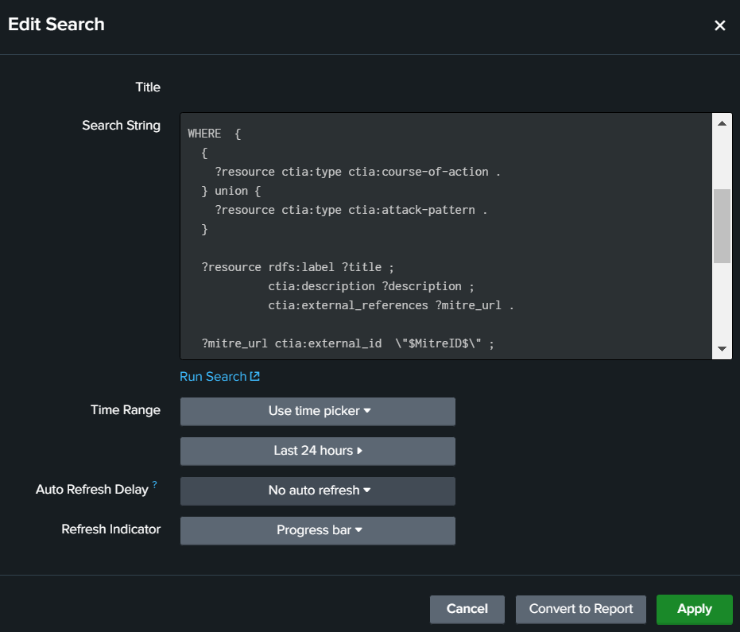
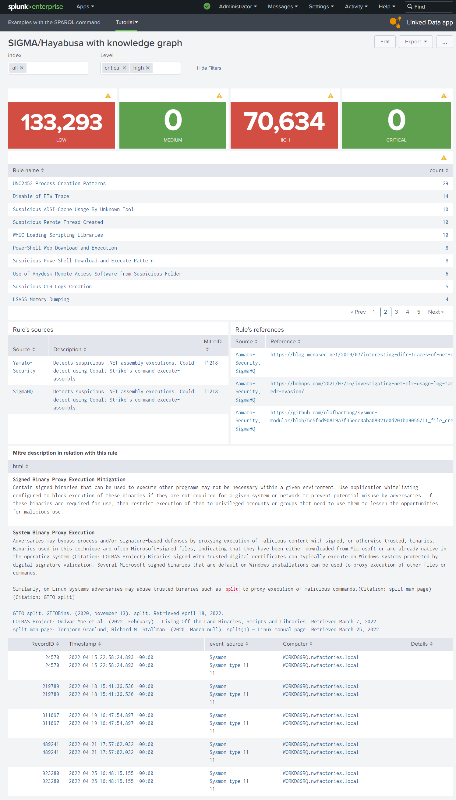
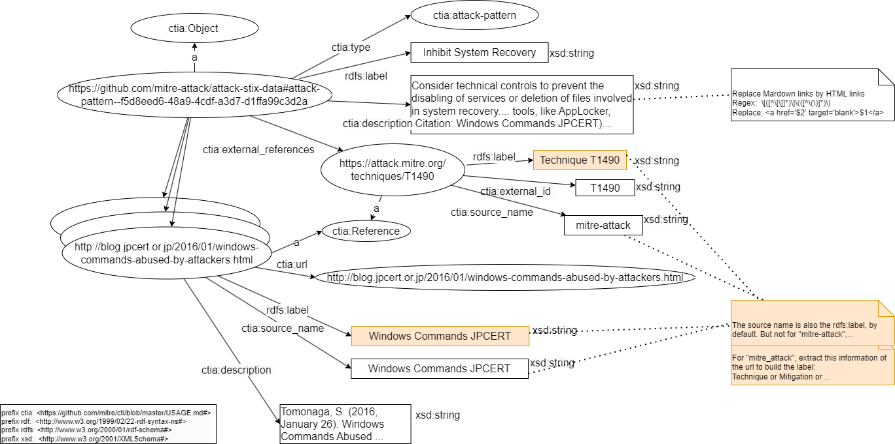
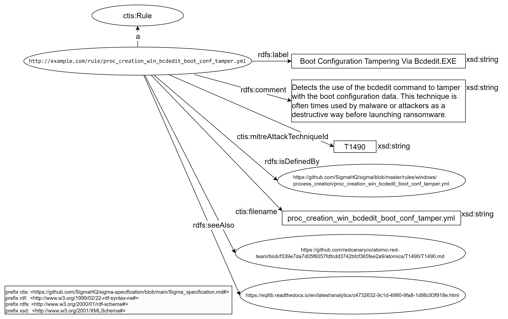

# Specify the dashboards before the RDF models

Another typical problem curing the creation of a knowledge graph is the time waste and performance loss due to the extraction of unnecessary information.
Thus, we put emphasis on the specification of the data model and as such limiting the data scope and size instead of conceptualizing useless ontology terms and bloating our knowledge graph with meaningless triples.

In this tutorial, we will show how to (1) define the information available in an alert of a IDS source and how to link this with OSINT, (2) create the interfaces for the final user to show these information, (3) specify the RDF model of each concept to extract the minimal vocabulary of your minimal knowledge graph.

## The interfaces of use cases

In the previous tutorial, we have defined the use cases in contact with the humans, ie. analysts (see figure 1)

<figure markdown="span">

<figcaption>Figure 1. We need to imagine an interface where analysts can list the IoCs during the incident and read all their documentations.</figcaption>
</figure>

The classic Splunk interface is a set of panels, like "static table" panel. This table panel can show a table of cells and also one cell with a text via in input a Splunk Search Processing Language (SPL). With the plugin [Linked Data App](../link-IDS-event-to-KG/eccenca_commands.tar.gz) ([tutorial page](../link-IDS-event-to-KG/index.md)), we can insert a SPARQL query and select the part of your knowledge graph to print (figure 2).

<figure markdown="span">

<figcaption>Figure 2. An analyst can insert a SPARQL query with Splunk token in input of one "static table" panel of his dashboard with the plugin "Linked Data App"</figcaption>
</figure>

The first dashboard to do for our use cases is the list of IoCs with classic SPL queries of analysts via a static table and allow the analyst to select one IoC via a click in the table. The dashboard with this selected row can save the ID of IoC in a global variable for the other panels in the same dashboard ([a Splunk token](https://docs.splunk.com/Documentation/Splunk/9.0.5/Viz/tokens)). When this variable (Splunk token) is changed by the user, Splunk is able to recalculate automatically the queries with this variable in the other static tables. So with this mechanism, we can print the details in the knowledge graph (with SPARQL queries) and the IoC statistics in the Splunk indexes (with SPL queries) around of one selected IoC. With these knowledge about Splunk dashboard, we proposed to analysts a first naive interface in the figure 3.

<figure markdown="span">

<figcaption>Figure 3. Imagine the expected Splunk dashboard with its interaction</figcaption>
</figure>

Here, the figure 3 is nice but before this first schema during the project, there are a lot of shemas and all were minimalist and ugly often only on a whiteboard. This  type schema before the technical feasibility is only to validate the objective with the analysts before starting the development. During the technical feasibility, we can decrease/increase step-by-step your objectives to show finally a first result in figure 4 in a real dashboard.

<figure markdown="span">

<figcaption>Figure 4. First interface with only SPARQL queries in SPLUNK static tables.</figcaption>
</figure>

## Technical feasibility with the available information

It's not really technical to check if the data is available or not, but without technical knowledge, it's hard to evaluate the difficulty to link each id to their instance in your RDF knowledge graph.
In this tutorial, we learn to use Corporate Memory of Eccenca to transform these IDs to IRI to import properly these ID with the other data necessary to build these interface.

After research and one meeting with analysts, we have chosen the datasets of Mitre Attack, the datasets of IoC rules (Sigma and Hayabusa) in Github and of course, the IoCs data already in the Splunk indexes.

<figure markdown="span">

<figcaption>Figure 5. Define the information available in alerts of IDS and in OSINT to link these information.</figcaption>
</figure>

The Splunk indexes of IoCs are selected by the analysts in the dashboard via the component [multiselect input](https://docs.splunk.com/Documentation/Splunk/9.0.5/Viz/FormEditor#Multiselect) in the form part of dashboard (the form part inits other Splunk tokens). We have choosen the IDs to link these data and the figure 5 resumes how we are going to link these data via Corporate Memory of Eccenca.

## Understand the base of Splunk dashboards

A Splunk dashboard is coded in XML. The Splunk user can modify a dashboard via a no-code interface or directly in the code.

A user can clone any dashboard before modifying it.

For example, in our dashboard, you can find:

- the root element `form`,
- the definition of input component to select the Splunk indexes by the user and
- the table panel to execute a SPL query and show the result in a table

```xml
<form>
  <label>SIGMA</label>
...
    <input type="multiselect" token="selected_index" searchWhenChanged="true">
      <label>index</label>
      <valuePrefix>index="</valuePrefix>
      <valueSuffix>"</valueSuffix>
      <delimiter> OR </delimiter>
      <fieldForLabel>index</fieldForLabel>
      <fieldForValue>index</fieldForValue>
      <search>
        <query>| eventcount summarize=false index=*
| search NOT index IN ("history", "cim_modactions", "summary")
| dedup index
| fields index</query>
        <earliest>0</earliest>
        <latest></latest>
      </search>
      <choice value="*">all</choice>
      <default>*</default>
    </input>
...
  <row>
    <panel>
      <table>
        <search>
          <query>| tstats count where $selected_index$ ld.ld_source_type=hayabusa Level!=info $level$ by RuleTitle
| rename RuleTitle as "Rule name"
| sort - count</query>
          <earliest>0</earliest>
          <latest></latest>
        </search>
        <option name="drilldown">cell</option>
        <option name="refresh.display">progressbar</option>
        <drilldown>
          <set token="selected_rule">$click.value$</set>
        </drilldown>
      </table>
    </panel>
    ...
  </row>
...
</form>
```

To read this code, you need to know the [Splunk concept "token"](https://docs.splunk.com/Documentation/Splunk/9.0.5/Viz/tokens). Quickly, a Splunk token is a global variable in the dashboard between all the components of dashboard.

In this example, the token "selected_index" is defined by the input component and reuse it in the SPL query of the table panel. When the user click on a label in this panel, this selected `RuleTitle` is saved in the token `selected_rule` and the panel which uses this token, are refreshed. So, we use tokens in the SPARQL queries to refresh automatically the SPARQL results inside dashboards. For example, this SPARQL query prints three columns "Source","Description" and "MitreID", only if the user initializes before the token `selected_rule` in another panel of dashboard:

```xml
  <row>
    <panel>
      <title>Rule's sources</title>
      <table>
        <search>
          <query>| sparql
query="prefix ctis: &lt;https://github.com/SigmaHQ/sigma-specification/blob/main/Sigma_specification.md#&gt;
prefix rdf:  &lt;http://www.w3.org/1999/02/22-rdf-syntax-ns#&gt;
prefix rdfs: &lt;http://www.w3.org/2000/01/rdf-schema#&gt;
prefix xsd:  &lt;http://www.w3.org/2001/XMLSchema#&gt;

SELECT DISTINCT (STRBEFORE(STRAFTER(STR(?link),\"https://github.com/\"),\"/\") as ?Source) (?comment as ?Description) ?link  (?mitreID as ?MitreID)
FROM &lt;http://example.com/rule&gt;
WHERE {
  VALUES ?title { \"$selected_rule$\" }

        ?ruleHayabusa a ctis:Rule ;
            rdfs:label ?title ;
            rdfs:comment ?comment ;
            rdfs:seeAlso ?referenceLink;
            rdfs:isDefinedBy ?link ;
            ctis:filename ?filename .
      OPTIONAL {
       ?ruleHayabusa ctis:mitreAttackTechniqueId ?mitreID .
      }
}"</query>
...
        </search>
        ...
        <fields>["Source","Description","MitreID"]</fields>
      </table>
    </panel>
  </row>
```

!!! Tip

    The editor of Splunk is limited for SPARQL. You can develop your SPARQL query in Corporate Memory Sparql editor. After, like you can see in this example, you have to insert (automatically) `\` before all `"` in your query before to copy this SPARQL in a Splunk query. If your SPARQL query works in the dashboard, you can insert the tokens.

!!! Warning

    You can follow the tutorial about Mitre Attack and Rules wihout using Splunk. If you want execute the dashboards with your knowledge graph, you need to modify the SPL queries of dashboards according to your data in Splunk. We do not share the indexes of Splunk in this tutorial.

## Technical feasibility with the Splunk dashboard

During our project, we have implemented the SPARQL command necessary to execute a SPARQL query in a SPL query but also several scripts to extend the panels of dashboard. For example, these are problems to print a HTML text and open a external Web page in a dashboard. Before starting a knowledge graph, we need to know if we have to work with a specific syntax in output for Splunk. So, we have searched the simplest solution to print the HTML literal in our knowledge graph with their links. We found it and implemented simple Javascript scripts to resolve these problems. These scripts are imported via the header of dashboard XML and called in the XML of static table panel. You can see the final dashboard with the Mitre description in HTML (the Mitre in these datasets uses Markdown but we show how convert Markdown link to HTML). We give you these scripts in your [Linked Data App](../link-IDS-event-to-KG/eccenca_commands.tar.gz) ([tutorial page](../link-IDS-event-to-KG/index.md)).

<figure markdown="span">

<figcaption>Figure 6. With an extern Javascript script, static tables support HTML and the user can open.</figcaption>
</figure>

## Conclusion: starting to specify the necessary RDF models for these interfaces

With the interfaces, the available data and their links in head, the analyst can now imagine the necessary RDF models of concepts (for example, figure 7 and 8) in his future knowledge graph to generate expected dashboards. These RDF models evolve at the same time as the interfaces (forever) and according to future RDF standards of Cyber world. With Corporate Memory, after each evolution of your models, you can rebuild your knowledge graph "from scratch" when you want. Several RDF models of different versions can exist in your knowledge graphs, so you can update progressively your dashboards without service interruption of old dashboards.

<figure markdown="span">

<figcaption>Figure 7. RDF model of Mitre concept "course of action" in our future knowledge graph.</figcaption>
</figure>

<figure markdown="span">

<figcaption>Figure 8. RDF model of concept "IoC Rule" in our future knowledge graph.</figcaption>
</figure>

---

Tutorial: [how to link Intrusion Detection Systems (IDS) to Open-Source INTelligence (OSINT)](../index.md)

Next chapter: [Build a Knowledge Graph from MITRE ATT&CK® datasets](./../../lift-data-from-STIX-2.1-data-of-mitre-attack/index.md)

Previous chapter: [Define the need, the expected result and the use cases](../define-the-need/index.md)
