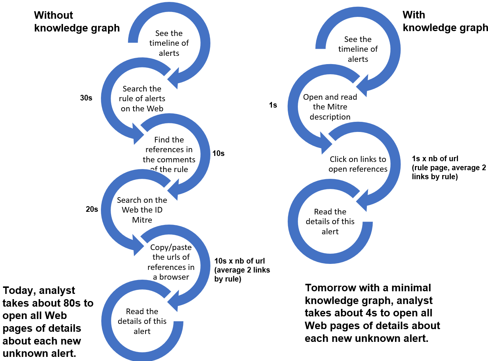
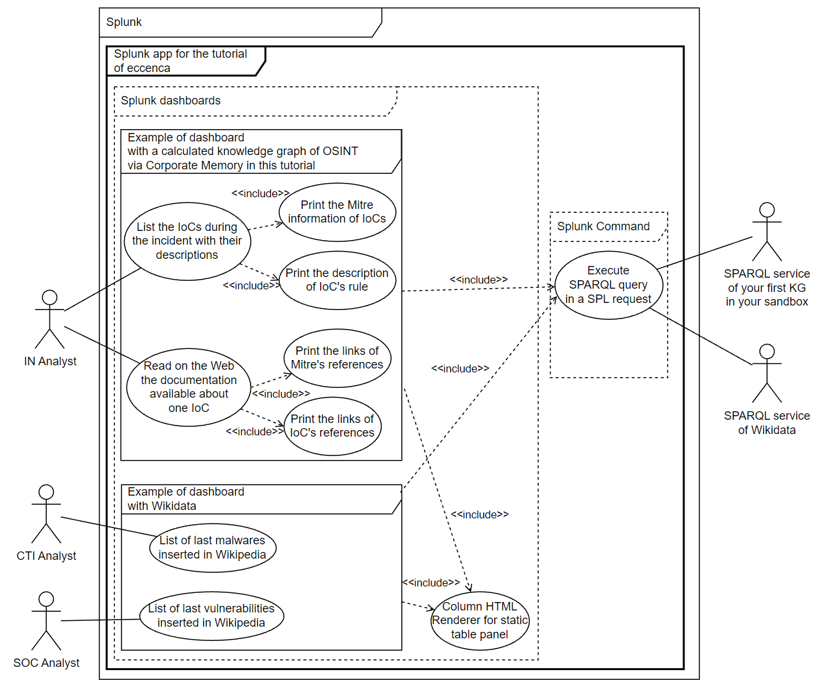
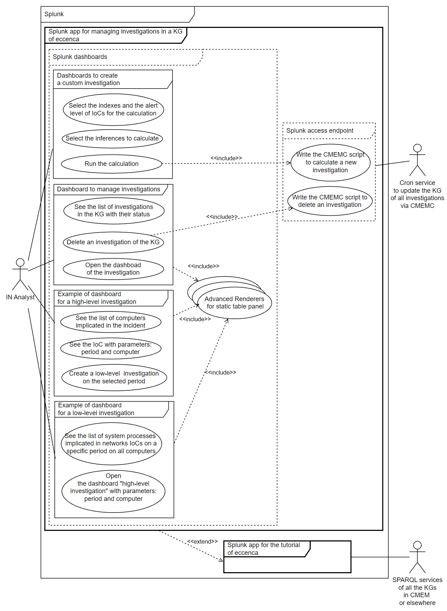

# Define the need, the expected result and the use cases

A typical mistake when staring to work on a complex ontology is the absence of a real use case and a lack of understanding of the cyber analysts requirements.

In this part, we explains how to:

1. Clarify a need
2. Propose an expected result
3. Define an use case to implement

## Define the need of precise users

There are three things to know to describe a need:

1. For who
2. What
3. The context

With our customers, we claim a knowledge graph can reduce the work of analysts in the Cybersecurity. So, one of our customer wanted to help their IN Analysts with the software Corporate Memory of eccenca.
After several meeting, we defined the need.

### For who

!!! example "For who"
        The future use case is to help the IN Analysts (Incident Responders) but also SOC Analysts (Security Operation Center).

Each field of activity is vast and brings together very different professions. Cybersecurity is no exception. It is necessary to organize work meetings with end users even if they have no knowledge of knowledge graphs for the moment. So you can ask them about their trades and identify what they want. However, keep in mind the most famous quote attributed to Ford: "If I had asked people what they wanted, they would have said faster horses." During the meetings, the question of "What" is not about the final result or the method to do it. The question is "what do you think to need?". After only, we can start to imagine how a knowledge graph can help or not.

### What

The conclusion of first meetings was:

!!! example "What"
        The analysts want a solution to link the heterogenous data of different indexes in Splunk to improve their capacity to analyze an incident via their Splunk dashboards.

Of course, during the meetings, a lot of needs are explained by the analysts but you need to choose the need to resolve according to the context.

### The context

During the meetings, we try to understand the "why" of their needs and their feeling about the knowledge graph technology.

!!! example "Context of the analyst job"
        Today, a IN Analysts (Incident Responders) switches between the timeline of alerts’ messages and an autonomous research in his event store (like Splunk). During this research of evidences for the last incident, there are often new unknown alerts’ messages of recent indicators of compromise rules. Each analyst for each unknown message will try to understand the reason of this message before investigating in the metadata behind this new alert. A professional analyst takes between 30s and 2 minutes to open all references in his browser about a new alert.

Feeling of the analyst about the knowledge graph technology:

!!! example "Feeling of the analyst about the knowledge graph technology"
        Today, typically, the IN Analysts have the skills necessary to write NoSQL requests to query their event store.
        As eccenca is going to create RDF graphs of OSINT, IN analysts will need to write SPARQL queries to jointly query IDS and knowledge graphs.
        SPARQL is an untypical skill among IN Analysis, thus, they need to make the investment to gain this knowledge.
        Like every investment a payoff is expected, in this case we see a significant reduction of the time spent by the analyst.
        Only after this demonstration, the IN Analysts will try to learn maybe to write SPARQL queries in their dashboards or they will create a new job in their team to do these new dashboards.

Very quickly (in a lot of customer meetings), the skills are the first problem to work with a knowledge graph and the no interoperability of a lot of knowledge graph on the market does not help to resolve this problem. To onboard the future final users with the technologies of Linked Data, a minimal and simple need is often the best way to start to think "graph". Only after, we can propose more complex graphs to resolve other needs and only after, we can do to understand the objectives to build/use in their domain a global ontology.

## Propose an expected result

Here, the context shows this project is an exploration with like deliverable probably a demonstrator. So, your project started like a exploration with a lot of meetings to understand how these analysts work concretely. We choose a public dataset of one previous incident with the analysts. After, they create the Splunk indexes with these datasets. With these Splunk indexes near of the reality, we can learn alone to use Splunk in order to understand the desire to use this tool to build their dashboards with a knowledge graph.

During this step of R&D, we are developing the tools to request a SPARQL service via an authentification OAuth directly by Splunk dashboard. You will install these Splunk apps step-by-step during this tutorial or you can download their "tar.gz" in SPlunk now:

- "[Linked Data App](../link-IDS-event-to-KG/eccenca_commands.tar.gz)" to install the SPARQL command. You need to configure it with the details in his README file or in [its tutorial page](../link-IDS-event-to-KG/index.md).
- "[Investigate lateral movements with a knowledge graph](../link-IDS-event-to-KG-via-cmem/eccenca_poc_investigate.tar.gz)" to install our demonstrator to connect SPLUNK to CMEM. You need to read his README or [its tutorial page](../link-IDS-event-to-KG/index.md) to understand this example.

After several propositions, analysts oriented the implementation of our first dashboards and finally, we showed clearly a benefice to use a knowledge graph via these results.

In this tutorial, we study only this first result:

!!! example "Expected result"
        A knowledge graph will reduce the time required to research details on the Web of each new alerts in the IDS of IN Analysts.  
        To achieve such savings we aggregate all links of sources and references about alerts in the Security information and event management (SIEM) in a knowledge graph.  
        Analyst are able to read the Mitre information directly in his timeline (e.g. in SPLUNK) and to access all references about an alert from this central place.

        
        *Figure 1. Example of expected results for analysts during the task to understand the meaning and relevance of new alerts in their IDS.*

When we know the waited results, we can imagine the necessary use cases.

## First use cases

We know the final need, the expected results and the limits of knowledge graph with the Linked Data technologies in Splunk. So, we can define the probable use cases to implement and all the actors who will interact with these use cases.

*Figure 2. UML use cases to resolve this basic need and several use cases with Wikidata to show the interoperability of knowledge graphs with the Linked data technologies. Each bubble in this type of schema is a use case.*

With a simple UML schema of use cases, you can delimited each use case, their priorities and their tasks for the next step, ie. specify the essential interfaces to limit the complexity of future RDF graph.

In this tutorial, after to test this first result, we claim a knowledge graph can reduce the time required to research details on the Web of each new alerts in the IDS of IN Analysts by 50 to 95%, see figure 1. The next step is to specify the interfaces before starting to think about the graphs.

## Advanced use cases

Another result of this project was to resolve this other need:

!!! example "For who"
        IN analysts
!!! example "What"
        Calculate and manage their investigations' knowledge graphs of high-level and low-level directly in Splunk
!!! example "Context"
        Linking IDS events to a knowledge graph can be complex.
        This is for several reasons like labels/IDs/structures of the same resources can be different.
        Corporate Memory provides advanced capabilities to perform this in an automatic way.
        To use these tools, we need to export the data of SPLUNK to Corporate Memory.
        Analysts need to export data from SPLUNK to Corporate Memory on the fly and execute Corporate Memory workflows with reconciling complex data automatically and SPARQL update queries directly triggered via their SPLUNK dashboards.

 For the moment, we are searching the best way to resolve this need but a demonstrator to manage several investigations in the same knowledge graphs is available with several examples of dasboards in the Splunk app "[Investigate lateral movements with a knowledge graph](../link-IDS-event-to-KG-via-cmem/eccenca_poc_investigate.tar.gz)" ([tutorial page](../link-IDS-event-to-KG/index.md)). This need is for advanced users of Corporate Memory and it may be proposed in a future tutorial.

*Figure 3. UML use cases to resolve this avanced need.*

---
Tutorial: [how to link Intrusion Detection Systems (IDS) to Open-Source INTelligence (OSINT)](../index.md)

Next chapter: [Specify the dashboards of use cases before the RDF models](../define-the-interfaces/index.md)

