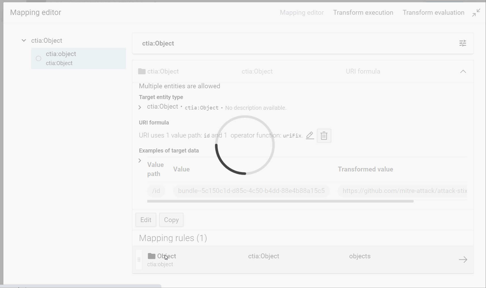
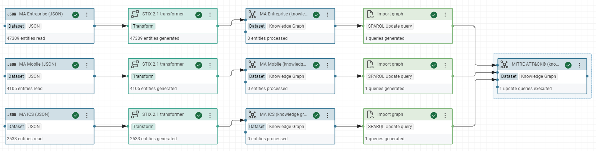

# Build a Knowledge Graph from STIX 2.1 data such as the MITRE ATT&CK® datasets

## Introduction

MITRE ATT&CK is a globally-accessible knowledge base of adversary tactics and techniques based on real-world observations. The ATT&CK knowledge base is used as a foundation for the development of specific threat models and methodologies in the private sector, in government, and in the cybersecurity product and service community.

The MITRE ATT&CK datasets in STIX 2.1 JSON collections are here:

*   [enterprise-attack.json](https://github.com/mitre-attack/attack-stix-data/tree/master/enterprise-attack/enterprise-attack.json){target=_blank}
*   [mobile-attack.json](https://github.com/mitre-attack/attack-stix-data/blob/master/mobile-attack/mobile-attack.json){target=_blank}
*   [ics-attack.json](https://github.com/mitre-attack/attack-stix-data/blob/master/ics-attack/ics-attack.json){target=_blank}

[Structured Threat Information Expression (STIX™)](
https://oasis-open.github.io/cti-documentation/stix/intro.html) is a language and serialization format used to exchange cyber threat intelligence (CTI).

The "ontology" of MITRE ATT&CK with STIX is here: [https://github.com/mitre/cti/blob/master/USAGE.md](https://github.com/mitre/cti/blob/master/USAGE.md)

The objective of this tutorial is not focus on the ontologies. In our use case, we just need to extract several metadata. If the community of STIX wants to resolve their problems, it will be the moment to define a solid ontology. If you are a newbie with the Linked Data technologies, you have to learn to generate in first a functional knowledge graph for your needs before building a perfect ontology for everybody. When you masterize the ontologies, we will modify this first ontology and you could refresh your knowledge graph when you want with Corporate Memory.

This tutorial is written in order to gradually acquire all the skills necessary to build from scratch a knowledge graph with Corporate Memory and update it automatically via Corporate Memory Console.
This tutorial must be completed in order.

Labs:

1. Create a new project for your knowledge graph in your Sandbox
2. Import the datasets to convert in RDF
3. Create named graphs of your knowledge graph
4. Create a RDF transformer for STIX 2.1
5. Create the workflow to transform all STIX datasets to RDF
6. Create the global named graph of your knowledge graph
7. Test the SPARQL query to obtain the name, the description and the references of a Mitre tag
8. (optional) Create the Void description of knowledge graph
9. (optional) Refresh your knowledge graph automatically

You can improve this first knowledge graph with these exercises:

1. Create an inference in your knowledge graph via a SPARQL Update query
2. Create an other knowledge graph for CAPEC linked to MITRE ATT&CK

## Labs

### Create your sandbox

You need to create your sandbox of Corporate Memory to create your tempory knowledge graph for this tutorial.

Follow the instructions here: [https://eccenca.my](https://eccenca.my/)

### Create a project

For each type of dataset, you can create an new project with all the tools necessary to convert this dataset in a knowledge graph.

Create a new project, reproduce the demonstration in the following video:

*   Title: MITRE ATT&CK®

*   Description: MITRE ATT&CK® is a globally-accessible knowledge base of adversary tactics and techniques based on real-world observations.


### Import datasets

MITRE ATT&CK® has 3 domains: [Entreprise](https://attack.mitre.org/techniques/enterprise/), [Mobile](https://attack.mitre.org/techniques/mobile/) and [ICS](https://attack.mitre.org/techniques/ics/).

Each domain dataset is saved in GitHub:

*   [enterprise-attack.json](https://github.com/mitre-attack/attack-stix-data/tree/master/enterprise-attack/enterprise-attack.json)
*   [mobile-attack.json](https://github.com/mitre-attack/attack-stix-data/blob/master/mobile-attack/mobile-attack.json)
*   [ics-attack.json](https://github.com/mitre-attack/attack-stix-data/blob/master/ics-attack/ics-attack.json)

1. Download these 3 files
2. Create for each JSON file, a JSON dataset:


!!! Tip

    Give a short name at each dataset/transformer/etc in Corporate Memory to recognize it easily in the workflow view. For example, we will use "MA Entreprise (JSON)" like label and "MITRE ATT&CK® Entreprise dataset STIX 2.1" like description for the Entreprise dataset and so "MA Mobile (JSON)" for Mobile, "MA ICS (JSON)" for ICS, etc.

!!! Success

    Now, you can see these JSON datasets in Corporate Memory:
    

### Create named graphs

!!! Info

    A knowledge graph is an abstract concept. Concretly in a triplestore or a RDF graph database via Corporate Memory, the database saves each RDF triple of graph in a named graph or RDF dataset in Corporate Memory. A graph named is a set of triples. So, a knowledge graph can be composed by one or several named graphs.

!!! Tip

    A named graph can be modify without affecting the other named graphs. Each dataset of Mitre can be updated at any moment, so we are going to create a specific named graph for each Mitre dataset to simplify the update of each dataset in your knowledge graph.

    A good practice is to name the named graph by the URI of its real source on the Web, so the labels and graph names of your RDF datasets can be:

    * Entreprise domain

        - Label: MA Entreprise (knowledge graph)
        - Graph name: https://github.com/mitre-attack/attack-stix-data/raw/master/enterprise-attack/enterprise-attack.json

    * Mobile domain

        - Label: MA Mobile (knowledge graph)
        - Graph name: https://github.com/mitre-attack/attack-stix-data/raw/master/mobile-attack/mobile-attack.json

    * ICS domain

        - Label: MA ICS (knowledge graph)
        - Graph name: https://github.com/mitre-attack/attack-stix-data/raw/master/ics-attack/ics-attack.json

Create one RDF dataset for each Mitre dataset:

1. Add component "Knowledge Graph"
2. Put a label
3. Put a URI of named graph
4. Enable "Clear graph before workflow execution"


!!! Success

    Now, you can see these RDF datasets in Corporate Memory:
    

!!! Tip

    The consequence of the option "Clear graph before workflow execution" is the named graph will be deleted (with all its triples) before receiving new triples  when you use this named graph like an output in a workflow and also in the transformer task (in the next step).

    This option is to use only for the graphs which will generate automatically by Corporate Memory.

### Create a transformer

!!! Tip

    There are not bad manners to build a knowledge graph but there are knowledge graphs useless or very hard to use by the analysts or developers in their missions.

    Without having all queries necessary in their missions, your knowledge will continue to evolve to sastify all needs of your users.

    With Corporate Memory, you can develop progressively your vocabularies RDFS or your ontologies OWL to describes your knowledge graph.

    If it's your first knowledge graph, the best manner to start is with RDFS vocabularies because you can develop it like you develop classes and their instances in an object oriented language. It's exactly the same manner to describe the world. Of course, there are differences but you can start a first functional knowledge graph without being an expert.

    Here, you will create all classes and attributes necessary in your use case case. Not more, not less. So, we are adding each STIX object in your knowledge base with its STIX type, its label, its description and its references. Each reference can have an url, a label, a description and an external ID, like Mitre ID or CAPEC ID.

    In UML, you can represent your targeted model like that: here a RDF model to describe an instance of type "course-of-action" in MITRE ATT&CK. (you can download the [File drawio of schemas](./RDF_model_and_pattern.drawio))

    

    The SPARQL query for this model can be specify in UML with a RDF pattern: here a RDF pattern to select the "course-of-action" objects with a known Mitre ID

    

    Without an official vocabulary and its official prefix, we are using the documentation on the Web of its datasets: [https://github.com/mitre/cti/blob/master/USAGE.md](https://github.com/mitre/cti/blob/master/USAGE.md)

    So, to make a prefix, we choosed a short name, for example "ctia", and the IRI will build with the Web address of its documentation with a # at the end (to link to anchors of attributes in the Web page, if they exist):

    ```turtle
    prefix ctia: <https://github.com/mitre/cti/blob/master/USAGE.md#>
    ```

1. Create the prefix of your vocabulary:

      ```turtle
      prefix ctia: <https://github.com/mitre/cti/blob/master/USAGE.md#>
      ```


2. Create the (Mitre) STIX 2.1 transformer

This transformer will be a component of your worflow. You could reuse it in several workflows in other projects. To create a new transformer, you need to give a:

*   Label: STIX 2.1 transformer
*   Input: MA Entreprise (JSON)
*   Output: MA Entreprise (knowledge graph)


!!! Tip

    In your use case, there is only this transformer to build this named graph, so there is no consequence on the final knowledge graph when we test this transformer on this graph (automatically cleared after each execution of transformer). However, a good practice is to create a tempory graph in ouput for each transformer, so your final knowledge graph is not affected during the modification of your transformer before executing the workflows with this transformer. In this case, you need to hide this tempory graph of your users.

    You can create a transformer for several syntaxes in input: JSON, XML, CSV, etc. If your format does not exist in Corporate Memory, you can convert your data in JSON before importing this data in Corporate Memory.

!!! Info

    STIX gives the possibility to extend its syntaxes. Mitre uses this possibility. So, in theory, if we need to import all the data, we can extend this transformer at all STIX attributes and add the Mitre attributes described in its [documentation](https://github.com/mitre/cti/blob/master/USAGE.md).

3. Study the tree of STIX data

```json
{
    "type": "bundle",
    "id": "bundle--19413d5e-67e5-4a48-a4c8-afb06b7954de",
    "spec_version": "2.1",
    "objects": [
        {
            "type": "x-mitre-collection",
            "id": "x-mitre-collection--1f5f1533-f617-4ca8-9ab4-6a02367fa019",
            "name": "Enterprise ATT&CK",
            "description": "ATT&CK for Enterprise provides a knowledge base of real-world adversary behavior targeting traditional enterprise networks. ATT&CK for Enterprise covers the following platforms: Windows, macOS, Linux, PRE, Office 365, Google Workspace, IaaS, Network, and Containers.",
            ...
        },
        {
            "id": "attack-pattern--0042a9f5-f053-4769-b3ef-9ad018dfa298",
            "type": "attack-pattern",
            "name": "Extra Window Memory Injection",
            "description": "Adversaries may inject malicious code..." ,
            "external_references": [
                {
                    "source_name": "mitre-attack",
                    "external_id": "T1055.011",
                    "url": "https://attack.mitre.org/techniques/T1055/011"
                },
                {
                    "url": "https://msdn.microsoft.com/library/windows/desktop/ms633574.aspx",
                    "description": "Microsoft. (n.d.). About Window Classes. Retrieved December 16, 2017.",
                    "source_name": "Microsoft Window Classes"
                },...
```

To extract STIX objects with its type, its label, its description and its references, we need to navigate via a root object of type "bundle" before touching the STIX objects. Each object has an ID, we suppose unique in all Mitre datasets to generate IRI of all objects. We use your prefix ctia to build the class name and the properties of your RDFS vocabulary. Here, we build the vocabulary of manner agile for your use case because Mitre had not proposed a RDFS vocabulary for its datasets.

4. Create the root object and give it an unique IRI:

*   RDF type: ctia:Object
*   IRI pattern: <https://github.com/mitre-attack/attack-stix-data#{id}>


!!! Tip

    You can develop an IRI from scratch in the IRI formula editor, like here or directly in the form and improve it after, if necessary (see an example in the next step).

    The important is to test the result in the evaluation view.

!!! Success

    During the development of a transformer, you can test your transformation and check all the steps.

    

5. Link the sub-objects to their root:

*   Value path: objects

with their IRI and the property ctia:object:

*   RDF property: ctia:object
*   RDF type: ctia:Object
*   IRI pattern: <https://github.com/mitre-attack/attack-stix-data#{id}>


!!! Tip

    The RDFS classes start by an uppercase and the property by a lowercase and apply the camel case notation, if possible. The objective is to create cool IRI, ie. lisible IDs for humans and unique on the Web.

    There are exceptions, like Wikidata which prefers to use a number for their IRI but with a explicit label in all languages.

    Moreover, if there is no clear ontology in your domain, the best is to take the name of parameters of the source (here json). So, we will use the property, like `ctia:external_id` with underscore because it's the convention of Mitre in its datasets. If Mitre defines a best RDF ontology, we will modify simply your transformer to respect their new ontology.

!!! Tip

    We could limit the number of objects to import, if you add conditions in the formula editor with the field "type" of objects, for example.

6. Extract now their type, label and description with these properties for example:

*   ctia:type
    *   RDF type: URI
    *   Via the "value forma editor" create the IRI: `https://github.com/mitre/cti/blob/master/USAGE.md#{type}`
*   rdfs:label
    *   value path: name
    *   RDF type: String
*   ctia:description
    *   value path: description
    *   RDF type: String


!!! Tip

    STIX type doesn't apply the camel case and doesn't start by an uppercase. We prefers to create a specific property ctia:type for this reason.

    You can reuse a vocabulary already in Corporate Memory (like rdfs) but you are also free to develop a new vocabulary on the fly with your prefixes.

!!! Success

    When you test your transformer, you can see the future instances in your knowledge graph:
    

7. At the end of the last step, we saw the dataset uses the syntax of Markdown to define a Web link. In the interface of SPLUNK, we need to use the HTML syntax. Modify the formula for the description with the operator "regex replace".

*   Regex:  `\[([^\[\]]*)\]\(([^\(\)]*)\)`
*   Replace: `<a href='$2' target='blank'>$1</a>`



!!! Success
        In the "value formula editor", you can immediatly check the result of your formula.
        

!!! Tip

    At any moment, you will modify your vocabulary according to your needs that you will find during your development. You need to modify this transformer and relaunch all your workflows which use this transformer.

!!! Tip

    The regular expression are often necessary in the components of "value formula editor". The website [regex101](https://regex101.com/) will help you to develop and debug the regular expressions.

8. Via the same method, we are linking the references objects to their STIX objects:

*   via the property: `ctia:external_references`
*   Type: ctia:Reference
*   value path: external_references
*   IRI of each object: its own URL ()

ctia:Reference object has these properties:

*   ctia:source_name
*   ctia:description
*   ctia:url
*   ctia:external_id


!!! Tip

    Sometimes, several urls are not correct. You can use the component "Fix URI" to fix the classic problems.

    

!!! Warning

    When you make a transformer on a dataset, you see quickly the limit of data. For example with Mitre, several references are a set of citations without URL.

    

    For example references with this description: `(Citation: Palo Alto menuPass Feb 2017)(Citation: DOJ APT10 Dec 2018)(Citation: District Court of NY APT10 Indictment December 2018)`

    The URL for the majority of citations can be found in the dataset but we need to do a first pass before to link correctly the citations at their URL.

    Moreover, we can find also citation directly in the description of several objects but without URL and without their references in their JSON tree.

    Here, it's a simple tutorial. So, we do not try to fix this problem of citations for the moment, but if you want a tutorial to fix it, let me a comment in this page.

!!! Success

    To test your transformer, you need to develop one or several SPARQL queries with the RDF pattern which will use in your use case. You are developing this query in the SPARQL editor:

    ```sparql
    #Test 1 transformer STIX 2.1

    PREFIX rdfs: <http://www.w3.org/2000/01/rdf-schema#>
    PREFIX ctia: <https://github.com/mitre/cti/blob/master/USAGE.md#>

    SELECT
    ?title ?description
    (GROUP_CONCAT(?link; separator="<br/>") as ?references)
    FROM <https://github.com/mitre-attack/attack-stix-data/raw/master/enterprise-attack/enterprise-attack.json>
    WHERE {
    {
        ?resource ctia:type ctia:course-of-action .
    } union {
        ?resource ctia:type ctia:attack-pattern .
    }

    ?resource rdfs:label ?title ;
                ctia:description ?description ;
                ctia:external_references ?mitre_url .

    ?mitre_url ctia:external_id  "T1490" ;
                ctia:source_name  "mitre-attack" .

    OPTIONAL {
        ?resource ctia:external_references [
                ctia:url ?reference_url ;
                ctia:source_name ?reference_label ;
                ctia:description ?reference_description
                ] .
        BIND( CONCAT("<a ref=",STR(?reference_url),"\">",?reference_label,": ",?reference_description ,"</a>") as ?link)
    }
    }
    GROUP BY ?title ?description
    ```

    

9. During the building of interfaces, we saw the same MITRE ID of IoC rules is used by the concepts of tactic, mitigation, technique,... In the final interface, we will print properly the label of each concept for the same Mitre ID, like "Technique TXX" or "Mitigation TXX".

!!! Tip

    Moreover, Corporate Memory indexes some specific properties automatically, like rdfs:label. Without this property, it's not easy to find the objects by a search by text. To facilite the research of references, like the mitre id, you are adding the property rdfs:label to reference objects.

So, we add a new property `rdfs:label` to object `ctia:Reference`. If the reference is not a Mitre ID, we will copy the source_name else we will extract the type of concept in the URL and concat his Mitre ID:

*   In the transformer STIX, add the property rdfs:label (type string) to object `ctia:Reference`.


*   Customize the value of label, like in this RDF model: (try to do this rule alone before to look at this possible response)


!!! Success

    You can test the result when you search the Mitre ID via the explorer of knowledge graph "MA Entreprise":

    <image src="23-1-success-extract-rdfslabel.png" width="60%" height="60%" align="center"/>

### Create a workflow

You have now a STIX transformer. We are building here a workflow to apply this transformer for all datasets in same time.

1. Create a workflow with a name, for example "MITRE ATT&CK® workflow"
2. Insert the input JSON dataset
3. Insert the output RDF dataset
3. Insert the transformer
4. Link the three components
5. Execute the workflow to test it
6. Save it

    

7. Do the same operations for the two other datasets.

!!! Success

    At the end, the workflow looks like that:

    

### Create a global named graph

To simplify the requests by a SPARQL query on your knowledge graph, we are offering the possibility to request all data of these 3 datasets in same time.

We are showing the "SPARQL tasks", another important feature available in Corporate Memory. More precisely, we will work with the SPARQL Update task with Jinja template.

!!! Note

    Jinja is a text-based template language and thus can be used to generate any markup as well as source code, like SPARQL. Corporate Memory gives the possibility to insert the name of named graph in a SPARQL query according to its position in the worflow to execute.

    For example, `$outputProperties.uri("graph")` inserts the name of graph connected to the output of the task in the workflow and `$inputProperties.uri("graph")` inserts the name of graph connected to the input. It's very practice to do repetive tasks, like to calculate the VoiD description at each update of graph.

1. Create a "Knowledge Graph" dataset (ie, a RDF dataset)

    *   Label: MITRE ATT&CK®  (knowledge graph)
    *   URI (name of graph): <https://attack.mitre.org>
    *   Enable "Clear graph before workflow execution"

2. Create a "SPARQL Update query" task without missing to enable the Jinja Template

    *   Label: Import graph

```sparql
PREFIX owl: <http://www.w3.org/2002/07/owl#>

INSERT DATA {
  GRAPH $outputProperties.uri("graph") {
   $outputProperties.uri("graph")
        owl:imports $inputProperties.uri("graph") .
  }
}
```

!!! Note

    In this query, Jinja replace $outputProperties.uri("graph") and $inputProperties.uri("graph") according to our workflow so the final code executed of this query is, for example:

    ```sparql
    PREFIX owl: <http://www.w3.org/2002/07/owl#>

    INSERT DATA {
        GRAPH <https://attack.mitre.org>  {
            <https://attack.mitre.org>
                owl:imports <https://github.com/mitre-attack/attack-stix-data/tree/master/enterprise-attack/enterprise-attack.json> .
        }
    }
    ```

!!! Success

    In the Turtle view of RDF dataset "MITRE ATT&CK®", you can see the triples inserted by your SPARQL query.

    ```turtle
    <https://attack.mitre.org>
        owl:imports <https://github.com/mitre-attack/attack-stix-data/tree/master/enterprise-attack/enterprise-attack.json>;
        owl:imports <https://github.com/mitre-attack/attack-stix-data/blob/master/mobile-attack/mobile-attack.json>;
        owl:imports <https://github.com/mitre-attack/attack-stix-data/blob/master/ics-attack/ics-attack.json>
        .
    ```

1. In the same workflow add one SPARQL task for each RDF datasets and in output add the RDF dataset "MITRE ATT&CK®". Execute it and save it.

    

!!! Success

    

    In the Turtle view of RDF dataset "MITRE ATT&CK®", you can see the triples inserted by your SPARQL query.

    ```turtle
    <http://attack.mitre.org>
        owl:imports <https://github.com/mitre-attack/attack-stix-data/tree/master/enterprise-attack/enterprise-attack.json> ;
        owl:imports <https://github.com/mitre-attack/attack-stix-data/blob/master/mobile-attack/mobile-attack.json> ;
        owl:imports <https://github.com/mitre-attack/attack-stix-data/blob/master/ics-attack/ics-attack.json>
        .
    ```

### Test your final SPARQL query

Now, you can request all the datasets in same time through the named graph `https://attack.mitre.org` to respond at the final query of our use case:

```sparql
#Test 2 final query

PREFIX rdfs: <http://www.w3.org/2000/01/rdf-schema#>
PREFIX ctia: <https://github.com/mitre/cti/blob/master/USAGE.md#>

SELECT
?title ?description
(GROUP_CONCAT( distinct ?link; separator="<br/>") as ?references)
FROM <https://attack.mitre.org>
WHERE {
    {
        ?resource ctia:type ctia:course-of-action .
    } union {
        ?resource ctia:type ctia:attack-pattern .
    }

    ?resource rdfs:label ?title ;
        ctia:description ?description ;
        ctia:external_references ?mitre_url .

    ?mitre_url ctia:external_id  "T1490" ;
        ctia:source_name  "mitre-attack" .

    OPTIONAL {
        ?resource ctia:external_references [
            ctia:url ?reference_url ;
            ctia:source_name ?reference_label ;
            ctia:description ?reference_description
        ] .
        BIND( CONCAT("<a ref=",STR(?reference_url),"\">",?reference_label,": ",?reference_description ,"</a>") as ?link)
    }
}
GROUP BY ?title ?description
```

!!! Success

    

### Create the Void description

In theory, RDF datasets in the Linked Open Data have to have a [VoID](https://www.w3.org/TR/void/) description with their statistics. The objective is to catalog automatically these datasets.

!!! Info

    [VoID](https://www.w3.org/TR/void/) is an RDF Schema vocabulary for expressing metadata about RDF datasets. It is intended as a bridge between the publishers and users of RDF data.

Here, we are creating a new SPARQL Update task to calculate and insert automatically the statistics of our global graph and add a [VoID](https://www.w3.org/TR/void/) description.

1. In the same workflow, insert a new SPARQL Update task with this query to calculate the statistics:

*   label: Calculate VoID

```sparql
PREFIX rdfs: <http://www.w3.org/2000/01/rdf-schema#>
PREFIX dcterms: <http://purl.org/dc/terms/>
prefix void: <http://rdfs.org/ns/void#>

INSERT
{
    GRAPH $outputProperties.uri("graph") {
        $outputProperties.uri("graph") a void:Dataset;
            rdfs:label  "MITRE ATT&CK®";
            rdfs:comment  "MITRE ATT&CK® is a globally-accessible knowledge base of adversary tactics and techniques based on real-world observations.";
            void:triples ?triples ;
            void:entities ?entities .
    }
}
USING $outputProperties.uri("graph")
WHERE {
    {
        SELECT (COUNT(DISTINCT ?resource) as ?entities)
        WHERE {
            ?resource a ?class .
        }
    }
    {
        SELECT (COUNT(?s) as ?triples)
        WHERE {
            ?s ?p ?o .
        }
    }
}
```

!!! Tip

    This query uses the variable `$outputProperties.uri("graph")` (Jinja template). If the name of graph changes, the code of the query stays stable in your workflow.


!!! Success

    The final triples in the graph `https://attack.mitre.org`after this worflow.

    ```turtle
    prefix owl:  <http://www.w3.org/2002/07/owl#>
    prefix rdf:  <http://www.w3.org/1999/02/22-rdf-syntax-ns#>
    prefix rdfs: <http://www.w3.org/2000/01/rdf-schema#>
    prefix xsd:  <http://www.w3.org/2001/XMLSchema#>

    <https://attack.mitre.org>
        rdf:type      <http://rdfs.org/ns/void#Dataset> ;
        rdfs:comment  "MITRE ATT&CK® is a globally-accessible knowledge base of adversary tactics and techniques based on real-world observations." ;
        rdfs:label    "MITRE ATT&CK®" ;
        <http://rdfs.org/ns/void#entities> 28081 ;
        <http://rdfs.org/ns/void#triples> 150120 ;
        owl:imports
            <https://github.com/mitre-attack/attack-stix-data/raw/master/ics-attack/ics-attack.json> ,
            <https://github.com/mitre-attack/attack-stix-data/raw/master/mobile-attack/mobile-attack.json> ,
            <https://github.com/mitre-attack/attack-stix-data/raw/master/enterprise-attack/enterprise-attack.json> .
    ```

### Refresh all automatically

The datasets of Mitre are updated regularly. You may want to update them automatically via a command line in a bash file. In this script, we use CMEM.

1. [Install CMEMC - a Command Line Interface of CMEM](../../../automate/cmemc-command-line-interface/installation/index.md)

2. Open your config file:

```bash
cmemc config edit
```

3. Insert your sandbox in your CMEMC config, example with a password grant type:

```bash
[johndo.eccenca.my]
CMEM_BASE_URI=https://johndo.eccenca.my/
OAUTH_GRANT_TYPE=password
OAUTH_CLIENT_ID=cmemc
OAUTH_USER=johndo@example.com
OAUTH_PASSWORD=XXXXXXXXX
```

You need to replace "johndo" by other thing, "<johndo@example.com>" by your login (email) in the sandbox and XXXXXXXXX by your password. Save the file (with VI, :wq).

!!! Tip

    Immediatly, in the file ~/.bashrc, you can specify your sandbox like your instance by default for CMEMC with this line:

    ```bash
    export CMEMC_CONNECTION=johndo.eccenca.my
    ```

Test:

```bash
cmemc graph list
# or cmemc -c johndo.eccenca.my graph list
```

If you can connect it, you can see your knowledge graph "<https://attack.mitre.org>" in the list.

4. You need to know the IDs of your JSON datasets IDs and your workflow ID to implement the command lines with the tool [Corporate Memory Console]() (


For example in my demo the JSON datasets and the workflow have these IDs:

```
MITREATTCK_3dc114458dfd4c57:MAEntrepriseJSON_14f0f94ed5de5daa
MITREATTCK_3dc114458dfd4c57:MAICSJSON_e024c6433ed523e1
MITREATTCK_3dc114458dfd4c57:MAMobileJSON_3f890442dad17750

MITREATTCK_3dc114458dfd4c57:MITREATTCKworkflow_0b8fa5454ef21a00
```

5. You can now import the file directly of Mitre repository on GitHub and import the files in the sandbox and execute your workflow.

```bash
wget https://raw.githubusercontent.com/mitre-attack/attack-stix-data/master/enterprise-attack/enterprise-attack.json
wget https://raw.githubusercontent.com/mitre-attack/attack-stix-data/master/mobile-attack/mobile-attack.json
wget https://raw.githubusercontent.com/mitre-attack/attack-stix-data/master/ics-attack/ics-attack.json

cmemc dataset download --replace MITREATTCK_3dc114458dfd4c57:MAEntrepriseJSON_14f0f94ed5de5daa enterprise-attack.json
cmemc dataset download --replace MITREATTCK_3dc114458dfd4c57:MAMobileJSON_3f890442dad17750 mobile-attack.json
cmemc dataset download --replace MITREATTCK_3dc114458dfd4c57:MAICSJSON_e024c6433ed523e1 ics-attack.json
cmemc workflow execute --wait MITREATTCK_3dc114458dfd4c57:MITREATTCKworkflow_0b8fa5454ef21a00
```

!!! Success

    You can see the result in the shell but also via the "Activities Board". It's useful to follow the errors of your workflows, if you execute a script via a Linux Cron, for example.

    

!!! Tip

    With these command lines, you can now start a cron every day to check the Mitre updates and start refreshing your datasets.

## Exercices

### Create inferences

After this tutorial, you want probably to navigate in your new knowledge graph between the relationships of Objects STIX. Before, you need to create inferences of these STIX "relationships" in your knowledge graph via a SPARQL Update query.

1. In the STIX transformer, import also the fields: `ctia:source_ref`, `ctia:target_ref` and `ctia:relationship_type`.

2. Create a new SPARQL Update task "convert STIX relationships to rdf statements" with this code:

```sparql
PREFIX ctia: <https://github.com/mitre/cti/blob/master/USAGE.md#>

INSERT {
    GRAPH  $outputProperties.uri("graph") {
        ?sourceIRI  ?propertyIRI ?targetIRI .
    }
}
WHERE {
    GRAPH  $inputProperties.uri("graph") {
        ?relationship
            ctia:type ctia:relationship ;
            ctia:source_ref ?source ;
            ctia:target_ref ?target ;
            ctia:relationship_type ?property .
    }

    BIND (IRI(CONCAT("https://github.com/mitre-attack/attack-stix-data#",STR(?source))) as ?sourceIRI)
    BIND (IRI(CONCAT("https://github.com/mitre/cti/blob/master/USAGE.md#",STR(?property))) as ?propertyIRI)
    BIND (IRI(CONCAT("https://github.com/mitre-attack/attack-stix-data#",STR(?target))) as ?targetIRI)
}
```

This SPARQL query create explicitly the STIX links in the knowledge graph. Here, we create a new inference via a simple query.

3. Create a new Knowledge graph dataset "STIX inferences" with this IRI: <https://attack.mitre.org/inferences>

!!! Tip

    Separate always the facts extracted of raw data and the inferences calculate with other graphs. So, you can recalculate your inferences without rebuild all knowledge graph.

4. Split the workflow in two workflows:

   *   "Transform all STIX data to RDF" to calculate the inferences after RDF triples
        

   *   "Assemble the global knowledge graph", it will import all the graphs of projects
        

5. Create a new workflow "MITRE ATT&CK® workflow" where you will insert the other workflows, like that:

    

!!! Success

    You can now navigate in your first knowledge graph:
    

### Reconcile automatically the STIX concepts via the Linking tasks

[The "Linking task"](../../../build/active-learning/index.md) is very useful to reconcile the instance of concepts in your graphs when their labels are inserted manually with some light differences. For example, you can reconcile the tool, malware, etc of different STIX documents.

1. Read the documentation of ["Linking task"](../../../build/active-learning/index.md)

2. Use the json of [STIX report](https://oasis-open.github.io/cti-documentation/examples/example_json/apt1.json) of [Mandiant's APT1 Report](https://oasis-open.github.io/cti-documentation/stix/examples.html) to reconcile the STIX tools in this report and the tools in the Mitre knowledge graph with your transformer STIX and a Linking task.

### Add the CAPEC dataset

The Common Attack Pattern Enumeration and Classification (CAPEC™) effort provides a publicly available catalog of common attack patterns that helps users understand how adversaries exploit weaknesses in applications and other cyber-enabled capabilities.

*   Dataset: [https://github.com/mitre/cti/blob/master/capec/2.1/stix-capec.json](https://github.com/mitre/cti/blob/master/capec/2.1/stix-capec.json)
*   The CAPEC "ontology": [https://github.com/mitre/cti/blob/master/USAGE-CAPEC.md](https://github.com/mitre/cti/blob/master/USAGE-CAPEC.md)

1. Import the CAPEC dataset in Corporate Memory
2. Create the named graph of CAPEC
3. In the workflows of MITRE ATT&CK, generate also the CAPEC dataset
4. Modify the transformer to support the references to CAPEC dataset from MITRE datasets.

## Conclusion

STIX uses JSON syntax and can therefore be converted to RDF via Corporate Memory. Here, we have only extracted a few useful fields for our use case but if you want to import all the data, you will need to import the other properties from STIX 2.1, the extended properties in your Mitre datasets and convert the other STIX relationships to RDF statements (like in the exercice "Create inferences").

## Ressources

*   [RDF schemas (Model, pattern, etc)](RDF_model_and_pattern.drawio)
*   [Archive of CMEM project](MITREATTCK_tutorial.zip)

---

Tutorial: [how to link Intrusion Detection Systems (IDS) to Open-Source INTelligence (OSINT)](../index.md)

Next chapter: [Build a Knowledge Graph of compromise rules, like Hayabusa and Sigma rules](../lift-data-from-YAML-data-of-hayabusa-sigma/index.md)

Previous chapter: [Specify the dashboards before the RDF models](../define-the-interfaces/index.md)
