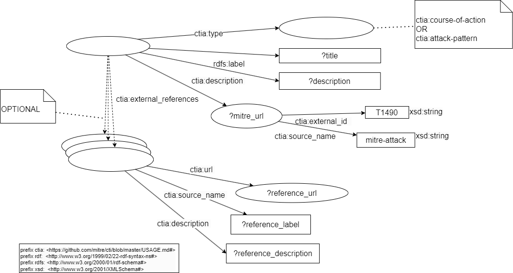

# Build a Knowledge Graph from STIX 2.1 data such as the MITRE ATT&CK® datasets

## Introduction
MITRE ATT&CK is a globally-accessible knowledge base of adversary tactics and techniques based on real-world observations. The ATT&CK knowledge base is used as a foundation for the development of specific threat models and methodologies in the private sector, in government, and in the cybersecurity product and service community.

The MITRE ATT&CK datasets in STIX 2.1 JSON collections are here:

* [enterprise-attack.json](https://github.com/mitre-attack/attack-stix-data/tree/master/enterprise-attack/enterprise-attack.json)
* [mobile-attack.json](https://github.com/mitre-attack/attack-stix-data/blob/master/mobile-attack/mobile-attack.json)
* [ics-attack.json](https://github.com/mitre-attack/attack-stix-data/blob/master/ics-attack/ics-attack.json)

[Structured Threat Information Expression (STIX™)](
https://oasis-open.github.io/cti-documentation/stix/intro.html) is a language and serialization format used to exchange cyber threat intelligence (CTI).

The "ontology" of MITRE ATT&CK with STIX is here: [https://github.com/mitre/cti/blob/master/USAGE.md](https://github.com/mitre/cti/blob/master/USAGE.md)

The objective of this tutorial is not focus on the ontologies. In our use case, we just need to extract several metadata. If the community of STIX wants to resolve their problems, it will be the moment to define a solid ontology. If you are a newbie with the Linked Data technologies, you have to learn to generate in first a functional knowledge graph for your needs before building a perfect ontology for everybody. When you masterize the ontologies, we will modify this first ontology and you could refresh your knowledge graph when you want with Corporate Memory.

This tutorial is written in order to gradually acquire all the skills necessary to build from scratch a knowledge graph with Corporate Memory and update it automatically via Corporate Memory Console.
This tutorial must be completed in order.

Labs:

1. Create a new project for your knowledge graph
2. Import the datasets to convert in RDF
3. Create named graphs of your knowledge graph
4. Create a STIX transformer
5. Create the workflow to transform all STIX data to RDF
6. Create the global graph of your knowledge graph
7. Test the SPARQL query to read the name, the description and the references of one Mitre tag
8. (optional) Create the Void description of knowledge graph 
9. (optional) Update the files via command lines

You can improve this first knowledge graph with these exercises:

1. Create an inference in your knowledge graph via a SPARQL Update query
2. Create an other knowledge graph for CAPEC linked to MITRE ATT&CK

## Labs

### Create a new project for your knowledge graph

For each type of dataset, you can create an new project with all the tools necessary to convert this dataset in a knowledge graph.


### Import the datasets to convert in RDF

MITRE ATT&CK® has 3 domains (TODO insert link): Entreprise, Mobile and ICS.

Each domain dataset is saved in GitHub:

* [enterprise-attack.json](https://github.com/mitre-attack/attack-stix-data/tree/master/enterprise-attack/enterprise-attack.json)
* [mobile-attack.json](https://github.com/mitre-attack/attack-stix-data/blob/master/mobile-attack/mobile-attack.json)
* [ics-attack.json](https://github.com/mitre-attack/attack-stix-data/blob/master/ics-attack/ics-attack.json)

1. Download these 3 files
2. Create for each JSON file, a JSON dataset:


!!! Tip

    Give a short name at each dataset/transformer/etc in Corporate Memory to recognize it easily in the workflow view. For example, we will use "MA Entreprise (JSON)" like label and "MITRE ATT&CK® Entreprise dataset STIX 2.1" like description for the Entreprise dataset and so "MA Mobile (JSON)" for Mobile, "MA ICS (JSON)" for ICS, etc.

!!! Success

    Now, you can see these JSON datasets in Corporate Memory:
    


### Create named graphs of your knowledge graph

!!! Info

    A knowledge graph is an abstract concept. Concretly in a triplestore or a RDF graph database via Corporate Memory, the database saves each RDF triple of graph in a named graph or RDF dataset in Corporate Memory. A graph named is a set of triples. So, a knowledge graph can be composed by one or several named graphs.


!!! Tip

    A named graph can be modify without affecting the other named graphs. Each dataset of Mitre can be updated at any moment, so we are going to create a specific named graph for each Mitre dataset to simplify the update of each dataset in your knowledge graph.

    A good practice is to name the named graph by the URI of its real source on the Web, so the labels and graph names of your RDF datasets can be:

    * Entreprise domain
  
        - Label: MA Entreprise (knowledge graph)
        - Graph name: https://github.com/mitre-attack/attack-stix-data/raw/master/enterprise-attack/enterprise-attack.json
  
    * Mobile domain
  
        - Label: MA Mobile (knowledge graph)
        - Graph name: https://github.com/mitre-attack/attack-stix-data/raw/master/mobile-attack/mobile-attack.json
  
    * ICS domain
  
        - Label: MA ICS (knowledge graph)
        - Graph name: https://github.com/mitre-attack/attack-stix-data/raw/master/ics-attack/ics-attack.json


Create one RDF datasets for each Mitre dataset:

1. Add component "RDF dataset"
2. Put a label
3. Put a URI of named graph
4. Enable "Clear graph before workflow execution"
   


!!! Success

    Now, you can see these RDF datasets in Corporate Memory:
    

!!! Tip

    The consequence of the option "Clear graph before workflow execution" is the named graph will be deleted (with all its triples) before receiving new triples  when you use this named graph like an output in a workflow and also in the transformer task (in the next step).

    This option is to use only for the graphs which will generate automatically by Corporate Memory.


### Create a STIX transformer

!!! Tip

    There are not bad manners to build a knowledge graph but there are knowledge graphs useless or very hard to use by the analysts or developers in their missions.

    Without having all queries necessary in their missions, your knowledge will continue to evolve to sastify all needs of your users.

    With Corporate Memory, you can develop progressively your vocabularies RDFS or your ontologies OWL to describes your knowledge graph.

    If it's your first knowledge graph, the best manner to start is with RDFS vocabularies because you can develop it like you develop classes and their instances in an object oriented language. It's exactly the same manner to describe the world. Of course, there are differences but you can start a first functional knowledge graph without being an expert.

    Here, you will create all classes and attributes necessary in your use case case. Not more, not less. So, we are adding each STIX object in your knowledge base with its STIX type, its label, its description and its references. Each reference can have an url, a label, a description and an external ID, like Mitre ID or CAPEC ID.

    In UML, you can represent your targeted model like that: here a RDF model to describe an instance of type "course-of-action" in MITRE ATT&CK

    

    The SPARQL query for this model can be specify in UML with a RDF pattern: here a RDF pattern to select the "course-of-action" objects with a known Mitre ID
    

    

    Without an official vocabulary and its official prefix, we are using the documentation on the Web of its datasets: [[enterprise-attack.json](https://github.com/mitre/cti/blob/master/USAGE.md)](https://github.com/mitre/cti/blob/master/USAGE.md)

    So, to make a prefix, we choosed a short name, for example "ctia", and the IRI will build with the Web address of its documentation with a # at the end (to link to anchors of attributes in the Web page, if they exist):

    ```turtle
    prefix ctia: <https://github.com/mitre/cti/blob/master/USAGE.md#>
    ```

1. Create the prefix of your vocabulary:
      ```turtle
      prefix ctia: <https://github.com/mitre/cti/blob/master/USAGE.md#>
      ```

      TODO insert screenshot

2. Create the (Mitre) STIX 2.1 transformer
   
      TODO insert screenshot

!!! Info

    STIX gives the possibility to extend its syntaxes. Mitre uses this possibility. So, in theory, if we need to import all the data, we can extend this transformer at STIX attributes and add the Mitre attributes described in its [documentation](https://github.com/mitre/cti/blob/master/USAGE.md).

3. Convert MD link of descriptions to html links for the interfaces of SPLUNK

      TODO insert screenshot

!!! Tip

    At any moment, you will modify your vocabulary according to your needs that you will find during your development.

!!! Success

    To test, you need to implement an example of SPARQL query with your RDF pattern. You can develop this query in the SPARQL editor:

      TODO insert screenshot

### Create the workflow to transform all STIX data to RDF

You have now a STIX transformer. We are building here a workflow to apply this transformer for all datasets in same time.

1. Create a workflow
2. Insert the input JSON dataset
3. Insert the output RDF dataset
3. Insert the transformer
4. Link all components
5. Execute the workflow
6. Save it
   TODO insert

Do the same operations for the three datasets.

!!! Success

    To test, you need to implement an example of SPARQL query with your RDF pattern. You can develop this query in the SPARQL editor:

      TODO insert screenshot

### Create the global graph of your knowledge graph

To simplify the requests by a SPARQL query on your knowledge graph, we are offering the possibility to request all data of these 3 datasets in same time.

We are showing SPARQL tasks, another important feature available in Corporate Memory: the SPARQL tasks with Jinja template

Here, the new SPARQL tasks are inserting automatically all the metadata to import the named graphs in this global graph and add a [VoID](https://www.w3.org/TR/void/) description with the statistics of your final knowledge graph.

!!! Info

    [VoID](https://www.w3.org/TR/void/) is an RDF Schema vocabulary for expressing metadata about RDF datasets. t is intended as a bridge between the publishers and users of RDF data.


1. Create a RDF dataset

    - Label: MITRE ATT&CK®  (knowledge graph)
    - URI (name of graph): https://attack.mitre.org


2. Create a SPARQL Update task

```sparql
PREFIX owl: <http://www.w3.org/2002/07/owl#>

INSERT DATA {
  GRAPH $outputProperties.uri("graph") {
  	$outputProperties.uri("graph") owl:imports $inputProperties.uri("graph")
  }
}
```

!!! Note

    TODO explain 
    $outputProperties.uri("graph")
    $inputProperties.uri("graph")

3. In the same workflow add one SPARQL task for each RDF datasets and in output add the RDF dataset "MITRE ATT&CK®". Execute it and save it.

TODO workflow image


!!! Success

    In the Turtle view of RDF dataset "MITRE ATT&CK®", you can see the triples inserted by your SPARQL query.
    ```turtle
    <http://attack.mitre.org> 
        owl:imports <https://github.com/mitre-attack/attack-stix-data/tree/master/enterprise-attack/enterprise-attack.json>;
        owl:imports <https://github.com/mitre-attack/attack-stix-data/blob/master/mobile-attack/mobile-attack.json>;
        owl:imports <https://github.com/mitre-attack/attack-stix-data/blob/master/ics-attack/ics-attack.json>
        .
    ```


4. In the same workflow, insert a new SPARQL task with this query to calculate the statistics:

```sparql
PREFIX rdfs: <http://www.w3.org/2000/01/rdf-schema#>
PREFIX dcterms: <http://purl.org/dc/terms/>
prefix void: <http://rdfs.org/ns/void#>

INSERT 
{ GRAPH $outputProperties.uri("graph") {
      $outputProperties.uri("graph") a void:Dataset;
          rdfs:label  "MITRE ATT&CK®";
          rdfs:comment  "MITRE ATT&CK® is a globally-accessible knowledge base of adversary tactics and techniques based on real-world observations.";
          void:triples ?triples ; 
          void:entities ?entities .
	}
}
USING $outputProperties.uri("graph")
WHERE
  { 
   {
    SELECT (COUNT(DISTINCT ?resource) as ?entities)
    WHERE {
      ?resource a ?class .
    }
  }
  {
    SELECT (COUNT(?s) as ?triples)
    WHERE {
          ?s ?p ?o .
    }
  }
}
```

This query uses the graph in output of workflow to replace the variable `$outputProperties.uri("graph")`. The work This SPARQL task is connected after the dataset

TODO workflow image

!!! Success

    ```turtle
    <http://attack.mitre.org> a void:Dataset;
        dcterms:title "MITRE ATT&CK®";
        dcterms:description "MITRE ATT&CK® is a globally-accessible knowledge base of adversary tactics and techniques based on real-world observations.";
        void:triples 1000000000 ; 
        void:entities 3400000 ;
            owl:imports <https://github.com/mitre-attack/attack-stix-data/tree/master/enterprise-attack/enterprise-attack.json>;
            owl:imports <https://github.com/mitre-attack/attack-stix-data/blob/master/mobile-attack/mobile-attack.json>;
            owl:imports <https://github.com/mitre-attack/attack-stix-data/blob/master/ics-attack/ics-attack.json>.
        .
    ```

### Update the files via command lines

1. Find your JSON datasets IDs and your workflow ID
2. execute these command lines

```bash
wget...
cmemc dataset download --replace DATASET_ID OUTPUT_PATH
cmemc workflow execute --wait WORKFLOW_ID
```

3. Create a scheduler in your cron

## Exercices

### Exercice: create an inference in your knowledge graph via a SPARQL Update query
After this tutorial, you want probably to navigate in your new knowledge graph between the relationships of Objects STIX.

TODO insert the view easynav with the icons of STIX ???

Apply these operations in Corporate Memory:
1. In the STIX transformer, import also the fields: ctia:source_ref, ctia:target_ref and ctia:relationship_type.
2. Create a new SPARQL Update task "convert STIX relationships to rdf statements" with this code:
```
PREFIX ctia: <https://github.com/mitre/cti/blob/master/USAGE.md#>

INSERT 
  { 
     GRAPH  $outputProperties.uri("graph") {
    			?source  ?property ?target .
       } 
  }
WHERE
  { 
     GRAPH  $inputProperties.uri("graph") {
      ?relationship
         ctia:type ctia:relationship ;
         ctia:source_ref ?source ;
         ctia:target_ref ?target ;
         ctia:relationship_type ?property .
    }
}
```
This SPARQL query create explicitly the STIX links in the knowledge graph. Here, we create a new inference via a simple query.
3. Create a new Knowledge graph dataset "STIX inferences" and import it, like other datasets, via the workflow "generate the global knowledge graph".
4. calculate also the "STIX inferences" dataset
  - In the workflow "Transform all STIX data to RDF", insert the task "convert STIX relationships to rdf statements" and the dataset "STIX inferences"
  - After all others tasks in this workflow, execute the task "convert STIX relationships to rdf statements" and save the inferences in the dataset "STIX inferences"
5. (TODO add STIX icon in CMEM)
6. You can now navigate in EasyNav

### Exercice: create an other knowledge graph for CAPEC
The Common Attack Pattern Enumeration and Classification (CAPEC™) effort provides a publicly available catalog of common attack patterns that helps users understand how adversaries exploit weaknesses in applications and other cyber-enabled capabilities.

Dataset: https://github.com/mitre/cti/blob/master/capec/2.1/stix-capec.json

The CAPEC "ontology": https://github.com/mitre/cti/blob/master/USAGE-CAPEC.md

1. Import the CAPEC dataset in Corporate Memory
2. Create the named graph of CAPEC
3. In the workflows of MITRE ATT&CK, insert the CAPEC dataset in the same knowledge graph

## Conclusion
STIX uses JSON syntax and can therefore be converted to RDF via Corporate Memory. Here, we have only extracted a few useful fields for our use case but if you want to import all the data, you will need to import the properties from STIX 2.1, the extended properties in your OSINT dataset and convert the other STIX relationships to RDF statements (like in the final exercice).

