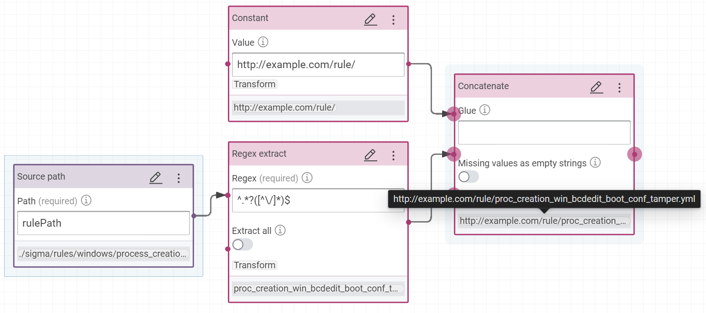

# Build the Knowledge Graph from indicators of compromise rules, like Hayabusa and Sigma rules

## Introduction

There are a lot of sources to download the indicators of compromise rules to detect a possible future incident.

There are rules for Host-based intrusion detection systems (HIDS) with Hayabusa/Sigma, for example, and Network intrusion detection systems (NIDS) with Suricata/Zeek for example.

Here, we are working with the Hayabusa/Sigma rules available via GitHub:

- https://github.com/Yamato-Security/hayabusa-rules
- https://github.com/SigmaHQ/sigma

The problem of interoperability, here, is the YAML format of files, their random position in their folders in their Github projets. Moreover, the same rule can exist in different projects but in this tutorial, we will not fix this problem and we consider the  IRI rule is their Web address. In Corporate Memory, we would fix that with the Linked Tool, we will study this tool in a next part of this tutorial.

To build this knowledge graph of rules, we need to:

1. Create a JSON dataset with all rules
2. Build the transformer of a JSON rule to RDF
3. Build a workflow to insert each rule in an unique knowledge graph
4. Use this workflow in CMEMC to import automatically all rules

## Import the JSON datasets

The YAML syntax is used to define each rule and there is one file by rule.

Corporate Memory doesn't support YAML (for the moment) but you can convert the files in JSON with this bash where you need to install git and [yq](https://github.com/mikefarah/yq).

Moreover, we use yq to add the field `rulePath` in each file with their paths in their repositories to have the possibility to rebuild their positions on the Web and so allowing the analyst to click directly on this link to read the details and may be, modify this rule.

At the end of this bash, you will have a tree of JSON files and we will apply a workflow on each file.

!!! Tip

    Don't forget to replace the final folder before using this bash.

```bash
#!/bin/bash -x

output_dir_rules=/home/karima/datasets/rules

mkdir -p  ${output_dir_rules}
cd ${output_dir_rules}
git clone --depth 1 https://github.com/Yamato-Security/hayabusa-rules
git clone --depth 1 https://github.com/SigmaHQ/sigma

for file in $(find . -name '*.yml'); do
    [ -f "$file" ] || break
	yq ".rulePath = \"${file}\"" -o=json  $file > ${file}.json
  
done
```

We can test this script:
```bash
mkdir -p /home/karima/datasets/rules
cd ~/git/tutorial-how-to-link-ids-to-osint/docs/build/tutorial-how-to-link-ids-to-osint/lift-data-from-YAML-data-of-hayabusa-sigma
chmod +x importRules.sh
./importRules.sh
```

For example, the file "https://github.com/SigmaHQ/sigma/master/
rules/windows/process_creation/proc_creation_win_bcdedit_boot_conf_tamper.yml" will become this JSON file:
```json
{
  "title": "Boot Configuration Tampering Via Bcdedit.EXE",
  "id": "1444443e-6757-43e4-9ea4-c8fc705f79a2",
  "status": "stable",
  "description": "Detects the use of the bcdedit command to tamper with the boot configuration data. This technique is often times used by malware or attackers as a destructive way before launching ransomware.",
  "references": [
    "https://github.com/redcanaryco/atomic-red-team/blob/f339e7da7d05f6057fdfcdd3742bfcf365fee2a9/atomics/T1490/T1490.md",
    "https://eqllib.readthedocs.io/en/latest/analytics/c4732632-9c1d-4980-9fa8-1d98c93f918e.html"
  ],
  ...
  "tags": [
    "attack.impact",
    "attack.t1490"
  ],
  ...
  "level": "high",
  "rulePath": "./sigma/rules/windows/process_creation/proc_creation_win_bcdedit_boot_conf_tamper.yml"
}
```

## Create the knowledge graph

The collected rules are from Sigma and Hayabusa repositories. [Hayabusa "are trying to make this rules as close to sigma rules as possible"](https://github.com/Yamato-Security/hayabusa-rules#rule-file-format). In your use case, we need properties defined by Sigma and which also exist in Hayabusa rules. The day where there will be a official RDF vocabulary to define a rule, we will use it. Waiting, your minimal vocabulary is "defined" here: [https://github.com/SigmaHQ/sigma-specification/blob/main/Sigma_specification.md#](https://github.com/SigmaHQ/sigma-specification/blob/main/Sigma_specification.md#). We use this address for the prefix of your RDF vocabulary for your use case.

The filename of the same rule between repositories does not change. So, we are making the IRI of rules with their filename and a arbitrary IRI, like "http://example.com/rule/". However, we want to give the possibility to open the original YAML rule directly via SPLUNK, so we add the property `rdfs:isDefinedBy` to associate the rule Web URLs to a rule.
We will not use the guid id or Web address of the rule in its IRI because rules are often duplicate between the repositories and the filename and the title seem to be the used IDs of rules in Splunk and not the guid id.

This new transformer are building the following RDF model for your use case:


1. Create a new project to build the knowledge graph of "Rules Hayabusa Sigma"
   (todo gif)

2. Create a RDF dataset "Rules Hayabusa Sigma" in Corporate Memory for all rules with the named graph: `http://example.com/rule`
   (todo gif after fix 142 )

4. Create a JSON dataset in Corporate Memory with one example of rule: "Rule example (JSON)"


5. Create the prefix of your vocabulary:
   
```turtle
prefix ctis: <https://github.com/SigmaHQ/sigma-specification/blob/main/Sigma_specification.md#>
```


4. Create the transformer for "SIGMA Hayabusa rule" to build this RDF model.

Rule object:

- type: `ctis:Rule`

- IRI: concatenation of "http://example.com/rule/" with the result of this regular expression `^.*?([^\/]*)$` on the rule path 
  
 (todo replace)

- property `rdfs:label` with the rule title
- property `rdfs:comment` with the rule description
- property `rdfs:seeAlso` with the references
- property `ctis:mitreAttackTechniqueId` is building with this formula
    - Filter by regex: `^attack\.t\d+$`
    - Regex replace `attack\.t` by `T`


  
- property `rdfs:isDefinedBy` is building with this formula to link the rules to their Web addresses.
    - Concatenate for Sigma `https://github.com/SigmaHQ/sigma/blob/master` with the rulepath `./sigma/rules/windows/process_creation/proc_creation_win_bcdedit_boot_conf_tamper.yml` to obtain this final link `https://github.com/SigmaHQ/sigma/blob/master/rules/windows/process_creation/proc_creation_win_bcdedit_boot_conf_tamper.yml`
    - Concatenate for Hayabusa `https://github.com/Yamato-Security/hayabusa-rules/blob/main` with the rulepath `./hayabusa-rules/hayabusa/sysmon/Sysmon_15_Info_ADS-Created.yml` to obtain this final link `https://github.com/Yamato-Security/hayabusa-rules/blob/main/hayabusa/sysmon/Sysmon_11_Med_FileCreated_RuleAlert.yml`


!!! Success

    Your example of rule exists now in your knowledge graph:
    
    


4. Make the workflow with one input


5. Copy the workflow ID


!!! Success

    In this example the ID of workflow is `RulesHayabusaSigma_0acd314cabf95ef2:Importrules_a1e8e349bc9563c6`

## Apply the worflow to all files

We modify the first bash where we add the line to clear the knowledge graph before importing all rules via our worflow where we subtitute the JSON dataset in input by the rules' files.

!!! Tip

    Don't forget to replace the worflow ID and the final folder before using this bash.

!!! Tip

    CMEMC config file need to be correctly configurated before to execute this bash. (todo create link to doc about cmemc config)

    For example:
    ```
    [myconfig]
    CMEM_BASE_URI=TODO put instance for the tutorial
    OAUTH_GRANT_TYPE=password
    OAUTH_CLIENT_ID=cmemc
    OAUTH_USER=YOUR_LOGIN
    OAUTH_PASSWORD=YOUR_PASSWORD
    ```

```bash
#!/bin/bash -x

output_dir_rules=/home/karima/datasets/rules

mkdir -p  ${output_dir_rules}
cd ${output_dir_rules}
git clone --depth 1 https://github.com/Yamato-Security/hayabusa-rules
git clone --depth 1 https://github.com/SigmaHQ/sigma

for file in $(find . -name '*.yml'); do
    [ -f "$file" ] || break
	yq ".rulePath = \"${file}\"" -o=json  $file > ${file}.json
done

cmemc -c myconfig graph delete http://example.com/rule

for file in $(find . -name '*.json'); do
    [ -f "$file" ] || break
    cmemc -c myconfig workflow io  RulesHayabusaSigma_0acd314cabf95ef2:Importrules_a1e8e349bc9563c6 -i ${file}
done
```

We can test this script:
```bash
./importRules.sh
```

## Conclusion

Here, we learnt how to generate a knowledge graph with files in input with Corporate Memory to prepare the worflow and cmemc to execute this worklow on all files.