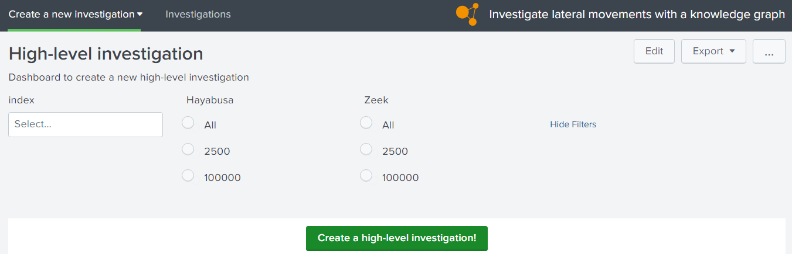
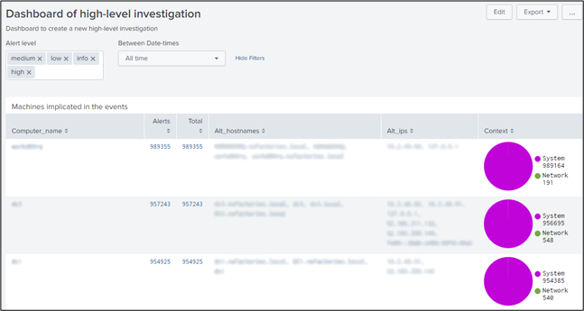
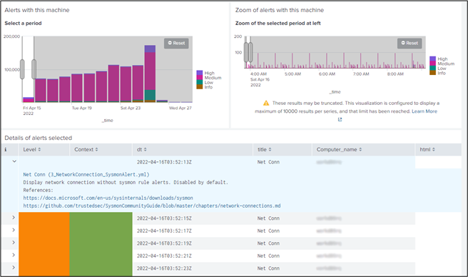
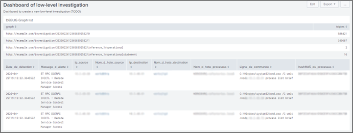
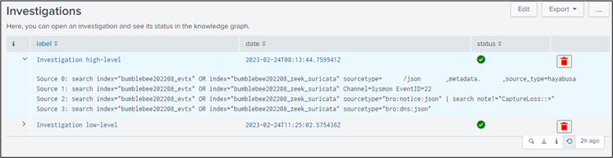
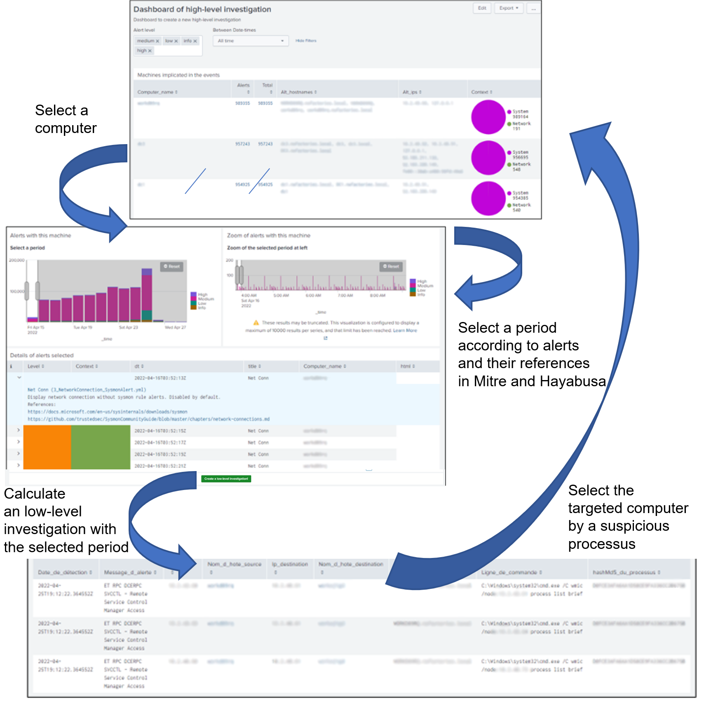

# Link IDS event to a knowledge graph via advanced tools

## Introduction
In this tutorial, we are using the Splunk app "Investigate lateral movements with a knowledge graph", like example. This app contains several dasboards to help the analysts to navigate in the Hayabusa or Sigma alerts before searching in the Suricata and Sysmon alerts. We hope this method can "Accelerate Cyber Threat Hunting".

In the demo of this Splunk app via the video 1, the user selects the data about one investigation via Splunk and generate a bash script to export these data via the Splunk API in tempory graphs in Corporate Memory for each investigation.


*Video 1: Splunk dashboards of the Splunk app "Investigate lateral movements with a knowledge graph"*

In this page, we are showing how, we :

1. Install the Splunk app "Investigate lateral movements with a knowledge graph"
2. "Accelerate Cyber Threat Hunting" with dashboards
3. Manage the graphs of your application
4. Export data in Splunk to Corporate Memory
5. Reasoning with data in Corporate Memory via Splunk
6. Reconcile automatically the complex data via Linking tasks

## Install the Splunk app "Investigate lateral movements with a knowledge graph"

This tutorial describes the method in the app "[Investigate lateral movements with a knowledge graph](eccenca_poc_investigate.tar.gz)". You can install it and modify the source code. The queries and workflows used in its dashboards are not shared because they are built according to Splunk indexes which are not shared also. But, you can modify the dashboards and build your queries and workflows in your sandbox.

This app is not directly connected to your Corporate Memory instance. The custom REST endpoint in this app via the file "Investigation.py" generates bash scripts for CMEMC to create or delete the tempory graphs of each investigation (and create/delete tempory folders). When the script is generated for one investigation, the script "createInvestigation.sh" or "deleteInvestigation.sh"  via a cron service on your Splunk server calls it and CMEMC will use this configuration by default on this server to connect to your Corporate Memory instance.

Position of these scripts in the folders of this app:
```                  
+---bin
|       Investigation.py  
+---cmem
|       createInvestigation.sh
|       deleteInvestigation.sh
```

Moreover, a settings file is necessary to insert the credentials of Splunk (like token, IP, port) and to specify the folders to manage the files of investigations on the server, ie. the generated scripts and the exported raw data of Splunk. Read the file "README.md" for more information.

## "Accelerate Cyber Threat Hunting" with dashboards

In this Proof of Concept, we have implemented two types of investigation:

- high-level with the data of alerts of Zeek and Hayabusa/Sigma
- low-level with the data of Suricata and Sysmon

For each investigation, an analyst selects and navigates in the data with two dashboards for each type of investigation:

- one dashboard (see figure 1) to select the data to transfer to knowledge graph: typeA_request.xml
- one dashboard (see figure 2,3,4) to navigate in the knowledge graph: typeA_dashboard.xml



*Figure 1: Splunk dashboard to select the data before executing a high-level investigation*



*Figure 2: High-level investigation dashboard with the list of computers implicated in the incident*



*Figure 3: High-level investigation dashboard with the panel to select a specific period during an incident according to IoCs details*



*Figure 4: low-level investigation dashboard contains the command lines of Windows processus rised Suricata alerts during the period selected by the analyst in a high-level investigation dashboard.*

The idea is the analyst can do an investigation high-level without using a lot of ressources (a little graph) but when he want to see the suspicious processus on one computer in a specific period, he can ask an investigation low-level with a maximum of details.

To follow the calculation of investigations and free memory when one investigation is closed, we developed another dashboard "investigation_list.xml" (see figure 5). This dashboard prints the status of investigations actually in the knowledge graph. Here, each investigation is saved in tempory graphs and the analyst can create and delete them directly in Splunk.


*Figure 5: The dashboard "investigation list" shows all the tempory graph actually in the knowledge graph. The analyst can open an investigation, see the SPL query generated when he has created an investigation and delete it when he want.*

With these interfaces to manage and calculate different investigations with different levels of details, we imagined a first method to "follow lateral movements" (see figure 6) in order to understand the objectives of the incident. We hope this PoC will "Accelerate Cyber Threat Hunting".


*Figure 6: Analyst can select a computer and a period to analyze the suspicious processus implicated in Suricata alerts. So, an analyst can follow the "lateral movements" and see the command lines executed by these suspicious processus.*

## Manage the graphs of your application

A knowledge graph in Corporate Memory is a set of named RDF graphs. Each named graph can be managed and each named graph can have missions very different. In this PoC, when a new investigation is created, the app creates in first the named graph "investigation" to link all the other tempory named graphs for this investigation with the property "owl:imports". So, when an analyst want to delete an investigation, the app can find all the tempory graphs of this investigation and can delete all its tempory graphs simply. Moreover, the analyst can request with SPARQL all these tempory graphs via one named graph "investigation" (thanks to "owl:imports"), so the complexity of tempory graphs is invisible for the final user.

An error of novices is to save all the triples of data in input and their inferences in the same graph. For each upload of facts, each calculated inference, etc, you need to save their triples in its own named graph because during the life of data (and the development), you want to restore easily one named graph without re-building all the other graphs.

This manner to manage the graphs has been applied in this app, so an analyst is able to write in his dashboard code the data to upload from Splunk to knowledge graph with the tokens "source_x", for example:
```xml
  <set token="source_1">{
  "index": $selected_index|s$,
  "search": "sauron_metadata.sauron_source_type=hayabusa Level!=info | table RuleTitle RuleFile | dedup RuleTitle RuleFile",
  "workflowID": "b5deffdd-f4b9-4d1a-8ea0-9b3410d915e7_PoC21:investigation-hayabusa"
  }</set>
```
This token contains a json object where:

- "index" the list of splunk indexes of the SPL query
- "search" the second part of the SPL query
- "workflowID" the ID of workflow in Corporate Memory to convert the raw data of Splunk in RDF in a tempory graph

An analyst can import as many sources as needed with several tokens, ie. "source_1", "source_2", etc. 

There are not consensus about the manner to calculate inferences on the RDF data in a knowledge graph. To simplify, one inference is a set of triples in a graph according to calculations with other triples in input. These calculations are possible only after all the sources are imported in the knowlege graph, ie. here, when all temporary graphs are created, the analyst can apply multiple calculations on these temporary graphs. Each calculation will create new triples in new tempory graphs always associated at the same investigation. We have created the token "inferences" to insert in the dashboard the json array of inferences to calculate when all data are imported from Splunk. For example:
```xml
<set token="inferences">
      [
        {
          "comment": "POC 2.1: inference 1: Resolve hostname in Zeek Notice with Zeek DNS",
        	"command": "query",
        	"queryIRI": "https://ns.eccenca.com/data/queries/d063d87e-9122-41a3-84e9-4a05c2d0766e",
        	"inferenceID": "1"
        },
        {
          "comment": "Linking hostname to prepare to calculate computers",
        	"command": "workflow",
        	"workflowID": "b5deffdd-f4b9-4d1a-8ea0-9b3410d915e7_PoC21:WORFLOW_CONSOLIDATION_HOSTNAME_bebe8b4a7f975e90"
        },
        {
          "comment": "POC 2.1: inference 2: Calculate computers",
        	"command": "query",
        	"queryIRI": "https://ns.eccenca.com/data/queries/10cd6a60-c5d4-444c-8a09-6dc63f51576f",
        	"inferenceID": "2"
        },
...
      ]
    </set>
```

We use two manners to calculate new inferences: 

- when the inference is simple to calculate with SPARQL, we use a SPARQL update query with parameters in Corporate Memory (like "inferenceID" to build the name of destination tempory graph). "queryIRI" is the IRI of the query in the catalog of Corporate Memory.
- when the inference is complex to calculate, we use a workflow of Corporate Memory.

With these tokens "source_1", "source_2", etc and "inferences" in the dashboard, the app can generate a bash script for CMEMC.

We explain now how to insert these tokens in a dashboard.

## Export data in Splunk to Corporate Memory
In the previous chapter, you explain the role of token "source_x" to create a new tempory graph with Splunk data. This token contains SPL queries with other external tokens. To calculate correctly these SPL queries, you need to "set" the token "source_x" in the xml element `change` of last input component of these external tokens, like in this example with the external token "selected_index":
```xml
    <input type="multiselect" token="selected_index" searchWhenChanged="true">
      <label>index</label>
      <valuePrefix>index="</valuePrefix>
      <valueSuffix>"</valueSuffix>
      <delimiter> OR </delimiter>
      <fieldForLabel>index</fieldForLabel>
      <fieldForValue>index</fieldForValue>
      <search>
        <query>| eventcount summarize=false index=*
| search NOT index IN ("history", "cim_modactions", "summary")
| dedup index 
| fields index</query>
        <earliest>0</earliest>
        <latest></latest>
      </search>
      <choice value="*">all</choice>
      <default>*</default>
      <change>
          <set token="source_1">{
          "index": $selected_index|s$,
          "search": "sauron_metadata.sauron_source_type=hayabusa Level!=info | table RuleTitle RuleFile | dedup RuleTitle RuleFile",
          "workflowID": "b5deffdd-f4b9-4d1a-8ea0-9b3410d915e7_PoC21:investigation-hayabusa"
          }</set>
      </change>
    </input>
```

Here the example is simple with one external token, but when you have several external tokens in the token "source_x", there are often problems to generate a complet SPL query (to check the SPL query, you need to use the Javascript console via the Javascript "investigation.js" to read the final SPL queries in the tokens "source_x").

You can add in your dashboard several tokens "source_1", "source_2", "source_3", etc. Each source generates a part of final bash script where a curl command requests the Splunk API and a CMEMC command executes the specified worflow via its ID in the token. With this method, the analyst is free to import any Splunk data and choose any CMEM workflow according to these data. The SPL queries are executed by the Splunk API (via curl), so the analyst is free to use all commands supported in Splunk to select the data. For example, with low-level investigation, these SPL queries contains also the selected period by the analyst to limit the quantity of data to import. 

## Reasoning with data in Corporate Memory via Splunk

When all the sources are imported in the knowlege graph, the app will use the token "inferences" to execute the last calculations to do on the knowledge graphs. Here, there is not SPL query to calculate so we "set" simply the token "inferences" in the xml element `init`:
```xml
<init>
    <set token="inferences">
      [
...
        {
          "comment": "Linking hostname to prepare to calculate computers",
        	"command": "workflow",
        	"workflowID": "b5deffdd-f4b9-4d1a-8ea0-9b3410d915e7_PoC21:WORFLOW_CONSOLIDATION_HOSTNAME_bebe8b4a7f975e90"
        },
        {
          "comment": "POC 2.1: inference 2: Calculate computers",
        	"command": "query",
        	"queryIRI": "https://ns.eccenca.com/data/queries/10cd6a60-c5d4-444c-8a09-6dc63f51576f",
        	"inferenceID": "2"
        },
...
      ]
    </set>
</init>
```

If you want to reuse your own algorithm to calculate new inferences, you can develop your own [plugin](develop/python-plugins/) in Corporate Memory and call it in a workflow that you can call in a Splunk dashboard.

## Reconcile automatically the complex data via a Linking task

In the previous chapter, you saw it is possible to call a workflow in a Splunk dashboard. A workflow is a set of components available in Corporate Memory, like transformer, tasks (SPARQL update query), etc. 

One component is **very useful** to reconcile the instance of concepts in your graphs like the concept of tools of different STIX documents or again, the computer according to their hostnames in the logs of systems and networks, etc. This component is the Linking task.

To use it:

1. Read the documentation of ["Linking task"](/build/active-learning) to learn to use it

2. [Do the exercice "Reconcile automatically the STIX concepts via the Linking tasks" in the page of tutorial about Mitre's datasets](../lift-data-from-STIX-2.1-data-of-mitre-attack/#reconcile-automatically-the-stix-concepts-via-the-linking-tasks)

## Conclusion

RDF is often considerated like too simple to manage the complexe knowledge but the reality is this simplicity is the core to manage all type of complexity. This abstraction is rarely simple for the novices but when you know use RDF properly with professional tools like Corporate Memory, you will make all type of applications, like applications in the cybersecurity.

Often with this tutorial, the analysts said there is already in SIEM (like Splunk) a lot of tools to hunt via the data. It's truth. There are a lot of tools in the SIEM to help the analysts. The difference with Corporate Memory and the Linked Data technologies, **YOU ARE FREE** because you can calculate your own inferences on your data, you can connect your SIEM with your knowledge graphs and ofcourse, your knowledge graphs is INTEROPERABLE, ie. you can connect your structured data with other tools in your information systems. Moreover, Corporate Memory can support several databases, so you are able to choose the best RDF database according the size of your investigations and the type of calculations to do.

Now, you know what is it possible to do simply an app in the CyberSecurity with the Linked Data technologies and Corporate Memory.

---
Tutorial: [how to link Intrusion Detection Systems (IDS) to Open-Source INTelligence (OSINT)](../index.md)

Previous chapter: [Link IDS event to a knowledge graph in dashboards via queries](../link-IDS-event-to-KG/index.md)