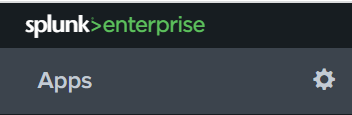
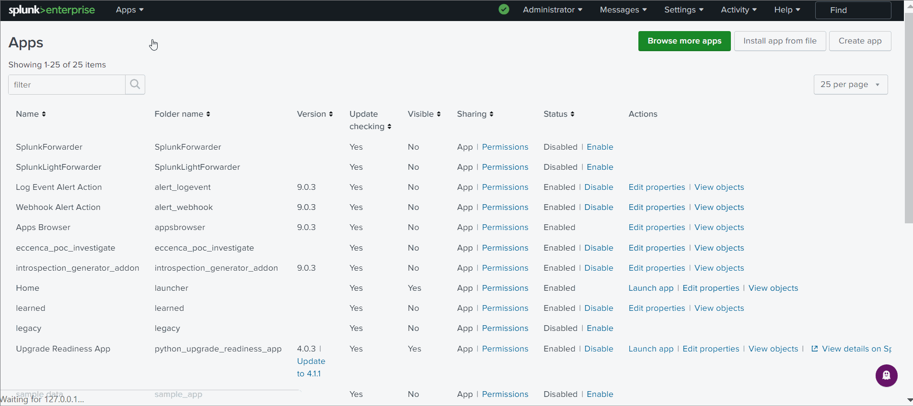
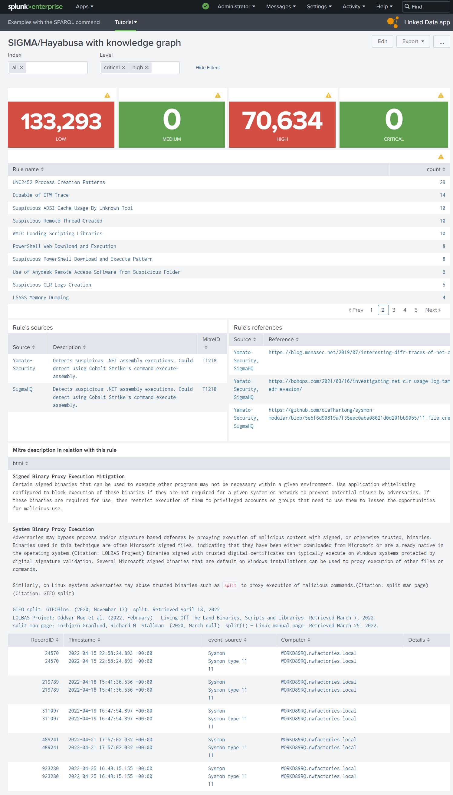

# Link IDS event to a knowledge graph in dashboards via SPARQL queries

## Introduction
In this tutorial, we are using the Linked Data App for Splunk. This app contains the SPARQL command necessary to dasboards to help the analysts to understand the Hayabusa and Sigma alerts before searching manually in the data via a SPL (Search Processing Language) query in Splunk.

In the demo of this app in the video 1, the user selects the indexes of his investigation and select an alert message to open its sources on the Web before searching manually via the Splunk interfaces. Splunk, automatically, refreshes the SPARQL queries in the dashboard after each interaction of user.


*Video 1: Splunk dashboards of the Linked Data App*

In this tutorial, we learn to:

1. Install the "Linked Data App" for this tutorial
2. Configure the SPARQL endpoint of your sandbox
3. Add other SPARQL endpoints
4. An example of dashboard with your private knowledge graphs

## Install the "Linked Data App" in Splunk for this tutorial

The "Linked Data App" extends Splunk Search Processing Language (SPL) to support the [SPARQL protocol](https://www.w3.org/TR/sparql11-protocol/). 


1. Download the tar.gz: [Linked Data App](../link-IDS-event-to-KG/eccenca_commands.tar.gz)

2. Open the App window in Splunk via the icon "tools" (see figure 1)



*Figure 1: In the top of the list of installed Splunk apps, you need to click on the icon "tools" to open the window to manage your apps*

3. Upload the app in Splunk (see video 2)


*Video 2: When the tar.gz of the "Linked Data App", you can upload it manually directly in Splunk.*

!!! Tip
    The dependencies of this app are already in its tar.gz but you can update the dependencies yourself, via the lines:
    ```bash
        cd eccenca_commands
        pip install sparqlwrapper -t bin --upgrade
        pip install splunk-sdk  -t bin --upgrade
    ```

## Configure the SPARQL endpoint of your sandbox

When you made your knowledge graphs in the previous pages, you have used the eccenca sandbox. To use these structured data in Splunk dashboards, you need to connect the SPARQL endpoint of your sandbox to Splunk via the "Linked Data App".

After the installation, this app is in the folder `etc/apps/eccenca_commands` of Splunk directory.

1. Create the file `settings.conf`:
```bash
cd etc/apps/eccenca_commands
cp default/settings_template_sandbox.conf default/settings.conf
vi default/settings.conf
```
You have an example of configuration for the eccenca sandbox SPARQL endpoint in the file `default/settings_template_sandbox.conf` (and another example via Oauth2 secret ID in the file `default/settings_template_oauth_secret_id.conf`).

2. Insert your credentials in the the file `settings.conf`, ie. replace `johndo` by the name of your sandbox (endpointRead, token_endpoint), `johndo@example.com` by your email and `XXXXXXXXX` by your password. Don't change the parameters OAUTH_CLIENT_ID and OAUTH_GRANT_TYPE.
```ini
[config:default]
# replace johndo.eccenca.my by your sandbox
endpointRead=https://johndo.eccenca.my/dataplatform/proxy/default/sparql
accessMethod=oauth2
# replace johndo.eccenca.my by your sandbox
token_endpoint=https://johndo.eccenca.my/auth/realms/cmem/protocol/openid-connect/token
OAUTH_CLIENT_ID=cmemc
OAUTH_GRANT_TYPE=password
# replace johndo@example.com  by your email
OAUTH_USER=johndo@example.com
# insert your password
OAUTH_PASSWORD=XXXXXXXXX
```

3. Restart after your Splunk instance (via the administration windows)

4. Test your sandbox endpoint in Splunk with this SPL query:
```
| sparql
    query="
        select *
        where {
            ?s ?p ?v
        }
        LIMIT 10
    "
```

## Add other SPARQL endpoints
To add a new SPARQL endpoint, add these two lines in your file `settings.conf` where your need to replace here `wikidata` by the name of new public endpoint and `https://query.wikidata.org/sparql` by the url of endpoint.
```ini
[config:wikidata]
endpointRead=https://query.wikidata.org/sparql
```

Restart after your Splunk instance and request in Splunk your endpoint with the parameter config (here wikidata) to select the config to use in the file `settings.conf`:
```
| sparql
    config="wikidata"
    query="
        select *
        where {
            ?s ?p ?v
        }
        LIMIT 10
    "
```

!!! Tip
    You can clone the dashboards of this app to see and modify the SPARQL examples with Wikidata.

## An example of dashboard with your private knowledge graphs

To work, our example of dashboard need to have Splunk indexes of IoCs. We cannot share our indexes but you can modify our example with your own SPL queries according to your Splunk indexes.


*Figure 2: Dashboard with SPARQL commands and the script `table_html.js` to print the HTML and to open Web pages of alerts' references*

!!! Tip
    The SPARQL command respects the logic of SPLUNK to see all metadata of the SPARQL response (types of literal, etc). However, in a dashboard via a static table panel, you want probably to see only the columns in the header of your SPARQL query. In the XML element `table`, you can select the columns in output via the XML element `fields`:
    ```xml
        <fields>["Source","Description","MitreID"]</fields>
    ```
    Ofcourse, you can do it also via the SPL query.

You can see the XML of dashboard in the figure 2:
```xml
<form version="1.1" script="eccenca_commands:table_html.js">
<label>SIGMA/Hayabusa with knowledge graph</label>
  <init>
    <unset token="help"></unset>
  </init>
  <fieldset submitButton="false" autoRun="true">
    <input type="multiselect" token="selected_index" searchWhenChanged="true">
      <label>index</label>
      <valuePrefix>index="</valuePrefix>
      <valueSuffix>"</valueSuffix>
      <delimiter> OR </delimiter>
      <fieldForLabel>index</fieldForLabel>
      <fieldForValue>index</fieldForValue>
      <search>
        <query>| eventcount summarize=false index=*
| search NOT index IN ("history", "cim_modactions", "summary")
| dedup index 
| fields index</query>
        <earliest>0</earliest>
        <latest></latest>
      </search>
      <choice value="*">all</choice>
      <default>*</default>
    </input>
    <input type="multiselect" token="level">
      <label>Level</label>
      <choice value="critical">critical</choice>
      <choice value="high">high</choice>
      <choice value="medium">medium</choice>
      <choice value="low">low</choice>
      <default>critical,medium,high,low</default>
      <valuePrefix>Level="</valuePrefix>
      <valueSuffix>"</valueSuffix>
      <delimiter> OR </delimiter>
    </input>
  </fieldset>
  <row>
    <panel>
      <single>
        <search>
          <query>| tstats count where $selected_index$ ld_metadata.ld_source_type=hayabusa Level=low</query>
          <earliest>0</earliest>
          <latest></latest>
        </search>
        <option name="colorMode">block</option>
        <option name="rangeColors">["0x53a051","0xdc4e41"]</option>
        <option name="rangeValues">[1]</option>
        <option name="refresh.display">progressbar</option>
        <option name="underLabel">LOW</option>
        <option name="useColors">1</option>
      </single>
    </panel>
    <panel>
      <single>
        <search>
          <query>| tstats count where $selected_index$ ld_metadata.ld_source_type=hayabusa Level=medium</query>
          <earliest>0</earliest>
          <latest></latest>
        </search>
        <option name="colorMode">block</option>
        <option name="rangeColors">["0x53a051","0xdc4e41"]</option>
        <option name="rangeValues">[1]</option>
        <option name="refresh.display">progressbar</option>
        <option name="underLabel">MEDIUM</option>
        <option name="useColors">1</option>
      </single>
    </panel>
    <panel>
      <single>
        <search>
          <query>| tstats count where $selected_index$ ld_metadata.ld_source_type=hayabusa Level=high</query>
          <earliest>0</earliest>
          <latest></latest>
        </search>
        <option name="colorMode">block</option>
        <option name="rangeColors">["0x53a051","0xdc4e41"]</option>
        <option name="rangeValues">[1]</option>
        <option name="refresh.display">progressbar</option>
        <option name="underLabel">HIGH</option>
        <option name="useColors">1</option>
      </single>
    </panel>
    <panel>
      <single>
        <search>
          <query>| tstats count where $selected_index$ ld_metadata.ld_source_type=hayabusa Level=critical</query>
          <earliest>0</earliest>
          <latest></latest>
        </search>
        <option name="colorMode">block</option>
        <option name="rangeColors">["0x53a051","0xdc4e41"]</option>
        <option name="rangeValues">[1]</option>
        <option name="refresh.display">progressbar</option>
        <option name="underLabel">CRITICAL</option>
        <option name="useColors">1</option>
      </single>
    </panel>
  </row>
  <row>
    <panel>
      <table>
        <search>
          <query>| tstats count where $selected_index$ ld_metadata.ld_source_type=hayabusa Level!=info $level$ by RuleTitle
| rename RuleTitle as "Rule name"
| sort - count</query>
          <earliest>0</earliest>
          <latest></latest>
        </search>
        <option name="drilldown">cell</option>
        <option name="refresh.display">progressbar</option>
        <drilldown>
          <set token="selected_rule">$click.value$</set>
        </drilldown>
      </table>
    </panel>
  </row>
  <row>
    <panel>
      <title>Rule's sources</title>
      <table>
        <search>
          <query>| sparql
query="prefix ctis: &lt;https://github.com/SigmaHQ/sigma-specification/blob/main/Sigma_specification.md#&gt;
prefix rdf:  &lt;http://www.w3.org/1999/02/22-rdf-syntax-ns#&gt;
prefix rdfs: &lt;http://www.w3.org/2000/01/rdf-schema#&gt;
prefix xsd:  &lt;http://www.w3.org/2001/XMLSchema#&gt;

SELECT DISTINCT (STRBEFORE(STRAFTER(STR(?link),\"https://github.com/\"),\"/\") as ?Source) (?comment as ?Description) ?link  (?mitreID as ?MitreID)
FROM &lt;http://example.com/rule&gt;
WHERE {     
  VALUES ?title { \"$selected_rule$\" }

        ?ruleHayabusa a ctis:Rule ;
            rdfs:label ?title ;
            rdfs:comment ?comment ;
            rdfs:seeAlso ?referenceLink;
            rdfs:isDefinedBy ?link ;
            ctis:filename ?filename .
      OPTIONAL {
       ?ruleHayabusa ctis:mitreAttackTechniqueId ?mitreID .
      }
}"</query>
          <earliest>-24h@h</earliest>
          <latest>now</latest>
          <done>
            <set token="MitreID">$result.MitreID$</set>
          </done>
        </search>
        <option name="drilldown">row</option>
        <drilldown>
          <link target="_blank">$row.link|n$</link>
        </drilldown>
        <option name="refresh.display">progressbar</option>
        <option name="wrap">true</option>
        <fields>["Source","Description","MitreID"]</fields>
      </table>
    </panel>
    <panel>
      <title>Rule's references</title>
      <table>
        <search>
          <query>| sparql
query="prefix ctis: &lt;https://github.com/SigmaHQ/sigma-specification/blob/main/Sigma_specification.md#&gt;
prefix rdf:  &lt;http://www.w3.org/1999/02/22-rdf-syntax-ns#&gt;
prefix rdfs: &lt;http://www.w3.org/2000/01/rdf-schema#&gt;
prefix xsd:  &lt;http://www.w3.org/2001/XMLSchema#&gt;

SELECT DISTINCT (GROUP_CONCAT(STRBEFORE(STRAFTER(STR(?link),\"https://github.com/\"),\"/\"); separator=', ') as ?Source)  (?referenceLink as ?Reference)
FROM &lt;http://example.com/rule&gt;
WHERE {     
  VALUES ?title { \"$selected_rule$\" }

        ?ruleHayabusa a ctis:Rule ;
            rdfs:label ?title ;
            rdfs:comment ?comment ;
            rdfs:seeAlso ?referenceLink;
            rdfs:isDefinedBy ?link ;
            ctis:filename ?filename .
}
GROUP BY ?referenceLink"</query>
          <earliest>-24h@h</earliest>
          <latest>now</latest>
        </search>
        <option name="drilldown">row</option>
        <option name="refresh.display">progressbar</option>
        <option name="wrap">true</option>
        <fields>["Source","Reference"]</fields>
        <drilldown>
          <link target="_blank">$row.Reference|n$</link>
        </drilldown>
      </table>
    </panel>
  </row>
  <row>
    <panel>
      <table id="column_html__1">
        <title>Mitre description in relation with this rule</title>
        <search>
          <query>| sparql
query="
PREFIX rdfs: &lt;http://www.w3.org/2000/01/rdf-schema#&gt;
PREFIX ctia: &lt;https://github.com/mitre/cti/blob/master/USAGE.md#&gt;

SELECT 
(CONCAT (\"&lt;b&gt;\",?title,\"&lt;/b&gt;\",\"&lt;br/&gt;\",?description,\"&lt;br/&gt;&lt;br/&gt;\",GROUP_CONCAT( distinct ?link; separator=\"&lt;br/&gt;\")) as ?html)
FROM &lt;https://github.com/mitre-attack/attack-stix-data/raw/master/enterprise-attack/enterprise-attack.json&gt;
WHERE  {

  {
    ?resource ctia:type ctia:course-of-action .
  } union {
    ?resource ctia:type ctia:attack-pattern .
  }

  ?resource rdfs:label ?title ;
            ctia:description ?description ;
            ctia:external_references ?mitre_url .

  ?mitre_url ctia:external_id  \"$MitreID$\" ;
             ctia:source_name  \"mitre-attack\" .

  OPTIONAL { 
    ?resource ctia:external_references [
        ctia:url ?reference_url ;
        ctia:source_name ?reference_label ;
        ctia:description ?reference_description 
    ] .
    BIND( CONCAT(\"&lt;a href='\",STR(?reference_url),\"'&gt;\",?reference_label,\": \",?reference_description ,\"&lt;/a&gt;\") as ?link)
  }

}
GROUP BY ?title ?description"</query>
          <earliest>-24h@h</earliest>
          <latest>now</latest>
        </search>
        <option name="drilldown">none</option>
        <option name="refresh.display">progressbar</option>
        <fields>["html"]</fields>
      </table>
    </panel>
  </row>
  <row>
    <panel depends="$selected_rule$">
      <table>
        <search>
          <query>$selected_index$ ld_metadata.ld_source_type=hayabusa RuleTitle="$selected_rule$"
| strcat Channel " type " EventID   event_source
| table RecordID, Timestamp, event_source, Computer, Details</query>
          <earliest>0</earliest>
          <latest></latest>
        </search>
        <option name="drilldown">cell</option>
        <drilldown>
          <link target="_blank">search?q=$selected_index$%20ld_metadata.ld_source_type%3Devtx%20EventRecordID%3D$click.value$&amp;earliest=0&amp;latest=</link>
        </drilldown>
      </table>
    </panel>
  </row>
</form>
```

## Conclusion
In the "Linked Data App", we implemented a simple SPARQL command to request the Linked Open Data and also your private knowledge graphs. 

The Linked Data technologies give the opportunity to push the Open-Source INTelligence (OSINT) in the Linked Open Data and it will simplify the work of analysts via their SIEM, like Splunk or other.

In the previous pages of this tutorial, you are able to create new classes and new properties in your knowledge graphs for Mitre Attack or IoC rules when you feel the need to do so. This natural behavior in the concept “Everything as code” creates a natural entropy of the global ontology of cyber domain. The first victim of this entropy is all the analysts. This problem can be resolve, if the analysts work together to build their cyber ontologies with the Linked Data technology, like Wikipedia contributors made Wikidata. It is only a matter of willpower and skill that you have now obtained through this tutorial.

In the next page, we are using advanced tools in Coporate Memory to "Accelerate Cyber Threat Hunting".

---
Tutorial: [how to link Intrusion Detection Systems (IDS) to Open-Source INTelligence (OSINT)](../index.md)

Next chapter: [Link IDS event to a knowledge graph in dashboards via inferences](../link-IDS-event-to-KG-via-cmem/index.md) (for the advanced users of Corporate Memory)

Previous chapter: [Build a Knowledge Graph from indicators of compromise rules, like Hayabusa and Sigma rules](../lift-data-from-YAML-data-of-hayabusa-sigma/index.md)
