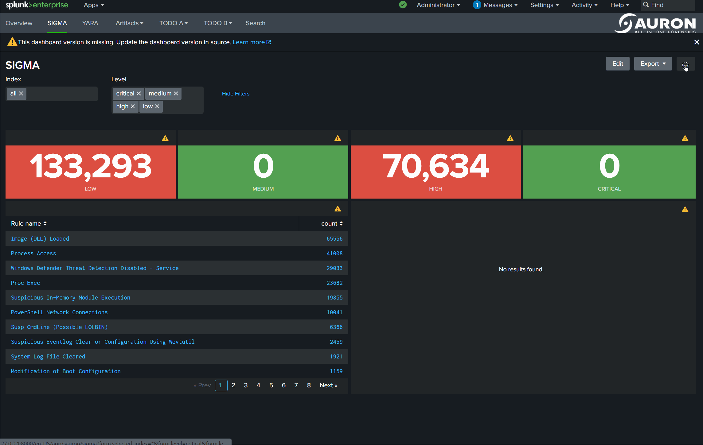
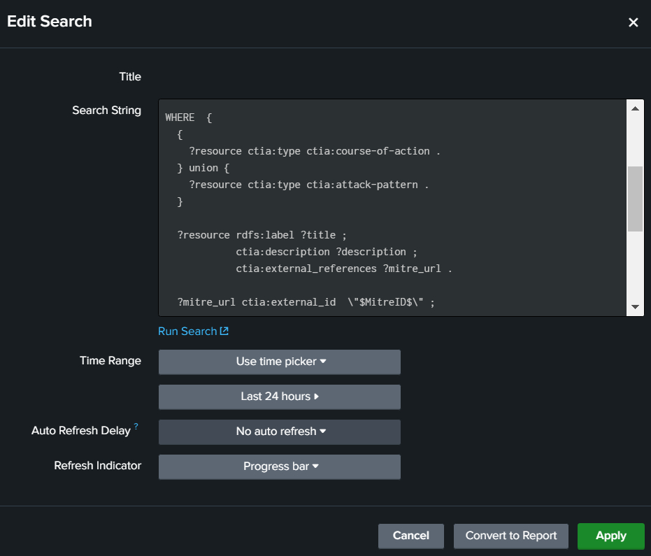
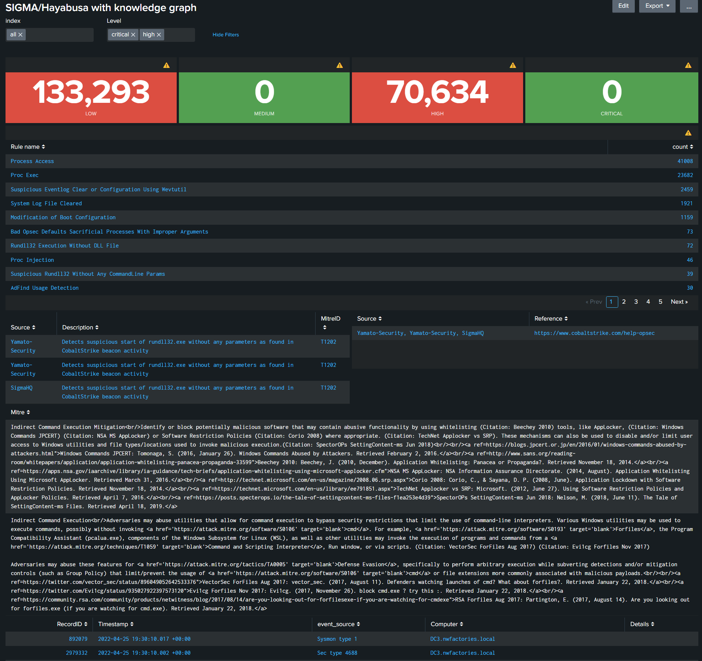
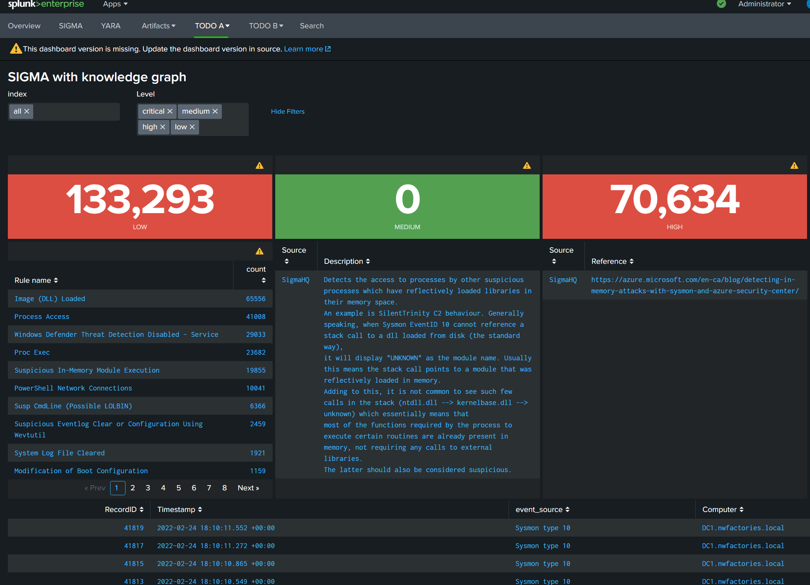

# Link IDS event to a knowledge graph via a SPARQL query

## Introduction

In this tutorial, we are using the Splunk app Sauron, like example. This app contains several dasboards to help the analysts to navigate in the Hayabusa or Sigma alerts before searching manually in the data via the SPL (Search Processing Language) in Splunk.

Demo of Sauron:


In this demo, the user selects the indexes of his investigation and select a alert message before searching manually. Splunk, automatically, refreshes the dashboard after each interaction of this user.

In this tutorial, we learn to:

<<<<<<<<<<TODO PLAN>>>>>>>>>>
(1) install the "eccenca" (name to find???) app for Splunk (2) request the Linked Open Data endpoints in Splunk, like the Wikidata endpoint with its referential of extension of files, (3) request your private knowledge graph, (4) join the details of alerts in a SPLUNK dashboard with SPARQL queries (figure~\ref{interface_static}) and (5) modify the SPLUNK dashboard to support the HTML in your knwoledge graph (figure~\ref{interface_dynamic}).

1. install the "eccenca" app in Splunk
   
2. request the Linked Open Data endpoints in Splunk, like the Wikidata endpoint with its referential of extension of files
   
3. request a private knowledge graph
   
4. join the details of alerts in a SPLUNK dashboard.

To facilate these tasks, we have developed a Splunk app to extend the SPL to support the [SPARQL protocol](https://www.w3.org/TR/sparql11-protocol/). We are starting to install this app.


We learn how to 






## Static


```xml
<form theme="dark">
  <label>SIGMA/Hayabusa with knowledge graph</label>
  <init>
    <unset token="help"></unset>
  </init>
  <fieldset submitButton="false" autoRun="true">
    <input type="multiselect" token="selected_index" searchWhenChanged="true">
      <label>index</label>
      <valuePrefix>index="</valuePrefix>
      <valueSuffix>"</valueSuffix>
      <delimiter> OR </delimiter>
      <fieldForLabel>index</fieldForLabel>
      <fieldForValue>index</fieldForValue>
      <search>
        <query>| eventcount summarize=false index=*
| search NOT index IN ("history", "cim_modactions", "summary")
| dedup index 
| fields index</query>
        <earliest>0</earliest>
        <latest></latest>
      </search>
      <choice value="*">all</choice>
      <default>*</default>
    </input>
    <input type="multiselect" token="level">
      <label>Level</label>
      <choice value="critical">critical</choice>
      <choice value="high">high</choice>
      <choice value="medium">medium</choice>
      <choice value="low">low</choice>
      <default>critical,medium,high,low</default>
      <valuePrefix>Level="</valuePrefix>
      <valueSuffix>"</valueSuffix>
      <delimiter> OR </delimiter>
    </input>
  </fieldset>
  <row>
    <panel>
      <single>
        <search>
          <query>| tstats count where $selected_index$ sauron_metadata.sauron_source_type=hayabusa Level=low</query>
          <earliest>0</earliest>
          <latest></latest>
        </search>
        <option name="colorMode">block</option>
        <option name="rangeColors">["0x53a051","0xdc4e41"]</option>
        <option name="rangeValues">[1]</option>
        <option name="refresh.display">progressbar</option>
        <option name="underLabel">LOW</option>
        <option name="useColors">1</option>
      </single>
    </panel>
    <panel>
      <single>
        <search>
          <query>| tstats count where $selected_index$ sauron_metadata.sauron_source_type=hayabusa Level=medium</query>
          <earliest>0</earliest>
          <latest></latest>
        </search>
        <option name="colorMode">block</option>
        <option name="rangeColors">["0x53a051","0xdc4e41"]</option>
        <option name="rangeValues">[1]</option>
        <option name="refresh.display">progressbar</option>
        <option name="underLabel">MEDIUM</option>
        <option name="useColors">1</option>
      </single>
    </panel>
    <panel>
      <single>
        <search>
          <query>| tstats count where $selected_index$ sauron_metadata.sauron_source_type=hayabusa Level=high</query>
          <earliest>0</earliest>
          <latest></latest>
        </search>
        <option name="colorMode">block</option>
        <option name="rangeColors">["0x53a051","0xdc4e41"]</option>
        <option name="rangeValues">[1]</option>
        <option name="refresh.display">progressbar</option>
        <option name="underLabel">HIGH</option>
        <option name="useColors">1</option>
      </single>
    </panel>
    <panel>
      <single>
        <search>
          <query>| tstats count where $selected_index$ sauron_metadata.sauron_source_type=hayabusa Level=critical</query>
          <earliest>0</earliest>
          <latest></latest>
        </search>
        <option name="colorMode">block</option>
        <option name="rangeColors">["0x53a051","0xdc4e41"]</option>
        <option name="rangeValues">[1]</option>
        <option name="refresh.display">progressbar</option>
        <option name="underLabel">CRITICAL</option>
        <option name="useColors">1</option>
      </single>
    </panel>
  </row>
  <row>
    <panel>
      <table>
        <search>
          <query>| tstats count where $selected_index$ sauron_metadata.sauron_source_type=hayabusa Level!=info $level$ by RuleTitle
| rename RuleTitle as "Rule name"
| sort - count</query>
          <earliest>0</earliest>
          <latest></latest>
        </search>
        <option name="drilldown">cell</option>
        <option name="refresh.display">progressbar</option>
        <drilldown>
          <set token="selected_rule">$click.value$</set>
        </drilldown>
      </table>
    </panel>
  </row>
  <row>
    <panel>
      <table>
        <search>
          <query>| sparql
query="prefix ctis: &lt;https://github.com/SigmaHQ/sigma-specification/blob/main/Sigma_specification.md#&gt;
prefix rdf:  &lt;http://www.w3.org/1999/02/22-rdf-syntax-ns#&gt;
prefix rdfs: &lt;http://www.w3.org/2000/01/rdf-schema#&gt;
prefix xsd:  &lt;http://www.w3.org/2001/XMLSchema#&gt;

SELECT DISTINCT (STRBEFORE(STRAFTER(STR(?link),\"https://github.com/\"),\"/\") as ?Source) (?comment as ?Description) ?link  (?mitreID as ?MitreID)
FROM &lt;http://example.com/rule&gt;
WHERE {    	
  VALUES ?title { \"$selected_rule$\" }
   
        ?ruleHayabusa a ctis:Rule ;
            rdfs:label ?title ;
            rdfs:comment ?comment ;
            rdfs:seeAlso ?referenceLink;
            rdfs:isDefinedBy ?link ;
            ctis:filename ?filename .
      OPTIONAL {
       ?ruleHayabusa ctis:mitreAttackTechniqueId ?mitreID .
      }
}"</query>
          <earliest>-24h@h</earliest>
          <latest>now</latest>
          <done>
            <set token="MitreID">$result.MitreID$</set>
          </done>
        </search>
        <option name="drilldown">row</option>
        <drilldown>
          <link target="_blank">$row.link|n$</link>
        </drilldown>
        <option name="refresh.display">progressbar</option>
        <option name="wrap">true</option>
        <fields>["Source","Description","MitreID"]</fields>
      </table>
    </panel>
    <panel>
      <table>
        <search>
          <query>| sparql
query="prefix ctis: &lt;https://github.com/SigmaHQ/sigma-specification/blob/main/Sigma_specification.md#&gt;
prefix rdf:  &lt;http://www.w3.org/1999/02/22-rdf-syntax-ns#&gt;
prefix rdfs: &lt;http://www.w3.org/2000/01/rdf-schema#&gt;
prefix xsd:  &lt;http://www.w3.org/2001/XMLSchema#&gt;

SELECT DISTINCT (GROUP_CONCAT(STRBEFORE(STRAFTER(STR(?link),\"https://github.com/\"),\"/\"); separator=', ') as ?Source)  (?referenceLink as ?Reference)
FROM &lt;http://example.com/rule&gt;
WHERE {    	
  VALUES ?title { \"$selected_rule$\" }
   
        ?ruleHayabusa a ctis:Rule ;
            rdfs:label ?title ;
            rdfs:comment ?comment ;
            rdfs:seeAlso ?referenceLink;
            rdfs:isDefinedBy ?link ;
            ctis:filename ?filename .
}
GROUP BY ?referenceLink"</query>
          <earliest>-24h@h</earliest>
          <latest>now</latest>
        </search>
        <option name="drilldown">row</option>
        <option name="refresh.display">progressbar</option>
        <option name="wrap">true</option>
        <fields>["Source","Reference"]</fields>
        <drilldown>
          <link target="_blank">$row.Reference|n$</link>
        </drilldown>
      </table>
    </panel>
  </row>
  <row>
    <panel>
      <table>
        <search>
          <query>| sparql
query="
PREFIX rdfs: &lt;http://www.w3.org/2000/01/rdf-schema#&gt;
PREFIX ctia: &lt;https://github.com/mitre/cti/blob/master/USAGE.md#&gt;

SELECT 
(CONCAT (?title,\"&lt;br/&gt;\",?description,\"&lt;br/&gt;&lt;br/&gt;\",GROUP_CONCAT( distinct ?link; separator=\"&lt;br/&gt;\")) as ?Mitre)
FROM &lt;https://github.com/mitre-attack/attack-stix-data/raw/master/enterprise-attack/enterprise-attack.json&gt;
WHERE  {
   
  {
    ?resource ctia:type ctia:course-of-action .
  } union {
    ?resource ctia:type ctia:attack-pattern .
  }

  ?resource rdfs:label ?title ;
            ctia:description ?description ;
            ctia:external_references ?mitre_url .

  ?mitre_url ctia:external_id  \"$MitreID$\" ;
             ctia:source_name  \"mitre-attack\" .

  OPTIONAL { 
    ?resource ctia:external_references [
        ctia:url ?reference_url ;
        ctia:source_name ?reference_label ;
        ctia:description ?reference_description 
    ] .
    BIND( CONCAT(\"&lt;a ref=\",STR(?reference_url),\"\\\"&gt;\",?reference_label,\": \",?reference_description ,\"&lt;/a&gt;\") as ?link)
  }
  
}
GROUP BY ?title ?description"</query>
          <earliest>-24h@h</earliest>
          <latest>now</latest>
        </search>
        <option name="drilldown">none</option>
        <option name="refresh.display">progressbar</option>
        <fields>["Mitre"]</fields>
      </table>
    </panel>
  </row>
  <row>
    <panel depends="$selected_rule$">
      <table>
        <search>
          <query>$selected_index$ sauron_metadata.sauron_source_type=hayabusa RuleTitle="$selected_rule$"
| strcat Channel " type " EventID   event_source
| table RecordID, Timestamp, event_source, Computer, Details</query>
          <earliest>0</earliest>
          <latest></latest>
        </search>
        <option name="drilldown">cell</option>
        <drilldown>
          <link target="_blank">search?q=$selected_index$%20sauron_metadata.sauron_source_type%3Devtx%20EventRecordID%3D$click.value$&amp;earliest=0&amp;latest=</link>
        </drilldown>
      </table>
    </panel>
  </row>
</form>
```


## HTML

```xml
<form theme="dark" script="gandalf:table_html.js">
  <label>SIGMA/Hayabusa with knowledge graph v2</label>
  <init>
    <unset token="help"></unset>
  </init>
  <fieldset submitButton="false" autoRun="true">
    <input type="multiselect" token="selected_index" searchWhenChanged="true">
      <label>index</label>
      <valuePrefix>index="</valuePrefix>
      <valueSuffix>"</valueSuffix>
      <delimiter> OR </delimiter>
      <fieldForLabel>index</fieldForLabel>
      <fieldForValue>index</fieldForValue>
      <search>
        <query>| eventcount summarize=false index=*
| search NOT index IN ("history", "cim_modactions", "summary")
| dedup index 
| fields index</query>
        <earliest>0</earliest>
        <latest></latest>
      </search>
      <choice value="*">all</choice>
      <default>*</default>
    </input>
    <input type="multiselect" token="level">
      <label>Level</label>
      <choice value="critical">critical</choice>
      <choice value="high">high</choice>
      <choice value="medium">medium</choice>
      <choice value="low">low</choice>
      <default>critical,medium,high,low</default>
      <valuePrefix>Level="</valuePrefix>
      <valueSuffix>"</valueSuffix>
      <delimiter> OR </delimiter>
    </input>
  </fieldset>
  <row>
    <panel>
      <single>
        <search>
          <query>| tstats count where $selected_index$ sauron_metadata.sauron_source_type=hayabusa Level=low</query>
          <earliest>0</earliest>
          <latest></latest>
        </search>
        <option name="colorMode">block</option>
        <option name="rangeColors">["0x53a051","0xdc4e41"]</option>
        <option name="rangeValues">[1]</option>
        <option name="refresh.display">progressbar</option>
        <option name="underLabel">LOW</option>
        <option name="useColors">1</option>
      </single>
    </panel>
    <panel>
      <single>
        <search>
          <query>| tstats count where $selected_index$ sauron_metadata.sauron_source_type=hayabusa Level=medium</query>
          <earliest>0</earliest>
          <latest></latest>
        </search>
        <option name="colorMode">block</option>
        <option name="rangeColors">["0x53a051","0xdc4e41"]</option>
        <option name="rangeValues">[1]</option>
        <option name="refresh.display">progressbar</option>
        <option name="underLabel">MEDIUM</option>
        <option name="useColors">1</option>
      </single>
    </panel>
    <panel>
      <single>
        <search>
          <query>| tstats count where $selected_index$ sauron_metadata.sauron_source_type=hayabusa Level=high</query>
          <earliest>0</earliest>
          <latest></latest>
        </search>
        <option name="colorMode">block</option>
        <option name="rangeColors">["0x53a051","0xdc4e41"]</option>
        <option name="rangeValues">[1]</option>
        <option name="refresh.display">progressbar</option>
        <option name="underLabel">HIGH</option>
        <option name="useColors">1</option>
      </single>
    </panel>
    <panel>
      <single>
        <search>
          <query>| tstats count where $selected_index$ sauron_metadata.sauron_source_type=hayabusa Level=critical</query>
          <earliest>0</earliest>
          <latest></latest>
        </search>
        <option name="colorMode">block</option>
        <option name="rangeColors">["0x53a051","0xdc4e41"]</option>
        <option name="rangeValues">[1]</option>
        <option name="refresh.display">progressbar</option>
        <option name="underLabel">CRITICAL</option>
        <option name="useColors">1</option>
      </single>
    </panel>
  </row>
  <row>
    <panel>
      <table>
        <search>
          <query>| tstats count where $selected_index$ sauron_metadata.sauron_source_type=hayabusa Level!=info $level$ by RuleTitle
| rename RuleTitle as "Rule name"
| sort - count</query>
          <earliest>0</earliest>
          <latest></latest>
        </search>
        <option name="drilldown">cell</option>
        <option name="refresh.display">progressbar</option>
        <drilldown>
          <set token="selected_rule">$click.value$</set>
        </drilldown>
      </table>
    </panel>
  </row>
  <row>
    <panel>
      <title>Rule's sources</title>
      <table>
        <search>
          <query>| sparql
query="prefix ctis: &lt;https://github.com/SigmaHQ/sigma-specification/blob/main/Sigma_specification.md#&gt;
prefix rdf:  &lt;http://www.w3.org/1999/02/22-rdf-syntax-ns#&gt;
prefix rdfs: &lt;http://www.w3.org/2000/01/rdf-schema#&gt;
prefix xsd:  &lt;http://www.w3.org/2001/XMLSchema#&gt;

SELECT DISTINCT (STRBEFORE(STRAFTER(STR(?link),\"https://github.com/\"),\"/\") as ?Source) (?comment as ?Description) ?link  (?mitreID as ?MitreID)
FROM &lt;http://example.com/rule&gt;
WHERE {    	
  VALUES ?title { \"$selected_rule$\" }
   
        ?ruleHayabusa a ctis:Rule ;
            rdfs:label ?title ;
            rdfs:comment ?comment ;
            rdfs:seeAlso ?referenceLink;
            rdfs:isDefinedBy ?link ;
            ctis:filename ?filename .
      OPTIONAL {
       ?ruleHayabusa ctis:mitreAttackTechniqueId ?mitreID .
      }
}"</query>
          <earliest>-24h@h</earliest>
          <latest>now</latest>
          <done>
            <set token="MitreID">$result.MitreID$</set>
          </done>
        </search>
        <option name="drilldown">row</option>
        <drilldown>
          <link target="_blank">$row.link|n$</link>
        </drilldown>
        <option name="refresh.display">progressbar</option>
        <option name="wrap">true</option>
        <fields>["Source","Description","MitreID"]</fields>
      </table>
    </panel>
    <panel>
      <title>Rule's references</title>
      <table>
        <search>
          <query>| sparql
query="prefix ctis: &lt;https://github.com/SigmaHQ/sigma-specification/blob/main/Sigma_specification.md#&gt;
prefix rdf:  &lt;http://www.w3.org/1999/02/22-rdf-syntax-ns#&gt;
prefix rdfs: &lt;http://www.w3.org/2000/01/rdf-schema#&gt;
prefix xsd:  &lt;http://www.w3.org/2001/XMLSchema#&gt;

SELECT DISTINCT (GROUP_CONCAT(STRBEFORE(STRAFTER(STR(?link),\"https://github.com/\"),\"/\"); separator=', ') as ?Source)  (?referenceLink as ?Reference)
FROM &lt;http://example.com/rule&gt;
WHERE {    	
  VALUES ?title { \"$selected_rule$\" }
   
        ?ruleHayabusa a ctis:Rule ;
            rdfs:label ?title ;
            rdfs:comment ?comment ;
            rdfs:seeAlso ?referenceLink;
            rdfs:isDefinedBy ?link ;
            ctis:filename ?filename .
}
GROUP BY ?referenceLink"</query>
          <earliest>-24h@h</earliest>
          <latest>now</latest>
        </search>
        <option name="drilldown">row</option>
        <option name="refresh.display">progressbar</option>
        <option name="wrap">true</option>
        <fields>["Source","Reference"]</fields>
        <drilldown>
          <link target="_blank">$row.Reference|n$</link>
        </drilldown>
      </table>
    </panel>
  </row>
  <row>
    <panel>
      <table id="column_html__1">
        <title>Mitre description in relation with this rule</title>
        <search>
          <query>| sparql
query="
PREFIX rdfs: &lt;http://www.w3.org/2000/01/rdf-schema#&gt;
PREFIX ctia: &lt;https://github.com/mitre/cti/blob/master/USAGE.md#&gt;

SELECT 
(CONCAT (\"&lt;b&gt;\",?title,\"&lt;/b&gt;\",\"&lt;br/&gt;\",?description,\"&lt;br/&gt;&lt;br/&gt;\",GROUP_CONCAT( distinct ?link; separator=\"&lt;br/&gt;\")) as ?html)
FROM &lt;https://github.com/mitre-attack/attack-stix-data/raw/master/enterprise-attack/enterprise-attack.json&gt;
WHERE  {
   
  {
    ?resource ctia:type ctia:course-of-action .
  } union {
    ?resource ctia:type ctia:attack-pattern .
  }

  ?resource rdfs:label ?title ;
            ctia:description ?description ;
            ctia:external_references ?mitre_url .

  ?mitre_url ctia:external_id  \"$MitreID$\" ;
             ctia:source_name  \"mitre-attack\" .

  OPTIONAL { 
    ?resource ctia:external_references [
        ctia:url ?reference_url ;
        ctia:source_name ?reference_label ;
        ctia:description ?reference_description 
    ] .
    BIND( CONCAT(\"&lt;a href='\",STR(?reference_url),\"'&gt;\",?reference_label,\": \",?reference_description ,\"&lt;/a&gt;\") as ?link)
  }
  
}
GROUP BY ?title ?description"</query>
          <earliest>-24h@h</earliest>
          <latest>now</latest>
        </search>
        <option name="drilldown">none</option>
        <option name="refresh.display">progressbar</option>
        <fields>["html"]</fields>
      </table>
    </panel>
  </row>
  <row>
    <panel depends="$selected_rule$">
      <table>
        <search>
          <query>$selected_index$ sauron_metadata.sauron_source_type=hayabusa RuleTitle="$selected_rule$"
| strcat Channel " type " EventID   event_source
| table RecordID, Timestamp, event_source, Computer, Details</query>
          <earliest>0</earliest>
          <latest></latest>
        </search>
        <option name="drilldown">cell</option>
        <drilldown>
          <link target="_blank">search?q=$selected_index$%20sauron_metadata.sauron_source_type%3Devtx%20EventRecordID%3D$click.value$&amp;earliest=0&amp;latest=</link>
        </drilldown>
      </table>
    </panel>
  </row>
</form>
```

