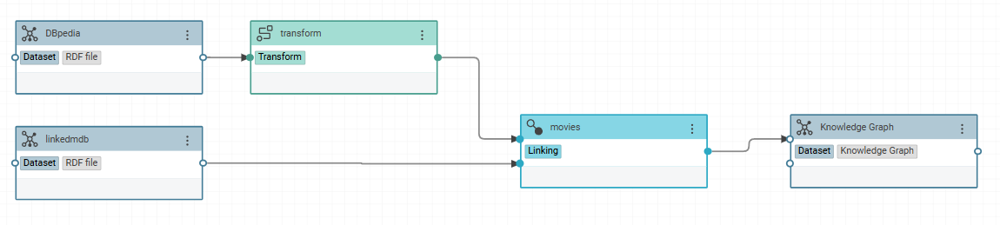
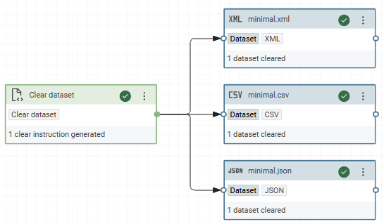
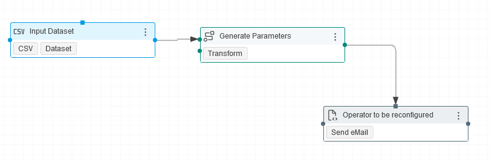

# Workflows

Workflows are the central building blocks for orchestrating complex data processing tasks.

A **workflow** is a directed acyclic graph (DAG) that orchestrates data processing. Each workflow connects **datasets** with **operators** (transforms, linking tasks, and other processing steps) to define a complete data pipeline.

Workflows are the primary mechanism for:

- Reading data from one or more sources, transforming it, and writing results to target datasets (for instance the Knowledge Graph).
- Connecting records across datasets using linking rules.
- Chaining multiple processing steps into a single, repeatable pipeline.
- Orchestrating other workflows as sub-tasks.

This page describes common workflow operations and how to configure them.

## Core Concepts

### Node Types

Every node in a workflow graph is one of:

- **Dataset** - A data source and/or sink (CSV file, database table, Knowledge Graph, etc.). Typical sources are files or databases, while sinks are typically Knowledge Graphs.
- **Operator** - A processing step such as a Transform, Linking task, or custom operator. Operators read entities from their inputs, process them, and pass results to their outputs.

A single project task (e.g., a Transform named "Clean addresses") can appear in the same workflow more than once; each occurrence is a distinct **workflow node**.

In addition, notes can be added; they do not affect workflow execution.

### Connection Types

Nodes are linked by different types of connections:

- **Data** - The default connection. Carries entity data from one node's output port to another node's input port.
- **Dependency** - Enforces execution order without transferring data. Use this when one node must finish before another starts, but the second node does not consume the first node's output.
- **Config** - Feeds configuration parameters into a downstream node at runtime, allowing dynamic reconfiguration of task settings.

### Execution Order

The workflow executor builds a dependency graph from all connections and performs a **topological sort** to determine execution order. Nodes with no unsatisfied dependencies execute first; downstream nodes execute once all of their inputs are available.

### Replaceable Datasets

Datasets can be marked as **replaceable inputs** or **replaceable outputs** on the workflow. When a workflow is executed programmatically (e.g., via the REST API or as a nested workflow), callers can substitute these datasets with alternative sources or sinks without modifying the workflow definition. This enables workflow reuse across different environments or data sets.

## Clearing datasets

The **Clear Dataset** operator empties the dataset connected to its output before new data is written. This is the recommended way to ensure a target dataset starts clean on every workflow run.

Place the Clear Dataset operator in the workflow and connect its output to the dataset that should be cleared. The operator takes no data inputs; connect it using a **dependency connection** from the upstream node that must complete first, or leave it unconnected if the dataset should be cleared before any subsequent nodes execute.

Some datasets historically provided their own clear attributes (e.g., `Clear graph before workflow execution` on the Knowledge Graph dataset). These per-dataset attributes are **deprecated** and should no longer be used. Use the Clear Dataset operator instead, which works uniformly across all dataset types.

## Workflow Reconfiguration

### Introduction

The operators of a workflow can be reconfigured completely in the context of a workflow.
During its execution, new parameters are loaded from any possible source and translated by a transformation task to allow an injection into the dataset configuration that overwrites originally set parameters.
To reconfigure a workflow operator, the transformation task has to be connected to the red dot at the top of this operator as shown in the following image:

Although this feature has been developed to support the ingestion of database deltas, the possible applications are various since any parameter can be overwritten to make workflow operators even more dynamic and reusable in various contexts.
The incremental ingestion of database content that was implemented as a first use-case can be found the application section of this page.
However, we intend to add other use-cases that have been implemented.
The following parameters seem to be good starting points for possible applications:

- Transformation Task:
    - Source Type
    - Source Restriction
- JDBC endpoint (remote)
    - Source Query
    - Write Strategy
    - Restriction
- Knowledge Graph (embedded)
    - Graph
- Scheduler
    - Interval
    - Enabled
- …

### Implementation

To reconfigure a workflow operator, you need to create a transformation task, the data source of which is the intended source of the dynamic parameters of the workflow operator.
Once you have created this task, you need to create a data value mapping for each parameter you want to overwrite.

!!! info

    Only one transformation task can be used to reconfigure the workflow operator and one source can be used for a transformation task's source.
    Thus, it is necessary to pre-process all parameters that need to be rewritten into one single dataset, e.g. a CSV file or a in-memory dataset.
    Then, you can use this dataset to inject all parameters with one transformation task.

Once you are sure, that your mapping rule entails the correct value, you can set the workflow operator parameter as the target property of the mapping rule.
After this is done, you can reconfigure any workflow operator that uses this parameter as part of its configuration.

!!! info

    The transformation task needs a suffix of the workflow parameter's URI in the workflow operator's serialization as its target property.
    This differs from the documentation that just refers to the parameter's `_name_`.
    If you want to overwrite the source query of a JDBC endpoint, you need to define `sourceQuery` as the target property, which is the suffix of `<https://vocab.eccenca.com/di/functions/param_Jdbc_sourceQuery>`.

### Applications

Tutorials that showcase this function in an application context:

- [Loading JDBC datasets incrementally](../loading-jdbc-datasets-incrementally/index.md)