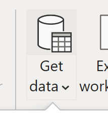
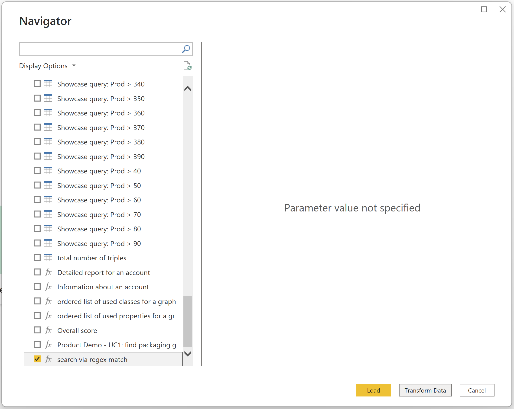

# Consuming Graphs in Power BI

## Introduction

Learn how to consume data from your Corporate Memory Knowledge Graph with our Microsoft Power-BI-Connector.

This manual and tutorial describes how you can consume data from your knowledge graph in Microsoft Power BI through our Corporate Memory Power-BI-Connector.

Power BI is a business analytics service by Microsoft. It aims to provide interactive visualizations and business intelligence capabilities with an interface simple enough for end users to create their own reports and dashboards. Power BI can be obtained from the [official Microsoft page](https://www.microsoft.com/download/details.aspx?id=45331)  and/or in the Windows Software Store.

The latest (unsigned) version of our Power-BI-Connector is available from its source repository a version signed by eccenca is available with each Corporate Memory release.

- [eccenca github.com repository](https://github.com/eccenca/power-bi-connector/tags) (unsigned .mez file) 
- [eccenca Corporate Memory Releases](https://releases.eccenca.com/power-bi-connector/) (signed .pqx file)
  - Thumbprint of the signature: **FB6C562BD0B08107AAA420EDDE94507420C7FE1A**

## Installation

- Download the `.pqx` or `.mez` file from the locations linked above.
- Move the file into the folder `Documents\Power BI Desktop\Custom Connectors` .
  - Create the folder if it does not exist.
  - In case you are running Windows on Parallels Desktop: Do not use the Local `Disk\Users\UserName\Documents` folder but your shared folder with macOS.
- Register the Thumbprint (for .pqx) or setup PowerBI Desktop to allow any 3rd party connector (for .pqx or .mez) *(we recommend to register the Thumbprint)*

!!! Setup

    === "Register Thumbprint (.pqx)"

        - In order to allow the eccenca Corporate Memory Power-BI-Connector in your Power BI Desktop installation you need to register the Thumbprint of the file signature in the windows registry.
        - Cf. [official Microsoft documentation](https://docs.microsoft.com/en-us/power-bi/connect-data/desktop-trusted-third-party-connectors)
            - The registry path is `HKEY_LOCAL_MACHINE\Software\Policies\Microsoft\Power BI Desktop` . Make sure the path exists, or create it.
            - Add a new value under the path specified above. The type should be “Multi-String Value” ( `REG_MULTI_SZ` ), and it should be called `TrustedCertificateThumbprints`
            - Add the thumbprints of the certificates you want to trust. You can add multiple certificates by using “\0” as a delimiter, or in the registry editor, right click → modify and put each thumbprint on a new line.
            
            - (Re-)Start Power BI Desktop
        
        If you wish to automate this setup you can use the reg windows command line tool to make this entry like:
      
        ```powershell
        REM list existing entries in Power BI Desktop > TrustedCertificateThumbprints
        reg query ""HKEY_LOCAL_MACHINE\SOFTWARE\Policies\Microsoft\Power BI Desktop" /v TrustedCertificateThumbprints
        
        REM add eccenca Corporate Memory Power-BI-Connector Thumbprint
        reg add "HKEY_LOCAL_MACHINE\SOFTWARE\Policies\Microsoft\Power BI Desktop" /v TrustedCertificateThumbprints /t REG_MULTI_SZ /d FB6C562BD0B08107AAA420EDDE94507420C7FE1A
        ```


    === "Allow 3rd Party Connectors (.mez and .pqx)"

        - In case you are using the .mez (works for .pqx file too) file or simply want to trust any third party connector extension
        - (Re-)Start Power BI Desktop, go to `File → Options and settings → Options → Security`
        - Under Data Extensions, select*(Not Recommended). Allow any extension to load without validation or warning.*
        - Select OK, and then restart Power BI Desktop.
        

## Add a Data Source

Use the Power-BI-Connector to login with your Corporate Memory Instance:

- Open Power BI Desktop
- Click `Edit Queries → New Source` (or directly Get `Data`)
[](22-1-2-Get-Data.png){ .off-glb }
- In the dialog search for eccenca `Corporate Memory`, which is listed in the `Database` category

- Select the connector and click `Connect`
- Read and accept the 3rd party connector notification

- In the following dialog you need to specify the connection and information and access credentials, ask your Corporate Memory administrator for assistance if you miss any of the requested details. You have the option to use username + password or a client secret for login. In case of a custom setup is used advanced configuration can be provided:

!!! Access-Configuration

    === "Username + Password"
        In order to use username +  password based login you need to fill the details shown below:

        - First Step
            - Corporate Memory Base URI
            - Grant type = password
            - Client ID
          
        - Second Step
            - Password / Client Secret
          

    === "Client"
        In order to use Client Secret based login you need to fill the details shown below:

        - First Step
            - Corporate Memory Base URI
            - Grant type = client_credentials
            - Client ID
          
        - Second Step
            - Password / Client Secret
      
    === "Advanced Configuration"
        In case you installation uses a custom service endpoint layout the individual URIs for DataPlatform and Keycloak can be configured individually. The configuration keys are the same as for cmemc.

        - The following configuration parameter can be provided:
            - `DP_API_ENDPOINT` - specifies the DataPlatform URI
            - `OAUTH_TOKEN_URI` - specifies the keycloak token URI
            - `SSL_VERIFY` - can be used to set certificate verification to `False`
        
        - In case a `Corporate Memory Base URI` is configured too, the values from the `Config ini` section take precedence

## Get Data

With the eccenca Corporate Memory Power-BI-Connector you can load data from SELECT queries stored in the query catalog of Corporate Memory. You can use queries without or with placeholders. The steps are different depending if your query uses placeholder:

!!! Queries

    === "Without placeholders"

        - `SELECT` queries that use no placeholders are shown with a table icon (e.g. [](22-1-3-Graph-List.png){ .off-glb })
        - When selected a preview will be loaded.
        - Check the one(s) you want to load and click `OK`.
        - The tables will be added to your list of `queries` and to the `fields` inventory in Power BI
        - Start using your data in transformations, dashboards and analytics
        

    === "With placeholders"

        - SELECT queries that take placeholder arguments are shown with a function icon. (e.g. [](22-1-3-regex-button.png){ .off-glb })
        
        - You need to be in `Edit Queries` mode in Power BI so you can enter the required query parameter.
        - Check the one(s) to be added.
        - Power BI will add the selected query as a `query` entry.
        - Click "Transform Data" in order to fill in the parameter.
        
        - This adds a new entry to the list of Power BI queries, which contains the actual data you requested. The new entry will be named “Invoked Function”.
        - It is recommended to rename this automatic generated name to a more speaking one. Right click on “Invoked Function” or select “Invoked Function” and press F2.
        - Rename the table (e.g. to “_search via regex match”). Click “Close & Apply“ to save changes.
        
        ???+ hint
            You can call the function multi times with different parameter values to get different result tables into Power BI.
        - Start using your data in transformations, dashboards and analytics
