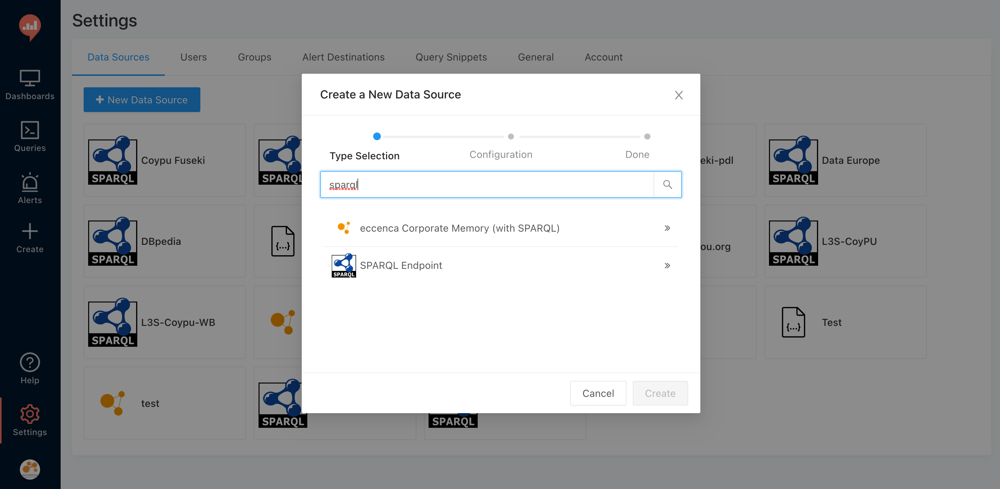
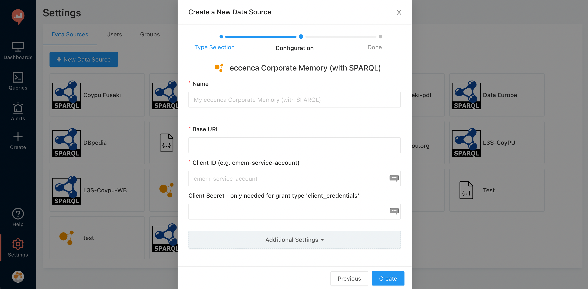
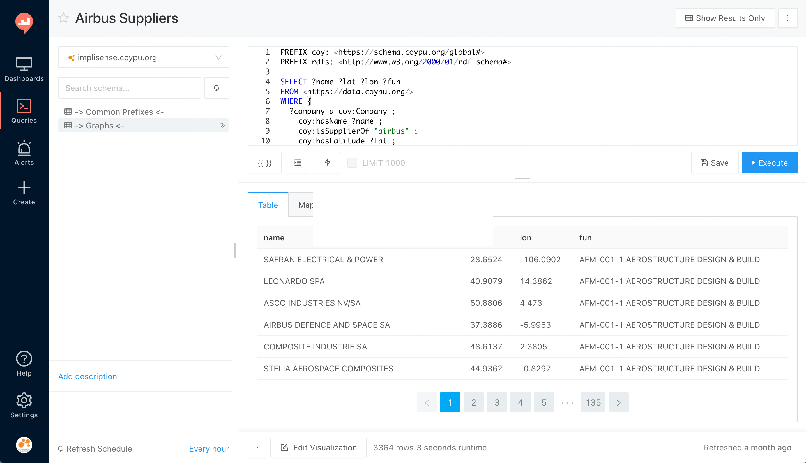

# Consuming Graphs in Redash

## Introduction

[Redash](https://redash.io) is an open-source tool designed to help data scientists and analysts visualize and build interactive dashboards of their data.
Beside creating Dashboards, users can configure alerts in order to get mails on specific data events.
In [03/2021](https://github.com/getredash/redash/pull/5415) Redash has added an eccenca Corporate Memory query runner to its core repository, which enables Redash users to query Corporate Memory instances and build visualisations and dashboards based on Knowledge Graphs.

## Adding an eccenca Corporate Memory Data Source

The key to query your Knowledge Graphs with Redash is to add a new eccenca Corporate Memory data source.
To do so, open the **Settings** > **Data Sources** Tab, and search for the right type:

Click on it and you will come into another screen where you have to enter location and access data:

This configuration screen basically clones the basic configuration of [cmemc](../../automate/cmemc-command-line-interface/configuration/file-based-configuration/index):

- **Name** is a human friendly identifier for the source,
- **Base URL** refers to `CMEM_BASE_URI`,
- **Client ID** refers to `OAUTH_CLIENT_ID`,
- **Client Secret** refers to `OAUTH_CLIENT_SECRET`.

## Query your Knowledge Graph and Create Dashboards

Once you added a eccenca Corporate Memory data source to Redash, you can create queries, configure visualisation widgets based on the query results, and combine these widgets as dashboards.

To get familiar with Redash, please have a look at the Redash user guide, especially the [Getting Started](https://redash.io/help/user-guide/getting-started) page.

!!! Info

    In order to query eccenca Corporate Memory data sources in Redash, you have to formulate your query with SPARQL:
    

