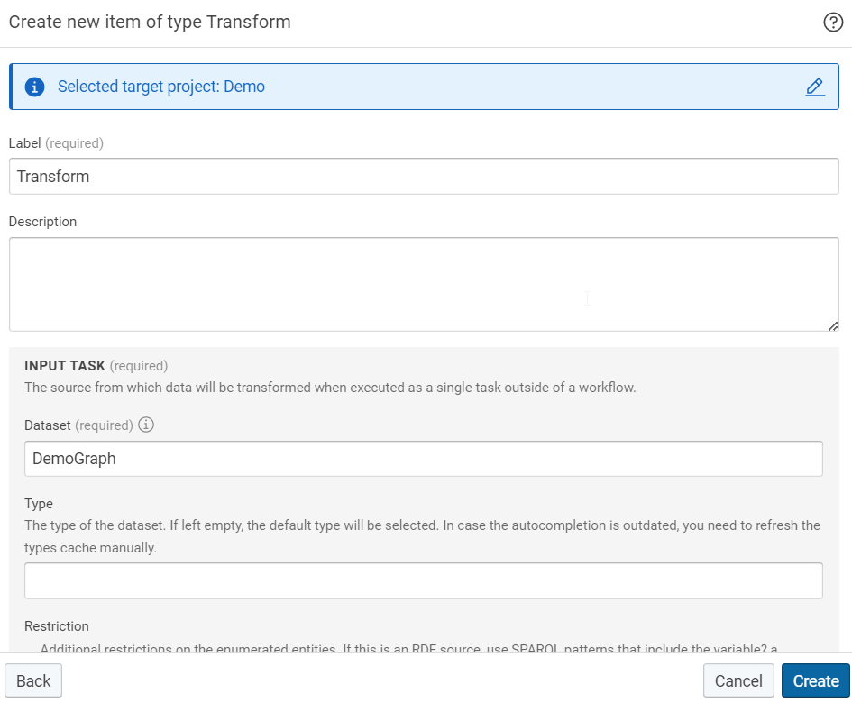

# Consuming Graphs with SQL Databases

## Introduction

If direct access to the knowledge graph is not sufficient, fragments of the Knowledge Graph may also be pushed into external SQL databases. While in general all supported databases can also be written into, optimized writing support is available and packaged for MySQL and MariaDB.

See the documentation of the JDBC dataset for more details.

## Writing a single table into a SQL database

Three buildings blocks are required in eccenca DataIntegration to write into a remote SQL database:

- A dataset that allows access to the Knowledge Graph.
- A transformation that builds tables from specified resources in the Knowledge Graph.
- A dataset that configures access to the SQL database using JDBC.

A simple workflow to write the contents of a Knowledge Graph into a SQL database looks like this:

In the following, we have a more detailed look at each of the three operators.

### Create Knowledge Graph dataset

Create a dataset of the type Knowledge Graph (embedded) and set the graph parameter to the URI of the graph that contains the resources to be exported:

### Create Transformation

Create a transformation that covers the type of the RDF resources to be exported into a table:

For each column of the target table, add a value mapping to the transformation:
<figure markdown>
  { width="90%" }
  <figcaption>Basic Mapping</figcaption>
</figure>
The shown transformation will create a table with two columns:

- A column **name**  that contains values of the property **foaf:name**.
- A column **runtime** that contains values of the property **dbpediaow:runtime**.

### Create SQL dataset

Create a dataset of the type JDBC endpoint (remote):

The most relevant parameters are:

- The JDBC Driver Connection URL should contain the database-specific JDBC URL.
- The table parameter defines the name of the table to be written.
- The write strategy specifies the behavior if the configured table already exists in the target SQL database.

## Writing multiple tables into a SQL database

If multiple tables should be written from several type of resources, there are two options:

1. If the types are connected by properties, a single transformation with multiple object mappings can be used. The root mapping will write the table specified by the SQL dataset. Each object mapping does write an additional table. The name of the table is generated based on the target type, which is defined in the object mapping.
2. If the types are not directly connected by properties, multiple transformations can be created. Note that for each transformation, a separate target SQL dataset needs to be created, since the table name is specified in it.
