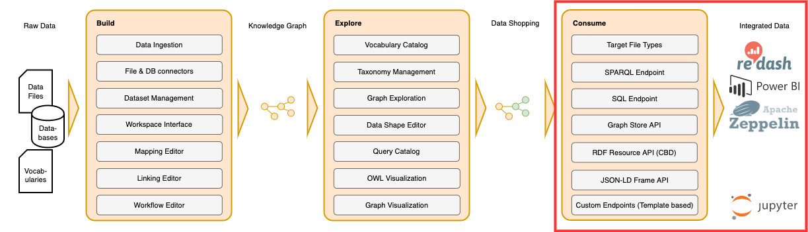

!!! info inline end ""

    

# :material-star: Consume

This section outlines how to consume data from Corporate Memory Knowledge Graphs.
While there are several options to retrieve information from the Knowledge Graph, the most direct way is to issue SPARQL queries.
SPARQL queries can be managed and executed in the [Query Module UI](../deploy-and-configure/configuration/explore/query-module/index.md).
External applications may access the query catalog and execute queries through the REST API directly or more conveniently by using the [cmemc - Command Line Interface](../automate/cmemc-command-line-interface/index.md).
Since not all applications allow the direct use of SPARQL, this section includes tutorials to access Knowledge Graphs using BI tools (such as Power BI) as well as relational databases.

**:octicons-people-24: Intended audience**: Linked Data Experts

-   :other-powerbi: [Power BI](consuming-graphs-in-power-bi/index.md)

    ---

    Learn how to consume data from your Corporate Memory Knowledge Graph with our Microsoft Power-BI-Connector.

-   :material-view-dashboard: [Redash](consuming-graphs-with-redash/index.md)

    ---

    Create Dashboards based on your Knowledge Graphs with the open-source application Redash.

-   :eccenca-artefact-dataset-sqlendpoint: [SQL Databases](consuming-graphs-with-sql-databases/index.md)

    ---

    If direct access to the knowledge graph is not sufficient, fragments of the Knowledge Graph may also be pushed into external SQL databases.

-   :material-api: [Custom APIs](provide-data-in-any-format-via-a-custom-api/index.md)

    ---

    Learn how to provide data via a customized Corporate Memory API in a text format of your choice and how to consume it in your applications.

-   :simple-neo4j: [Neo4j](populate-data-to-neo4j/index.md)

    ---

    Learn how to populate graphs to Neo4j.

-   :material-apache-kafka: [Apache Kafka](consume-graphs-in-apache-kafka/index.md)

    ---

    Use a Apache Kafka Producer in order to export parts of your Knowledge Graph as a message stream.

