# Populate Data to Neo4j

## Introduction

This tutorial walks you through the process of using the Neo4j dataset.
You will learn how to transform data from a source dataset into a graph structure into Neo4j.

!!! Abstract

    This tutorial uses a specific dataset called Northwind for your understanding.
    However, the principles can be applied and reused with any dataset.
    All the source data for this project is stored in a Multi CSV Zip file: [northwind.zip](northwind.zip).

    The vocabulary used in the tutorial can be found here: [schema.ttl](schema.ttl).

    Download these files to have them available before you start the tutorial.

## 1 Load the source dataset

eccenca Corporate Memory provides the framework to create Resource Description Framework (RDF) tuples from non-Graph data sources such as tabular (CSV, Excel, SQL) or hierarchical (XML, JSON) sources.
Additionally, Corporate Memory supports Neo4j as a source of or target for data.
The Northwind dataset is available on [github](https://github.com/neo4j-documentation/developer-resources/tree/gh-pages/data/northwind).
This tutorial uses the _Multi CSV Zip_ format to efficiently handle the following CSV files:

- employees.csv
- orders.csv
- products.csv
- categories.csv
- Suppliers.csv

To upload multiple files together as an input:

1. In Corporate Memory, click Projects under **BUILD** in the navigation on the left side of the page.
    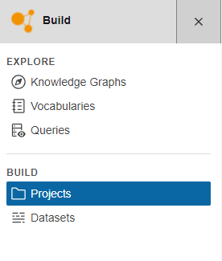{width="50%"}
2. Click Create at the top of the page. 
3. In Create new item window, select Project and click Add. The Create new item of type Project window appears.
4. Fill in the required details such as Title and Description.  Alternatively, import the existing project by clicking Import Project File and selecting the file from your system. 
5. Click Create. Your project (Northwind) is created.
    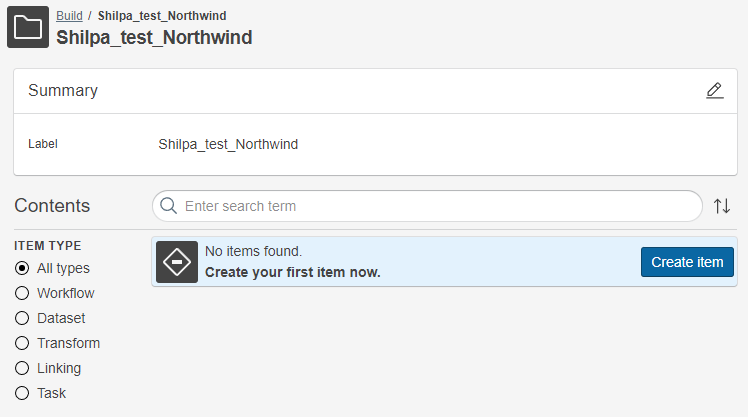
6. In your project, click Create Item.
7. In the Create new item window, select Multi CSV ZIP and click Add.
    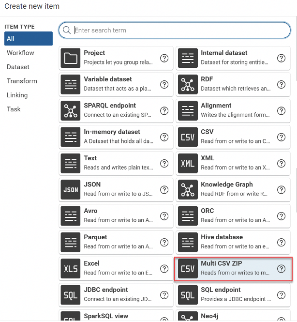
8. Specify a Label of the dataset in the Create new item of type Multi CSV ZIP window.
9. Select the Upload new file option as you have the files. The Multi CSV ZIP file containing the above-listed files is available here. If it is an existing project, you can select the files from the project. For the remaining parameters, the default settings are used.
10. Click Create. You can see the message northwind.zip was successfully uploaded in Green.
11. You can see the Multi CSV ZIP file is uploaded with the datasets, and the item has been created.
    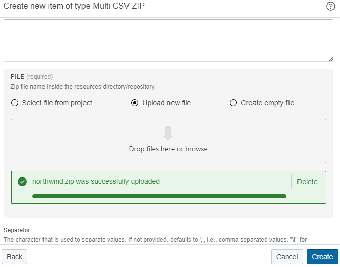
12. Click the Play button and review the dataset in the Data preview section. You can see the contents of the loaded zip file consisting of the CSV files introduced above.

## 2 Create a Neo4j dataset

A Neo4j dataset holding a Labeled Property Graph (LPG) representation is one of the outputs of the process.
Perform the following steps to create a Neo4j dataset:

1. In your existing project, click Create to create a new item. 
2. In the item category Dataset select Neo4j.
    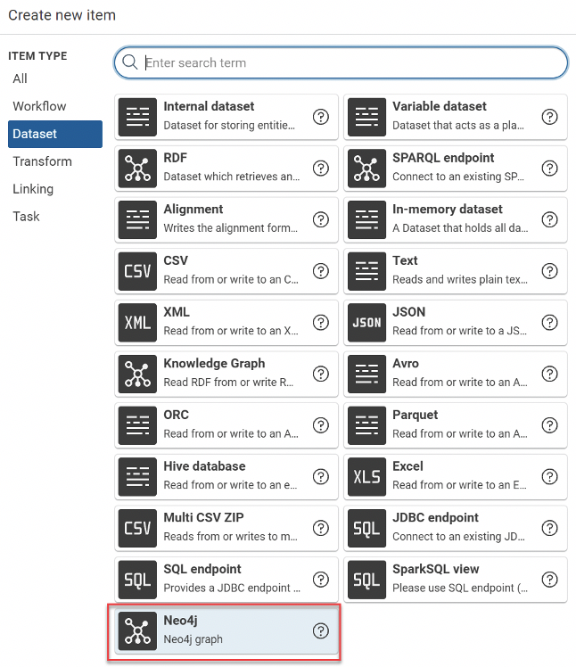
3. Click Add.
4. Enter the following details:
    - Label: _Name of the item_.  
    - Uri: _URL of the Neo4j instance_.  
    - User: _Username of the instance_.
    - Password: _Password of the instance_.
5. Click Create.

## 3 Register the Vocabulary

The vocabulary contains the classes and properties in order to map the source data into a new (domain specific) structure.
In this case we will create an RDF and LPG Knowledge Graph.
A vocabulary for this tutorial is available as [schema.ttl](schema.ttl).
Follow [Lift data from tabular data such as CSV, XSLX or database tables](/build/lift-data-from-tabular-data-such-as-csv-xslx-or-database-tables) to learn how to register your vocabulary in Corporate Memory.

The provided vocabulary is inspired by this structure from the original Neo4j tutorial on the Northwind data:

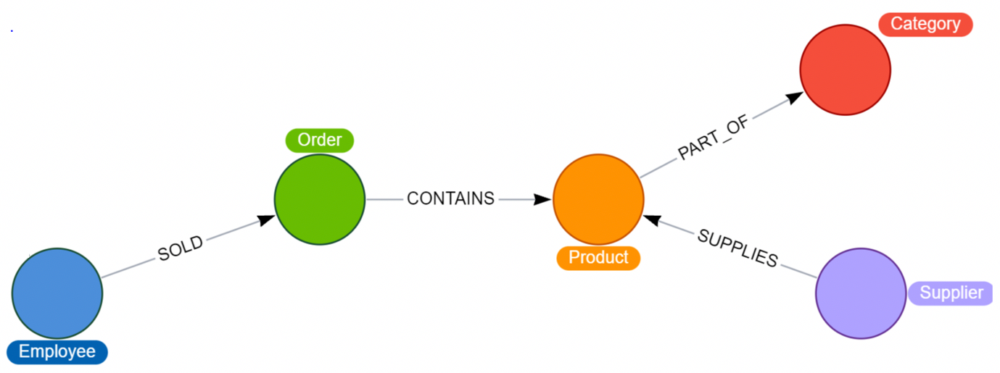

The vocabulary for the Northwind project can be visualized like this:

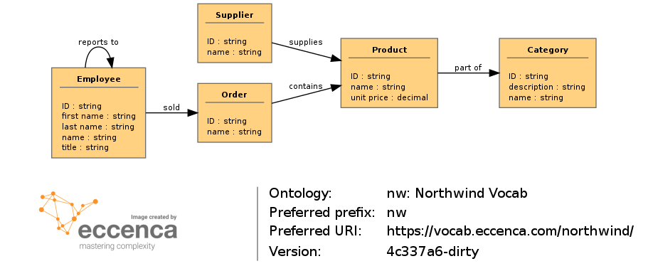

## 4 Create Transformations

A transformation defines how the input datasets are transformed into output datasets.
In this example, each of the CSV files is represented as nodes with the same labels in the application.
The following relationships must be established between the nodes:

To register the nodes and relationships, perform the following:

1. Create nodes  
2. Establish the relationships through transformations

=== "Employees"

    ### Employee

    1. Click Create in your project.  
    2. On the Create New Item window, select Transform and click Add to create a new transformation.
    3. In the Create new item of type Transform window, select your project from the dropdown and click Create.
    4. For this tutorial, enter the following:
        - Label: _Northwind Employees_
        - Dataset: Select the previously uploaded _Northwind dataset_ from the dropdown.
        - Type: Select _employees.csv_
    5. Click Create. A Transformation Northwind Employees is created.

    #### Add Value Mapping

    1. On the Mapping Editor, expand the Root Mapping section and click Edit.
    2. If the vocabulary is pre-defined, specify the Target entity type from the vocabulary. Else, specify the Target entity type and click Create option. In this example, specify the following:
        - Target entity type: `nw:Employee`
        - URI pattern: `urn:empl-{EmployeeID}`

            {EmployeeID} is a placeholder that points to the column name of the specific dataset.
    3. Click **>** button to evaluate the mapping. The examples of the three generated base URIs are as follows: 
    4. Click Save. The Employee node is created.  Now, you have to add the value mapping to indicate the basis on which the current CSV file must be transformed.  
    5. Click the circular blue button on the lower right and select Add value mapping.
    6. Define the Target property, Data type, Value path (column name), and a Label for value mapping. In this example, specify the following:
        - Target Property: `rdfs:label`
        - Datatype:  _StringValueType_
        - Use a complex transformation to concatenate Last name and First name fields to ensure that the rows are mapped individually

=== "Orders"

    ### Orders

    Create another transformation using the node Orders.  

    1. Repeat steps from 1 to 3 in Create Employees Transforms section to create the Order Transformation.
    2. In the Create new item of type Transform window, for this tutorial, specify the following:
        - Label: _Northwind Orders_
        - Dataset: Select the previously uploaded _Northwind dataset_ from the dropdown.
        - Type: Select _Orders.csv_

    Click Create.
    A transformation for Northwind Orders is created.

    To add a value mapping, repeat the steps followed while adding the mapping to the Employees node.
    In this example, for the orders node specify the following:

    - Target entity type: `nw:Order` 
    - URI pattern: `urn:order-{OrderID}`

        {OrderID} is a placeholder that points to the column name specified in the specific dataset.

    #### Add Object Mapping

    In this example, the Employee and Orders nodes have a relationship SOLD.
    To create the relationship, create an Object mapping.

    1. Click the circular blue button on the lower right and select Add object mapping
        - Target property: `nw:sold`
        - Target entity type: `nw:Employee`
        - URI pattern: `urn:empl-{EmployeeID}` 
    2. Select Connect from Orders as this relationship is from Orders to the Employee.

    !!! info

        The URI (pattern) must be the same URI specified in the Employee transform, `urn:empl-{EmployeeID}` in this example.

=== "Products"

    ### Products

    Create another transformation using the node Orders.

    1. Repeat steps from 1 to 3 in Create Employees Transforms section to create the Order Transformation.  
    2. In the Create new item of type Transform window, specify the following for this tutorial:
        - Label: _Northwind Products_
        - Dataset: Select the previously uploaded _Northwind dataset_ from the dropdown.
        - Type: Select _products.csv_

    Click Create. A transformation for Northwind Products is created.

    1. To add value mapping define, repeat the steps followed while adding the mapping to the Employees node. In this example, for the Products node, specify the following:
        - Target entity type: `nw:Product`
        - URI pattern: `urn:prod-{ProductID}`

            {ProductID} is a placeholder that points to the column name specified in the specific dataset.

=== "Category"

    ### Category

    1. Repeat steps from 1 to 3 in Create Employees Transforms section to create the Category Transformation.  
    2. In the **Create new item of type Transform** window, for this tutorial, specify the following:
        - Label: _Northwind Category_
        - Dataset: Select the previously uploaded _Northwind dataset_ from the dropdown.
        - Type: Select _categories.csv_

    Click Create. A Transformation for Northwind Category is created.

    To add value mapping, repeat the steps followed while adding the mapping to the Employees node.
    In this example, specify the following for the category node:

    - Target entity type:  `nw:Category`
    - URI pattern: `urn:cat-{CategoryID}`

        {CategoryID} is a placeholder that points to the column name specified in the specific dataset.

    #### Add Object Mapping

    In this example, the Product node is connected to the Category node through the relationship, partOf.
    To create this, click add object mapping.

    For this example, specify the following:

    - Target property: `nw:partOf`
    - Target entity type: `nw:Category`
    - URI pattern: `urn:cat-{CategoryID}`

=== "Suppliers"

    ### Suppliers

    1. Repeat steps from 1 to 3 in Create Employees Transforms section to create the Suppliers Transformation. 
    2. In the Create new item of type Transform window, for this tutorial, specify the following:
        - Label: _Northwind Suppliers_
        - Dataset: Select the previously uploaded _Northwind dataset_ from the dropdown.
        - Type: Select _suppliers.csv_
    3. Click Create. A Transformation for Northwind Suppliers is created.

    To add value mapping, repeat the steps followed while adding the mapping to the Employees node.
    In this example, for suppliers node, specify the following:

    - Target entity type: `nw:Supplier`
    - URI pattern: `urn:suppl-{SupplierID}`

        _{SupplierID}_ is a placeholder that points to the column name specified in the specific dataset.

    #### Add Object Mapping

    In this example, the Product node is connected to the Supplier node through the relationship, SUPPLIES.
    As the supplier supplies to the Product, navigate to Product transform and then click Add Object Mapping.
    To create this, click Add object mapping. For this example, specify the following:

    - Target property: `nw:supplies`
    - Select _Connect to Product_
    - Target entity type: `nw:Suppliers`
    - URI pattern: `urn:suppl-{SupplierID}`

## 5 Create a workflow

To integrate all the transformations, perform the following steps:

1. Navigate to the project.
2. Click Create
3. In the Create new item window, select Workflow and click Add. 
4. In the Create new item of type Transform window, for this tutorial, enter the following:
    - Label: _Northwind Workflow_
    - Click Create

In this example, the dataset must be connected to the transformations as an input, and the output should be the Neo4j output.

Drag and drop the options available in the Workflow editor pane and link them accordingly.

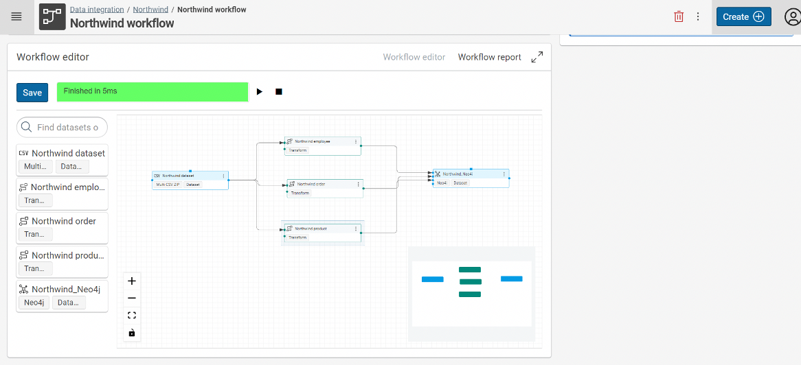

Click the Play icon to validate the results. The nodes and edges created are stored in the Neo4j dataset.

## 6 Results in Neo4j

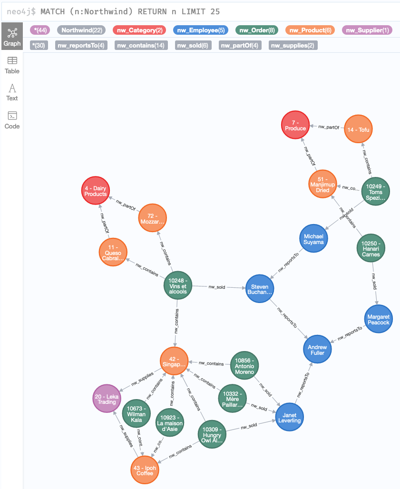

## 7 Results in Knowledge Graph

Optionally, you can use the same transformation and workflow to render the resulting graph data into a Knowledge Graph.

1. Add a Knowledge Graph dataset and use this as an additional target in your workflow:
    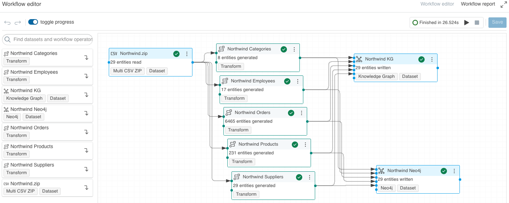
2. The results can then be reviewed in the Knowledge Graph module, e.g., explored visually:
    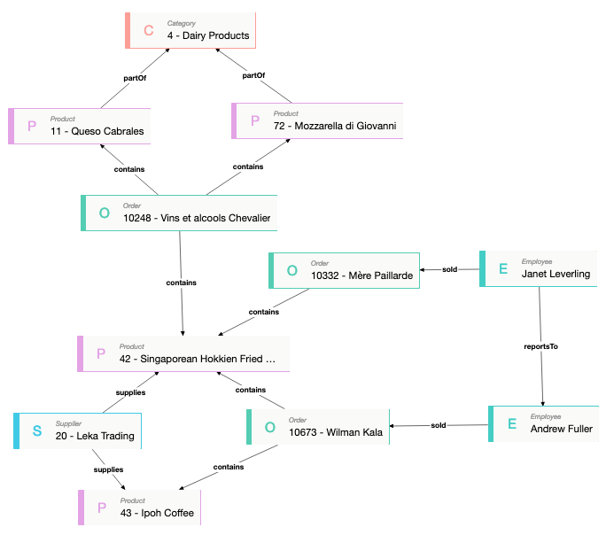

