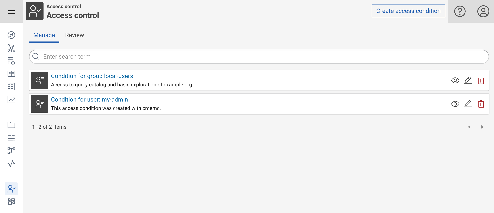
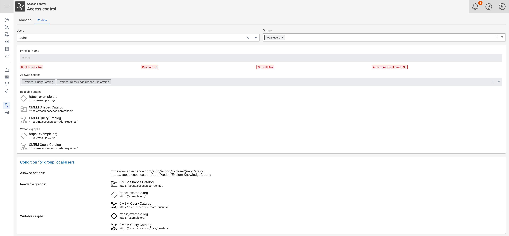
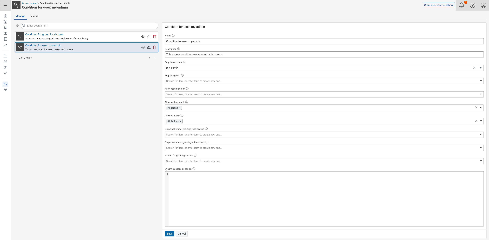

---
tags:
    - Security
    - cmemc
---
# Access Conditions

## Introduction

Access Conditions specify access rights for users and groups to graphs and actions (1).
{ .annotate }

1.  Graphs identify specific Knowledge Graphs.
    Actions identify specific parts or components of the platform, such as the query catalog or the data integration system (Build).

Access Conditions are managed in a special system graph, so write access to this graph needs to be handled carefully.
The management of access conditions can be done either by using the browser based user interface or the command line based user interface (cmemc).

## Attributes of Access Conditions

In order to understand the different user interfaces to manage access conditions, it is crucial to understand what details can be described with a single access condition.
The following list describes the different attributes, a single access condition can have.
They are all optional except that a single access condition needs to provide at least one grant or has a dynamic access condition query.

The listed IRIs in this section use the following prefix declarations:

``` turtle
PREFIX eccauth: <https://vocab.eccenca.com/auth/>
PREFIX :        <https://vocab.eccenca.com/auth/Action/>
```

### **Metadata**

- **Name** is a short and human readable text you can give to your access condition in order to identify them.

- **Description** is an optional and longer text you can add, to provide more context.

### Define **who** gets access

- Use **Requires account** to specify the user account, which is required by the access condition.
  If the account matches the account of a given request, this access condition is used to identify the grants for this request.
  Instead of an actual account, the following meta account can be used.

| Resource | Explanation |
| ---------| ------------|
| `eccauth:AnonymousUser`| Represents the anonymous user account. You can use it in the **Requires account** field. |

- Use **Requires group** to specify the group, the account must be member of in order to match the access condition.
  If the account of a given request is member of this group, this access condition is used to identify the grants for this request.
  Instead of an actual group, the following meta group can be used.

| Resource | Explanation |
| ---------| ------------|
| `eccauth:PublicGroup`| Represents the group which every user is member of (incl. anonymous users). You can use it in the *Requires group* field. |

!!! warning "Users and groups cannot have the same name"

    Since both user and group resource are represented in the same namespace in the internal graph representation, users and groups cannot have the same identifier.

### Define **what** grants are given

- **Allow reading graph** is a list of graph IRI to allow to read these graphs.
  Instead of an actual graph, the following meta graph can be used.

| Resource | Explanation |
| ---------| ------------|
| `eccauth:AllGraphs`| Represents all RDF named graphs. You can use it in the *Allow reading graph* or *Allow writing graph* field.|

- **Allow writing graph** is a list of graph IRIs to allow to write these graphs.
  The grant to write to a graph implicitly grants to read the graph.
  Instead of an actual graph, the following meta graph can be used.

| Resource | Explanation |
| ---------| ------------|
| `eccauth:AllGraphs`| Represents all RDF named graphs. You can use it in the *Allow reading graph* or *Allow writing graph* field.|

- **Allowed action** is a list of action IRI to allow to use the components or capabilities which are identified with this action.
  You can use the following actions identifier with this attribute.

| Resource | Explanation |
| ---------| ------------|
| `:AllActions` | Represents all actions. You can use it to grant execution rights to all actions |
| `:Build` | Represents the action needed to use eccenca DataIntegration component of eccenca Corporate Memory. |
| `:Build-AdminPython` | Represents the action needed to use eccenca DataIntegration's Python plugin management component of eccenca Corporate Memory. |
| `:Build-AdminWorkspace` | Represents the action needed to use eccenca DataIntegration's workspace administration component of eccenca Corporate Memory. |
| `:ChangeAccessConditions` | Represents the action needed to use the Authorization management API (see Developer Manual). You can use it as object of the `eccauth:allowedAction` property to grant access to the Authorization management API if the user fulfills the access condition. |
| `:Explore-BKE-Manage` | Represents the action needed to view, create, edit and delete visualisations in the BKE-Module (needs access to config graph as well). |
| `:Explore-BKE-Read` | Allows to use the BKE-Module interface in read-only mode (needs access to config graph as well). |
| `:Explore-KnowledgeGraphs` | Represents the action needed to use the Explore Tab (needs access to at least one graph as well) |
| `:Explore-ListSystemGraphs` | Represents the action needed to list Corporate Memory system graphs (tagged with shui:isSystemResource) in the Knowledge Graph list. |
| `:Explore-QueryCatalog` | Represents the action needed to use the Query Catalog (needs access to catalog graph as well if changes should be allowed) |
| `:Explore-ThesaurusCatalog` | Represents the action needed to use the Thesaurus Catalog as well as Thesaurus Project editing interface (needs access to specific thesaurus graphs as well) |
| `:Explore-VocabularyCatalog` | Represents the action needed to use the Vocabulary Catalog (needs access to specific vocabulary graphs as well) |

In addition to these attributes, you can use the following special attributes to grant partial access to the access conditions itself:

- **Graph pattern for granting read access** is a pattern to allow users to manage access conditions which grant read access to graphs identified by IRI matching the pattern.

- **Graph pattern for granting write access** is a pattern to allow users to manage access conditions which grant write access to graphs identified by IRI matching the pattern.

- **Pattern for granting actions** is a pattern to allow users to manage access conditions which grant action usage to action identified by IRI matching the pattern.

### Dynamic Conditions

Use this attribute to dynamically compute **who** get access on **which graphs**, based on background information from your Knowledge Graphs:

- **Dynamic access condition** is an attribute which requires a SPARQL Select query which returns the following projection variables: `user`, `group`, `readGraph`, `writeGraph`.

The following example query grants write access to all users which are described as creators (using Dublin Core) in the graph itself.

``` sparql
PREFIX rdf: <http://www.w3.org/1999/02/22-rdf-syntax-ns#>
PREFIX dct: <http://purl.org/dc/terms/>
PREFIX void: <http://rdfs.org/ns/void#>

SELECT  ?user ?group ?readGraph ?writeGraph
WHERE
{
  GRAPH ?writeGraph {
    ?writeGraph rdf:type void:Dataset .
    ?writeGraph dct:creator ?user .
  }
}
```

Given the following Knowledge Graph `https://example.org/my-data/`, the account `tester` will get access to it, because the IRI of the account is related to the graph.

``` turtle
PREFIX dct: <http://purl.org/dc/terms/>
PREFIX rdf: <http://www.w3.org/1999/02/22-rdf-syntax-ns#>
PREFIX rdfs: <http://www.w3.org/2000/01/rdf-schema#>
PREFIX void: <http://rdfs.org/ns/void#>

<https://example.org/my-data/>
  rdf:type void:Dataset ;
  rdfs:label "My Data"@en;
  dct:creator <http://eccenca.com/tester> .
```

!!! info "User and group namespace"

    The IRI identifier for users and groups need have the namespace `http://eccenca.com/`.
    If your data does not match this requirement, you can manipulate the IRIs with SPARQL functions on-the-fly.

## Managing Access Conditions

### Web interface

The access control module can be selected in the **Admin** section of the left main menu of the **Explore** component.
After clicking it, you will see a screen similar to this:

<figure markdown>

<figcaption>Access Control: List Access Conditions</figcaption>
</figure>

You have two major application areas (tabs) here:

- In the **Manage** tab, you can view, edit, add and delete all access conditions, which are manageable by your account.
- In the **Review** tab, you can see the **effective rights** based on a selection of an account and groups.

#### View, edit and update

Use the following icon buttons for a specific action with a certain access condition:

- Use :material-eye-outline: to view an access condition.
- Use :material-pencil-outline: to edit an access condition.
- Use :material-trash-can-outline: to delete an access condition.

Use the **Create access condition** button to create a new access condition.

#### Review

In the **Review** tab, you can see the **effective rights** based on a selection of an account and groups.
This allows for debugging your access condition system as a whole.
In order to see the rights select a user and / or group combination from the drop-down list on top (principal).
Then you will see a screen similar to this:

<figure markdown>

<figcaption>Access Control: Review Access Conditions</figcaption>
</figure>

This screen is split into two main areas:

- First, the effective rights are listed, which summarize the resulting access rights.
    - The **Root access** field shows if the principal has root access.
    - The **Read all** and **Write all** fields show if the principal has read or write access to all graphs.
    - The **All actions are allowed** field shows if the principal has permission to execute all actions.
    - The **Allowed actions** field lists the actions the principal is allowed to execute.
    - The **Readable graphs** and **Writable graphs** fields list the graphs the principal is allowed to read or write.

- Second, the list of all access conditions which contributed to the effective access rights. This section allows to see which access conditions matched the principal and which access rights they grant.


### Command line interface

With [cmemc](../../../automate/cmemc-command-line-interface/index.md) you can use an additional command line based interface to manage access conditions.
This interface is primarily used for the automation of provisioning tasks.
The important command groups for managing principals and access conditions are:

- [`admin acl`](../../../automate/cmemc-command-line-interface/command-reference/admin/acl/index.md) - List, create, delete, modify and review access conditions.
- [`admin user`](../../../automate/cmemc-command-line-interface/command-reference/admin/user/index.md) - List, create, delete and modify user accounts.
- [`admin client`](../../../automate/cmemc-command-line-interface/command-reference/admin/client/index.md) - List client accounts, get or generate client account secrets.

The following session demonstrates how to create a new user, set a password and grant access to certain areas.


``` shell-session
$ cmemc admin acl list
No access conditions found. Use the `admin acl create` command to create a new access condition.

$ cmemc admin user create tester
Creating user tester ... done

$ cmemc admin user update tester --assign-group local-users
Updating user tester ... done

$ cmemc admin user password tester
Changing password for account tester ...
New password:
Retype new password:
done

$ cmemc admin acl create --id local-users-access --group local-users \
    --write-graph https://example.org/ \
    --write-graph https://ns.eccenca.com/data/queries/ \
    --read-graph https://vocab.eccenca.com/shacl/ \
    --action :Explore-QueryCatalog \
    --action :Explore-KnowledgeGraphs \
    --description "Access to query catalog and basic exploration of example.org"
Creating access condition 'Condition for group local-users' ... done

$ cmemc admin acl list
┏━━━━━━━━━━━━━━━━━━━━━┳━━━━━━━━━━━━━━━━━━━━━━━━━━━━━━━━━┓
┃ URI                 ┃ Name                            ┃
┣━━━━━━━━━━━━━━━━━━━━━╋━━━━━━━━━━━━━━━━━━━━━━━━━━━━━━━━━┫
┃ :local-users-access ┃ Condition for group local-users ┃
┗━━━━━━━━━━━━━━━━━━━━━┻━━━━━━━━━━━━━━━━━━━━━━━━━━━━━━━━━┛
```

## Typical Use Cases

### <a name="create-regular-admin-user"></a> Regular administration user

In order to create a regular administration user account, you need to grant the following rights:

- Allowed Actions: **All Actions** (`https://vocab.eccenca.com/auth/Action/AllActions`)
- Allow writing graphs: **All Graphs** (`https://vocab.eccenca.com/auth/AllGraphs`)

In the web interface, this will look like:

<figure markdown>

<figcaption>Access Control: Create a regular Administration user</figcaption>
</figure>

With cmemc, you can achieve this with the following command:

``` shell-session
$ cmemc admin acl create --id my-admin-account-acl \
    --user my-admin --action :AllActions \
    --write-graph https://vocab.eccenca.com/auth/AllGraphs
Creating access condition 'Condition for user: my-admin' ... done

∴ cmemc admin acl list
┏━━━━━━━━━━━━━━━━━━━━━━━┳━━━━━━━━━━━━━━━━━━━━━━━━━━━━━━━━━┓
┃ URI                   ┃ Name                            ┃
┣━━━━━━━━━━━━━━━━━━━━━━━╋━━━━━━━━━━━━━━━━━━━━━━━━━━━━━━━━━┫
┃ :local-users-access   ┃ Condition for group local-users ┃
┃ :my-admin-account-acl ┃ Condition for user: my-admin    ┃
┗━━━━━━━━━━━━━━━━━━━━━━━┻━━━━━━━━━━━━━━━━━━━━━━━━━━━━━━━━━┛
```

In case you need to create the user account, you can do this as well:

``` shell-session
$ cmemc admin user create my-admin
Creating user my-admin ... done

$ cmemc admin user password my-admin
Changing password for account my-admin ...
New password:
Retype new password:
done
```

### User with limited access

In order to limit access to specific parts of the application, you need to know which actions and graphs should be combined to achieve a certain goal.

The following list, provides grants which work together:

#### Access to the Explore User Interface

- Allowed Actions: **Explore - Knowledge Graphs Exploration** (`:Explore-KnowledgeGraphs`)
- Allow read graphs:
    - **CMEM Shape Catalog** (`https://vocab.eccenca.com/shacl/`)
    - Any other graph the user should be able to explore
- Allow write graphs:
    - (optional) Any graph the user should be able to change

#### Access to the Query Catalog

- Allowed Actions: **Explore - Query Catalog** (`:Explore-QueryCatalog`)
- Allow read graphs:
    - (optional) Any graph the user should be able to query
- Allow write graphs:
    - **CMEM Query Catalog** (`https://ns.eccenca.com/data/queries/`)
    - (optional) Any graph the user should be able to change

#### Access to DataIntegration

- Allowed Actions: **Build - Workspace** (`:Build`)
- Allow write graphs:
    - **All Graphs** (`https://vocab.eccenca.com/auth/AllGraphs`)

