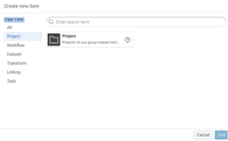

# Title: DataIntegration.
## Subtitle: Creating a data linking project.

## **eccenca DataIntegration**

 The eccenca DataIngration platform is designed to support the process to "BUILD" a knowledge graph by integrating structured and unstructured data from multiple sources,including on-premises systems and cloud-based services. The feature to BUILD include data mapping, transformation, and cleansing tools, as well as real-time data integration and governance support.

This beginner-level tutorial explains how to build a data integration project using linking rules.

  

The documentation consists of the following steps described in detail below:

1. Create a new project. 
2. Upload files.
3. Create datasets
4. Create a linking task
5. Work with linking rules.

This tutorial shows how to connect two movie-related data sources and introduces some of Data-Integration’s fundamental functions. sources of information are LinkedMDB, the linked data version of the IMDb movie database, and DBpedia, the linked data version of Wikipedia. Both files contain a list of movies with their names, titles, release dates, and an internal ID for each movie. The task is to link the two datasets to find out which movie in DBpedia corresponds to which movie in LinkedMDB.

Sample CSV files: dbpedia.csv and linkedmdb.csv

[This is a link](**[https://drive.google.com/drive/folders/1LR-6d17LYTjsCr8ZOdJNVXI_QgkSfIIi](https://drive.google.com/drive/folders/1LR-6d17LYTjsCr8ZOdJNVXI_QgkSfIIi)**)

**

The following material is used in this tutorial, you should download the files and have them at hand throughout the tutorial:

## Let's begin to create a project with the linking rules.

### 1. Create a new project.
-   Once logged in to Corporate memory on the right side click on **create**

The screen gives an overview of the different projects created in your installation of Data Integration. It shows the item type on the left side like a project, workflow, dataset, transform, linking, and task.

-   Click on the project on the left side in the item type and double-click on the project in the centre.
****

  
