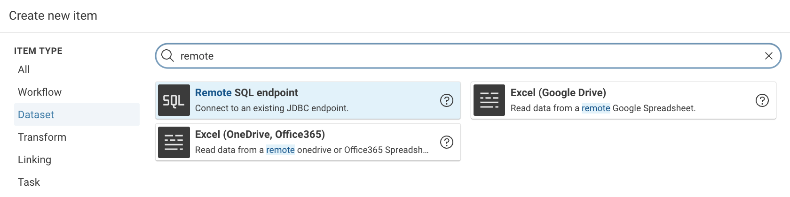
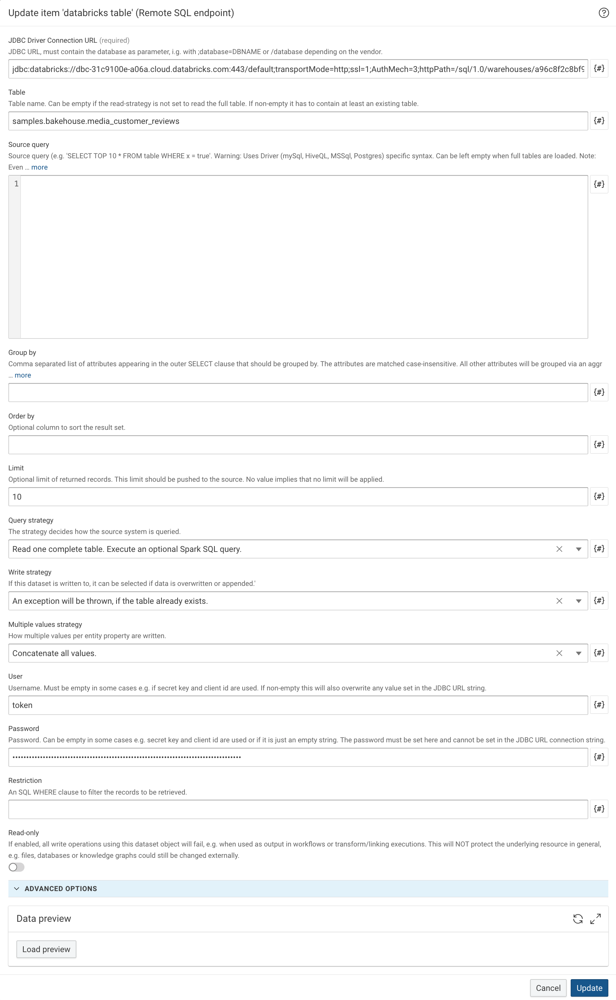

---
tags:
    - Configuration
    - JDBC
---
# Setup and use of JDBC Drivers

Corporate Memory supports JDBC connections to database management systems (DBMSs).
The platform includes several JDBC drivers by default.
You can also add and use custom drivers.

!!! info "References"

    For more technical details, see the following reference pages:

    -   [Remote SQL endpoint](../../../../build/reference/dataset/Jdbc.md) and
    -   [Snowflake SQL endpoint](../../../../build/reference/dataset/SnowflakeJdbc.md).

## Bundled JDBC Drivers

The platform includes the following JDBC drivers:

- PostgreSQL (`postgresql v42.7.10`)
- MariaDB (includes support for MySQL, `mariadb-java-client v3.5.7`)
- Microsoft SQL Server (`mssql-jdbc v13.2.1.jre11`)
- Snowflake (`snowflake-jdbc v3.28.0`)

## Custom JDBC Drivers

In addition to the bundled JDBC drivers, you can register custom JDBC drivers.
The following sections describe the required configuration.

### Download Custom JDBC Driver

Download the JDBC driver for each database management system that you want to connect to.
[Integrations](../../../../build/integrations/index.md) provides links for well-known systems and lists those that are actively used with Corporate Memory.

### Provide a Custom JDBC Driver

Consult your solutions manager or DevOps specialist for options to copy or inject the JDBC driver `jar` into a Corporate Memory deployment.
Depending on the deployment model, suitable options include:

- The Docker Compose package `cmem-orchestration` mounts the folder `./conf/dataintegration/plugin/` into the DataIntegration container.
    The configuration snippets below assume this location, which maps to `/opt/cmem/eccenca-DataIntegration/dist/etc/dataintegration/conf/plugin/` inside the container.
- A dedicated _Build project_ in which the driver JAR files are uploaded as project file resources.
- Dedicated file or resource mounts in a Docker Compose or Helm/Kubernetes configuration.

### Driver Registration

A custom JDBC driver must be registered in the DataIntegration configuration file `dataintegration.conf`, in the `spark.sql.options` section.
The following example shows how to register a custom JDBC driver for Databricks:

```conf
…
spark.sql.options {
  …
  # driver name
  jdbc.drivers = "databricks"
  # path to the jar in the docker container
  jdbc.databricks.jar =  "/opt/cmem/eccenca-DataIntegration/dist/etc/dataintegration/conf/plugin/DatabricksJDBC.jar"
  # class name
  jdbc.databricks.name = "com.databricks.client.jdbc.Driver"
  …
}
…
```

## Use JDBC Drivers

JDBC drivers are used through the **Remote SQL endpoint** or **Snowflake SQL endpoint** dataset type.

{ class="bordered" width="60%" }

Configure them in the dataset configuration dialog.
For details about the [JDBC connection string](https://www.baeldung.com/java-jdbc-url-format), consult your DBMS or JDBC driver documentation.

{ class="bordered" width="100%" }
