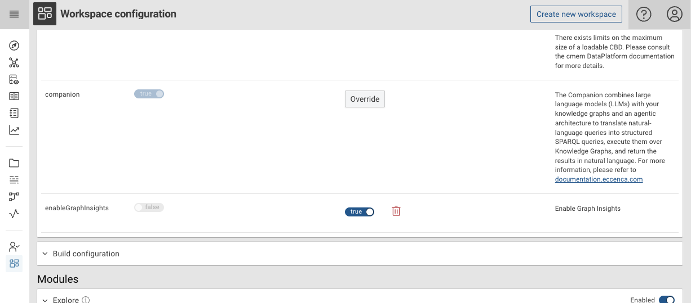
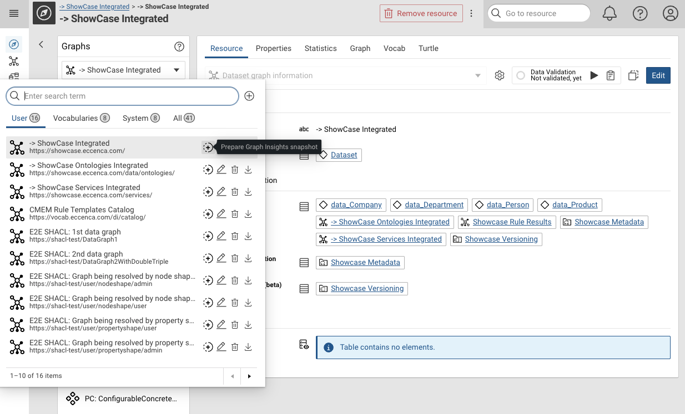
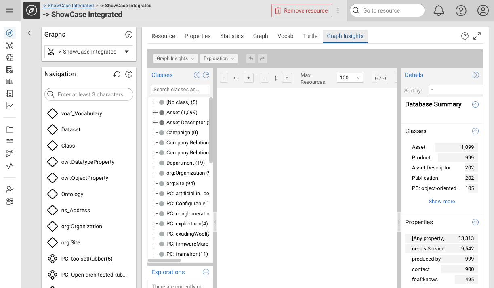
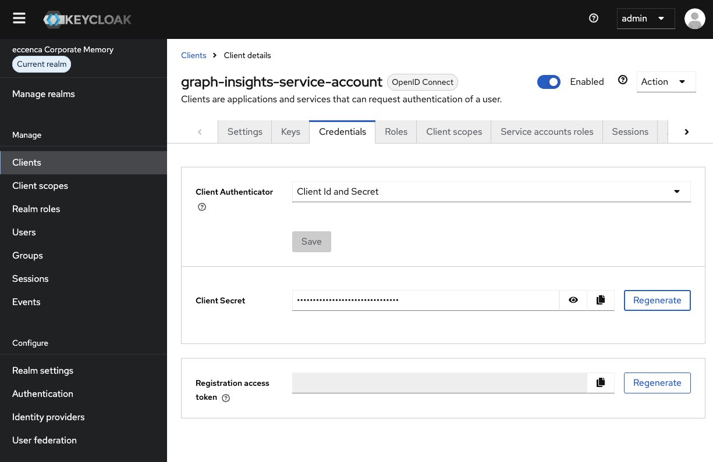
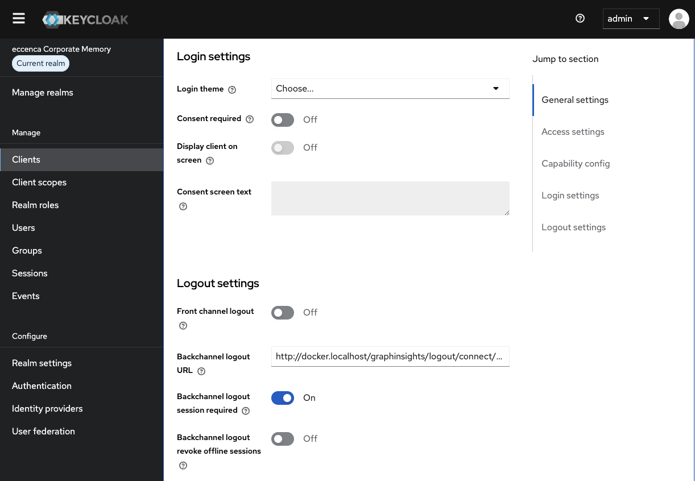

---
tags:
    - Configuration
    - Graph-Insights
    - GraphInsights
---
# Graph Insights

## Enable Graph Insights

Follow the instructions related to your deployment type: a) docker-compose or b) helm / Kubernetes based.

### (a) Enable in docker-compose deployment

In our Corporate Memory docker-orchestration all main configurations can be directed by setting environment
variables in `environments/config.env`.
You can find the environment variables set as usual in `environments/default.env` and `environments/config.env`.

Add your license to `licenses/graphinsights.lic` then start the extension on an already running Corporate Memory
deployment.

``` console
mkdir licenses
ln -s your-license-file.lic graphinsights.lic
make enable-extension EXTENSION=graphinsights
```

Please also have a look at `extensions/README.graphinsights.md`.

### (b) Enable in helm deployment

In helm based deployment you can enable Graph Insights by enabling it in your value file.
It creates a new StatefulSet.
Preemptively, you have to create a secret containing your license file.

``` console
kubectl -n cmem create secret generic graphinsights-license --from-file your-graphinsights.lic
```

All needed configuration can be done in the Corporate Memory helm chart `value.yaml` file.
This enables the plugin.

``` yaml
graphinsights:
  enabled: true
```

Besides enabling the extension you also have to create a route/path in your Ingress or Route.
In the Chart's `value.yaml` file, a configuration is commented out.
You should enable this in your `value.yaml` file.

``` yaml
    # GraphInsights at /graphinsights path (if enabled).
    - path: /graphinsights
      pathType: Prefix
      serviceName: graphinsights
      servicePort: 8080
```

Also make sure you have set the clients and client credentials.
See [Configure OAuth clients (helm)](../../../deploy-and-configure/configuration/graphinsights/index.md#configure-oauth-clients-helm)

The configuration mentioned below is rendered with those files, but you usually don't have to touch those:

- `configuration-files/explore-application.yml` for Explore
- `configuration-files/cmem.integration.config.yml` for Graph Insights

For more details please have a look in the helm value file.
Every configuration is documented there.
Please refer to [Kubernetes deployments](../../../deploy-and-configure/installation/scenario-k8s-deployment/index.md)
for more information.

## Activate and verify the installation

First, you have to enable the Graph Insight in your Explore workspace. By default, it is disabled.



Then you are able to create a snapshot, send it to Graph Insights and select the Graph Insights tab in explore.





## Configuration

This section explains the basic configuration of Graph Insights.
Since Graph Insights is an application integrated into explore, we need to configure Explore for the integration and Graph Insights as application itself.

The following chapters explain the configuration in case you want to change the default behavior.

While the extension in the docker-orchestration is enabled through Spring profiles, we just use the benefits of templating in helm and only use one profile.

This is why the configuration differs in both deployments, but we tried to use the same variable names and configuration snippets.

### Explore configuration

In our **docker-orchestration** you find the file which is loaded as `graphinsight` profile
at `conf/explore/application-graphinsights.yml`.
Environment variables as usual can be found in `environments/default.env` and `environments/config.env`.
Sizing can be changed in the loaded memory profile, e.g. at `environments/config.mem.16g.env`.
The deployment definition for explore with the extension is defined in `extensions/docker-compose.graphinsights.yml` in the explore service.

In **helm deployments** you find the needed section inside the `.Values.graphinsights.enabled` block in the file at `configuration-files/explore-application.yml`, where most of the configuration is inserted with GO-templates.
Some environment variables are set in the `value.yaml` and rendered in a ConfigMap `templates/explore-configmap.yaml`.

``` yaml
spring.security.oauth2.client.registration.explore-service:
    client-id: cmem-service-account
    client-secret: change-me
    authorization-grant-type: client_credentials
    provider: keycloak
```

``` yaml
semspect:
  enabled: true
  integration:
    url: http://graphinsights:8080/graphinsights
    externalUrl: ${DEPLOY_BASE_URL}/graphinsights
    automaticResyncCronExpression: "0 0/30 8-10 * * *"
    localDatasetStatePath: /graphinsights/infinispan
    ### Configure either fileShareIntegrationSettings or graph-store-integration-settings
    # fileShareIntegrationSettings:
    localGraphStoragePathExplore: /graphinsights
    # localGraphStoragePathSemspect: /explore-share/
    graph-store-integration-settings:
      semspect-dataplatform-url: http://explore/dataplatform
```

### Graph Insights configuration

Graph Insights, like Explore, is a Spring Boot application, so it gets configured with environment variables and a YAML file.

In our **docker-orchestration** you find the file at `conf/graphinsights/cmem.integration.config.yml`.
Environment variables as usual can be found in `environments/default.env` and `environments/config.env`.
Sizing can be changed in the loaded memory profile, e.g. at `environments/config.mem.16g.env`.
The deployment definition of the extension is defined in `extensions/docker-compose.graphinsights.yml`.

In **helm deployments** you find the file at `configuration-files/cmem.integration.config.yml`, which is rendered as a ConfigMap and then mounted into the Graph Insights StatefulSet.
Environment variables are set in the `value.yaml` and rendered in a ConfigMap `templates/graphinsights-configmap.yaml`.
Sizing regarding memory, CPU or disk usage are configured in the `value.yaml`.

``` yaml
---
# for descriptions of the properties s. the same file in https://gitlab.eccenca.com/devops/eccenca-graphinsights-docker
semspect:
  extensions: cmem
  extension.cmem:
    baseUri: "${DEPLOY_BASE_URL}"
    authorization:
      cacheDuration: 60
  core:
    enableCaptionPropertySelection: false
    enableDescriptionPropertySelection: false

frontend:
  appNameOverride: "Graph Insights"
  enableLogo: false
  enableAboutWindow: false
  singleDatabaseMode: true
  enableIframeOnlyMode: true
  enableCopyDeepLink: false
  fontFamily: "Roboto, helvetica, arial, sans-serif"
  fontFace: >
    @font-face {
          font-family: 'Roboto';
          font-style: normal;
          font-weight: 400;
          src: url('https://eccenca.com/layouts/default/fonts/roboto-v20-latin-regular.woff2') format('woff2');
    }

  trustedOrigins:
    - "${DEPLOY_BASE_URL}"
    - "${DEPLOY_BASE_URL}/*"

  backlink:
    objectURLTemplate: ${DEPLOY_BASE_URL}/{workspaceID}/explore?resource={objectID}&graph={contextGraphIRI}
    categoryURLTemplate: ${DEPLOY_BASE_URL}/{workspaceID}/explore?type={categoryID}&graph={contextGraphIRI}
    objectBacklinkDestination: "CMEM"
    categoryBacklinkDestination: "CMEM"
    multiObjectBacklinkDestination: "CMEM"
  debug: true
  logLevel: DEBUG

# secure /api/** via resourceserver
spring.security.oauth2:
  resourceserver:
    jwt:
      jwk-set-uri: "${OAUTH_JWK_SET_URL}"
  # semspect backend for frontend as oauth2client
  # To enable SLO add this as back-channel logout uri to the client semspect uses:
  # http://docker.localhost/graphinsights/logout/connect/back-channel/keycloak
  client:
    registration:
      keycloak:
        client-id: "${GRAPHINSIGHTS_OAUTH_CLIENT_ID}"
        authorization-grant-type: "authorization_code"
        client-authentication-method: "client_secret_basic"
        # not needed here because we never login to semspect directly
        redirectUri: "${DEPLOY_BASE_URL}/graphinsights/login/oauth2/code/{registrationId}"
        # openid is mandatory as spring somehow does not add it to the userinfo request
        scope:
          - openid
          - profile
          - email
      # service account used for datastore access
      semspect-service:
        client-id: "${GRAPHINSIGHTS_OAUTH_SERVICE_CLIENT_ID}"
        client-secret: "${GRAPHINSIGHTS_OAUTH_SERVICE_CLIENT_SECRET}"
        authorization-grant-type: client_credentials
        provider: keycloak
    provider:
      keycloak:
        issuer-uri: "${OAUTH_ISSUER_URL}"
        user-name-attribute: "preferred_username"

# same (fixed) session timeout as explore backend
server.servlet.session.timeout: "36000s"
server.frame.ancestors: "${DEPLOY_BASE_URL}"

logging:
  level:
    root: DEBUG
    org.springframework: WARN
    org.springframework.security: WARN

  pattern:
    console: "%d{yyyy-MM-dd'T'HH:mm:ss.SSSX,UTC} %-5level %logger{15} - %message%n%xException"

```

### Resource consideration

Please refer to [Graph Insights Sizing](../../../deploy-and-configure/requirements/graph-insights-sizing.md) for more
information.

### OAuth configuration

Graph Insights requires authentication similar to Explore and Build (DataIntegration).
There is the need for a client to authenticate in a browser and a second client to allow inter-component communication.

For convenience, by default we use the same clients as for the rest of the application:

- Client for browser: cmem
- Client for component communication: cmem-service-account

In case you want to have separate clients for production deployments, this chapter is for you.

#### Configure OAuth clients (docker-compose)

In our **docker-orchestration** to enrol those other clients, please follow these steps:

1.) take a look at `environments/default.env` and copy these variables to your `environments/config.env` file:

``` Makefile
# This is the browser client:
GRAPHINSIGHTS_OAUTH_CLIENT_ID=graph-insights
# was this before:
# GRAPHINSIGHTS_OAUTH_CLIENT_ID=${OAUTH_CLIENT_ID}

# This is the inter component client:
GRAPHINSIGHTS_OAUTH_SERVICE_CLIENT_ID=graph-insights-service-account
# change the credential depending on your client secret, default would be: 7Ctw7eZvTeFYdwwvwopy8OjuMUVPb8A9
GRAPHINSIGHTS_OAUTH_SERVICE_CLIENT_SECRET=changeme
```

2.) Replace this in `docker-compose.yml`:

``` yaml
      - "EXPLORE_CMEM_SERVICE_CLIENT=${CMEM_SERVICE_ACCOUNT_CLIENT_ID}"
      - "EXPLORE_CMEM_SERVICE_CLIENT_SECRET=${CMEM_SERVICE_ACCOUNT_CLIENT_SECRET}"
      # with:
      - "EXPLORE_CMEM_SERVICE_CLIENT=${GRAPHINSIGHTS_OAUTH_SERVICE_CLIENT_ID}"
      - "EXPLORE_CMEM_SERVICE_CLIENT_SECRET=${GRAPHINSIGHTS_OAUTH_SERVICE_CLIENT_SECRET}"
```

3.) And also replace this in `extensions/docker-compose.graphinsights.yml`

``` yaml
      - "GRAPHINSIGHTS_OAUTH_SERVICE_CLIENT_ID=${CMEM_SERVICE_ACCOUNT_CLIENT_ID}"
      - "GRAPHINSIGHTS_OAUTH_SERVICE_CLIENT_SECRET=${CMEM_SERVICE_ACCOUNT_CLIENT_SECRET}"
      # with:
      - "GRAPHINSIGHTS_OAUTH_SERVICE_CLIENT_ID=${GRAPHINSIGHTS_OAUTH_SERVICE_CLIENT_ID}"
      - "GRAPHINSIGHTS_OAUTH_SERVICE_CLIENT_SECRET=${GRAPHINSIGHTS_OAUTH_SERVICE_CLIENT_SECRET}"
```

#### Configure OAuth clients (helm)

In **helm deployments**, once you have the clients available all you have to do is change these lines in your value.yaml
accordingly:

``` yaml
global:
  # GraphInsights service account OAuth credentials (if using GraphInsights).
  # Can use the same credentials as CMEM or separate ones.
  graphinsightsClientId: graph-insights-service-account
  graphinsightsClientSecret: changeme  # IMPORTANT: Change this to a secure value!

  # OAuth client ID for GraphInsights frontend authentication.
  # Default: "graph-insights" (must exist in your Keycloak realm if GraphInsights is enabled).
  oauthClientIdGraphInsights: graph-insights
```

#### Creating separate OAuth clients for Graph Insights

If you start Corporate Memory with the docker-orchestration (or use our keycloak helm chart) for the first time, the
separate clients are already created when starting the Postgresql container.

However, regenerating a new client secret is advisable:

- Select the `eccenca Corporate Memory`-realm
- Select `Clients`
- Select the client `graph-insights-service-account`.
- Select the tab `Credentials`
- Press `Regenerate`
- Then copy the new secret and fill in the values from above.



Also have a look below and check if your
[Backchannel logout URL](../../../deploy-and-configure/configuration/graphinsights/index.md#set-backchannel-logout-url-for-graph-insights) is set.

In an already running deployment you would have to create those clients on your own.

We assume that we name the clients as following:

- Browser client: `graph-insights`
- Inter-component client: `graph-insights-service-account`

#### Set Backchannel logout URL for Graph Insights

You would follow the same steps as in [Keycloak Client configuration](../../../deploy-and-configure/configuration/keycloak/index.md) but name them differently, e.g. as above.
In addition, one last step is missing: To have the logout working properly you have to add a client Backchannel logout URL for the client meant for browser authentication (`graph-insights`):

- Select the `eccenca Corporate Memory`-realm
- Select `Clients`
- Select the client `graph-insights`.
- Scroll down to this section and add this: `https://<your-deploy-host>/graphinsights/logout/connect/back-channel/keycloak`


