---
tags:
    - Configuration
    - Security
    - Keycloak
---
# Keycloak

## Introduction

This page describes important steps in order to configure Keycloak as an authentication backend for Corporate Memory.
The screenshots displayed in this documentation were taken from Keycloak v20 using the `keycloak.v2` theme.

!!! info

    You do not need these instruction in case you followed the documentation on [Scenario: Local Installation](../../installation/scenario-local-installation/index.md) or [Scenario: Single Node Cloud Installation](../../installation/scenario-single-node-cloud-installation/index.md) (in this case, everything was done automatically).
    However, in case you need to integrate Corporate Memory with an existing Keycloak, this page may help you.
    Please also have the [Keycloak - Server Administration Guide](https://www.keycloak.org/docs/latest/server_admin/) ready :smile:

## Realm configuration

!!! warning

    A realm can be im-/exported.
    However, exported realms will not contain user credentials.

To create a realm, use the drop down menu for choosing a realm on the left side.

- Create a realm `cmem`
    - Select **Realm settings**
    - **General** tab:
    - Change HTML Display name to `<span class="ecc-logo"></span>Corporate Memory`
    - **Themes** tab
    - Switch realm's login theme to `eccenca`
    - Switch realm's account theme to `eccenca`

## Client configuration

Clients are used to link users and groups managed in Keycloak to Corporate Memory.
There are two different types of clients used by Corporate Memory:

- The first client is used to authenticate a user for using the web interface (usually named `cmem`).
- The second client is used as a technical user with the command line interface (usually named `cmem-service-account`).
- (optional, when using Graph Insights) similar to the `cmem` client you can configure Graph Insights to use a separate client (usually named `graph-insights`)
- (optional, when using Graph Insights) similar to the `cmem-service-account` client you can configure Graph Insights to communicate with a separate client (usually named `graph-insights-service-account`)

For Graph Insight please refer the [Graph Insights OAUTH documentation](../../../deploy-and-configure/configuration/graphinsights/index.md#oauth-configuration)
Depending on the environment, there might be other use cases, when running background schedules, then a third client, also as technical user, might be useful.

### Access conditions, roles and groups

Corporate Memory uses access conditions which are related to users or groups.
This is described at [Access Conditions](./../access-conditions/index.md).
To use groups from Keycloak in Corporate Memory access conditions, all Keycloak client configurations need to have attached mappers:

- For the web interface client (`cmem`), the user groups need to get attached to the client.
  This is done by a **Group Membership** mapper (described below).
  With this mapper each group of a user is assigned for the authentication process, so Corporate Memory is aware of the user and group IDs for setting up access conditions.

- For the technical account clients (such as `cmem-service-account`), Keycloak does not allow to add groups directly to a client.
  To work around this limitation, we are using **ROLES** instead.
  By creating a mapper to re-define roles from groups, we allow Corporate Memory to read roles as groups attached to the client token.

In the default setup in helm or `docker compose` deployments, we often refer to the `elds-admins` group, acting as a super-admin / root group.
Every user in this group has all possible rights in Corporate Memory, no matter which access conditions are available.
This is configured in the Explore backend (DataPlatform) configuration or as an environment variable `AUTHORIZATION_ABOX_ADMINGROUP=elds-admins` (see also [Explore backend authorization configuration](../explore/dataplatform/application-full.md#authorization)).

### Option 1: Import the needed clients from a JSON export

To import a pre-configured `cmem` client for using the web interface, follow these steps:

!!! quote inline end ""

    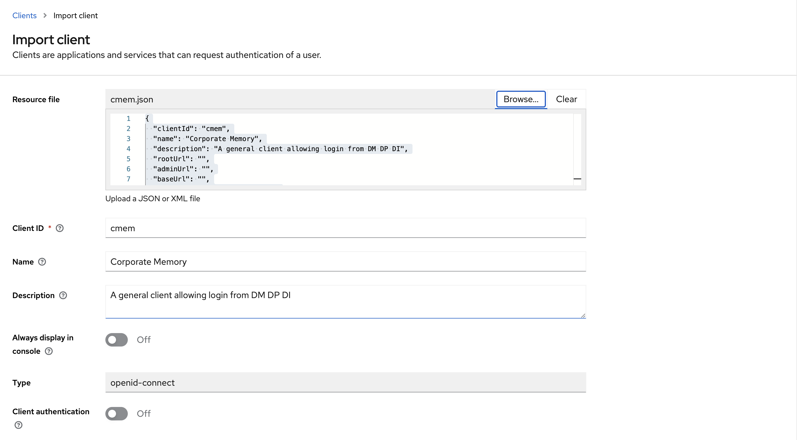

- Login to Keycloak and select the Corporate Memory realm (`cmem`).
- Download the [client configuration for using the web interface](cmem.json) (`cmem.json`).
- Select **Clients**, then **Import client**.
- **Browse** for the downloaded `cmem.json` and select it.
- **Save** new client.

To import a pre-configured `cmem-service-account` client, repeat the process with the [client configuration with credentials for the technical account (`cmem-service-account`)](cmem-service-account.json) (`cmem-service-account.json`). After importing add the `elds-admins` role mapper to the client. See in the manual section of [Add the `cmem-service-account` client](#serviceaccountroles)

### Option 2: Create client configurations manually

#### Add the `cmem` client for using the web interface

This client is intended for the usage with Explore and Build (DataIntegration) (user login):

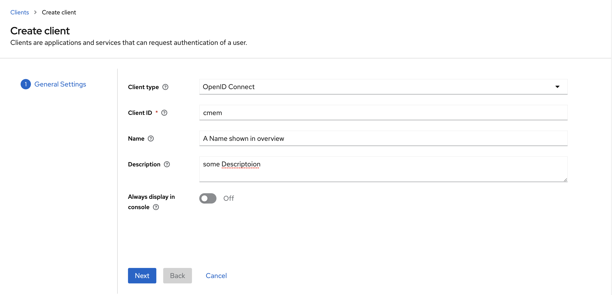{ class="bordered" }

- **Client type**: OpenID Connect
- **Client ID**: i.e. `cmem`, you need to remember this and use this later
- **Name** and **Description**: fill as you like
- Select **Next**
- **Client authentication**: Off
- **Authorization**: Off
- Enable **Standard Flow Enabled** (enables OAuth 2.0 Authorization Code Flow)
- Before v23.1:
    - Additionally enable **Implicit Flow Enabled**
- **Save**

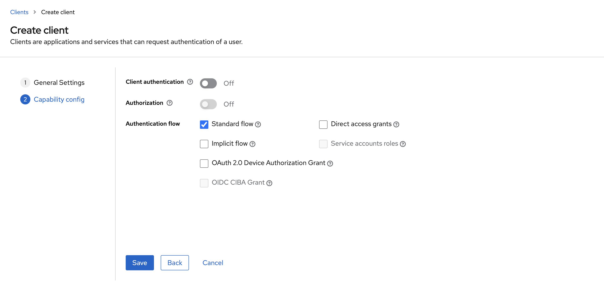{ class="bordered" }

The dialog above closes and you land on the configuration page of this client:

- **Valid redirect URIs**: Add the correct URL pattern (e.g., wildcard `https://cmem.example.net/*` works) to `Valid Redirect URIs` (`*` for testing purposes can be used as well) and **Save**
- Switch the Tabs to **Client scopes** and click on the first scope (i.e.: `cmem-dedicated`)

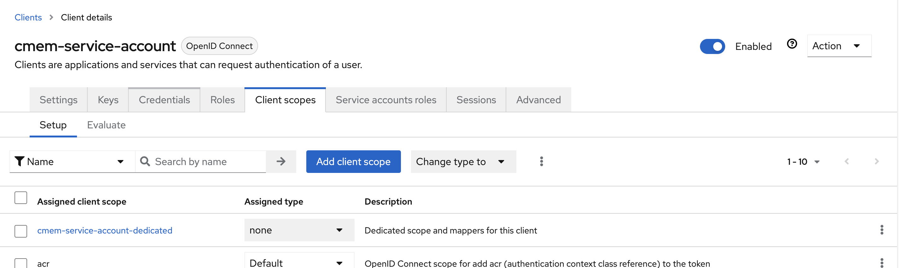{ class="bordered" }
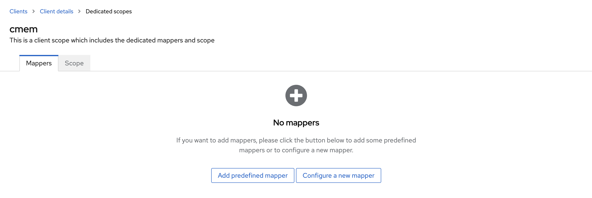{ class="bordered" }
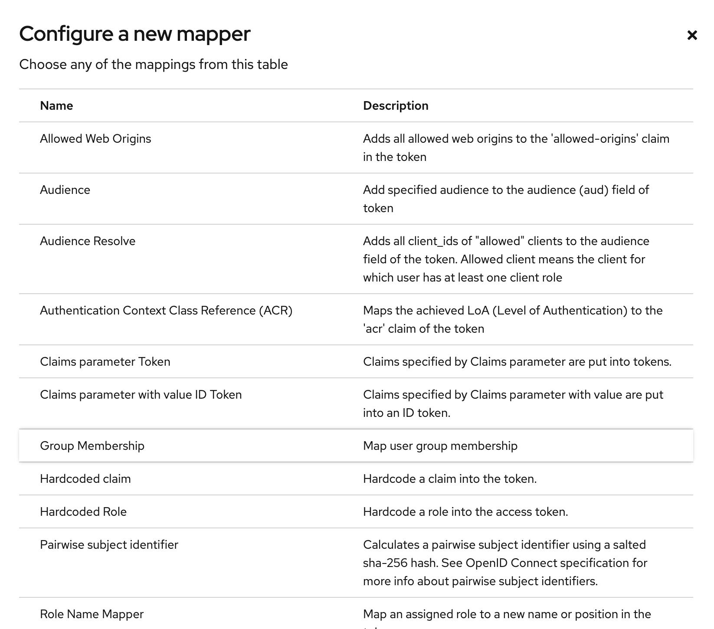{ class="bordered" }

- Click **Configure a new mapper**
    - Select Mapper Type **Group Membership**
    - **Name** `groups`
    - **Token Claim Name** `groups`
    - Disable **Full group path**
    - Disable **Add to ID token**
    - Enable **Add to access token**
    - Enable **Add to user info**
- **Save**

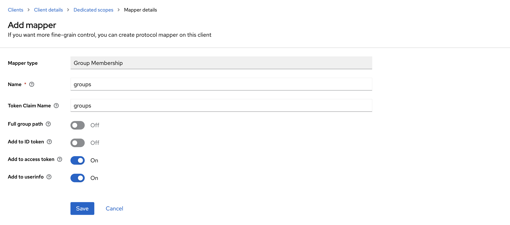{ class="bordered" }

- In Corporate Memory configuration until v22.2:
    - Configure this client ID under `js.config.workspaces.default.authorization.oauth2.clientId` in DataManager's configuration file (Datamanager needs implicit flow)
    - Configure  this client ID under `oauth.clientId = "cmem"` in DataManager's configuration file (Dataintegration needs standard flow)
- In Corporate Memory configuration from v23.1:
    - Configure this client ID in the environments with the name `OAUTH_CLIENT_ID` in `/environments/config.env` (defaults to `cmem` if not set)

#### Add the `cmem-service-account` client

This client is intended for internal use by Build (DataIntegration) (scheduler super-user) and data import purposes ([cmemc](https://documentation.eccenca.com/latest/automate/cmemc-command-line-interface)).

This descriptions can also be used to create clients with different permissions than admins.
For this, just create a different role name later, and create an access condition with this groups name in Corporate Memory as it is described in [Access Conditions](./../access-conditions/index.md).

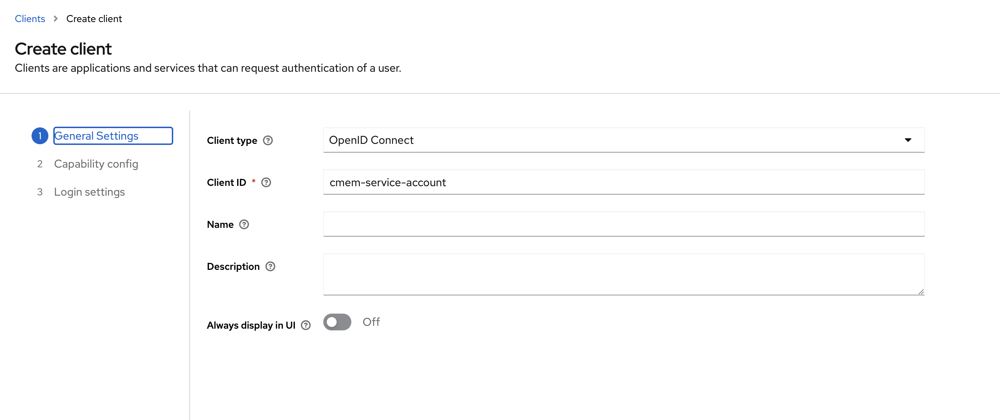{ class="bordered" }
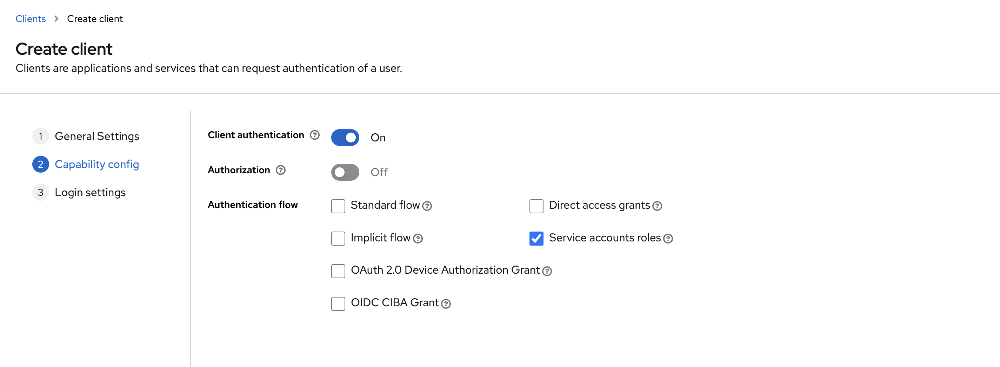{ class="bordered" }
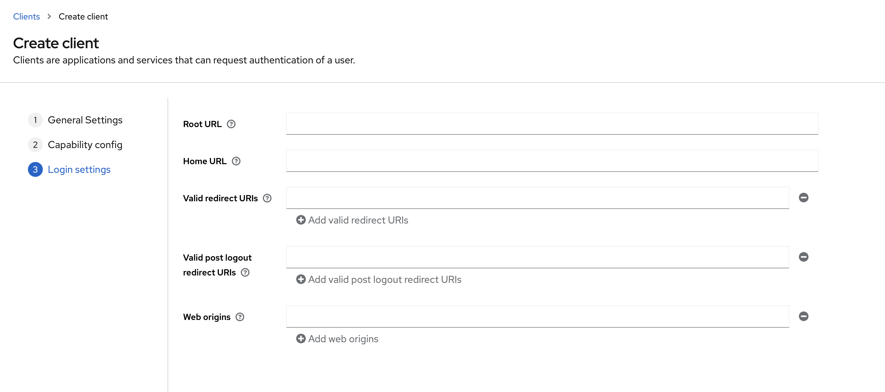{ class="bordered" }

- **Client type**: OpenID Connect
- **Client ID**: i.e. `cmem-service-account`, you need to remember this and use this later
- **Name** and **Description**: fill as you like
- click **Next**
- **Client authentication**: On
- **Authorization**: Off
- **Authentication flow**: only enable `Service accounts roles`, the rest can be disabled
- **Save**

- Go to **Credentials** and configure **Client Id and Secret**, copy the client secret for later usage

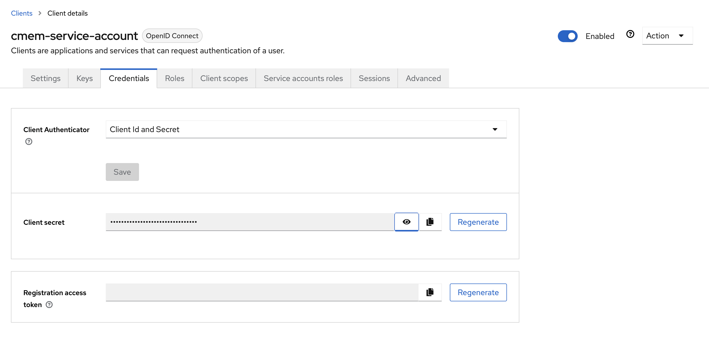{ class="bordered" }

- Go to **Roles** and click **Create role** to create the `elds-admins` role

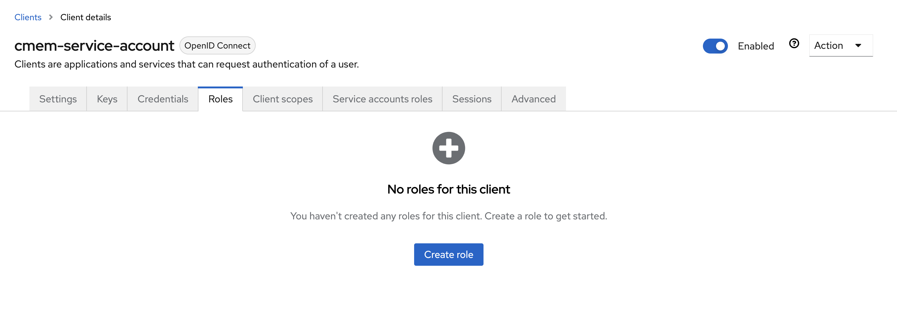{ class="bordered" }
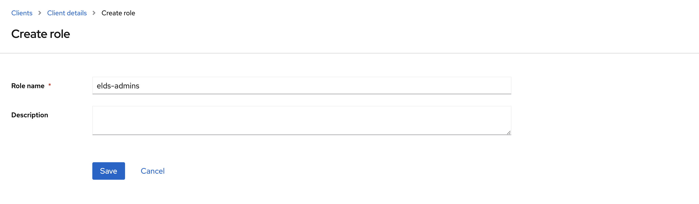{ class="bordered" }

- Click **Action** and select **Add associated roles**

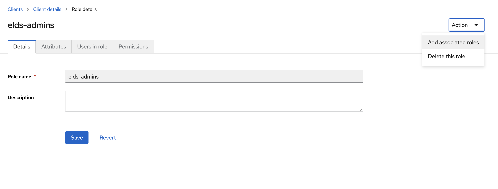{ class="bordered" }

- Select **Filter by client** from the filter pull-down-menu

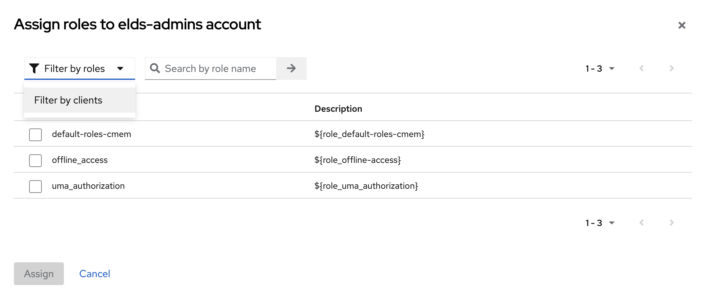{ class="bordered" }

- In this dialog select the client by name which you are currently configuring (here `cmem-service-account`) and then **Assign**

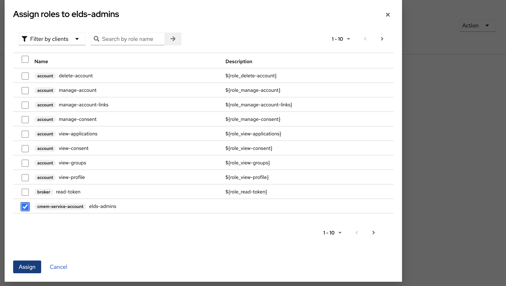{ class="bordered" }

- Go back to **Client details** e.g., by using the top navigation
- In the **Roles** tab you now see your created role here

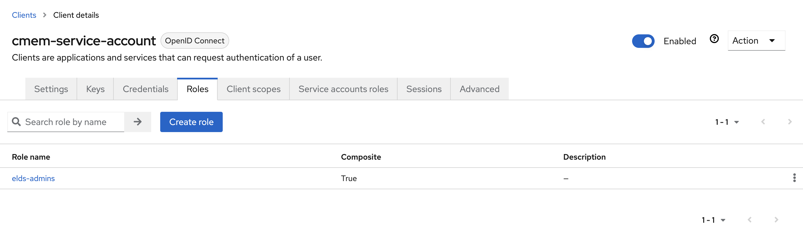{ class="bordered" }

- Switch the Tabs to **Client scopes** and click on the first scope (i.e.: `cmem-service-account-dedicated`)

{ class="bordered" }

- select **Add mapper** -> **By configuration**

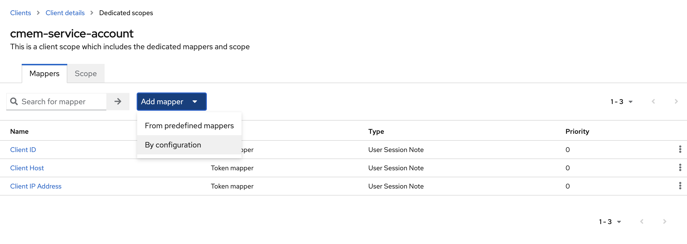{ class="bordered" }

- select Mapper Type `User Client Role`
    - **Name** `roles`
    - **Client ID** select the client you are currently configuring from the pull-down-menu (here `cmem-service-account`)
    - Enable **Multivalued**
    - **Token Claim Name** `groups`
    - Enable **Add to ID token**
    - Enable **Add to access token**
    - Enable **Add to user info**
- **Save**

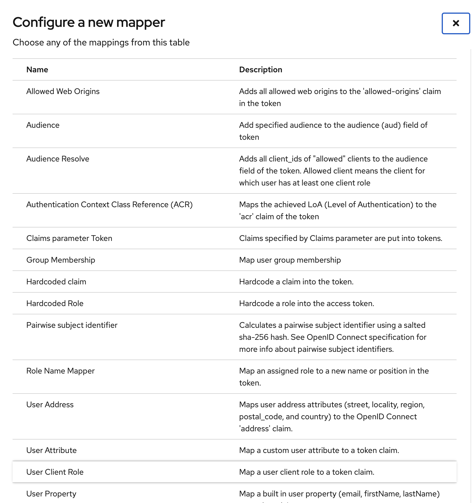{ class="bordered" }

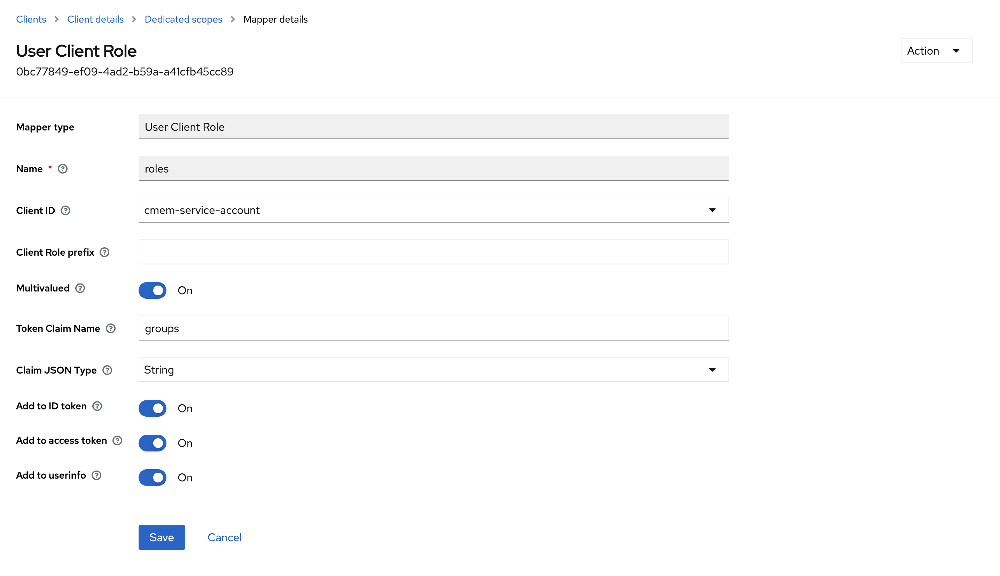{ class="bordered" }

- After **Save** go back to **Client details**
- Go to **<a name="serviceaccountroles">Service account roles**</a> tab
- Select the link in the center **To manage detail and group mappings, click on the username service-account-YOUR_CLIENT_ID**

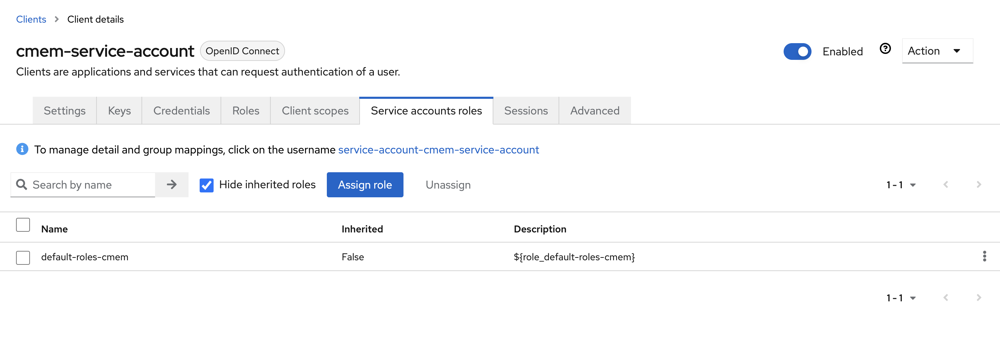{ class="bordered" }

- Go to tab **Role mapping** and select **Assign role**

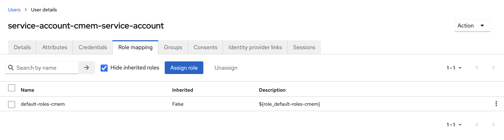{ class="bordered" }

- Change the filter to **Filter by clients** and select the new Client ID, i.e `cmem-service-account`
- Click **Assign**

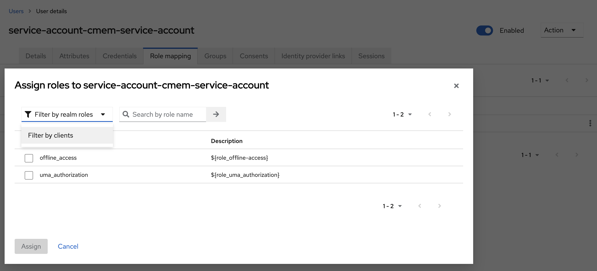{ class="bordered" }
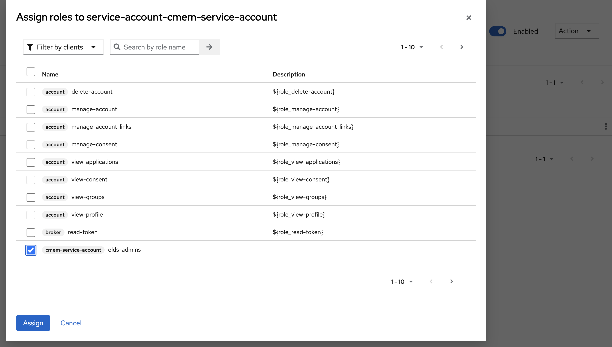{ class="bordered" }
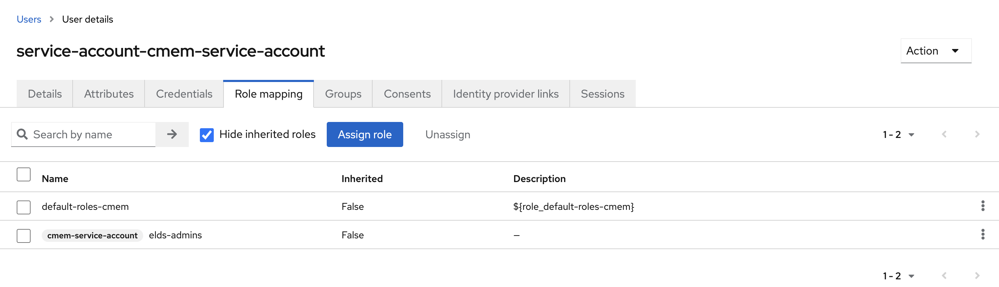{ class="bordered" }

## Corporate Memory configuration after setting up clients

- If **Build (DataIntegration)** schedulers are required, configure this client id and secret under the properties `workbench.superuser.client` and `workbench.superuser.clientSecret` in Build (DataIntegration)'s configuration file or
- in `docker compose`-orchestration you can edit this in the environment as:

      ``` bash
        CMEM_SERVICE_ACCOUNT_CLIENT_ID=cmem-service-account
        CMEM_SERVICE_ACCOUNT_CLIENT_SECRET=YourSecret
        DATAINTEGRATION_CMEM_SERVICE_CLIENT=cmem-service-account
        DATAINTEGRATION_CMEM_SERVICE_CLIENT_SECRET=YourSecret
      ```

- in helm this value is defined by:

      ``` yaml
        DATAINTEGRATION_CMEM_SERVICE_CLIENT_SECRET: {{ .Values.global.cmemClientSecret }}
        DATAINTEGRATION_CMEM_SERVICE_CLIENT: {{ .Values.global.cmemClientId }}
      ```

- For **cmemc** you can configure this with `OAUTH_CLIENT_ID` and `OAUTH_CLIENT_SECRET`.

### Groups configuration

- Go to **Groups** and add the following groups:
    - `elds-admins`
    - These groups are used only to assign them to user accounts (clients have roles-to-group mappers).
    - Any groups provided by your user management system (e.g. LDAP) that must be recognized/mapped by Keycloak
    - Corporate Memory does not come with any other groups. Those are optional and can be defined here.

### Users configuration

- This applies to the [Docker Orchestration](./../docker-orchestration/index.md), for other setups consult the [Keycloak manual](https://www.keycloak.org/docs/latest/server_admin/).
- Go to `Users`
- Add the following users and assign their groups respectively (for each user go to credentials, add password and disable `Temporary`)
    - `admin:admin`
        - groups: `elds-admins`
