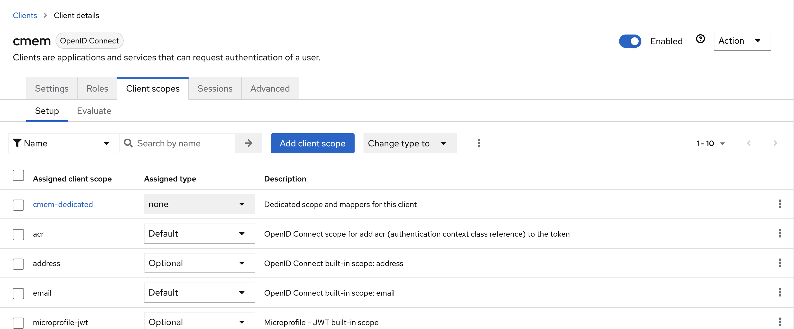

---
tags:
    - Configuration
    - Security
    - Keycloak
---
# Keycloak

## Introduction

This page documents important steps in order to configure Keycloak as an authentication backend for Corporate Memory.
The screenshots displayed in this documentation were taken from Keycloak v20 using the `keycloak.v2` theme.

!!! info

    You do not need these instruction in case you followed the documentation on [Scenario: Local Installation](./../../installation/scenario-local-installation/index.md) or [Scenario: Single Node Cloud Installation](./../../installation/scenario-single-node-cloud-installation/index.md) (in this case, everything was done automatically).
    However, in case you need to integrate Corporate Memory with an existing Keycloak, this page may help you.
    Please also have the [Keycloak - Server Administration Guide](https://www.keycloak.org/docs/latest/server_admin/) ready :smile:

## Realm configuration

!!! warning

    A realm can be im-/exported.
    However, exported realms will not contain user credentials.
    So be aware not losing data.

To create a realm, use the drop down menu for choosing a realm on the left side.

  -  Create a realm `cmem`
    - Select "Realm settings"
      - "General" tab:
      - Change HTML Display name to `<span class="ecc-logo"></span>Corporate Memory`
    - "Themes" tab
      - Switch realm's login theme to `eccenca`
      - Switch realm's account theme to `eccenca`

## Client configuration

There are two (three) different kinds of clients used by Corporate Memory:

- One client is used by DM/DP/DI to authenticate a user for using the UI (usually named `cmem`).
- The other client is for using the command line client as a technical user (usually named `cmem-service-account`).
  Depending on the environment, there might be an other use case when running background schedules, then a third client, also as technical user, might be useful.

### Add clients by importing the JSON exports

Add a client named `cmem` by select clients, then create client.
The client described below can also be imported.
Please download the file below, then select **Import client**.
For the `cmem-service-account` client you have to edit the file and replace the secret or regenerate the secret in keycloak after the import.

Available files:

  - [client configuration for using the ui (`cmem`)](cmem.json)
  - [client configuration with credentials for technical account (`cmem-service-account`)](cmem-service-account.json)

{ class="bordered" }

### Create client `cmem` manually (for web interface)

This client is intended for the usage with DataManager, Dataplatform and DataIntegration (user login):

{ class="bordered" }

  - **Client type**: OpenID Connect
  - **Client ID**: i.e. `cmem`, you need to remember this and use this later
  - **Name** and **Description**: fill as you like
  - Select **Next**
  - **Client authentication**: Off
  - **Authorization**: Off
  - Enable **Standard Flow Enabled** (enables OAuth 2.0 Authorization Code Flow)
  - Before v23.1:
    - Additionally enable **Implicit Flow Enabled**
  - **Save**

{ class="bordered" }

The dialog above closes and you land on the configuration page of this client:

  - **Valid redirect URIs**: Add the correct URL pattern (wildcard `http://example.org/*` works) to `Valid Redirect URIs` (`*` for testing purposes can be used as well)
  - Switch the Tabs to **Client scopes** and select the first scope (i.e.: `cmem-dedicated`)

{ class="bordered" }
{ class="bordered" }
{ class="bordered" }

  - Configure a new mapper (**Client** -> **Client Scopes** -> **Add / Select Client Scope** -> **Add Mapper**)
    - select Mapper Type **User Client Role**
    - **Name** `groups`
    - **Token Claim Name** `groups`
    - Disable **Full group path**
    - Disable **Add to ID token**
    - Enable **Add to access token**
    - Enable **Add to user info**
  - **Save**

{ class="bordered" }

  - In Corporate Memory configuration until v22.2:
    - Configure this client ID under `js.config.workspaces.default.authorization.oauth2.clientId` in DataManager's configuration file (Datamanager needs implicit flow)
    - Configure  this client ID under `oauth.clientId = "cmem"` in DataManager's configuration file (Dataintegration needs standard flow)
  - In Corporate Memory configuration from v23.1:
    - Configure this client ID in the environments with the name `OAUTH_CLIENT_ID` in `/environments/config.env`


### Create a client manually (Technical Account)

This client is intended for internal use by DataIntegration (scheduler super-user) and data import purposes ([cmemc](https://documentation.eccenca.com/latest/automate/cmemc-command-line-interface))

  - **Client type**: OpenID Connect
  - **Client ID**: i.e. `cmem-service-account`, you need to remember this and use this later
  - **Name** and **Description**: fill as you like
  - Select **Next**
  - **Client authentication**: On
  - **Authorization**: Off
  - **Authentication flow**: only enable `Service accounts roles`, the rest can be disabled
  - **Save**

  - Go to **Credentials** and configure **Client Id and Secret**, copy the client secret for later usage

{ class="bordered" }
{ class="bordered" }

  - Go to **Roles** and add the `elds-admins` role
  - Select **Action** and **Add associated roles**
  - Select **Filter by client** then

{ class="bordered" }
{ class="bordered" }

  - Go to **Service Account Roles** -> **Client Roles** (`cmem-service-account`) and add the `elds-admins` role to **Assigned Roles**
      - no **Realm roles** needed beforehand
  - Switch the Tabs to **Client scopes** and select the first scope (i.e.: `cmem-service-account-dedicated`)

{ class="bordered" }
{ class="bordered" }

  - **Configure a new mapper** (**Client** -> **Client Scopes** -> **Add / Select Client Scope** -> **Add Mapper**)
  - select Mapper Type `User Client Role`
    - **Name** `roles`
    - **Token Claim Name** `groups`
    - Enable **Add to ID token**
    - Enable **Add to access token**
    - Enable **Add to user info**
  - **Save**

{ class="bordered" }

  - Go to tab **Service account roles**
  - Select the link in the center **To manage detail and group mappings, click on the username service-account-YOUR_CLIENT_ID**

{ class="bordered" }

  - Go to tab **Role mapping** and select **Assign role**
  - Change the filter to **Filter by clients** and select the new Client ID, i.e `cmem-service-account`

{ class="bordered" }
{ class="bordered" }

  - In Corporate Memory configuration:
    - If DataIntegration schedulers are required, configure this client id and secret under the properties `workbench.superuser.client` and `workbench.superuser.clientSecret` in DataIntegration's configuration file or
    - in docker-compose-orchestration you can edit this in the environment as:
        ``` bash
          CMEM_SERVICE_ACCOUNT_CLIENT_ID=cmem-service-account
          CMEM_SERVICE_ACCOUNT_CLIENT_SECRET=YourSecret
          DATAINTEGRATION_CMEM_SERVICE_CLIENT=cmem-service-account
          DATAINTEGRATION_CMEM_SERVICE_CLIENT_SECRET=YourSecret
        ```
    - in helm this value is defined by:
        ``` yaml
          DATAINTEGRATION_CMEM_SERVICE_CLIENT_SECRET: {{ .Values.global.cmemClientSecret }}
          DATAINTEGRATION_CMEM_SERVICE_CLIENT: {{ .Values.global.cmemClientId }}
        ```
    - For cmemc you can this with `OAUTH_CLIENT_ID` and `OAUTH_CLIENT_SECRET`.

## Groups configuration

- Go to **Groups** and add the following groups:
  - `elds-admins`
  - Any groups provided by your user management system (e.g. LDAP) that must be recognized/mapped by Keycloak
  - In Corporate Memory docker orchestration, `local-users`, `local-admins`

## Users configuration

- This applies to the [Docker Orchestration](./../docker-orchestration/index.md), for other setups consult the [Keycloak manual](https://www.keycloak.org/docs/latest/server_admin/).
- Go to `Users`
- Add the following users and assign their groups respectively (for each user go to credentials, add password and disable `Temporary`)
  - `user:user`
    - groups: `local-users`
  - `admin:admin`
    - groups: `local-admin`

