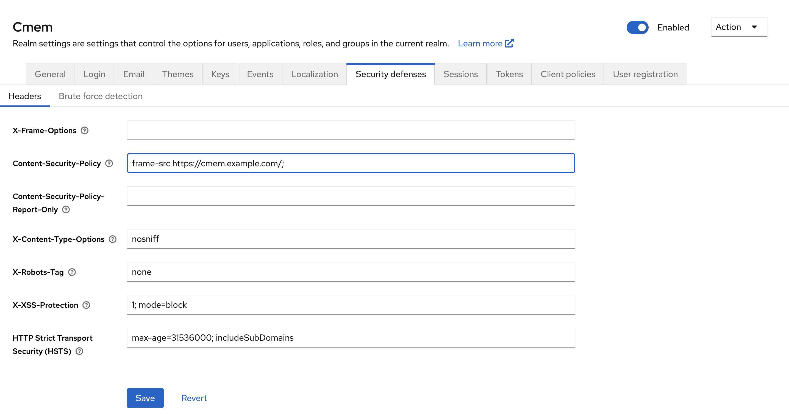
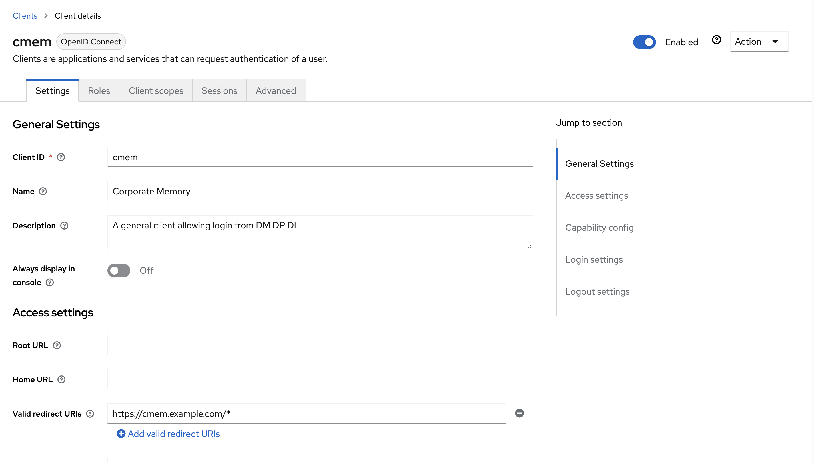
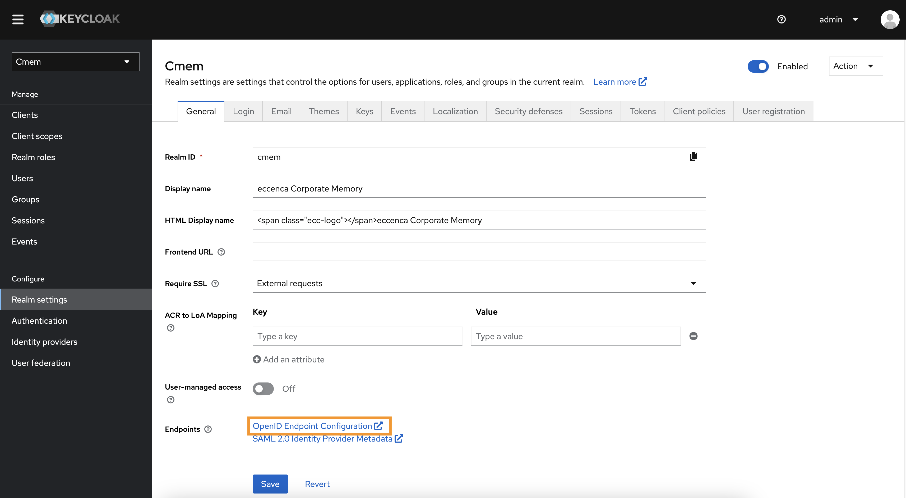

---
tags:
    - Configuration
    - Security
    - Keycloak
---
# Configure Corporate Memory with an external Keycloak

## Introduction

Maybe you already operate a central Keycloak deployment in your infrastructure or you want to deploy multiple stages of Corporate Memory with a single Keycloak.
Very often this results a Keycloak which is deployed in a different domain than your Corporate Memory, i.e. `cmem.example.com` and `keycloak.example.com`.
For this scenario, this page give some hints.

## Configuration in Keycloak

When using a Keycloak in a different domain, you have to allow this domain in the Keycloak settings:

-   In **Realm Settings**, go to **Security defenses** tab
    -   `X-Frame-Options` need to be cleared
    -   The `Content-Security-Policy` header needs to be defined for allowing the framing of the login mask of Keycloak for the deployment `frame-src <https://cmem.example.com/>;`
-   In **Clients** go to i.e. `cmem` client
    -   add `https://cmem.example.com/*` to Valid redirect URIs

{ class="bordered" }

{ class="bordered" }

## Configuration in Corporate Memory

### Environments

When running the Corporate Memory docker orchestration, you can configure the Keycloak through editing `environments/config.env`.
Then just add the variables below.
You can get those from the `.well-known` url from your instance, e.g. `https://keycloak.example.com/auth/realms/cmem/.well-known/openid-configuration`:

``` bash
OAUTH_AUTHORIZATION_URL=${EXTERNAL_BASE_URL}/auth/realms/cmem/protocol/openid-connect/auth
OAUTH_TOKEN_URL=${EXTERNAL_BASE_URL}/auth/realms/cmem/protocol/openid-connect/token
OAUTH_JWK_SET_URL=${EXTERNAL_BASE_URL}/auth/realms/cmem/protocol/openid-connect/certs
OAUTH_USERINFO_URL=${EXTERNAL_BASE_URL}/auth/realms/cmem/protocol/openid-connect/userinfo
OAUTH_LOGOUT_REDIRECT_URL=${EXTERNAL_BASE_URL}/auth/realms/cmem/protocol/openid-connect/logout?redirect_uri=${EXTERNAL_BASE_URL}
OAUTH_CLIENT_ID=cmem
```

{ class="bordered" }

### Dataintegration (optional)

By default, Dataintegration is configured through environments.
However you can also edit this in Dataintegration's config file `dataintegration.conf`:

``` bash
oauth.clientId = ${OAUTH_CLIENT_ID}
oauth.authorizationUrl = ${OAUTH_AUTHORIZATION_URL}
oauth.tokenUrl = ${OAUTH_TOKEN_URL}
oauth.logoutRedirectUrl = ${OAUTH_LOGOUT_REDIRECT_URL}
```

### Dataplatform (optional)

By default, Dataplatform is configured through environments.
However you can also edit this in Dataplatform's config file `application.yml`:

``` yaml
spring.security.oauth2:
  resourceserver:
    anonymous: "${DATAPLATFORM_ANONYMOUS}"
    jwt:
      jwk-set-uri: "${OAUTH_JWK_SET_URL}"
  client:
    registration:
      keycloak:
        client-id: "${OAUTH_CLIENT_ID}"
        authorization-grant-type: "authorization_code"
        client-authentication-method: "basic"
        redirectUri: "${DEPLOY_BASE_URL: 'http://localhost' }/dataplatform/login/oauth2/code/{registrationId}"
        scope: # openid is mandatory as spring somehow does not add it to the userinfo request
          - openid
          - profile
          - email
    provider:
      keycloak:
        jwk-set-uri: "${OAUTH_JWK_SET_URL}"
        authorization-uri: "${OAUTH_AUTHORIZATION_URL}"
        token-uri: "${OAUTH_TOKEN_URL}"
        user-info-uri: "${OAUTH_USERINFO_URL}"
        user-name-attribute: "preferred_username"
```

### cmemc

In cmemc you also need to change the Keycloak cmemc tries to authenticate before connecting to Corporate Memory.
You have to add this:

``` ini
KEYCLOAK_BASE_URI=https://keycloak.example.com/
KEYCLOAK_REALM_ID=cmem
```

### Helm charts (optional)

In the helm charts, we assumed you deploy Keycloak by official charts, either via operator, or via helm charts.
In either way you can configure the base realm path in the value section.

``` yaml
  # This is the base Keycloak realm url, e.g. https://cmem.example.com/auth/realms/cmem
  .Values.global.keycloakIssuerUrl: https://keycloak.example.com/auth/realms/cmem
  .Values.global.oauthClientId: cmem
```

